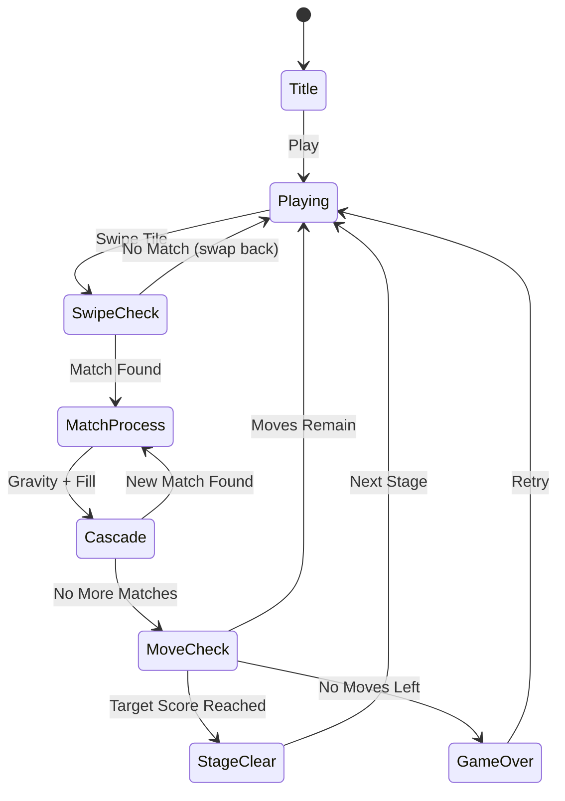

# Fishdom

> 매치3 퍼즐을 풀어 물고기 수족관을 꾸미는 게임

## 개요

Playrix의 Fishdom을 레퍼런스로 한 매치3 퍼즐 게임. 플레이어는 8×8 보드에서 타일을 스와이프해 3개 이상 같은 타일을 매치하여 점수를 획득한다. 목표 점수를 달성하면 스테이지 클리어.

## 게임 규칙

### 기본 규칙
- 8×8 그리드 보드에 해양 테마 타일이 배치됨
- 인접한 두 타일을 스와이프하여 위치 교환
- 교환 결과 3개 이상 연속 매치 시 제거, 아니면 원위치
- 매치된 자리는 위에서 새 타일이 떨어져 채워짐
- 연쇄(cascade) 매치 시 콤보 배점
- 제한된 이동 횟수(moves) 안에 목표 점수 달성 시 클리어

### 타일 종류
- 🐠 열대어, 🐟 물고기, 🦀 게, 🐚 조개, 🌊 파도, ⭐ 불가사리, 🐙 문어, 🦑 오징어
- 스테이지별 6~8종 사용

### 점수
- 3매치: 100점
- 4매치: 200점
- 5+매치: 500점
- 콤보 배율: combo × 기본점수

## 게임 플로우



## UI 레이아웃

```
┌─────────────────────────┐
│ Stage  Score  Target  ▼ │  ← HUD
├─────────────────────────┤
│                         │
│  🐠 🐟 🦀 🐚 🌊 ⭐ 🐙 🦑  │
│  🦀 🐠 🐟 🐚 ⭐ 🌊 🦑 🐙  │
│  🐚 🌊 🐠 🐟 🦀 ⭐ 🐙 🦑  │  ← 8×8 보드
│  🐟 🦀 🐚 🌊 🐠 ⭐ 🦑 🐙  │
│  ...                    │
│                         │
├─────────────────────────┤
│       Moves: 25         │  ← 하단 정보
└─────────────────────────┘
```

## 스테이지 설계

| Stage | 타일 종류 | Moves | Target Score |
|-------|-----------|-------|-------------|
| 1     | 6         | 25    | 1,000       |
| 2     | 6         | 22    | 2,000       |
| 3     | 7         | 22    | 3,000       |
| 4     | 7         | 20    | 4,500       |
| 5     | 8         | 20    | 6,000       |

## 기술 스택

- **Core**: lib/fishdom — Phaser.io 씬, 매치3 로직
- **Web**: web/arcade/src/games/fishdom — React + Stitches HUD/ClearScreen
- **RN**: rn 슈퍼앱 카탈로그 등록
