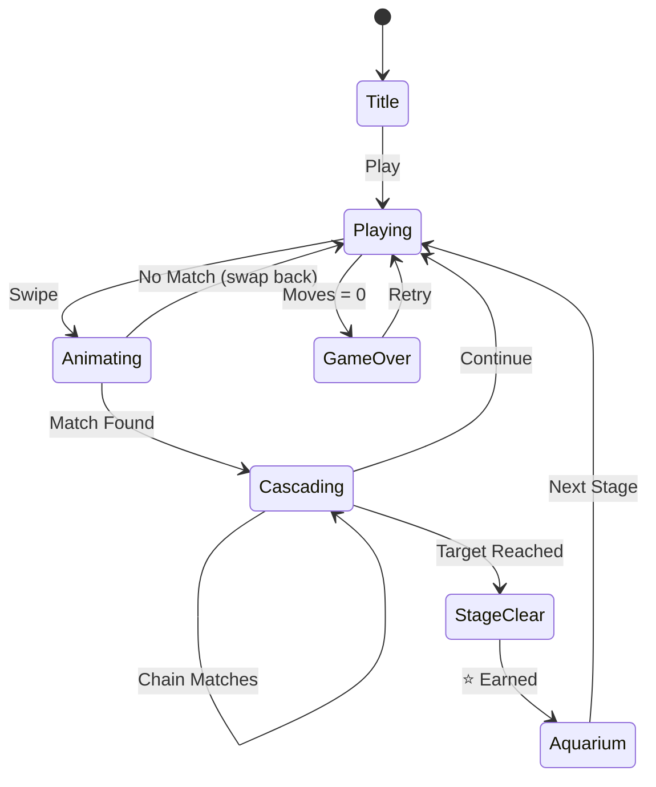

# 피쉬돔 (Fishdom) — 기능 기획서

> 수족관 꾸미기와 매치-3 결합. Playrix 스타일 하이브리드 퍼즐.

---

## 1. Playrix 전략 분석

Playrix는 세계적 퍼즐 퍼블리셔로, **Gardenscapes**, **Homescapes**, **Fishdom** 등 "매치-3 + 메타게임" 조합의 선두주자다.

**핵심 전략:**
- 순수 매치-3은 Candy Crush가 지배 → 정면 대결 회피
- "매치-3 = 통화 획득 수단" + "메타 = 감정적 몰입" 공식
- 매칭은 단순화하고, 메타(꾸미기/스토리)로 차별화
- 세션당 2~3분 매칭 → 보상 → 꾸미기 1개 → 다시 매칭 루프

**우리에게 주는 교훈:**
- 매치-3 자체는 레드오션이지만, 메타를 잘 붙이면 차별화 가능
- 꾸미기 메타는 구현 비용 대비 리텐션 효과 높음
- MVP에서 메타를 간단하게라도 넣어야 의미 있음

---

## 2. 코어 매치-3 + 수족관 메타

### 코어 루프
```
매치-3 퍼즐 클리어 → 코인 획득 → 수족관 아이템 구매/배치 → 다음 퍼즐
```

### 매치-3 메카닉 (MVP)
- 8×8 그리드, 스와이프 매칭
- 3개 이상 같은 타일 매치 시 제거
- 4개 매치 → 라인 폭탄 (가로/세로 한 줄 제거)
- 5개 매치 → 폭탄 (주변 8칸 제거)
- 중력 + 새 타일 자동 충전
- 제한된 이동 횟수 내 목표 점수 달성 → 클리어

### 수족관 메타 (MVP)
- 스테이지 클리어 시 ⭐(별) 획득
- 별로 수족관 장식 아이템 해금 (물고기, 장식물 등)
- 수족관은 심플한 텍스트/이모지 기반 표현 (MVP)
- 장식 수에 따라 "수족관 레벨" 상승

---

## 3. 메타게임의 중요성

| 요소 | 순수 매치-3 | 매치-3 + 메타 |
|------|------------|--------------|
| D1 리텐션 | 35~40% | 45~55% |
| D7 리텐션 | 12~15% | 20~28% |
| 세션 길이 | 3~5분 | 5~8분 |
| 감정적 투자 | 낮음 | 높음 (내가 꾸민 공간) |
| 수익화 용이성 | 중간 | 높음 (꾸미기 아이템) |

**결론:** 메타 없는 매치-3은 경쟁력 없음. 최소한의 메타라도 붙여야 함.

---

## 4. 매치-3 장르 최종 결론

### 만들어야 하는 이유
- 매치-3은 전세계 모바일 게임 매출 1위 장르
- CPI(설치당 비용)가 가장 낮은 장르 중 하나
- 35세 이상 여성 타겟으로 광고 수익 높음
- Crunch3 코어 로직을 90% 재사용 가능 → 개발 비용 극소

### 만들지 말아야 하는 이유
- Candy Crush, Royal Match 등 거대 경쟁자
- 순수 매치-3만으로는 차별화 불가
- UA(유저 획득) 경쟁 치열

### 최종 판단: **만든다** ✅
- Crunch3 엔진 위에 수족관 메타만 추가하면 됨
- 개발 기간: **3~5일** (엔진 재사용)
- 메타(수족관 꾸미기)가 차별화 포인트
- 실패해도 손실 최소 (코드 재사용이므로)

---

## 5. 수익화 설계

### MVP 수익 모델
| 수익원 | 설명 | 우선순위 |
|--------|------|----------|
| 보상형 광고 | 이동 횟수 +5, 특수 타일 획득 | ⭐⭐⭐ |
| 인터스티셜 | 스테이지 사이 전면 광고 | ⭐⭐ |
| 수족관 꾸미기 | 프리미엄 장식 아이템 | ⭐ (Phase 2) |

### Playrix 수준 수익 구조 (장기)
- 초기: 광고 중심 (보상형 80% + 인터스티셜 20%)
- 성장기: 인앱결제 비중 확대 (부스터, 생명, 프리미엄 아이템)
- 성숙기: 배틀패스, 시즌 이벤트

---

## 6. 구현 사양

### 게임 규칙
- 8×8 그리드
- 스와이프로 인접 타일 교환
- 3개 이상 같은 타일 연결 시 매치
- 매치 시 점수 획득 + 타일 제거 + 중력 + 충전
- 연쇄 매치(캐스케이드) 시 콤보 보너스
- 제한 이동 내 목표 점수 = 스테이지 클리어
- 클리어 시 ⭐ 획득 → 수족관 장식 해금

### 스코어링
| Action | Score |
|--------|-------|
| 3매치 | +100 |
| 4매치 | +200 |
| 5+매치 | +500 |
| 콤보 배율 | ×콤보 수 |
| 스테이지 클리어 보너스 | +남은 이동 × 50 |

### 스테이지 설계

| Stage | 타일종류 | 이동제한 | 목표점수 | 별보상 |
|-------|---------|---------|---------|--------|
| 1 | 6 | 25 | 1000 | ⭐ |
| 2 | 7 | 22 | 2000 | ⭐ |
| 3 | 7 | 20 | 3500 | ⭐ |
| 4 | 8 | 18 | 5000 | ⭐ |
| 5 | 8 | 15 | 7000 | ⭐ |

### 수족관 아이템 (MVP)

| 아이템 | 비용(⭐) | 설명 |
|--------|---------|------|
| 🐠 열대어 | 1 | 기본 물고기 |
| 🐡 복어 | 2 | 귀여운 복어 |
| 🪸 산호 | 1 | 바닥 장식 |
| 🫧 에어레이터 | 2 | 거품 발생기 |
| 🏰 성 | 3 | 수중 성 장식 |

### UI 레이아웃

```
┌─────────────────────────┐
│ ⭐Stage  🎯Score  🔄Moves│  ← HUD
├─────────────────────────┤
│                         │
│  🍎 🍊 🍇 🍓 🍌 🫐 🍑 🍒 │
│  🍊 🍇 🍓 🍌 🫐 🍑 🍒 🍎 │
│  🍇 🍓 🍌 🫐 🍑 🍒 🍎 🍊 │  ← 매치-3 보드
│  🍓 🍌 🫐 🍑 🍒 🍎 🍊 🍇 │    (8×8)
│  🍌 🫐 🍑 🍒 🍎 🍊 🍇 🍓 │
│  🫐 🍑 🍒 🍎 🍊 🍇 🍓 🍌 │
│  🍑 🍒 🍎 🍊 🍇 🍓 🍌 🫐 │
│  🍒 🍎 🍊 🍇 🍓 🍌 🫐 🍑 │
│                         │
└─────────────────────────┘
```

### 게임 플로우



---

## 7. 기술 구현

### lib/fishdom/ (Phaser.io Core)
- Crunch3 매치-3 엔진을 fork하여 수족관 메타 추가
- `types.ts`: 타일 타입, 스테이지 설정, 수족관 아이템
- `logic/board.ts`: 매치-3 보드 로직 (Crunch3 재사용)
- `logic/stage.ts`: 5스테이지 난이도 설정
- `objects/Tile.ts`: 타일 게임 오브젝트
- `scenes/PlayScene.ts`: 매치-3 플레이 씬
- `game.ts`: Phaser 게임 팩토리

### web/arcade/src/games/fishdom/ (React UI)
- `useGame.ts`: Phaser 게임 ↔ React 상태 연결
- `HUD.tsx`: 스테이지, 점수, 이동횟수, 콤보
- `ClearScreen.tsx`: 클리어/게임오버 화면 + 수족관 미리보기

---

## MVP 범위

### Phase 1 (MVP — 3~5일)
- [x] 기획서 작성
- [ ] 매치-3 코어 (Crunch3 포크)
- [ ] 수족관 메타 (별 수집 → 아이템 해금)
- [ ] 5 스테이지
- [ ] 웹 빌드
- [ ] 브라우저 테스트

### Phase 2
- [ ] 수족관 꾸미기 비주얼 개선
- [ ] 특수 타일 (라인 폭탄, 폭탄)
- [ ] 보상형 광고 연동
- [ ] RN 래핑
