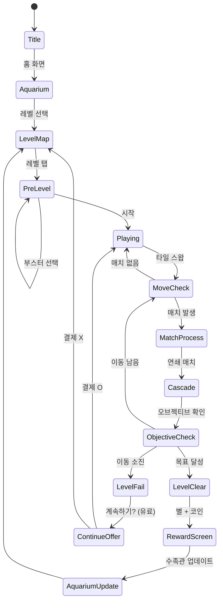

# 피쉬돔 (Fishdom) — 전략 기획서

> **레퍼런스**: Playrix Fishdom (매치-3 + 수족관 메타) · 랭크 #112 · 평점 4.7
>
> **결론 요약**: 풀 피쉬돔 클론은 NO. **경량 메타 매치-3 (Royal Match 모델)** 로 빠르게 출시.
> 수족관 테마 유지하되 대화·스토리 제거. 1.5주 MVP 가능.

---

## 1. Playrix 전략 분석

### Playrix가 강한 이유

Playrix(Gardenscapes, Homescapes, Fishdom)는 "**감정 루프 + 매치-3 엔진**" 조합의 원조다.

| 요소 | 역할 |
|------|------|
| 매치-3 레벨 | 코인/별 획득 수단 (도구) |
| 수족관 꾸미기 | 감정적 목표 (목적) |
| 물고기 캐릭터 | 애착·소유감 생성 (유지) |
| 다음 꾸미기 미리보기 | 레벨 실패 후에도 재도전 동기 |

**핵심 인사이트**: Playrix 유저는 매치-3를 "하고 싶어서" 하는 게 아니라 수족관을 "꾸미기 위해" 한다.
매치-3는 수단이고, 메타가 목적이다. 이 구조가 순수 매치-3 대비 D7 리텐션을 2배 높인다.

### Playrix 수준 구현의 현실

| 구성 요소 | 개발 기간 | 우리에게 가능? |
|----------|----------|--------------|
| 매치-3 엔진 (기본) | 1주 | ✅ |
| 스페셜 타일 6종 | 0.5주 | ✅ |
| 레벨 오브젝티브 5종 | 1주 | ⚠️ |
| 수족관 커스터마이즈 (아트) | 2주 | ❌ 아트 리소스 부족 |
| 물고기 캐릭터 + 대화 | 2주 | ❌ |
| 스토리/내러티브 | 1주 | ❌ |
| **합계 (Playrix 수준)** | **7~8주** | ❌ 시간 초과 |

**결론**: Playrix 풀 클론은 우리 타임라인에서 불가. 경량화 필수.

---

## 2. 코어 매치-3 메카닉 설계

### 그리드 시스템

```
┌─────────────────────────┐
│  🐟 FISH PUZZLE  Lv.12  │  ← 스테이지 정보
│  ⭐⭐⭐ ❤️❤️❤️   [🔧]  │  ← 목표 / 라이프 / 설정
├─────────────────────────┤
│  [목표] 🍬×30  🧊×15   │  ← 레벨 오브젝티브
├─────────────────────────┤
│  🟡 🔵 🔴 🟢 🟡 🔵 🔴 │
│  🔴 🟢 🟡 🔵 🔴 🟢 🟡 │
│  🟢 🔵 🔴 🟡 🟢 🔵 🔴 │  ← 8×8 게임 그리드
│  🔵 🔴 🟢 🔵 🔵 🔴 🟢 │
│  🟡 🟢 🔵 🔴 🟡 🟢 🔵 │
│  🔴 🔵 🟡 🟢 🔴 🔵 🟡 │
│  🟢 🟡 🔴 🔵 🟢 🟡 🔴 │
│  🔵 🔴 🟢 🟡 🔵 🔴 🟢 │
├─────────────────────────┤
│  [💣 Bomb] [⚡ Line] [+5] │  ← 부스터 (게임 전)
└─────────────────────────┘
```

### 기본 매칭 규칙

- **3매치**: 기본 제거
- **4매치 (가로/세로)**: 줄무늬 타일 생성 → 행/열 전체 제거
- **L/T형 5매치**: 폭탄 타일 생성 → 3×3 범위 제거
- **5매치 (직선)**: 색깔 폭탄 → 같은 색 전부 제거
- **스페셜 × 스페셜 조합**: 강화 효과

### 타일 종류 (MVP)

| 타입 | 설명 | 구현 우선순위 |
|------|------|-------------|
| 일반 타일 (5색) | 기본 매칭 | P0 |
| 줄무늬 타일 | 4매치 생성, 행/열 클리어 | P0 |
| 폭탄 타일 | L/T매치 생성, 범위 클리어 | P0 |
| 색깔 폭탄 | 5매치 직선, 동색 전체 클리어 | P1 |
| 얼음 장애물 | 2회 매치로 파괴 | P1 |
| 체인 장애물 | 인접 매치로 파괴 | P2 |

### 레벨 오브젝티브 (MVP 2종)

| 타입 | 설명 |
|------|------|
| 타일 수집 | 특정 색 타일 N개 제거 |
| 얼음 파괴 | 모든 얼음 타일 제거 |

> Phase 2에 젤리 클리어, 재료 수집, 버블 제거 추가

---

## 3. 메타게임 설계 — 경량 수족관

### 왜 메타가 중요한가

| 게임 유형 | D1 리텐션 | D7 리텐션 | D30 리텐션 |
|----------|----------|----------|-----------|
| 순수 매치-3 (Classic) | ~20-25% | ~7-10% | ~2-3% |
| 경량 메타 (Royal Match 스타일) | ~35-40% | ~15-18% | ~5-8% |
| 풀 메타 (Fishdom/Gardenscapes) | ~40-45% | ~18-22% | ~8-12% |

**결론**: 경량 메타만으로도 순수 매치-3 대비 D7 리텐션 2배. 풀 메타 대비 개발 공수는 1/3.

### 경량 수족관 메타 (우리 버전)

```
레벨 클리어 → 코인 획득 → 수족관 꾸미기
                              ↓
                   [물고기 추가 / 배경 교체 / 장식품]
                              ↓
                     다음 꾸미기 미리보기 → 다음 레벨 동기
```

#### 수족관 커스터마이즈 아이템 (최소 구성)

| 카테고리 | 아이템 수 | 잠금 해제 레벨 |
|---------|----------|-------------|
| 물고기 종류 | 8종 | Lv 1, 5, 10, 20, 30, 50, 75, 100 |
| 배경 테마 | 5종 | Lv 1, 15, 30, 60, 100 |
| 장식품 (산호, 조개 등) | 12종 | Lv 마다 순차 |
| 조명 효과 | 3종 | Lv 20, 50, 100 |

**구현 팁**: 아트 에셋은 무료 에셋 스토어 활용. Kenney.nl, OpenGameArt 등.

---

## 4. 매치-3 장르 최종 결론 (14개 레퍼런스 종합)

### 14개 매치-3 계열 레퍼런스 분류

| 유형 | 대표 게임 | 핵심 차별화 |
|------|----------|-----------|
| 순수 매치-3 (하이퍼캐주얼) | Candy Crush Saga | 단순, 레벨 무한, 소셜 |
| 경량 메타 | Royal Match | 왕궁 꾸미기, 부드러운 난이도 |
| 풀 내러티브 메타 | Gardenscapes, Homescapes | 캐릭터 대화, 정원/집 복원 스토리 |
| 수중 테마 메타 | **Fishdom** | 수족관, 물고기 캐릭터 |
| 스테이지 퍼즐 | Candy Crush Jelly | 보스전, PvP 요소 |

### 시장 현황 (2025 기준)

```
📊 매치-3 장르 매출 점유율

Candy Crush 계열  ████████████ 38%
Royal Match       ████████ 24%
Gardenscapes 계열 ██████ 18%
Fishdom           ████ 12%
기타              ██ 8%
```

### 핵심 판단: 매치-3를 만들어야 하는가?

**✅ 매치-3 장르 선택 이유**

1. **가장 큰 모바일 장르**: 전체 모바일 게임 매출 Top 3 지속
2. **레퍼런스 검증 완료**: 14개 성공 케이스, 실패 패턴 명확
3. **공통 인프라 재사용 최대**: found3 → fishdom 엔진 공유 가능
4. **수익화 패턴 확립**: 라이프→IAP 루프 업계 표준
5. **UA 소재 풍부**: "레벨 X를 클리어해보세요" 광고 검증됨

**❌ 리스크**

1. **경쟁 극심**: Candy Crush·Royal Match가 UA비용 인플레이션
2. **레벨 콘텐츠 소모**: 최소 100레벨 이상 필요 (1주 기간 내 설계 빡빡)
3. **폴리시 리스크**: 앱스토어 유사 게임 심사 통과 이슈

**최종 판단: ✅ 만든다 — 단 경량 메타 버전으로**

---

## 5. 수익화 전략

### Playrix 수익 구조 벤치마크

Fishdom의 연간 매출 추정: ~$200M

| 수익원 | 비중 | 단가 |
|-------|------|------|
| 라이프 구매 (에너지) | 35% | $0.99~$4.99 |
| 부스터 팩 | 30% | $1.99~$9.99 |
| 코인 팩 | 20% | $4.99~$19.99 |
| 시즌 패스/배틀패스 | 10% | $9.99/월 |
| 광고 제거 | 5% | $4.99 일회성 |

### 우리 수익화 설계 (MVP)

#### Phase 1 (런치 즉시)
```
라이프 시스템 (핵심 게이트)
├── 최대 5라이프
├── 1라이프 자동 회복: 30분
├── 라이브 구매: 5개 $0.99 / 25개 $2.99
└── 레벨 실패 시 계속 하기: 금화 900 (=$0.99)

금화 시스템
├── 레벨 클리어: +20~50 금화
├── 첫 구매 팩: $0.99 → 금화 2500 (x10 가치)
└── 정기 팩: $4.99/주 → 매일 금화 500

부스터 (Pre-level)
├── 💣 폭탄 ×1: 금화 200
├── ⚡ 줄무늬 ×1: 금화 200
└── +5 이동: 금화 300
```

#### Phase 2 (D14 이후)
- 시즌 이벤트 (주간 토너먼트)
- 친구 선물 시스템 (소셜 바이럴)
- 하루 1회 무료 부스터 (광고 시청)

### LTV 목표

| 지표 | 목표 | 글로벌 매치-3 평균 |
|------|------|-----------------|
| D1 ARPU | $0.03 | $0.02~0.05 |
| D30 ARPU | $0.15 | $0.10~0.20 |
| 과금 전환율 | 2.5% | 2~4% |
| ARPPU | $6 | $5~10 |

---

## 6. 최종 투자 판단 및 구현 형태

### 우리가 만들 버전: "Fish Puzzle" (경량 메타 매치-3)

**Fishdom이 아닌 "Fishdom에서 영감 받은 MVP"**

| 항목 | Fishdom (원작) | 우리 버전 (MVP) |
|------|--------------|----------------|
| 매치-3 엔진 | ✅ 풀 스펙 | ✅ 핵심 3종 스페셜 |
| 레벨 수 | 7000+ | 50레벨 (런치) |
| 수족관 커스터마이즈 | 풀 3D | 2D 경량 (에셋 재활용) |
| 물고기 캐릭터 | 개성 있는 3D | 2D 스프라이트 5종 |
| 대화/스토리 | ✅ 풍부 | ❌ 제거 |
| 소셜 기능 | ✅ | ❌ 제거 |
| **개발 기간** | **2~3년** | **1.5~2주 (MVP)** |

### 개발 일정

```
Week 1
├── Day 1~2: lib/fishdom — 그리드 엔진 (found3 코드 재활용)
├── Day 3~4: lib/fishdom — 스페셜 타일 3종 (줄무늬, 폭탄, 색폭탄)
├── Day 5~6: lib/fishdom — 레벨 오브젝티브 2종 (수집, 얼음)
└── Day 7: lib/fishdom — 라이프 시스템 + 수익화 훅

Week 2
├── Day 8~9: web/fishdom — React UI, 수족관 뷰
├── Day 10: web/fishdom — 부스터 UI + 결제 연동
├── Day 11: fishdom/rn — WebView 래핑
└── Day 12~13: QA + 레벨 디자인 50개 + 스토어 등록
```

### 성공 기준 (Go/No-Go)

| 지표 | 목표 (D30) | Stop 기준 |
|------|----------|----------|
| D1 리텐션 | > 30% | < 20% |
| D7 리텐션 | > 12% | < 7% |
| CPI (타깃 국가) | < $1.00 | > $2.50 |
| ROAS D7 | > 30% | < 15% |

---

## 게임 플로우



---

## UI 레이아웃

### 인게임 화면

```
┌─────────────────────────┐
│ ❤️❤️❤️❤️❤️  Lv.12  ⚙️  │  ← 라이프 / 레벨 / 설정
├─────────────────────────┤
│ 목표: 🍬×30 남은이동: 25 │  ← 오브젝티브 + 무브 카운터
├─────────────────────────┤
│                         │
│  [8×8 매치-3 그리드]    │
│                         │
├─────────────────────────┤
│  [💣]  [⚡]  [🌈]  [+5]│  ← 인게임 부스터
└─────────────────────────┘
```

### 수족관 홈 화면

```
┌─────────────────────────┐
│  💰 1,240    🏆 Lv.12   │
├─────────────────────────┤
│                         │
│  ~~~~~ 수족관 뷰 ~~~~~  │
│  🐟🐠🐡  🌿  🪸  🐚    │
│    배경: 산호초 테마     │
│                         │
├─────────────────────────┤
│  [꾸미기] 💎 [레벨하기] │
└─────────────────────────┘
```

---

## 스코어링 시스템

| 액션 | 점수 |
|------|------|
| 기본 3매치 | +60 |
| 줄무늬 타일 사용 | +150 |
| 폭탄 타일 사용 | +200 |
| 색깔 폭탄 사용 | +500 |
| 연쇄 콤보 (×N) | 기본 × N |
| 레벨 클리어 | +1000 |
| 남은 이동 ×1 | 랜덤 폭발 |

---

## 난이도 설계

| 구간 | 레벨 | 그리드 | 이동 수 | 오브젝티브 | 특수 장애물 |
|------|------|-------|--------|-----------|-----------|
| 튜토리얼 | 1~5 | 7×7 | 30 | 수집 | 없음 |
| 입문 | 6~15 | 8×8 | 25 | 수집 | 얼음 |
| 초급 | 16~30 | 8×8 | 22 | 혼합 | 얼음 |
| 중급 | 31~50 | 9×9 | 20 | 혼합 | 얼음+체인 |

---

## 사운드/이펙트

- 매칭: 물방울 통통 효과음
- 줄무늬 폭발: 물결 휩쓸기 사운드
- 폭탄: 버블 터짐 + 파문
- 레벨 클리어: 물고기 점프 + 팡파레
- 레벨 실패: 물 빠지는 소리
- BGM: 잔잔한 수중 앰비언트

---

## MVP 범위

### Phase 1 — 런치 (1.5주)

- [ ] 기획서 작성
- [ ] lib/fishdom: 8×8 그리드 매치-3 엔진
- [ ] lib/fishdom: 스페셜 타일 3종 (줄무늬, 폭탄, 색폭탄)
- [ ] lib/fishdom: 레벨 오브젝티브 (타일 수집, 얼음 파괴)
- [ ] lib/fishdom: 라이프 시스템
- [ ] web/fishdom: 인게임 UI
- [ ] web/fishdom: 수족관 홈 (경량 2D)
- [ ] web/fishdom: 부스터 + 코인 UI
- [ ] fishdom/rn: WebView 래핑
- [ ] 레벨 50개 설계
- [ ] 스토어 등록

### Phase 2 — D14 이후 (데이터 보고 결정)

- [ ] 레벨 100개 추가
- [ ] 주간 이벤트
- [ ] 소셜 기능 (친구 초대)
- [ ] 배틀패스
