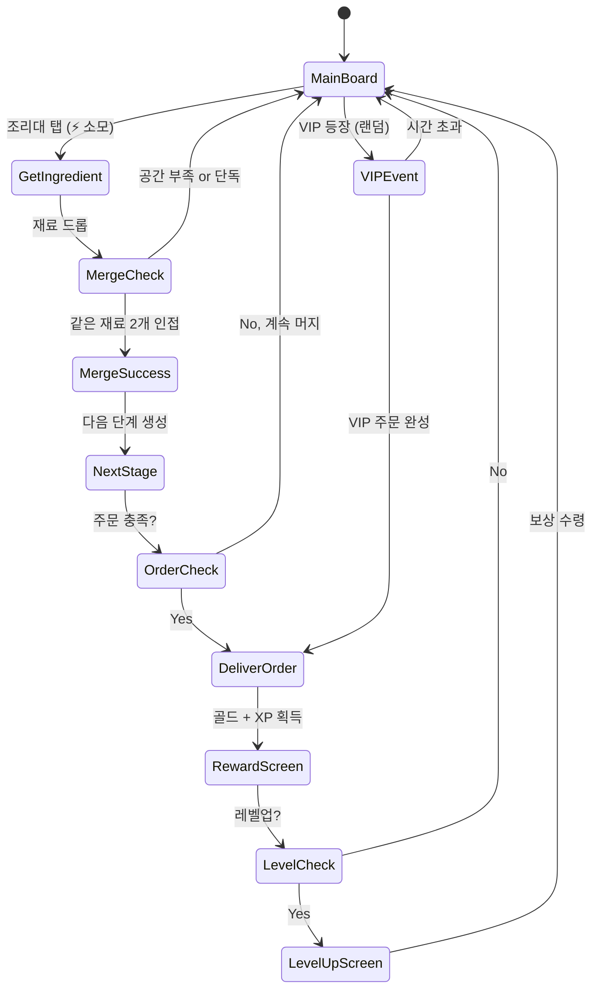

# Foodie Sizzle: 푸디 시즐

> 음식 재료를 합성해 요리를 완성하는 머지 퍼즐 게임.
> 고객 주문을 받아 제한 시간 내에 음식을 만들고 레스토랑을 키워라!

## 개요

제한된 조리대(보드) 위에서 같은 음식 재료를 합성(Merge)하여 더 높은 단계의 요리로 진화시킨다.
고객이 주문한 요리를 완성해 납품하면 골드를 획득하고, 조리대를 확장하며 레스토랑을 성장시킨다.

**핵심 재미 루프**: 재료 획득 → 머지로 진화 → 주문 완성 → 보상 → 조리대 확장 → 반복

## 게임 규칙

### 기본 규칙
- 조리대(보드)는 격자 형태 (초기 4×5 = 20칸)
- 같은 음식 아이템 **2개**를 탭하여 합성 → 다음 단계로 진화
- 합성은 드래그 앤 드롭 또는 더블탭 후 대상 선택
- 조리대가 꽉 차면 신규 재료 획득 불가 → **공간 관리가 핵심 전략**
- 고객 주문 탭에서 요리를 납품하면 골드 + 경험치 획득
- 에너지(⚡) 소모로 행동 수행 (재료 획득 시)

### 머지 규칙
- 같은 단계의 아이템 **2개** = 다음 단계 아이템 **1개**
- 최고 단계(10단계) 아이템은 더 이상 합성 불가 → "명작 요리" 트로피로 변환
- 빈 칸에만 합성 결과물 생성 (이동 후 합성 또는 제자리 합성)
- 합성 시 **Sizzle Effect**: 지글지글 파티클 + 사운드

## 머지 체인 (진화 트리)

### 체인 A: 에그 체인 (달걀 → 풀코스)
| 단계 | 아이템 | 이모지 |
|------|--------|--------|
| 1 | 날달걀 | 🥚 |
| 2 | 계란프라이 | 🍳 |
| 3 | 스크램블에그 | 🍳✨ |
| 4 | 오믈렛 | 🫔 |
| 5 | 치즈오믈렛 | 🧀🫔 |
| 6 | 에그베네딕트 | 🍽️ |
| 7 | 키쉬 | 🥧 |
| 8 | 수플레 | ☁️🧁 |
| 9 | 에그 타르트 | 🥮 |
| 10 | 황금달걀 요리 👑 | 🏆 |

### 체인 B: 밀 체인 (밀가루 → 파스타 풀코스)
| 단계 | 아이템 | 이모지 |
|------|--------|--------|
| 1 | 밀가루 포대 | 🌾 |
| 2 | 반죽 | 🫙 |
| 3 | 국수 | 🍜 |
| 4 | 파스타면 | 🍝 |
| 5 | 알리오올리오 | 🧄🍝 |
| 6 | 카르보나라 | 🥓🍝 |
| 7 | 라자냐 | 🟫🍽️ |
| 8 | 피자 | 🍕 |
| 9 | 트러플 파스타 | 🍄🍝 |
| 10 | 셰프의 파스타 👑 | 🏆 |

### 체인 C: 고기 체인 (생고기 → 스테이크 풀코스)
| 단계 | 아이템 | 이모지 |
|------|--------|--------|
| 1 | 생고기 | 🥩 |
| 2 | 양념고기 | 🌶️🥩 |
| 3 | 구운고기 | 🔥🥩 |
| 4 | 햄버거 패티 | 🍔 |
| 5 | 햄버거 | 🍔✨ |
| 6 | 바베큐 립 | 🍖 |
| 7 | 스테이크 | 🥩🍽️ |
| 8 | 웰링턴 스테이크 | 🥩🫓 |
| 9 | 와규 스테이크 | 🐄💎 |
| 10 | 황금 스테이크 👑 | 🏆 |

### 체인 D: 채소 체인 (씨앗 → 샐러드 풀코스)
| 단계 | 아이템 | 이모지 |
|------|--------|--------|
| 1 | 씨앗 | 🌱 |
| 2 | 새싹 채소 | 🌿 |
| 3 | 당근 | 🥕 |
| 4 | 믹스 채소 | 🥦🥕 |
| 5 | 볶음 채소 | 🥘 |
| 6 | 그린 샐러드 | 🥗 |
| 7 | 니수아즈 샐러드 | 🫒🥗 |
| 8 | 채식 스프 | 🍲 |
| 9 | 채식 코스 | 🌿🍽️ |
| 10 | 황금 채소 타워 👑 | 🏆 |

### 체인 E: 해산물 체인 (새우 → 씨푸드 풀코스)
| 단계 | 아이템 | 이모지 |
|------|--------|--------|
| 1 | 새우 | 🦐 |
| 2 | 조개 | 🦪 |
| 3 | 게 | 🦀 |
| 4 | 랍스터 | 🦞 |
| 5 | 새우 튀김 | 🍤 |
| 6 | 씨푸드 파스타 | 🦐🍝 |
| 7 | 부야베스 | 🍲🌊 |
| 8 | 씨푸드 타워 | 🗼🦞 |
| 9 | 오마카세 씨푸드 | 🍱🦞 |
| 10 | 황금 씨푸드 👑 | 🏆 |

> MVP에서는 **체인 A(에그), B(밀), C(고기)** 3개만 구현

## 주문 시스템

### 주문 구조
- 화면 상단에 **주문 슬롯 3칸** 표시
- 각 주문: 요구 아이템(단계), 보상 골드, 남은 시간
- 주문 완료: 해당 아이템을 주문 슬롯에 드래그 → 골드 + XP 획득
- 주문 만료: 시간 초과 시 주문 소멸 (패널티 없음, 단 VIP는 예외)

### 주문 예시
```
┌─────────────────────────────────┐
│ 주문 #1       주문 #2    주문 #3 │
│ 🍳 계란프라이  🍔 햄버거  🥗 샐러드│
│ 💰 50G        💰 120G   💰 80G  │
│ ⏱ 2:30       ⏱ 4:00   ⏱ 3:00 │
└─────────────────────────────────┘
```

### VIP 고객 시스템
- 랜덤으로 VIP 고객 등장 (30초 체류)
- VIP 주문 완료 시: 골드 **3배** + 특별 재료 드롭
- VIP 주문 실패 시: 다음 VIP 출현까지 **2분** 패널티
- VIP 표시: 황금 테두리 + 반짝임 이펙트

## 재료 획득 시스템

### 기본 획득
- **조리대 탭**: 에너지(⚡) 1 소모 → 랜덤 1~3단계 재료 드롭
- **에너지 회복**: 5분마다 1개, 최대 20개 보유
- **레벨업 보상**: 레벨 달성 시 에너지 +5, 골드, 재료 상자

### 특수 획득
- **데일리 박스**: 하루 3회 무료 재료 상자 (광고 시청으로 +3회 추가)
- **이벤트 드롭**: 특정 시간대 재료 드롭률 2배
- **체인 완성 보너스**: 10단계 달성 시 → 해당 체인 2단계 재료 ×3 드롭

## 보드 관리 전략

### 공간 구성 원칙
- 초기 20칸 (4×5)
- **동선 확보**: 최소 3~4칸 여유 유지 권장
- **체인별 구역 분리**: 체인 A 왼쪽, 체인 B 오른쪽 등 자율 구성
- **잠금 칸**: 일부 칸은 초기 잠금 → 골드/보석으로 해제

### 보드 확장
| 확장 | 추가 칸 | 비용 |
|------|---------|------|
| 1차 확장 | +4칸 (4×6) | 💰 500G |
| 2차 확장 | +5칸 (5×6) | 💰 1500G |
| 3차 확장 | +6칸 (5×7) | 💎 50 보석 |
| 4차 확장 | +7칸 (6×7) | 💎 120 보석 |

## 게임 플로우



## UI 레이아웃

```
┌─────────────────────────────┐
│ Lv.12  ━━━━━━━━━░  XP:850  │  ← 레벨/경험치 바
│ ⚡ 18/20        💰 2,340G  │  ← 에너지 / 골드
├─────────────────────────────┤
│ [🍳 2:30 50G] [🍔 4:00 120G] [VIP⭐ 0:30 360G] │  ← 주문 슬롯
├─────────────────────────────┤
│                             │
│  🥚  🥚  🍳  __  🌾        │
│  🌾  🍳  __  🥩  🥩        │
│  __  🌿  🥩  🌾  __        │  ← 조리대 (4×5)
│  🌱  __  🌿  __  🥩        │
│  🥚  🌱  __  🌾  🌿        │
│                             │
├─────────────────────────────┤
│ [🔀 정리] [⚡+에너지] [📖 레시피] │  ← 하단 액션바
└─────────────────────────────┘
```

### 주요 UI 컴포넌트
| 컴포넌트 | 기능 |
|----------|------|
| 주문 슬롯 | 현재 주문 3개 표시, 시간 바, VIP 강조 |
| 조리대 격자 | 드래그 앤 드롭 머지, 빈칸 강조 |
| 정리 버튼 | 같은 아이템 자동 인접 배치 (골드 소모) |
| 레시피 북 | 전체 체인 트리 확인, 잠금/해제 표시 |
| 에너지 팝업 | 에너지 부족 시 충전 유도 |

## 스코어링 & 진행

### 경험치 테이블
| 액션 | XP |
|------|-----|
| 재료 획득 | +1 |
| 머지 성공 | +5 × 단계 |
| 주문 완료 | +20 |
| VIP 주문 완료 | +60 |
| 10단계 완성 | +200 |

### 레벨 보상
| 레벨 | 보상 |
|------|------|
| 5 | 새 체인 해금 (채소 체인) |
| 10 | 주문 슬롯 +1 (4슬롯) |
| 15 | 새 체인 해금 (해산물 체인) |
| 20 | VIP 출현 빈도 +20% |
| 30 | 주문 슬롯 +1 (5슬롯) |

## 수익화 (IAP)

### 소비성 IAP
| 상품 | 가격 | 내용 |
|------|------|------|
| 에너지 팩 소 | ₩1,200 | ⚡ +20 |
| 에너지 팩 대 | ₩4,500 | ⚡ +100 |
| 골드 팩 소 | ₩1,200 | 💰 1,000G |
| 골드 팩 대 | ₩8,900 | 💰 10,000G |
| 보석 팩 소 | ₩2,400 | 💎 60 |
| 보석 팩 대 | ₩12,000 | 💎 350 |

### 구독 (월정액)
| 상품 | 가격 | 혜택 |
|------|------|------|
| 셰프 패스 (월) | ₩5,900 | ⚡ 무제한, 광고 제거, 데일리 보석 💎5 |
| 프리미엄 셰프 패스 (월) | ₩12,900 | 셰프 패스 + 보드 확장 1회 무료, 데일리 보석 💎15 |

### 영구 IAP
| 상품 | 가격 | 내용 |
|------|------|------|
| 레시피 북 프리미엄 | ₩8,900 | 모든 체인 미리보기 해금 |
| 조리대 스킨팩 | ₩4,500 | 테마 4종 (일식/중식/양식/카페) |
| 광고 제거 | ₩5,900 | 광고 영구 제거 |

### 광고 활용
- 데일리 박스 추가 획득: 광고 시청 시 +3회
- 에너지 즉시 충전: 광고 시청 시 ⚡ +5
- 주문 시간 연장: 광고 시청 시 현재 주문 시간 +2분 (주문당 1회)

## 시각/사운드 디자인

### Sizzle Effect (핵심 이펙트)
- 머지 성공 시: 🔥 파티클 + 지글지글 SFX (`sizzle_sfx_0~3.wav` 랜덤)
- 고단계 머지 (7단계↑): 화염 파티클 + 연기 + 강조 셰이크
- VIP 등장: 황금 빛 웨이브 + 팡파레 SFX
- 주문 완료: 접시 놓는 SFX + 골드 코인 파티클

### 아트 스타일
- 2D 캐릭터: 귀엽고 통통한 음식 캐릭터 (눈코입 있는 음식)
- 배경: 아늑한 레스토랑 주방, 시간대별 조명 변화
- 체인별 색상 코드:
  - 에그 체인: 노란색 계열 🟡
  - 밀 체인: 베이지/갈색 계열 🟤
  - 고기 체인: 빨간색 계열 🔴
  - 채소 체인: 초록색 계열 🟢
  - 해산물 체인: 파란색 계열 🔵

### BGM
- 메인 BGM: 경쾌한 주방 재즈 (루프)
- VIP 등장: 빠른 템포 전환
- 에너지 부족: 긴장감 있는 스팅 SFX

## 난이도 & 밸런스

### 초반 유저 온보딩 (0~레벨5)
1. 튜토리얼: 에그 체인만으로 2단계 머지 1회 체험
2. 첫 주문: 🍳 계란프라이 1개 (체인 A 2단계)
3. 보드 확장 유도: 레벨 3에서 첫 확장 골드 무료 제공
4. 레시피 북 소개: 레벨 5에서 체인 B(밀) 해금

### 미드게임 밸런스 (레벨 6~20)
- 동시 체인 2~3개 운영 필요 → 공간 압박 증가
- 주문 요구 단계 점진적 상승 (평균 3→5단계)
- VIP 주문 빈도 증가

### 레이트게임 (레벨 21+)
- 5개 체인 동시 운영, 극한 공간 관리
- VIP 연속 등장 이벤트 (골드 러시)
- 시즌 리더보드: 월별 리셋, 상위 100명 보석 보상

## MVP 범위

### Phase 1 — MVP (1~2주 개발)
- [ ] 기획서 작성 ✅
- [ ] 보드 격자 (4×5) + 드래그 앤 드롭 머지
- [ ] 에그 체인 (10단계) + 밀 체인 (10단계) + 고기 체인 (10단계)
- [ ] 주문 슬롯 3칸 + 타이머
- [ ] 재료 획득 (탭 → 랜덤 드롭)
- [ ] 골드/레벨/XP 기본 시스템
- [ ] Sizzle 이펙트 (파티클 + SFX)
- [ ] 광고 연동 (데일리 박스 추가 획득)

### Phase 2 — 성장 (출시 후 1주)
- [ ] VIP 고객 시스템
- [ ] 채소 체인 + 해산물 체인 추가
- [ ] 보드 확장 (IAP)
- [ ] 레시피 북 UI
- [ ] 셰프 패스 구독 IAP

### Phase 3 — 최적화 (데이터 기반)
- [ ] 에너지 밸런스 조정 (CPI/리텐션 데이터 기반)
- [ ] A/B 테스트: 광고 노출 타이밍
- [ ] 시즌 이벤트 / 리더보드
- [ ] 조리대 스킨팩

## 기술 구현 노트

> 구현 결정은 각 팀(lib/web/rn)에 위임. 아래는 기획 관점 참고사항.

- 머지 로직: 격자 좌표 기반 아이템 상태 관리
- 보드 상태: JSON 직렬화 → LocalStorage 저장 (오프라인 지원)
- 에너지 타이머: 서버 시간 기준 (클라이언트 조작 방지)
- Phaser.io: 파티클 시스템으로 Sizzle Effect 구현
- 주문 타이머: 씬 레벨 업데이트 루프에서 관리
