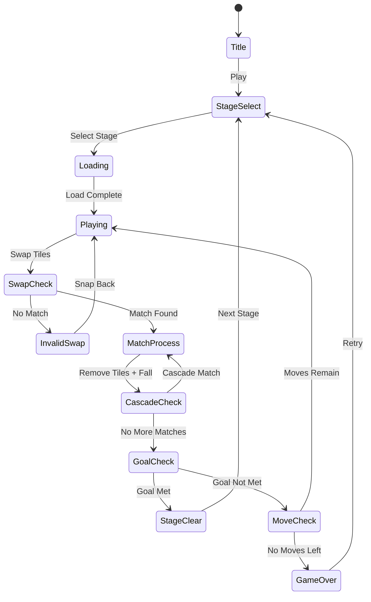

# 포레스트 애니팝 (Forest Anipop)

> 레퍼런스: springpocket / Rating 4.3 / Genre: match-3 / Rank #110

## 개요

숲 속 동물·식물 테마의 스왑 매치-3 퍼즐 게임.
인접한 타일 2개를 교환(swap)하여 같은 종류 3개 이상을 가로·세로로 맞추면 제거.
제한 이동 횟수 안에 목표 타일 수를 클리어하면 스테이지 통과.

### 포지셔닝 키워드
- **숲/자연 테마** + **귀여운 동물** 캐릭터
- **스왑 매치-3** (Candy Crush 클론 계열)
- 캐주얼, 전 연령대

---

## 게임 규칙

### 기본 규칙
- **8×8 그리드** 보드 위에 6종류 숲 테마 타일 배치
- 인접 타일 2개를 **스왑**하여 가로·세로 **3개 이상** 연속 배치 시 제거
- 제거된 자리는 위에서 타일이 **낙하(gravity)**하여 채워짐
- 스테이지마다 **목표 조건**(특정 타일 n개 제거, 장애물 제거 등)과 **이동 횟수 제한**
- 목표 달성 → 스테이지 클리어 / 이동 횟수 소진 → 실패

### 타일 종류 (숲 테마)
| 타일 | 이미지 | 설명 |
|------|--------|------|
| 도토리 | 🌰 | 기본 타일 1 |
| 버섯 | 🍄 | 기본 타일 2 |
| 나뭇잎 | 🍃 | 기본 타일 3 |
| 꽃 | 🌸 | 기본 타일 4 |
| 딸기 | 🍓 | 기본 타일 5 |
| 나비 | 🦋 | 기본 타일 6 |

### 특수 타일 (스페셜 매치)
| 매치 조건 | 생성 아이템 | 효과 |
|-----------|-------------|------|
| 4개 가로/세로 | 줄무늬 타일 | 해당 행/열 전체 제거 |
| 5개 직선 | 색깔폭탄 | 같은 색 타일 전체 제거 |
| L/T자 5개 | 폭탄 | 3×3 범위 제거 |

### 장애물 타일
| 장애물 | 제거 조건 |
|--------|-----------|
| 나무뿌리 | 인접 매치 1회 |
| 돌 | 인접 매치 2회 |
| 얼음 | 해당 위치 매치 또는 특수 타일 |

### 스테이지 목표 유형
1. **수집형**: 특정 타일 n개 제거 (예: 도토리 30개)
2. **장애물 제거형**: 모든 장애물 제거
3. **점수형**: n점 이상 달성

---

## 게임 플로우



---

## UI 레이아웃

```
┌─────────────────────────────┐
│  ❤️❤️❤️  Lv.12   🎯 목표   │  ← 상단 HUD (목숨, 레벨, 목표)
├─────────────────────────────┤
│  [목표: 🌰×30]  이동: 25   │  ← 미션 표시
├─────────────────────────────┤
│  🍄 🌰 🍃 🌸 🍓 🦋 🌰 🍄  │
│  🌸 🍓 🦋 🌰 🍄 🍃 🌸 🍓  │
│  🌰 🦋 🌸 🍄 🍃 🌰 🦋 🌸  │  ← 8×8 게임 보드
│  🍃 🌰 🍓 🦋 🌸 🍄 🌰 🍃  │
│  🦋 🍄 🌰 🍃 🌰 🌸 🍓 🦋  │
│  🌸 🍃 🦋 🍄 🍓 🌰 🌸 🍃  │
│  🍓 🌰 🌸 🍃 🦋 🍄 🌰 🍓  │
│  🌰 🦋 🍄 🌸 🍃 🍓 🦋 🌰  │
├─────────────────────────────┤
│     [🔀 부스터]  [⚡ 추가이동]  │  ← 하단 아이템
└─────────────────────────────┘
```

---

## 스코어링 시스템

| 액션 | 점수 |
|------|------|
| 기본 3매치 제거 | 타일 1개당 +30 |
| 4매치 | 타일 1개당 +60 |
| 5매치+ | 타일 1개당 +100 |
| 연쇄(캐스케이드) | +50 × 캐스케이드 횟수 |
| 스테이지 클리어 | +500 |
| 남은 이동 보너스 | 이동 1회당 +100 (랜덤 폭발) |

---

## 난이도 설계

| 구간 | 스테이지 | 타일 종류 | 이동 제한 | 주요 요소 |
|------|----------|-----------|-----------|-----------|
| 튜토리얼 | 1~5 | 4종 | 20~25 | 기본 매치만 |
| 초급 | 6~20 | 5종 | 20 | 줄무늬 타일 등장 |
| 중급 | 21~50 | 6종 | 18 | 장애물(나무뿌리) |
| 고급 | 51~100 | 6종 | 15 | 돌·얼음 장애물 복합 |
| 마스터 | 101+ | 6종 | 12 | 멀티 목표, 타임어택 |

---

## 아이템 시스템

### 인게임 부스터
| 아이템 | 효과 | 비용 |
|--------|------|------|
| 망치 | 원하는 타일 1개 즉시 제거 | 코인 |
| 셔플 | 보드 전체 재배치 | 코인 |
| +5이동 | 이동 횟수 5회 추가 | 코인/광고 |

### 사전 부스터 (스테이지 시작 전 선택)
| 부스터 | 효과 |
|--------|------|
| 시작 줄무늬 | 무작위 줄무늬 타일 3개 배치 |
| 시작 폭탄 | 중앙에 폭탄 타일 배치 |

---

## 사운드/이펙트

| 이벤트 | 효과 |
|--------|------|
| 스왑 | 사각사각 나뭇잎 소리 |
| 3매치 제거 | 팡! + 파티클 이펙트 |
| 캐스케이드 | 연쇄 상승 음계 |
| 특수 타일 폭발 | 빛 이펙트 + 큰 사운드 |
| 스테이지 클리어 | 새소리 + 별 이펙트 |
| 실패 | 나뭇잎 떨어지는 소리 |

---

## MVP 범위

### Phase 1 (1주차 — MVP 출시 목표)
- [x] 기획서 작성
- [ ] 8×8 그리드 보드 렌더링
- [ ] 스왑 + 3매치 감지 로직
- [ ] 타일 낙하(gravity) 애니메이션
- [ ] 스테이지 목표 / 이동 횟수 카운트
- [ ] 게임 클리어 / 실패 판정
- [ ] 기본 타일 6종 (스프라이트)
- [ ] 스테이지 10개

### Phase 2 (2주차 — 폴리싱)
- [ ] 특수 타일 3종 (줄무늬, 폭탄, 색깔폭탄)
- [ ] 장애물 2종 (나무뿌리, 돌)
- [ ] 캐스케이드 애니메이션
- [ ] 인게임 부스터 2종 (망치, +5이동)
- [ ] 스테이지 30개
- [ ] 광고 삽입 (실패 후 부활 광고)

---

## 수익화 모델

| 모델 | 설명 |
|------|------|
| 보상형 광고 | 실패 시 이동 +5 (영상 광고) |
| 인터스티셜 광고 | 스테이지 완료마다 (5스테이지당 1회) |
| 인앱 결제 | 코인 팩 ($0.99~$4.99) |

---

## 전략적 메모

> **주의**: 13번째 매치-3 레퍼런스. 장르 포화 상태.
> 본 기획서는 레퍼런스 분석용 + 빠른 클론 개발을 위한 최소 스펙.
> **차별화 없이 출시 시 CPI가 높아 마케팅 비용 소진 위험.**
> 아래 전략 분석 문서 참조: [Issue #110](https://github.com/hisgtory/mobile-arcade/issues/110)
