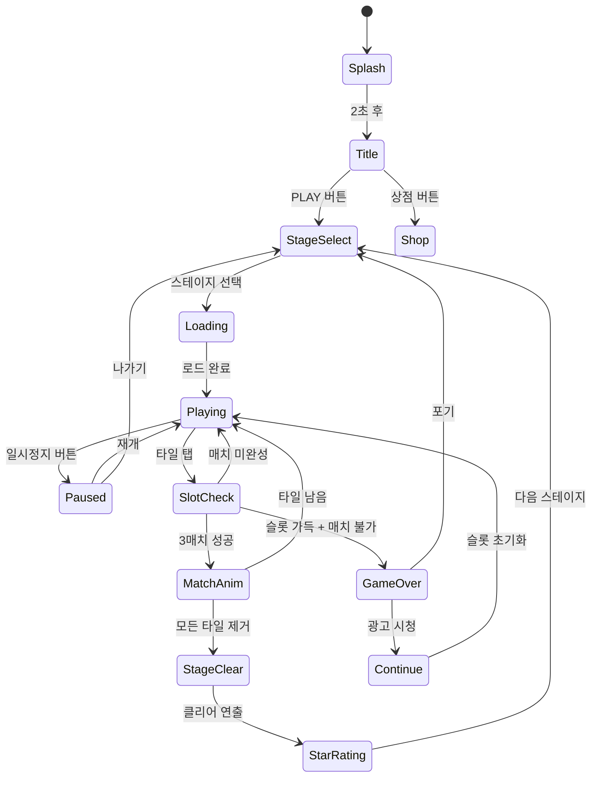

# Found3 — 트리플 매치 타일 퍼즐 상세 기획서

> 3개씩 같은 그림을 찾아 없애서 모든 타일을 클리어하는 게임.
> **우리의 첫 번째 게임. 파이프라인 검증 + 첫 매출.**

---

## 개요

보드 위에 다양한 그림 타일이 여러 레이어로 겹쳐 배치되어 있다.
플레이어는 같은 그림 3개를 선택하여 하단 슬롯(7칸)에 모은다.
슬롯에 같은 그림 3개가 모이면 자동 제거. 슬롯이 가득 차면 게임오버.
모든 타일을 제거하면 스테이지 클리어.

---

## 1. 코어 메카닉 상세 설계

### 1-1. 타일 보드 배치 알고리즘

**목표**: 반드시 클리어 가능한 배치 보장

#### 그리드 구조

```
보드 크기: 9열 × 7행 (portrait 기준)
타일 크기: 64×64px (겹침 오프셋: 32px)
레이어 오프셋: (x+8, y-8) per layer (우상단 방향)
```

#### 배치 알고리즘 (역방향 생성)

```
1. 타일 풀 생성
   - 그림 종류 N개 × 3장 = 총 3N장
   - 배열을 랜덤 셔플

2. 클리어 가능 보장 — 시뮬레이션 기반 배치
   a. 빈 보드에 타일을 역순으로 배치 (바닥→상단 레이어 순)
   b. 각 타일 배치 후 "현재 오픈 타일" 목록 계산
   c. 오픈 타일 중 3매치 가능한 조합이 항상 존재하는지 검증
   d. 막히면 해당 배치를 rollback → 다른 위치 시도
   e. 최대 100회 시도 후 실패 시 전체 재생성

3. 레이어 겹침 좌표
   - Layer 0 (바닥): 정규 그리드 위치
   - Layer 1: 0.5칸 우하단 오프셋 (홀수열 stagger)
   - Layer 2+: 추가 오프셋 누적
   - 겹침 감지: 타일 중심 거리 < 48px이면 겹침 관계 등록
```

#### 가림 판정 (Blocking) 데이터 구조

```typescript
interface Tile {
  id: string;
  symbolId: number;       // 그림 종류 인덱스
  layer: number;          // 레이어 번호 (0 = 바닥)
  gridX: number;
  gridY: number;
  blockedBy: string[];    // 이 타일을 덮고 있는 타일 id 목록
  isOpen: boolean;        // blockedBy.length === 0
}
```

**가림 판정 규칙**:
- 타일 A가 타일 B보다 높은 레이어에 있고
- A의 렌더 영역이 B와 50% 이상 겹치면
- B는 A에 의해 막힘 (`B.blockedBy.push(A.id)`)

타일 제거 시: 제거된 타일을 blockedBy에서 제거 → 길이 0이 된 타일의 `isOpen = true`

---

### 1-2. 타일 선택 규칙

- `isOpen === true`인 타일만 탭 가능
- 탭 불가 타일: 시각적으로 어둡게 표시 (alpha 0.5 + 잠금 아이콘 없음)
- 탭 가능 타일: 밝게, hover 시 살짝 scale up (1.05×)
- 이미 슬롯에 들어간 타일: 보드에서 즉시 제거

**터치 우선순위**: 같은 위치에 여러 타일이 겹친 경우 가장 높은 레이어(top) 타일만 반응

---

### 1-3. 슬롯 시스템 (7칸)

```
슬롯 동작 상세:

1. 타일 탭 → 슬롯에 삽입
   - 같은 symbolId를 가진 타일 옆에 삽입 (그룹화)
   - 없으면 가장 오른쪽 빈 칸에 추가

2. 3매치 자동 제거
   - 슬롯 내 같은 symbolId 3개 감지 즉시 트리거
   - 제거 애니메이션: scale 1→1.3→0 (0.3초) + 파티클
   - 제거 후 오른쪽 타일들이 왼쪽으로 슬라이드

3. 게임오버 판정
   - 슬롯 7칸이 모두 채워짐 AND 자동 제거가 발생하지 않음
   - 즉, 7칸 채운 직후 3매치가 없으면 게임오버 트리거
```

**슬롯 삽입 알고리즘 (인접 정렬)**:
```
function insertToSlot(tile):
  for i in range(slot.length):
    if slot[i].symbolId === tile.symbolId:
      // 같은 그림 그룹의 마지막 위치 찾기
      lastSameIdx = findLastSameGroupIndex(i)
      slot.splice(lastSameIdx + 1, 0, tile)
      return
  // 같은 그림 없으면 맨 오른쪽
  slot.push(tile)
```

---

## 2. 경쟁작 대비 차별화 전략

### 2-1. 우리가 가져갈 핵심 요소 (검증된 메카닉)

| 요소 | 출처 | 이유 |
|------|------|------|
| 7칸 슬롯 | Triple Tile, 전 경쟁작 공통 | 업계 표준. 최적의 긴장감 |
| 레이어 겹침 | Triple Tile, Tiletopia | 전략적 깊이의 핵심 |
| Shuffle/Undo 아이템 | 전 경쟁작 공통 | 플레이어 좌절 방지 필수 |
| 스테이지 진행 구조 | Tile Match (LinkDesks) | 목표 명확 → 재방문율 ↑ |
| 힐링/릴랙스 BGM | Tile Explorer | 장기 세션 유도 |
| 인접 정렬 슬롯 | Triple Tile | 매치 가시성 향상 |

### 2-2. 우리만의 차별점

**비주얼 톤: "따뜻한 한국 감성 일러스트"**
- 경쟁작 대부분이 서구/글로벌 스타일 → 한국/아시아 감성 틈새
- 타일 그림: 음식(떡볶이, 삼겹살, 김밥), 자연(벚꽃, 단풍), 전통 오브젝트
- 배경: 계절별 한국 풍경 (봄→여름→가을→겨울 테마 스테이지)

**UX 차별점**:
- **즉시 시작**: 타이틀 → 게임 진입 2탭 이내 (경쟁작은 3~4탭)
- **힌트 시스템**: 10초 비활성 시 클릭 가능 타일 1개 자동 하이라이트 (비침습적)
- **클리어 경로 표시**: Shuffle 사용 시 매칭 가능한 타일 그룹 0.5초 하이라이트

**밸런스 철학: "공정한 난이도"**
- Triple Tile의 문제: 후반 스테이지가 Shuffle 없이 클리어 불가능하게 설계 → 과금 유도
- 우리의 원칙: **모든 스테이지는 아이템 없이 클리어 가능**하도록 배치 알고리즘 보장
- 아이템은 편의성/시간 단축용이지 필수가 아님

### 2-3. Triple Tile 후반 과금 유도 문제 해결

**문제**: Triple Tile은 레이어를 의도적으로 막아 Shuffle 강제 구매 유도

**우리의 해결책**:
```
1. 클리어 가능성 검증 알고리즘 (배치 시점)
   - 모든 스테이지: 아이템 0개로 풀 가능한 경로 반드시 존재
   - QA 자동화: 시뮬레이션 봇이 아이템 없이 각 스테이지 100회 클리어율 체크

2. 아이템 공급 정책
   - 일일 무료 Shuffle 3개 (광고 없이 지급)
   - 스테이지 클리어 보상으로 Undo 1개
   - 광고 시청 → 추가 아이템 (강제 아님, 선택)

3. 게임오버 시 구제책
   - "광고 시청 → 슬롯 초기화 1회" (무료 컨티뉴)
   - 슬롯 초기화: 슬롯의 타일을 보드로 되돌림
```

---

## 3. 스테이지 설계

### 3-1. 난이도 곡선 (레벨 1~50)

| 레벨 | 그림 종류 | 타일 수 | 레이어 | 시간(초) | 특징 |
|------|-----------|---------|--------|----------|------|
| 1 | 4 | 12 | 1 | 무제한 | 튜토리얼, 레이어 없음 |
| 2 | 5 | 15 | 1 | 무제한 | |
| 3 | 6 | 18 | 1 | 무제한 | |
| 4 | 6 | 18 | 2 | 무제한 | 첫 레이어 소개 |
| 5 | 7 | 21 | 2 | 무제한 | |
| 6~10 | 7~9 | 21~27 | 2 | 180 | 타이머 도입 |
| 11~15 | 9~10 | 27~30 | 2~3 | 160 | 레이어 3 도입 |
| 16~20 | 10~11 | 30~33 | 3 | 150 | |
| 21~25 | 11~12 | 33~36 | 3 | 140 | 밀집 배치 시작 |
| 26~30 | 12~13 | 36~39 | 3~4 | 130 | 레이어 4 도입 |
| 31~35 | 12~14 | 36~42 | 4 | 120 | 보스 스테이지 포함 |
| 36~40 | 13~15 | 39~45 | 4 | 110 | |
| 41~45 | 14~16 | 42~48 | 4~5 | 100 | 레이어 5 도입 |
| 46~49 | 15~17 | 45~51 | 5 | 90 | |
| 50 | 18 | 54 | 5 | 90 | 피날레 보스 스테이지 |

> 타일 수 = 그림 종류 × 3 (항상 3의 배수)

**챕터 구조** (10스테이지 = 1챕터):
- Chapter 1 (1~10): 봄 — 벚꽃, 딸기, 새
- Chapter 2 (11~20): 여름 — 수박, 파도, 선풍기
- Chapter 3 (21~30): 가을 — 단풍, 고구마, 도토리
- Chapter 4 (31~40): 겨울 — 눈사람, 귤, 핫초코
- Chapter 5 (41~50): 사계절 혼합 — 최고 난이도

### 3-2. 스테이지 자동 생성 vs 수동 디자인

| 방식 | 장점 | 단점 | 결정 |
|------|------|------|------|
| 자동 생성 | 무한 스테이지, 개발 빠름 | 재미 보장 어려움, 최적화 필요 | MVP: 자동 생성 |
| 수동 디자인 | 정교한 난이도 곡선, 'aha moment' 설계 | 리소스 많이 듦 | Phase 2: 주요 스테이지 수동 |

**MVP 자동 생성 파라미터**:
```typescript
interface StageConfig {
  level: number;
  symbolCount: number;     // 그림 종류
  totalTiles: number;      // symbolCount * 3
  maxLayers: number;       // 레이어 수
  timeLimitSec: number;    // 0 = 무제한
  seed?: number;           // 재현 가능성을 위한 시드
}
```

### 3-3. 보스/이벤트 스테이지 아이디어

**보스 스테이지** (챕터 마지막 스테이지: 10, 20, 30, 40, 50):
- 특수 배치: 원형, 하트형, 별형 등 비정형 보드
- 잠금 타일 추가 (특정 타일을 먼저 제거해야 언락)
- 보스 클리어 시: 특별 이모티콘/스킨 보상

**이벤트 스테이지 아이디어**:
- 시간 제한 챌린지: 60초 이내 클리어 (리더보드)
- 역방향 스테이지: 슬롯에서 보드로 배치하는 퍼즐
- 협동 모드 (Phase 3): 2인이 같은 보드 공유

---

## 4. 아이템/파워업 시스템

### 4-1. 아이템 상세 설계

#### Shuffle (셔플)
```
효과: 보드의 모든 오픈 타일을 무작위 재배치
     (레이어 구조 유지, 위치만 재배치)
보장: 재배치 후 반드시 1개 이상의 3매치 가능 경로 존재
애니메이션: 타일들이 공중으로 날아올랐다 착지 (0.5초)
사용 제한: 스테이지당 제한 없음 (보유 개수 내)
```

#### Undo (되돌리기)
```
효과: 슬롯의 마지막 타일을 원래 보드 위치로 되돌림
     (타일 isOpen 상태 복원, blockedBy 관계 복원)
연속 사용: 최대 3회 연속 (스택 기반)
애니메이션: 타일이 슬롯에서 보드로 날아가는 트윈 (0.3초)
제한: 3매치 제거된 타일은 Undo 불가
```

#### Magnet (마그넷)
```
효과: 보드에서 특정 그림의 타일을 즉시 슬롯으로 수집
     플레이어가 하나를 선택하면 같은 그림 2개 더 자동 수집
보장: 오픈 타일 중 3개 이상 존재할 때만 활성화
     (없으면 그레이아웃)
애니메이션: 마그넷 아이콘이 보드 위로 이동, 타일 3개가 빨려들어옴
```

### 4-2. 아이템 획득 경로

| 경로 | Shuffle | Undo | Magnet | 조건 |
|------|---------|------|--------|------|
| 일일 무료 | 3개 | 3개 | 1개 | 매일 자정 리셋 |
| 스테이지 클리어 보상 | - | 1개 | - | 별 3개 클리어 시 |
| 광고 시청 | 1개 | 1개 | 1개 | 게임오버 시 제안 |
| IAP 번들 | 20개 | 20개 | 10개 | $0.99 / $2.99 |
| 레벨업 보상 | 2개 | 2개 | 1개 | 10레벨마다 |

---

## 5. 수익화 설계

### 5-1. 라이프 시스템

```
하트: 최대 5개
실패 시: -1 하트
회복: 30분당 +1 하트 (자연 회복)
즉시 회복: 광고 시청 → +1 하트 | IAP → +5 하트 (풀 충전)
하트 0개: 플레이 불가 → "기다리거나 광고/구매" 팝업
```

**하트 소모 예외**:
- 게임오버 후 "컨티뉴" (광고 시청) 사용 시 하트 미소모
- 튜토리얼 스테이지 (1~3): 하트 소모 없음

### 5-2. 광고 리워드 플레이스먼트

| 위치 | 광고 타입 | 리워드 | 트리거 |
|------|-----------|--------|--------|
| 게임오버 → 컨티뉴 | Rewarded Video | 슬롯 초기화 1회 | 게임오버 즉시 |
| 아이템 부족 | Rewarded Video | 아이템 1개 | 아이템 0개 상태에서 사용 시도 |
| 하트 회복 | Rewarded Video | 하트 +1 | 하트 0개 상태 |
| 힌트 | Rewarded Video | 힌트 3회 | 힌트 버튼 탭 |
| 일일 보너스 | Rewarded Video | 코인 100개 | 홈 화면 배너 |

**인터스티셜 (비보상 전면광고)**:
- 스테이지 클리어 후 매 3회마다 노출
- 광고 제거 IAP 구매 시 영구 비활성화
- 튜토리얼(1~5스테이지) 중 미노출

### 5-3. IAP 구성

| 상품 | 가격 | 내용 | 타깃 |
|------|------|------|------|
| 하트 팩 Small | ₩1,200 | 하트 즉시 충전 | 캐주얼 과금 |
| 하트 팩 Large | ₩5,900 | 하트 충전 + 무한 하트 72시간 | 중과금 |
| 스타터 번들 | ₩2,400 | Shuffle×10, Undo×10, Magnet×5 | 신규 유저 |
| 아이템 번들 | ₩5,900 | Shuffle×30, Undo×30, Magnet×15 | 리텐션 유저 |
| 광고 제거 | ₩4,900 | 영구 인터스티셜 제거 | 하드코어 |
| VIP 패스 | ₩9,900/월 | 무한 하트 + 광고 제거 + 일일 아이템 | 고가치 유저 |

---

## 6. UI/UX 플로우

### 6-1. 전체 화면 상태 머신



### 6-2. 화면 레이아웃 (Portrait 세로 모드 최적화)

```
┌─────────────────────────┐  ← 전체 높이 100%
│ ✕  [STAGE 1]  ⚙️  🛒   │  ← HUD (8%)
│ ❤️❤️❤️❤️❤️  ⭐ 0      │
├─────────────────────────┤
│                         │
│                         │
│    [타일 보드 영역]      │  ← 보드 (60%)
│    9열 × 7행 그리드      │
│    + 레이어 오버레이     │
│                         │
│                         │
├─────────────────────────┤
│ [슬롯 7칸 ————————————]│  ← 슬롯 (12%)
├─────────────────────────┤
│  🔀 Shuffle  ↩️ Undo  🧲│  ← 아이템 (10%)
│   (×3)        (×3)  (×1)│
└─────────────────────────┘

※ 하단 safe area 고려 (iPhone notch / Android nav bar)
```

### 6-3. 타일 탭 피드백 (멀티센서리)

| 피드백 | 내용 | 타이밍 |
|--------|------|--------|
| 시각 — 탭 | 타일 scale 1.0→1.1→1.0 (0.15초) + 선택 링 표시 | 즉시 |
| 시각 — 이동 | 타일이 슬롯으로 날아가는 트윈 (0.25초) | 탭 직후 |
| 시각 — 3매치 | 파티클 폭발 + 타일 사라짐 (0.3초) | 3번째 삽입 |
| 사운드 — 탭 | 경쾌한 "톡" (C4 note) | 즉시 |
| 사운드 — 매치 | 상승 3음 멜로디 (C-E-G) | 3매치 시 |
| 사운드 — 콤보 | 음이 높아지는 연속 멜로디 | 연속 매치 시 |
| 햅틱 — 탭 | Light impact | 즉시 |
| 햅틱 — 매치 | Medium impact | 3매치 시 |
| 햅틱 — 게임오버 | Heavy impact + notification | 게임오버 시 |

**접근성**: 설정에서 사운드/햅틱 각각 on/off 가능

---

## 7. Phaser.io 기술 설계

### 7-1. 씬 구조

```
lib/found3/src/
├── scenes/
│   ├── BootScene.ts       # 에셋 프리로드
│   ├── TitleScene.ts      # 타이틀 화면
│   ├── StageSelectScene.ts
│   ├── PlayScene.ts       # 핵심 게임플레이
│   ├── ClearScene.ts      # 클리어 연출
│   └── GameOverScene.ts
├── objects/
│   ├── Tile.ts            # 타일 게임오브젝트
│   ├── SlotArea.ts        # 슬롯 컨테이너
│   └── Board.ts           # 보드 로직 + 렌더링
├── logic/
│   ├── BoardGenerator.ts  # 배치 알고리즘
│   ├── BlockingChecker.ts # 가림 판정
│   └── MatchChecker.ts    # 3매치 판정
└── index.ts               # createGame() 진입점
```

### 7-2. 타일 레이어 렌더링

**Depth Sort**:
```typescript
// 타일의 depth = layer * 1000 + gridY * 10 + gridX
// 높은 depth가 위에 렌더링됨
tile.setDepth(tile.layer * 1000 + tile.gridY * 10 + tile.gridX);

// 그림자: 각 타일 아래 오프셋 sprite (depth - 1)
shadow.setDepth(tile.getDepth() - 1);
shadow.setAlpha(0.3);
```

**가림 처리 시각화**:
```typescript
// isOpen === false인 타일
tile.setAlpha(0.6);
tile.setTint(0x888888);  // 어둡게

// isOpen === true인 타일
tile.clearTint();
tile.setAlpha(1.0);
```

### 7-3. 타일 애니메이션

**선택 → 슬롯 이동**:
```typescript
function moveToSlot(tile: Tile, slotIndex: number): Promise<void> {
  const targetPos = slotArea.getSlotPosition(slotIndex);
  return new Promise(resolve => {
    scene.tweens.add({
      targets: tile,
      x: targetPos.x,
      y: targetPos.y,
      scaleX: 0.7,
      scaleY: 0.7,
      duration: 250,
      ease: 'Back.easeIn',
      onComplete: resolve
    });
  });
}
```

**3매치 제거 이펙트**:
```typescript
function playMatchEffect(tiles: Tile[]): void {
  // 파티클 시스템
  const emitter = scene.add.particles(0, 0, 'particle', {
    speed: { min: 100, max: 300 },
    lifespan: 600,
    quantity: 20,
    tint: [0xFFD700, 0xFF6B6B, 0x4ECDC4],
    scale: { start: 0.5, end: 0 }
  });

  // 타일 사라짐 트윈
  tiles.forEach(tile => {
    emitter.setPosition(tile.x, tile.y);
    emitter.explode();
    scene.tweens.add({
      targets: tile,
      scaleX: 1.3, scaleY: 1.3, alpha: 0,
      duration: 300,
      ease: 'Power2',
      onComplete: () => tile.destroy()
    });
  });
}
```

**셔플 애니메이션**:
```typescript
async function animateShuffle(tiles: Tile[]): Promise<void> {
  // 1. 모든 타일 중앙으로 모이기
  const center = { x: scene.scale.width/2, y: scene.scale.height/2 };
  await Promise.all(tiles.map(t =>
    tweenTo(t, center.x, center.y, 300)
  ));

  // 2. 회전 + 흩어지기 → 새 위치로
  await Promise.all(tiles.map(t =>
    tweenTo(t, t.newX, t.newY, 400, 'Back.easeOut')
  ));
}
```

### 7-4. 터치 인터랙션

```typescript
// 타일 터치 핸들러 (최상위 레이어만 반응)
tile.setInteractive();
tile.on('pointerdown', (pointer: Phaser.Input.Pointer) => {
  if (!tile.tileData.isOpen) {
    // 탭 불가 피드백: 짧은 흔들림
    scene.tweens.add({
      targets: tile,
      x: tile.x + 5, duration: 50, yoyo: true, repeat: 2
    });
    return;
  }
  board.selectTile(tile);
});

// 겹친 타일 최상위만 반응하도록
// Phaser의 input.setTopOnly(true) 사용
scene.input.setTopOnly(true);
```

### 7-5. createGame() API

```typescript
// lib/found3/src/index.ts

export interface GameConfig {
  parentElementId: string;   // DOM 컨테이너 id
  width?: number;            // 기본 390
  height?: number;           // 기본 844
  startLevel?: number;       // 시작 레벨 (기본 1)
  onClear?: (level: number, score: number, stars: number) => void;
  onGameOver?: (level: number, score: number) => void;
  onItemUse?: (itemType: 'shuffle' | 'undo' | 'magnet') => void;
  onRewardAdRequest?: (reason: string) => Promise<boolean>; // 광고 요청
}

export interface GameInstance {
  destroy: () => void;
  pause: () => void;
  resume: () => void;
  setLevel: (level: number) => void;
  addItem: (itemType: 'shuffle' | 'undo' | 'magnet', count: number) => void;
}

export function createGame(config: GameConfig): GameInstance {
  const phaserConfig: Phaser.Types.Core.GameConfig = {
    type: Phaser.AUTO,
    width: config.width ?? 390,
    height: config.height ?? 844,
    parent: config.parentElementId,
    backgroundColor: '#F5E6D3',
    scene: [BootScene, TitleScene, PlayScene, ClearScene, GameOverScene],
  };

  const game = new Phaser.Game(phaserConfig);
  game.registry.set('gameConfig', config);

  return {
    destroy: () => game.destroy(true),
    pause: () => game.pause(),
    resume: () => game.resume(),
    setLevel: (level) => game.registry.set('targetLevel', level),
    addItem: (type, count) => game.events.emit('addItem', { type, count }),
  };
}
```

---

## 8. MVP 1주 출시 계획

### Day 1~2: lib/found3 코어 로직

**목표**: 게임 로직 완성 (렌더링 없이 순수 로직 테스트 가능)

- [ ] `BoardGenerator.ts`: 스테이지 배치 알고리즘 + 클리어 가능성 검증
- [ ] `BlockingChecker.ts`: 타일 가림 판정 (isOpen 계산)
- [ ] `MatchChecker.ts`: 슬롯 3매치 감지 + 슬롯 인접 정렬
- [ ] `Tile.ts` / `SlotArea.ts` 데이터 구조 정의
- [ ] 유닛 테스트: 레벨 1~5 배치 검증

**체크포인트**: `node test` 통과 → 코어 로직 완료

### Day 3~4: Phaser 씬 구현

**목표**: 플레이 가능한 게임 (스타일링 최소)

- [ ] `BootScene.ts`: 에셋 로드 (임시 도형 에셋으로 대체 가능)
- [ ] `PlayScene.ts`: 보드 렌더링 + 터치 + 슬롯 UI
- [ ] `TitleScene.ts`: 스타트 버튼만 있는 최소 타이틀
- [ ] `ClearScene.ts`: "CLEAR!" 텍스트 + 다음 버튼
- [ ] `GameOverScene.ts`: "GAME OVER" + 재시도 버튼

**체크포인트**: 레벨 1~5 플레이 가능, 클리어/게임오버 동작

### Day 5: web/found3 React 래핑

**목표**: 브라우저에서 정상 동작

```
web/found3/src/
├── App.tsx           # createGame() 호출, 이벤트 핸들링
├── GameContainer.tsx # Phaser 마운트 div
└── main.tsx
```

- [ ] `web/found3` Vite 프로젝트 생성 (web 기존 템플릿 복사)
- [ ] `lib/found3` 패키지 링크 (`pnpm-workspace.yaml` 등록)
- [ ] `createGame()` 연동 + 콜백 핸들링
- [ ] 빌드 검증: `pnpm build` 성공

**체크포인트**: `http://localhost:5173` 에서 게임 플레이 가능

### Day 6: found3/rn WebView 래핑

**목표**: React Native 앱에서 실행

```
found3/rn/
├── App.tsx
├── GameWebView.tsx   # WebView 컴포넌트
└── bridge/
    └── messages.ts   # JS → RN 브릿지 메시지 타입
```

- [ ] `found3/rn` RN 프로젝트 생성 (기존 rn 템플릿 복사)
- [ ] `web/found3` 빌드 결과물을 assets/에 번들
- [ ] WebView에서 로컬 HTML 로드
- [ ] 브릿지: 게임오버/클리어 이벤트 → RN 핸들링
- [ ] iOS/Android 시뮬레이터 동작 확인

**체크포인트**: 시뮬레이터에서 게임 플레이 가능

### Day 7: 테스트 + 버그 수정 + 제출 준비

- [ ] 레벨 1~5 전 스테이지 플레이 테스트
- [ ] 크래시 / 렌더링 버그 수정
- [ ] 아이콘 + 스플래시 스크린 (최소)
- [ ] 앱 스토어 메타데이터 작성 (스크린샷, 설명)
- [ ] TestFlight (iOS) / Internal Testing (Android) 제출

---

## 스코어링 시스템

| 액션 | 점수 |
|------|------|
| 타일 3매치 제거 | +100 |
| 연속 매치 콤보 (2연속) | +200 |
| 연속 매치 콤보 (3연속) | +400 |
| 연속 매치 콤보 (N연속) | +100 × 2^(N-1) |
| 스테이지 클리어 | +500 |
| 남은 시간 보너스 | 남은초 × 10 |
| 별 3개 (아이템 미사용) | +1000 |

**별점 기준**:
- ⭐ 1개: 클리어
- ⭐ 2개: 클리어 + 아이템 1개 이하 사용
- ⭐ 3개: 클리어 + 아이템 미사용

---

## 사운드/이펙트 에셋 목록

| 에셋 | 파일명 | 설명 |
|------|--------|------|
| BGM | `bgm_main.mp3` | 루핑 힐링 BGM (봄 테마) |
| SFX 탭 | `sfx_tap.mp3` | 경쾌한 클릭음 |
| SFX 매치 | `sfx_match.mp3` | 3매치 성공 효과음 |
| SFX 콤보 | `sfx_combo_N.mp3` | 콤보 레벨별 (1~5) |
| SFX 클리어 | `sfx_clear.mp3` | 스테이지 클리어 |
| SFX 게임오버 | `sfx_gameover.mp3` | 게임오버 |
| SFX 셔플 | `sfx_shuffle.mp3` | 셔플 아이템 |
| SFX 언두 | `sfx_undo.mp3` | 언두 아이템 |

> MVP: 무료 라이선스 효과음 사용 (freesound.org / zapsplat.com)

---

## MVP 범위 체크리스트

### Phase 1 (MVP — 1~2주)
- [x] 기획서 작성
- [ ] 기본 타일 보드 (1~2 레이어)
- [ ] 타일 선택 → 슬롯 이동
- [ ] 슬롯 3매치 자동 제거
- [ ] 게임오버 / 클리어 판정
- [ ] 레벨 1~10 (스테이지 자동 생성)
- [ ] 기본 HUD (스테이지, 점수)
- [ ] 클리어/게임오버 화면
- [ ] Shuffle / Undo 아이템 (각 3개 무료 지급)

### Phase 2 (2~3주차)
- [ ] 다중 레이어 (3~5)
- [ ] 타이머 + 스코어링 + 콤보
- [ ] Magnet 아이템
- [ ] 스테이지 셀렉트 화면
- [ ] 라이프 시스템 (하트)
- [ ] 광고 리워드 연동
- [ ] 챕터 테마 비주얼

### Phase 3 (수익화)
- [ ] IAP 연동
- [ ] 인터스티셜 광고
- [ ] 레벨 11~50
- [ ] 보스 스테이지
- [ ] 리더보드
