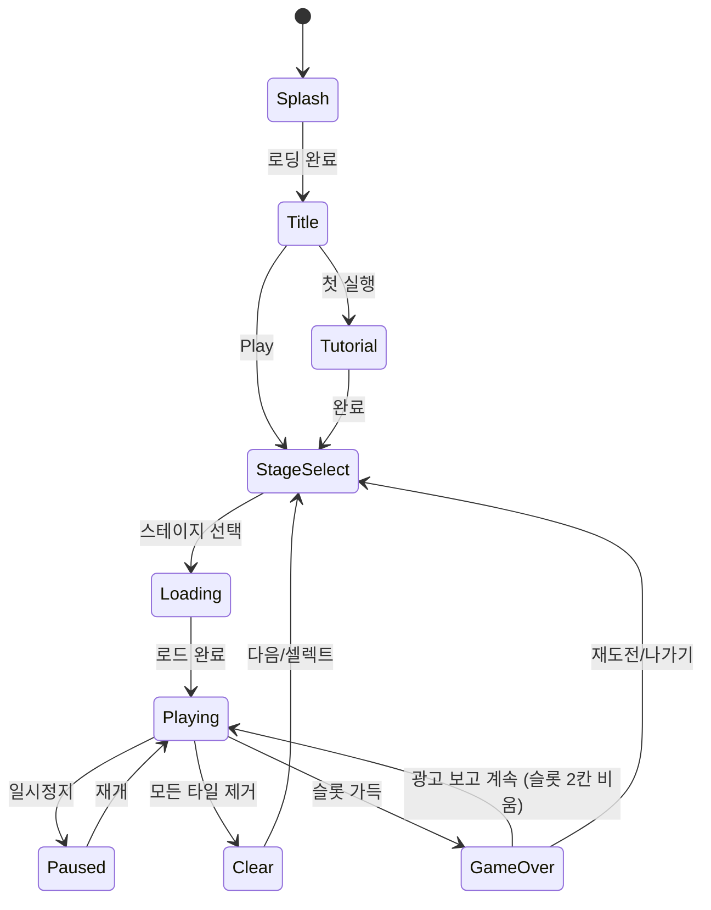

# Found3 — 트리플 매치 타일 퍼즐

> 3개씩 같은 그림의 퍼즐을 찾아서 없애서 모든 타일을 다 지우는 게임
> **우리의 첫 번째 게임. 파이프라인 검증 + 첫 매출 창출.**

---

## 1. 코어 메카닉 상세 설계

### 1-1. 타일 보드 배치 알고리즘

#### 기본 원칙
- 모든 그림 타입은 정확히 3의 배수로 배치 (3개, 6개, 9개...)
- 반드시 클리어 가능한 배치 보장 → **역방향 생성(Reverse Generation)**

#### 역방향 생성 알고리즘
```
1. 빈 보드에서 시작
2. 타일을 제거 순서대로 역으로 배치
   - "이 타일들을 이 순서로 제거하면 클리어된다"는 해법을 먼저 설계
   - 해법의 역순으로 타일을 보드에 배치
3. 배치 후 셔플: 보드 위치를 랜덤하게 섞되, 클리어 가능성 유지
4. 검증: BFS/DFS로 최소 1개의 클리어 경로 존재 확인
```

#### 그리드 좌표 시스템
- 기본 그리드: N×M (레벨에 따라 6×9, 7×10, 8×12)
- 타일 크기: 80×80px (기준), 겹침 오프셋 ±20px
- 레이어별 z-index: layer0=0, layer1=100, layer2=200
- 타일 중심점 기준 배치 (짝수 그리드 = 반 칸 오프셋 적용)

#### 가림(Blocking) 판정 알고리즘
```
isTileBlocked(tile):
  for each higherLayerTile in tiles where tile.layer < higherLayerTile.layer:
    overlapX = |tile.x - higherLayerTile.x| < tileWidth * 0.7
    overlapY = |tile.y - higherLayerTile.y| < tileHeight * 0.7
    if overlapX AND overlapY:
      return true  // 가려져 있음 = 선택 불가
  return false  // 선택 가능
```

### 1-2. 타일 선택 규칙 상세

- **터치 판정**: 터치 포인트 기준 반경 내 타일 중 가장 높은 layer의 타일 선택
- **가림 상태 시각화**: 가려진 타일은 밝기 60%로 dimming 처리 → 선택 불가 시각적 피드백
- **선택 피드백**: 선택 가능한 타일 위로 마우스/손가락이 올라오면 살짝 scale-up (1.05×)
- **중복 선택 방지**: 이미 슬롯에 있는 타일은 선택 불가

### 1-3. 슬롯 시스템 상세

#### 슬롯 구조
```
슬롯: [A][A][B][C][C][ ][ ]  ← 최대 7칸
       ↑같은 타입 인접 정렬
```

#### 삽입 로직
```
insertToSlot(tile):
  // 같은 타입이 이미 슬롯에 있으면 그 옆에 삽입
  existingIndex = findLastIndexOf(tile.type)
  if existingIndex >= 0:
    insertAt(existingIndex + 1)
  else:
    appendToEnd()

  // 3매치 체크
  if countOf(tile.type) == 3:
    triggerMatchRemoval(tile.type)  // 애니메이션 후 제거
```

#### 3매치 제거 애니메이션 시퀀스
1. 3개 타일 동시 scale-up (0.1s)
2. 파티클 이펙트 발생
3. 타일 fade-out (0.2s)
4. 슬롯 나머지 타일 재정렬 slide 애니메이션 (0.15s)
5. 총 소요: 0.45s → 이 동안 추가 입력 버퍼링

#### 게임오버 판정
- 슬롯 7칸 모두 차 있음 + 추가 타일 선택 시도 시
- 또는: 슬롯에 7개 있고 3매치가 없는 상태
- 판정 즉시 게임오버 화면 (0.3s delay로 최종 상태 확인 후)

---

## 2. 경쟁작 대비 차별화 전략

### 2-1. 경쟁작 분석 요약

| 경쟁작 | 강점 | 약점 | 우리가 가져갈 것 |
|--------|------|------|-----------------|
| Triple Tile (1위) | 비주얼 최고, 폴리시 | 후반 과금 장벽 심각 | 슬롯 7칸 표준, 레이어 겹침 |
| Tile Explorer | 힐링 분위기, 낮은 압박 | 단조로움 | 릴랙스 BGM 전략 |
| Tiletopia | 마작+현대 결합 고평점 | 복잡한 학습 곡선 | 클래식 감성 |
| Triple Master | 심플, 빠른 플레이 | 비주얼 약함 | 빠른 피드백 루프 |

### 2-2. 우리의 포지셔닝

**"한국 감성 힐링 퍼즐"** — 아시아 시장 틈새 공략

- **비주얼 톤**: 파스텔 + 한국 로컬 소재 (음식, 자연, 전통)
  - 타일 테마 예시: 떡볶이·김밥·붕어빵·벚꽃·단풍·한복
  - 배경: 계절별 한국 풍경 (봄 벚꽃길, 여름 해변, 가을 단풍, 겨울 눈)
- **UX 철학**: 압박 최소화, 모든 스테이지 아이템 없이 클리어 가능
- **타겟**: 30~50대 한국 여성 (가장 큰 캐주얼 게임 소비층)

### 2-3. Triple Tile 과금 유도 문제 해결

Triple Tile 비판의 핵심: **후반부 스테이지가 아이템 없이 불가능하게 설계됨**

우리의 해법:
1. **배치 알고리즘 단계에서 보장**: 모든 스테이지는 아이템 0개로 클리어 가능성 검증 필수
2. **난이도 = 시간 압박이 아닌 전략적 사고**: 아이템 없어도 되지만 있으면 더 빠름
3. **일일 무료 아이템**: 매일 Shuffle×3, Undo×5 무료 제공
4. **광고 리워드**: 아이템 부족 시 광고 시청으로 보충 (강제 아님)

---

## 3. 스테이지 설계 (레벨 1~50)

### 3-1. 챕터 구조

| 챕터 | 레벨 | 테마 | 특징 |
|------|------|------|------|
| 1: 봄 정원 | 1~10 | 꽃, 나비, 봄 소재 | 튜토리얼. 1레이어만. 타일 최소 |
| 2: 여름 바다 | 11~20 | 해산물, 해변 소재 | 2레이어 도입. 타이머 도입 |
| 3: 가을 축제 | 21~30 | 음식, 단풍 소재 | 3레이어 도입. 그림 종류 증가 |
| 4: 겨울 마을 | 31~40 | 눈, 따뜻한 음식 | 레이어 복잡도 상승. 시간 압박 |
| 5: 특별 이벤트 | 41~50 | 혼합 테마 | 보스 스테이지. 특수 타일 |

### 3-2. 레벨별 상세 파라미터

#### 챕터 1: 봄 정원 (레벨 1~10)
| 레벨 | 그림 종류 | 타일 수 | 레이어 | 시간(초) | 특이사항 |
|------|-----------|---------|--------|----------|----------|
| 1 | 3 | 9 | 1 | 무제한 | 튜토리얼, 힌트 제공 |
| 2 | 4 | 12 | 1 | 무제한 | 슬롯 시스템 학습 |
| 3 | 5 | 15 | 1 | 무제한 | 자유 플레이 |
| 4 | 6 | 18 | 1 | 180 | 타이머 첫 등장 (넉넉) |
| 5 | 6 | 18 | 1 | 150 | Shuffle 아이템 튜토리얼 |
| 6 | 7 | 21 | 1 | 150 | |
| 7 | 8 | 24 | 1 | 120 | |
| 8 | 8 | 24 | 2 | 150 | 2레이어 첫 등장 |
| 9 | 9 | 27 | 2 | 150 | |
| 10 | 10 | 30 | 2 | 120 | 챕터 1 보스 (이펙트 강화) |

#### 챕터 2: 여름 바다 (레벨 11~20)
| 레벨 | 그림 종류 | 타일 수 | 레이어 | 시간(초) |
|------|-----------|---------|--------|----------|
| 11 | 8 | 24 | 2 | 120 |
| 12 | 9 | 27 | 2 | 120 |
| 13 | 10 | 30 | 2 | 120 |
| 14 | 10 | 30 | 3 | 150 | 3레이어 첫 등장 |
| 15 | 11 | 33 | 3 | 150 | Undo 아이템 튜토리얼 |
| 16 | 12 | 36 | 3 | 120 | |
| 17 | 12 | 36 | 3 | 120 | |
| 18 | 13 | 39 | 3 | 120 | |
| 19 | 14 | 42 | 3 | 110 | |
| 20 | 14 | 42 | 3 | 100 | 챕터 2 보스 |

#### 챕터 3~5 요약
- 레벨 21~30: 타일 42~60개, 레이어 3~4, 시간 90~120초
- 레벨 31~40: 타일 60~75개, 레이어 4~5, 시간 80~100초, 특수 타일 등장
- 레벨 41~50: 타일 75~90개, 레이어 5~6, 시간 70~90초, 보스 이펙트

### 3-3. 스테이지 생성 전략

**MVP (레벨 1~10): 수동 디자인**
- 각 레벨 JSON 파일로 하드코딩
- 빠른 구현, 확실한 밸런스 보장
- 파일: `lib/found3/stages/stage_{n}.json`

**Phase 2 (레벨 11+): 알고리즘 생성 + 수동 검수**
```typescript
generateStage(params: StageParams): StageData {
  const { tileTypes, tileCount, layers, seed } = params
  // 1. 클리어 경로 생성 (역방향)
  const clearPath = generateClearPath(tileTypes, tileCount)
  // 2. 보드에 배치
  const board = placeOnBoard(clearPath, layers, seed)
  // 3. 클리어 가능성 검증
  assert(isBeatable(board))
  return board
}
```

### 3-4. 보스/이벤트 스테이지

- **챕터 보스**: 타일 수 2배, 화려한 배경, 클리어 시 특별 보상
- **주간 이벤트**: 매주 월요일 특별 스테이지 5개 (한정 타일 스킨)
- **시즌 이벤트**: 명절(설날, 추석) 특별 테마 스테이지

---

## 4. 아이템/파워업 시스템

### 4-1. 핵심 아이템 3종

#### Shuffle (셔플)
- **효과**: 보드의 모든 타일 위치를 랜덤 재배치
- **클리어 가능성 보장**: 셔플 후 BFS 검증, 불가능하면 재셔플
- **애니메이션**: 타일 전체가 공중으로 튀어올랐다가 새 위치로 착지 (0.8s)
- **획득**: 일일 무료 3개, 광고 시청 +2개, IAP

#### Undo (되돌리기)
- **효과**: 슬롯의 마지막 타일을 원래 보드 위치로 복귀
- **제한**: 연속 최대 3회 (슬롯에 있는 마지막 3개까지)
- **애니메이션**: 타일이 슬롯에서 보드로 arc 이동 (0.4s)
- **획득**: 일일 무료 5개, 광고 시청 +3개, IAP

#### Magnet (자석) — Phase 2
- **효과**: 선택한 타일 타입의 같은 타일 3개를 즉시 슬롯으로 이동
- **단, 가려진 타일은 제외** (접근 가능한 타일만)
- **획득**: 스테이지 보상, IAP

### 4-2. 아이템 경제 설계

| 획득 경로 | Shuffle | Undo | 비고 |
|-----------|---------|------|------|
| 일일 무료 | 3개 | 5개 | 매일 자정 리셋 |
| 광고 시청 | +2개 | +3개 | 일 최대 5회 |
| 스테이지 보상 | 보스 클리어 시 | 보스 클리어 시 | 1~2개 |
| IAP 소형 | 10개 ₩1,100 | 15개 ₩1,100 | |
| IAP 중형 | 30개 ₩3,300 | 50개 ₩3,300 | |

---

## 5. 수익화 설계

### 5-1. 라이프 시스템

- 최대 하트: 5개
- 실패 시 하트 1개 소모
- 회복: 30분당 1개 자동 회복
- 즉시 회복: 광고 시청(+1), IAP(전체 회복 ₩550)
- 친구 선물: 소셜 기능 추가 시 (Phase 3)

### 5-2. 광고 설계 (핵심 수익원)

#### 리워드 광고 (사용자 자발적)
- 아이템 부족 시 → "광고 보고 Shuffle 2개 받기"
- 게임오버 시 → "광고 보고 추가 기회 받기" (슬롯 2칸 비우기)
- 힌트 요청 시 → "광고 보고 힌트 보기"

#### 인터스티셜 광고 (노출 통제)
- **트리거**: 스테이지 클리어 후
- **노출 빈도**: 레벨 5 이후, 3스테이지마다 1회 (레벨 1~4는 노출 안 함)
- **스킵**: 즉시 스킵 가능 (강제 시청 없음 — 이탈률 방지)
- **광고 제거 IAP**: ₩5,500/월 또는 ₩11,000 영구

### 5-3. IAP 구성

| 상품 | 가격 | 내용 |
|------|------|------|
| 하트 소형 | ₩550 | 하트 즉시 회복 |
| 아이템 팩 소 | ₩1,100 | Shuffle×10, Undo×15 |
| 아이템 팩 중 | ₩3,300 | Shuffle×30, Undo×50 |
| 광고 제거 | ₩5,500 | 광고 영구 제거 |
| 스타터 팩 | ₩2,200 | Shuffle×20, Undo×30, 하트×3 (첫 구매 한정) |

### 5-4. 수익화 철학

> **플레이어를 벽 앞에 세우지 않는다. 지갑을 열면 더 편해지는 것이지, 막힌 것이 뚫리는 것이 아니다.**

- 모든 스테이지: 아이템 0개로 클리어 가능 (보장)
- 광고: 강제 없음, 자발적 선택
- 인터스티셜: 초반 없음, 이후에도 3회마다 1회만

---

## 6. UI/UX 플로우

### 6-1. 전체 화면 상태 머신

```
[앱 시작]
    ↓
[스플래시] (1.5s, 로고 + 로딩)
    ↓
[타이틀]
    ├─ Play → [스테이지 셀렉트]
    ├─ Settings → [설정]
    └─ (첫 실행) → [튜토리얼] → [스테이지 셀렉트]

[스테이지 셀렉트]
    ├─ 스테이지 탭 → [로딩] → [플레이]
    └─ 뒤로 → [타이틀]

[플레이]
    ├─ 클리어 → [클리어 팝업] → 다음 스테이지 or 셀렉트
    ├─ 게임오버 → [게임오버 팝업] → 재도전 or 셀렉트
    └─ 일시정지 → [일시정지 팝업] → 재개 or 셀렉트
```

### 6-2. 플레이 화면 레이아웃 (세로 모드, 9:16 기준)

```
┌─────────────────────────┐ ← 상단 safe area
│ ← │  Ch.1 - Lv.3  │ ⚙️ │  ← 뒤로/설정 (44px 터치 영역)
│ ──────────────────────  │
│  ⭐⭐☆  [스코어: 1,240]  │  ← HUD
│  ⏱ 01:45               │  ← 타이머
├─────────────────────────┤
│                         │
│                         │
│     [ 타일 보드 영역 ]   │  ← 화면 60% 차지
│    (터치 인터랙션 영역)  │
│                         │
│                         │
├─────────────────────────┤
│ [ ][ ][ ][ ][ ][ ][ ]  │  ← 슬롯 7칸 (각 44×44px)
├─────────────────────────┤
│ 🔀 Shuffle  ↩️ Undo    │  ← 아이템 버튼 (각 숫자 표시)
└─────────────────────────┘ ← 하단 safe area
```

### 6-3. 터치 피드백 시스템

| 이벤트 | 시각 | 사운드 | 햅틱 |
|--------|------|--------|------|
| 타일 탭 (선택 가능) | scale 1.1, 테두리 강조 | "톡" | light impact |
| 타일 탭 (가려짐) | 흔들림 효과 (shake) | "틱" (낮은 음) | 없음 |
| 슬롯 이동 | arc 이동 애니메이션 | "슉" | - |
| 3매치 제거 | 파티클 + scale-up | "팡!" | medium impact |
| 콤보 | 텍스트 팝업 "COMBO×2" | 상승 음계 | - |
| 게임오버 | 화면 흔들림 | 실패음 | error impact |
| 클리어 | 별 3개 애니메이션 | 팡파르 | success |

### 6-4. 게임오버 팝업

```
┌──────────────────────┐
│      게임 오버        │
│  [슬롯 꽉 참 이미지]  │
│   최종 스코어: 1,240  │
│                       │
│ [📺 광고 보고 계속하기] │ ← 슬롯 2칸 비우기
│ [↩️ 다시 도전]        │ ← 하트 1개 소모
│ [← 스테이지 선택]     │
└──────────────────────┘
```

---

## 7. Phaser.io 기술 설계

### 7-1. 씬 구성

```
BootScene      → 에셋 로딩, 설정 초기화
PreloadScene   → 스테이지 데이터 로딩
TitleScene     → 타이틀 화면
StageScene     → 스테이지 셀렉트
PlayScene      → 메인 게임 (핵심)
ClearScene     → 클리어 팝업 (오버레이)
GameOverScene  → 게임오버 팝업 (오버레이)
```

### 7-2. PlayScene 핵심 클래스 구조

```typescript
// lib/found3/src/scenes/PlayScene.ts
class PlayScene extends Phaser.Scene {
  private board: Board        // 타일 보드 관리
  private slot: SlotSystem    // 슬롯 관리
  private timer: GameTimer    // 타이머
  private scorer: Scorer      // 스코어

  create() {
    this.board = new Board(this, stageData)
    this.slot = new SlotSystem(this, 7)
    this.board.onTileTap = (tile) => this.handleTileTap(tile)
  }

  handleTileTap(tile: Tile) {
    if (tile.isBlocked()) return  // 가려진 타일 무시
    this.board.removeTile(tile)
    this.slot.insert(tile, () => this.checkGameEnd())
  }
}

// lib/found3/src/core/Board.ts
class Board {
  private tiles: Tile[]

  isTileBlocked(tile: Tile): boolean {
    return this.tiles.some(t =>
      t.layer > tile.layer && this.overlaps(t, tile)
    )
  }
}

// lib/found3/src/core/SlotSystem.ts
class SlotSystem {
  private slots: (Tile | null)[]

  insert(tile: Tile, onComplete: () => void) {
    // 같은 타입 옆에 삽입 → 3매치 체크 → 제거 애니메이션
  }

  isFull(): boolean {
    return this.slots.filter(Boolean).length >= 7
  }
}
```

### 7-3. 타일 렌더링 — Depth Sort

```typescript
// 타일 depth 계산
tile.setDepth(tile.layer * 100 + tile.gridY)
// → layer0 타일: depth 0~99
// → layer1 타일: depth 100~199
// → 같은 layer 내: y좌표 순 (아래 타일이 앞에 보임)

// 그림자 효과
const shadow = this.add.image(tile.x + 4, tile.y + 4, tile.textureKey)
shadow.setAlpha(0.3).setDepth(tile.depth - 1)

// 가려진 타일 dimming
tile.setAlpha(tile.isBlocked() ? 0.6 : 1.0)
```

### 7-4. 타일 선택 → 슬롯 이동 애니메이션

```typescript
moveTileToSlot(tile: Tile, slotPosition: {x, y}) {
  // 1. 보드에서 제거 (시각적으로는 유지)
  this.board.removeTile(tile)

  // 2. Arc 이동 트윈
  this.tweens.add({
    targets: tile,
    x: slotPosition.x,
    y: slotPosition.y,
    scaleX: 0.6,
    scaleY: 0.6,
    duration: 300,
    ease: 'Back.easeIn',
    onComplete: () => {
      tile.setDepth(SLOT_DEPTH)
      // 3매치 체크
    }
  })
}
```

### 7-5. createGame() API — web/found3 인터페이스

```typescript
// lib/found3/src/index.ts
export interface Found3Config {
  parentElementId: string
  width?: number   // 기본값: 390
  height?: number  // 기본값: 844 (iPhone 14 기준)

  // 콜백
  onReady?: () => void
  onClear?: (level: number, score: number, stars: number) => void
  onGameOver?: (level: number, score: number) => void
  onScoreUpdate?: (score: number) => void

  // 광고 연동
  onRewardAdRequest?: (reason: 'item' | 'continue') => Promise<boolean>

  // 인앱결제 연동
  onIAPRequest?: (productId: string) => Promise<boolean>
}

export interface Found3Game {
  loadLevel: (level: number) => void
  useItem: (item: 'shuffle' | 'undo' | 'magnet') => void
  pause: () => void
  resume: () => void
  destroy: () => void
}

export function createGame(config: Found3Config): Found3Game {
  const game = new Phaser.Game({ ... })
  return {
    loadLevel: (level) => game.scene.getScene('PlayScene').loadLevel(level),
    useItem: (item) => game.scene.getScene('PlayScene').useItem(item),
    pause: () => game.pause(),
    resume: () => game.resume(),
    destroy: () => game.destroy(true)
  }
}
```

### 7-6. 터치 인터랙션 — 최상위 타일만 선택

```typescript
// 터치 포인트에서 선택 가능한 타일 찾기
getTileAtPoint(x: number, y: number): Tile | null {
  const candidates = this.tiles.filter(tile =>
    !tile.isBlocked() &&
    Phaser.Geom.Rectangle.Contains(tile.getBounds(), x, y)
  )
  // 가장 높은 레이어, 같은 레이어면 가장 높은 depth
  return candidates.sort((a, b) => b.depth - a.depth)[0] ?? null
}
```

---

## 8. MVP 1주 출시 계획

### Day 1~2: lib/found3 코어 로직

**목표**: Phaser 없이도 테스트 가능한 순수 로직

- [ ] `Board` 클래스: 타일 배치, 가림 판정, 타일 제거
- [ ] `SlotSystem` 클래스: 삽입, 3매치 체크, 제거
- [ ] `StageLoader`: JSON에서 스테이지 데이터 로딩
- [ ] 레벨 1~10 스테이지 JSON 수동 작성 (5개 MVP)
- [ ] 단위 테스트: 가림 판정, 3매치 로직, 게임오버 판정
- [ ] `createGame()` API 인터페이스 정의

**체크포인트**: `npm test` 통과, 콘솔에서 게임 시뮬레이션 가능

### Day 3~4: Phaser 씬 구현

**목표**: 브라우저에서 플레이 가능한 상태

- [ ] `BootScene`: 에셋 로딩 (임시 색상 사각형 타일)
- [ ] `PlayScene`: Board + SlotSystem Phaser 렌더링 연결
- [ ] 타일 터치 인터랙션 + 슬롯 이동 애니메이션
- [ ] 3매치 제거 파티클 이펙트
- [ ] `ClearScene`, `GameOverScene` 팝업
- [ ] HUD: 스코어, 타이머, 레벨 표시

**체크포인트**: localhost에서 5개 레벨 플레이 가능

### Day 5: web/found3 React 래핑

**목표**: `createGame()` API로 웹 앱에서 호출 가능

- [ ] `web/found3` 프로젝트 초기화 (React + Stitches)
- [ ] `GameContainer` 컴포넌트: `createGame()` 호출
- [ ] `StageSelectPage` UI
- [ ] 모바일 뷰포트 최적화 (viewport meta, 가로 스크롤 방지)
- [ ] `pnpm build` → 정적 파일 생성

**체크포인트**: 모바일 브라우저에서 플레이 가능

### Day 6: found3/rn WebView 래핑

**목표**: React Native 앱에서 실행 가능

- [ ] `found3/rn` 프로젝트 초기화
- [ ] WebView 컴포넌트: `web/found3` 빌드 파일 로딩
- [ ] JS Bridge: `onClear`, `onGameOver`, `onRewardAdRequest` 연결
- [ ] 광고 SDK 연결 (AdMob)
- [ ] iOS/Android 빌드 확인

**체크포인트**: 실제 디바이스에서 실행 가능

### Day 7: 테스트 + 버그 수정 + 제출

**목표**: 스토어 제출 가능 상태

- [ ] 실 디바이스 QA (iOS + Android 각 2~3종)
- [ ] 크래시 버그 수정
- [ ] 임시 타일 아트 → 최소 수준 실제 이미지 교체
- [ ] App Store Connect / Google Play Console 등록
- [ ] 스토어 스크린샷, 설명 작성
- [ ] 심사 제출

---

## 게임 플로우 (상태 머신)



---

## MVP 범위

### Phase 1 (MVP — 1주)
- [x] 기획서 작성
- [ ] 기본 타일 보드 (1 레이어, 레벨 1~5)
- [ ] 타일 선택 → 슬롯 이동
- [ ] 3매치 제거 로직 + 기본 애니메이션
- [ ] 게임 오버 / 클리어 판정
- [ ] 기본 HUD (스코어, 타이머)
- [ ] web 래핑 + RN WebView

### Phase 2 (2~3주차)
- [ ] 다중 레이어 (2~3레이어)
- [ ] 타이머 + 스코어링 + 콤보
- [ ] Shuffle / Undo 아이템
- [ ] 콤보 시스템
- [ ] 스테이지 셀렉트 화면 (챕터 1: 10레벨)
- [ ] 광고 연동 (AdMob 리워드/인터스티셜)
- [ ] 한국 감성 타일 아트 적용

### Phase 3 (한달 이후)
- [ ] IAP 연동
- [ ] 레벨 11~50 (챕터 2~5)
- [ ] 주간/시즌 이벤트
- [ ] 소셜 기능 (친구 하트 선물)
- [ ] 밸런스 데이터 기반 조정
