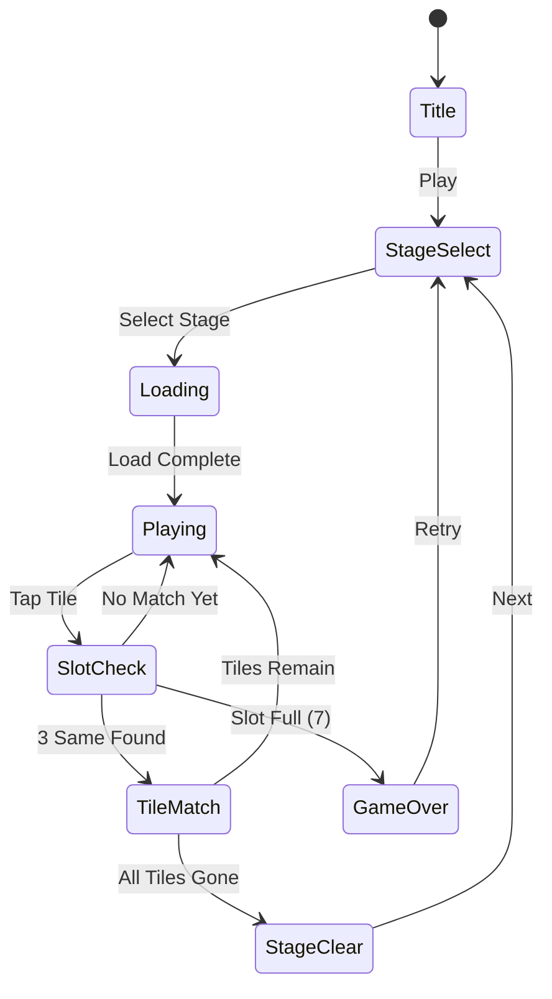

# Found3

> 3개씩 같은 그림의 퍼즐을 찾아서 없애서 모든 타일을 다 지우는 게임

## 개요

보드 위에 다양한 그림 타일이 배치되어 있다. 플레이어는 같은 그림 3개를 찾아 선택하면 해당 타일이 제거된다. 모든 타일을 제거하면 스테이지 클리어.

## 게임 규칙

### 기본 규칙
- 보드에 여러 종류의 그림 타일이 배치됨
- 모든 그림은 정확히 **3개씩** 존재
- 플레이어가 같은 그림 타일 3개를 선택하면 제거됨
- 선택한 타일은 하단 **슬롯(최대 7칸)**에 임시 보관됨
- 슬롯이 가득 차면 (7칸 모두 차고 3매치 불가) **게임 오버**
- 모든 타일을 제거하면 **스테이지 클리어**

### 슬롯 매칭
- 타일 선택 시 슬롯에 추가됨
- 슬롯 내 같은 그림 3개가 모이면 자동으로 제거됨
- 같은 그림끼리 인접하게 정렬됨 (같은 그림 옆에 삽입)

### 타일 레이어
- 타일은 여러 레이어로 겹쳐져 배치될 수 있음
- 위에 덮인 타일은 선택 불가 (아래 타일이 가려짐)
- 위 타일이 제거되면 아래 타일 선택 가능해짐

## 게임 플로우



## UI 레이아웃

```
┌─────────────────────────┐
│  ⏱ Timer    ⭐ Score    │  ← 상단 HUD
├─────────────────────────┤
│                         │
│    ┌──┐ ┌──┐ ┌──┐      │
│    │🌸│ │🌺│ │🌸│      │
│    └──┘ └──┘ └──┘      │
│  ┌──┐ ┌──┐ ┌──┐ ┌──┐  │  ← 타일 보드
│  │🍎│ │🌺│ │🍎│ │🌸│  │    (겹침 가능)
│  └──┘ └──┘ └──┘ └──┘  │
│    ┌──┐ ┌──┐ ┌──┐      │
│    │🍎│ │🌺│ │🍎│      │
│    └──┘ └──┘ └──┘      │
│                         │
├─────────────────────────┤
│ [  ][  ][  ][  ][  ][  ][  ] │  ← 슬롯 (7칸)
├─────────────────────────┤
│  🔀 Shuffle  ↩️ Undo   │  ← 아이템/도구
└─────────────────────────┘
```

## 스코어링 시스템

| Action | Score |
|--------|-------|
| 타일 3매치 제거 | +100 |
| 연속 매치 (콤보) | +100 × 콤보 수 |
| 스테이지 클리어 | +500 |
| 남은 시간 보너스 | 남은초 × 10 |

## 난이도 설계

| Level | 그림 종류 | 타일 수 | 레이어 | 시간(초) |
|-------|-----------|---------|--------|----------|
| 1 | 4 | 12 | 1 | 120 |
| 2 | 6 | 18 | 1 | 120 |
| 3 | 8 | 24 | 2 | 150 |
| 4 | 10 | 30 | 2 | 150 |
| 5 | 12 | 36 | 3 | 180 |

> 타일 수 = 그림 종류 × 3 (항상 3의 배수)

## 아이템/도구

| Item | Effect |
|------|--------|
| Shuffle | 보드 타일 위치 랜덤 재배치 |
| Undo | 마지막 선택 타일 슬롯에서 보드로 복귀 |

## 사운드/이펙트 (TODO)

- 타일 선택: 톡 효과음
- 3매치 제거: 팡 이펙트 + 사운드
- 콤보: 상승 톤 효과음
- 스테이지 클리어: 축하 이펙트
- 게임 오버: 실패 사운드

## MVP 범위

### Phase 1 (MVP)
- [x] 기획서 작성
- [ ] 기본 타일 보드 (1 레이어)
- [ ] 타일 선택 → 슬롯 이동
- [ ] 3매치 제거 로직
- [ ] 게임 오버 / 클리어 판정
- [ ] 5 스테이지

### Phase 2
- [ ] 다중 레이어
- [ ] 타이머 + 스코어링
- [ ] Shuffle / Undo 아이템
- [ ] 콤보 시스템
- [ ] 스테이지 셀렉트 화면
