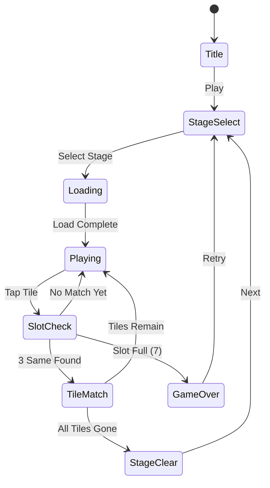

# Found3

> 3개씩 같은 그림의 퍼즐을 찾아서 없애서 모든 타일을 다 지우는 게임

## 개요

보드 위에 다양한 그림 타일이 배치되어 있다. 플레이어는 같은 그림 3개를 찾아 선택하면 해당 타일이 제거된다. 모든 타일을 제거하면 스테이지 클리어.

## 게임 규칙

### 기본 규칙
- 보드에 여러 종류의 그림 타일이 배치됨
- 모든 그림은 정확히 **3개씩** 존재
- 플레이어가 같은 그림 타일 3개를 선택하면 제거됨
- 선택한 타일은 하단 **슬롯(최대 7칸)**에 임시 보관됨
- 슬롯이 가득 차면 (7칸 모두 차고 3매치 불가) **게임 오버**
- 모든 타일을 제거하면 **스테이지 클리어**

### 슬롯 매칭
- 타일 선택 시 슬롯에 추가됨
- 슬롯 내 같은 그림 3개가 모이면 자동으로 제거됨
- 같은 그림끼리 인접하게 정렬됨 (같은 그림 옆에 삽입)

### 타일 레이어
- 타일은 여러 레이어로 겹쳐져 배치될 수 있음
- 위에 덮인 타일은 선택 불가 (아래 타일이 가려짐)
- 위 타일이 제거되면 아래 타일 선택 가능해짐

## 게임 플로우



## UI 레이아웃

```
┌─────────────────────────┐
│  ⏱ Timer    ⭐ Score    │  ← 상단 HUD
├─────────────────────────┤
│                         │
│    ┌──┐ ┌──┐ ┌──┐      │
│    │🌸│ │🌺│ │🌸│      │
│    └──┘ └──┘ └──┘      │
│  ┌──┐ ┌──┐ ┌──┐ ┌──┐  │  ← 타일 보드
│  │🍎│ │🌺│ │🍎│ │🌸│  │    (겹침 가능)
│  └──┘ └──┘ └──┘ └──┘  │
│    ┌──┐ ┌──┐ ┌──┐      │
│    │🍎│ │🌺│ │🍎│      │
│    └──┘ └──┘ └──┘      │
│                         │
├─────────────────────────┤
│ [  ][  ][  ][  ][  ][  ][  ] │  ← 슬롯 (7칸)
├─────────────────────────┤
│  🔀 Shuffle  ↩️ Undo   │  ← 아이템/도구
└─────────────────────────┘
```

## 스코어링 시스템

| Action | Score |
|--------|-------|
| 타일 3매치 제거 | +100 |
| 연속 매치 (콤보) | +100 × 콤보 수 |
| 스테이지 클리어 | +500 |
| 남은 시간 보너스 | 남은초 × 10 |

## 난이도 설계

| Level | 그림 종류 | 타일 수 | 레이어 | 시간(초) |
|-------|-----------|---------|--------|----------|
| 1 | 4 | 12 | 1 | 120 |
| 2 | 6 | 18 | 1 | 120 |
| 3 | 8 | 24 | 2 | 150 |
| 4 | 10 | 30 | 2 | 150 |
| 5 | 12 | 36 | 3 | 180 |

> 타일 수 = 그림 종류 × 3 (항상 3의 배수)

## 아이템/도구

| Item | Effect |
|------|--------|
| Shuffle | 보드 타일 위치 랜덤 재배치 |
| Undo | 마지막 선택 타일 슬롯에서 보드로 복귀 |

## 사운드/이펙트 (TODO)

- 타일 선택: 톡 효과음
- 3매치 제거: 팡 이펙트 + 사운드
- 콤보: 상승 톤 효과음
- 스테이지 클리어: 축하 이펙트
- 게임 오버: 실패 사운드

## 슬롯 경고 시스템

슬롯 상태에 따라 시각적 긴장감 조성:

| 슬롯 사용 | 상태 | UI 처리 |
|-----------|------|---------|
| 1~4칸 | 안전 | 기본 색상 |
| 5~6칸 | 경고 | 슬롯 테두리 빨간색, 진동 효과 |
| 7칸 (만원) | 게임 오버 | 전체 화면 플래시 + 게임 오버 모달 |

## 수익화 모델

### 광고 (주 수익원)

| 광고 유형 | 위치 | 트리거 |
|-----------|------|--------|
| 인터스티셜 | 게임 오버 후 | 매 3회 실패마다 |
| 리워드 광고 | 슬롯 비우기 (2칸) | 슬롯 5칸 이상 시 버튼 노출 |
| 배너 | 스테이지 셀렉트 | 상시 |

리워드 광고 트리거:
```
슬롯 5칸 이상 → "광고 보고 슬롯 2칸 비우기" 버튼 → 광고 시청 → 슬롯 2개 제거
```

### IAP (보조 수익원, Phase 2 이후)

| 상품 | 가격 |
|------|------|
| 광고 제거 | $2.99 |
| 셔플 팩 (5회) | $0.99 |
| 언두 팩 (10회) | $0.99 |
| 스타터 팩 | $1.99 |

### 에너지(하트) 시스템

- 기본 5하트, 게임 오버 시 1개 소모
- 30분당 1개 자동 충전
- **D3 이후 활성화** (초기 이탈 방지)

## 메타게임: 스티커북 (경량 메타)

레퍼런스 분석 결과 경량 메타가 D7 리텐션 +10%p 기여:

- 스티커 20종 (4세트 × 5장)
- 스테이지 클리어 시 랜덤 1장 획득
- 세트 완성 시 파티클 이펙트 + 소셜 공유

> 풀 메타(집 꾸미기) 전환은 D7 리텐션 > 30% 확인 후 결정

## MVP 범위

### Phase 1 (MVP) — 1주 목표
- [x] 기획서 작성
- [ ] 기본 타일 보드 (1 레이어)
- [ ] 타일 선택 → 슬롯 이동
- [ ] 3매치 제거 로직
- [ ] 게임 오버 / 클리어 판정
- [ ] 슬롯 경고 UI (5칸 이상 빨간 테두리)
- [ ] 15 스테이지
- [ ] 리워드 광고 연동 (AdMob)
- [ ] 인터스티셜 광고

### Phase 2 — 출시 후 1~2주
- [ ] 다중 레이어 (2~3겹)
- [ ] 타이머 + 스코어링 강화
- [ ] Shuffle / Undo 아이템
- [ ] 콤보 시스템 (파티클 + 점층 사운드)
- [ ] 스테이지 셀렉트 화면
- [ ] 마스코트 캐릭터 리액션
- [ ] 스티커북 메타 (20종)
- [ ] 하트 시스템 활성화
- [ ] IAP 기본 상품

### Phase 3 — 데이터 기반 결정
- [ ] 집 꾸미기 풀 메타 (D7 리텐션 > 30% 조건)
- [ ] 시즌 이벤트 타일셋
- [ ] 50 스테이지

## 레퍼런스 분석 요약

7개 트리플 매치 레퍼런스(#6,#14,#27,#35,#73,#101,#104) 분석 결과:

> 상세 분석: `prd/tile-family.md` 참조

| 인사이트 | 적용 |
|----------|------|
| 순수 퍼즐은 D7 이후 이탈 급증 | 스티커북 경량 메타 추가 |
| 콤보 피드백이 중독성 핵심 | 파티클 + 점층 사운드 강화 |
| 슬롯 긴장감이 몰입 유지 | 경고 UI 5칸 이상 활성화 |
| 캐릭터 리액션이 만족감 2배 | 마스코트 클리어 리액션 |
| 블라스트 혼합은 실패 | 트리플 매치에만 집중 |
