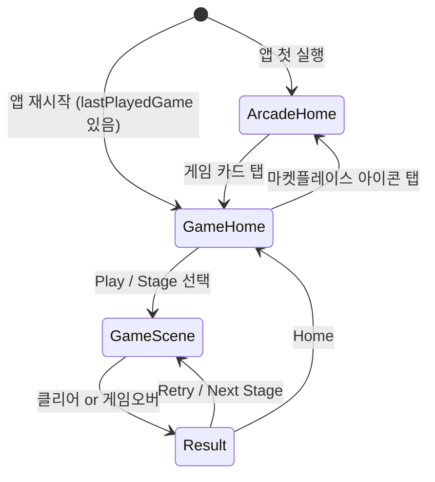

# Game Home System

> 전체 9개 게임에 게임별 홈 화면, 통일된 플로우, 리더보드 포함 결과 화면을 도입하는 시스템 설계

## 배경

현재 게임 진입 시 바로 플레이 화면(또는 간단한 타이틀)으로 넘어간다. 게임별 홈 화면이 없어서 스테이지 진행 상황을 확인하거나 게임 모드를 선택할 수 없다. Arcade Home(마켓플레이스)과 Game Home(개별 게임)을 분리하여, 유저가 게임에 몰입하되 필요할 때 다른 게임을 탐색할 수 있게 한다.

## 전체 플로우



### 핵심 원칙
- **Game Home이 기본 화면**: 앱 재시작 시 최근 게임의 Game Home으로 바로 복귀
- **Arcade Home은 마켓플레이스**: 게임 질렸을 때만 의도적으로 탐색
- **전체 화면, 헤더 없음**: 게임 경험을 해치지 않음
- **React 컴포넌트**: ADR-002 준수 (Phaser = 보드만)
- **routes.tsx 패턴 유지**: ADR-016 준수 (게임별 자체 등록)

## 공통 Game Home 레이아웃

```
┌──────────────────────────────────────┐
│                              [🏪]   │  ← 마켓플레이스 아이콘 (우측 상단)
│                                      │     Arcade Home으로 이동
│            GAME TITLE                │  ← 게임 타이틀 (큰 텍스트)
│            ─────────                 │
│                                      │
│  ┌──────────────────────────────┐   │
│  │                              │   │
│  │                              │   │
│  │     게임별 커스텀 영역        │   │  ← Stage Map 또는 Mode Select
│  │     (스크롤 가능)            │   │     게임마다 다른 콘텐츠
│  │                              │   │
│  │                              │   │
│  └──────────────────────────────┘   │
│                                      │
│         [ ▶  PLAY ]                 │  ← 메인 액션 버튼 (3D 입체)
│                                      │
│    Best: 3,400   🏆 #12             │  ← 최고 기록 / 리더보드 순위
│                                      │
└──────────────────────────────────────┘
```

### 공통 요소 (모든 게임 동일)
| 요소 | 위치 | 역할 |
|------|------|------|
| 마켓플레이스 아이콘 | 우측 상단 | Arcade Home으로 이동 (작고 비간섭적) |
| 게임 타이틀 | 상단 중앙 | 게임 이름 표시 |
| 메인 액션 버튼 | 하단 중앙 | Play / Continue / Stage 선택 |
| 최고 기록 | 하단 | 베스트 스코어 또는 진행률 |

### 게임별 커스텀 영역
- Stage 게임: 스테이지 맵 (징검다리 노드)
- Endless 게임: 모드/난이도 선택 또는 빈 영역 + 게임 미리보기

## Stage 게임 — 스테이지 맵 UI

### 대상 게임
- found3, crunch3, watersort, sudoku

### 와이어프레임

```
┌──────────────────────────────────────┐
│                              [🏪]   │
│                                      │
│            FOUND 3                   │
│                                      │
│  ┌──────────────────────────────┐   │
│  │         ↕ 세로 스크롤         │   │
│  │                              │   │
│  │        ○ Stage 12            │   │  ← 미래 스테이지 (잠금, 흐릿)
│  │       ╱                      │   │
│  │      ○ Stage 11              │   │
│  │       ╲                      │   │
│  │        ● Stage 10            │   │  ← 현재 스테이지 (강조, 큰 노드)
│  │       ╱                      │   │
│  │      ★ Stage 9               │   │  ← 클리어 스테이지 (별/체크)
│  │       ╲                      │   │
│  │        ★ Stage 8             │   │
│  │       ╱                      │   │
│  │      ★ Stage 7               │   │
│  │                              │   │
│  └──────────────────────────────┘   │
│                                      │
│         [ ▶  STAGE 10 ]            │  ← 현재 스테이지 플레이
│                                      │
│    Progress: 9/∞   ★★★             │  ← 진행률 + 평균 별점
│                                      │
└──────────────────────────────────────┘
```

### 스테이지 맵 설계

#### 노드 상태
| 상태 | 비주얼 | 인터랙션 |
|------|--------|----------|
| Locked | 작은 원, 흐릿, 자물쇠 | 탭 불가 |
| Current | 큰 원, 강조 색상, 펄스 애니메이션 | 탭 → 바로 플레이 |
| Cleared | 중간 원, 별 또는 체크 마크 | 탭 → 다시 플레이 |

#### 맵 레이아웃
- **세로 스크롤**: 아래(Stage 1) → 위(최신)로 진행
- **지그재그 경로**: 노드가 좌-우 번갈아 배치 (징검다리 느낌)
- **자동 스크롤**: 진입 시 현재 스테이지로 자동 포커스
- **노드 간 연결선**: 점선 또는 실선 경로

#### 스테이지별 정보 (노드 옆)
- 스테이지 번호
- 난이도 라벨 (sudoku: Easy/Medium/Hard/Expert)
- 클리어 여부 (별/체크)

### 게임별 Stage Map 커스텀

| 게임 | 스테이지 특성 | 노드 부가 정보 |
|------|-------------|---------------|
| found3 | 레벨별 타일 수/종류 증가 | 타일 수 아이콘 |
| crunch3 | 레벨별 난이도 증가 | — |
| watersort | 레벨별 병/색상 수 증가 | 병 수 아이콘 |
| sudoku | 자동 난이도 상승 (1-2 Easy → 3-4 Medium → ...) | 난이도 라벨 |

## Endless 게임 — Home UI

### 대상 게임
- blockrush, tictactoe, minesweeper, number10, blockpuzzle

### 타입 A: Play Only (모드 선택 없음)

**blockrush, number10, blockpuzzle**

```
┌──────────────────────────────────────┐
│                              [🏪]   │
│                                      │
│          BLOCK PUZZLE                │
│                                      │
│  ┌──────────────────────────────┐   │
│  │                              │   │
│  │                              │   │
│  │     게임 미리보기 이미지       │   │  ← 정적 보드 이미지 또는
│  │     또는 미니 애니메이션       │   │     짧은 데모 루프
│  │                              │   │
│  │                              │   │
│  └──────────────────────────────┘   │
│                                      │
│         [ ▶  PLAY ]                 │  ← 3D 입체 버튼
│                                      │
│    Best: 3,400                       │
│                                      │
└──────────────────────────────────────┘
```

### 타입 B: 모드/난이도 선택

**tictactoe**

```
┌──────────────────────────────────────┐
│                              [🏪]   │
│                                      │
│          TIC TAC TOE                 │
│                                      │
│  ┌──────────────────────────────┐   │
│  │                              │   │
│  │  Grid Size:                  │   │
│  │                              │   │
│  │  ┌─────┐ ┌─────┐ ┌─────┐   │   │
│  │  │ 3×3 │ │ 4×4 │ │ 5×5 │   │   │  ← 그리드 크기 선택 카드
│  │  │     │ │     │ │     │   │   │     선택된 카드 강조
│  │  │ ○×○ │ │○×○× │ │○×○×○│   │   │     미니 그리드 미리보기
│  │  └─────┘ └─────┘ └─────┘   │   │
│  │                              │   │
│  └──────────────────────────────┘   │
│                                      │
│         [ ▶  PLAY ]                 │
│                                      │
│    Best: 5 wins streak               │
│                                      │
└──────────────────────────────────────┘
```

**minesweeper**

```
┌──────────────────────────────────────┐
│                              [🏪]   │
│                                      │
│          MINESWEEPER                 │
│                                      │
│  ┌──────────────────────────────┐   │
│  │                              │   │
│  │  Difficulty:                 │   │
│  │                              │   │
│  │  ┌──────────────────────┐   │   │
│  │  │  Easy                │   │   │  ← 난이도 선택 리스트
│  │  │  9×9 · 10 mines      │   │   │     선택된 항목 강조
│  │  └──────────────────────┘   │   │
│  │  ┌──────────────────────┐   │   │
│  │  │  Medium              │   │   │
│  │  │  16×16 · 40 mines    │   │   │
│  │  └──────────────────────┘   │   │
│  │  ┌──────────────────────┐   │   │
│  │  │  Expert              │   │   │
│  │  │  16×16 · 56 mines    │   │   │
│  │  └──────────────────────┘   │   │
│  │                              │   │
│  └──────────────────────────────┘   │
│                                      │
│         [ ▶  PLAY ]                 │
│                                      │
│    Best: 1:23 (Easy)                 │
│                                      │
└──────────────────────────────────────┘
```

## Result 화면 (공통)

### 레이아웃

```
┌──────────────────────────────────────┐
│                                      │
│          STAGE CLEAR!                │  ← 또는 GAME OVER
│          ★ ★ ★                      │     별점 (클리어 시)
│                                      │
│  ┌──────────────────────────────┐   │
│  │  Score          1,250        │   │
│  │  Time           1:23         │   │  ← 스코어 요약
│  │  Combo          ×3           │   │
│  │  Best           3,400        │   │
│  └──────────────────────────────┘   │
│                                      │
│  ── Leaderboard ──────────────────  │
│  ┌──────────────────────────────┐   │
│  │  🥇  Player1      5,200     │   │
│  │  🥈  Player2      4,800     │   │  ← 리더보드 (상위 5명)
│  │  🥉  Player3      3,900     │   │     현재 유저 위치 강조
│  │   4   You ←       3,400     │   │
│  │   5   Player5     2,100     │   │
│  └──────────────────────────────┘   │
│                                      │
│  [ ▶ Next Stage ]  [ ↻ Retry ]     │  ← 액션 버튼 (3D 입체)
│           [ 🏠 Home ]               │     Home = Game Home으로
│                                      │
└──────────────────────────────────────┘
```

### Result 요소

| 요소 | 설명 | Stage 게임 | Endless 게임 |
|------|------|------------|-------------|
| 타이틀 | STAGE CLEAR / GAME OVER | ✅ | ✅ (GAME OVER만) |
| 별점 | 성과 기반 1~3별 | ✅ | — |
| 스코어 요약 | 점수, 시간, 콤보 등 | 게임별 다름 | 게임별 다름 |
| 리더보드 | 상위 5명 + 본인 위치 | 스테이지별 | 전체 |
| Next Stage | 다음 스테이지로 | ✅ | — |
| Retry | 같은 스테이지/게임 재시작 | ✅ | ✅ |
| Home | Game Home으로 돌아가기 | ✅ | ✅ |

### 게임별 스코어 요약 커스텀

| 게임 | 표시 항목 |
|------|----------|
| found3 | Score, Time, Combo |
| crunch3 | Score, Time, Combo |
| watersort | Moves, Time |
| sudoku | Score, Time, Mistakes, Hints used |
| blockrush | Score, Lines, Level |
| tictactoe | Result (Win/Lose/Draw), Win streak |
| minesweeper | Time, Difficulty |
| number10 | Score, Combo |
| blockpuzzle | Score, Lines cleared, Best combo |

### 별점 기준 (Stage 게임)

| 별 | 조건 |
|----|------|
| ★☆☆ | 클리어 |
| ★★☆ | 클리어 + 시간/점수 기준 이상 |
| ★★★ | 클리어 + 퍼펙트 (노미스/노힌트 등) |

> 게임별 구체적 기준은 각 게임 PRD에서 정의

## Navigation 상세

### Arcade Home → Game Home
- 게임 카드 탭 → 해당 게임의 Game Home으로 이동
- AsyncStorage에 `lastPlayedGame` 저장

### Game Home → Arcade Home
- 우측 상단 마켓플레이스 아이콘 탭
- 아이콘은 작고 비간섭적 (게임 경험 우선)

### 앱 재시작 시 복귀
- `lastPlayedGame`이 있으면 해당 Game Home으로 바로 이동
- 없으면 Arcade Home

### 브릿지 연동 (RN)

| 이벤트 | 방향 | 데이터 |
|--------|------|--------|
| `NAVIGATE_HOME` | Web → RN | `{ target: 'game-home' }` |
| `NAVIGATE_ARCADE` | Web → RN | `{ target: 'arcade-home' }` |
| `STAGE_CLEAR` | Web → RN | 기존 유지 |
| `GAME_OVER` | Web → RN | 기존 유지 |

## 9개 게임별 Game Home 요약

### Stage 기반

| 게임 | Home 타입 | 커스텀 영역 | 액션 버튼 |
|------|-----------|------------|----------|
| found3 | Stage Map | 징검다리 노드 + 타일 수 | Continue Stage N |
| crunch3 | Stage Map | 징검다리 노드 | Continue Stage N |
| watersort | Stage Map | 징검다리 노드 + 병 수 | Continue Stage N |
| sudoku | Stage Map | 징검다리 노드 + 난이도 라벨 | Continue Stage N |

### Endless

| 게임 | Home 타입 | 커스텀 영역 | 액션 버튼 |
|------|-----------|------------|----------|
| blockrush | Play Only | 게임 미리보기 | Play |
| number10 | Play Only | 게임 미리보기 | Play |
| blockpuzzle | Play Only | 게임 미리보기 | Play |
| tictactoe | Mode Select | 그리드 크기 카드 (3×3/4×4/5×5) | Play |
| minesweeper | Difficulty Select | 난이도 리스트 (Easy/Medium/Expert) | Play |

## 공유 컴포넌트 구조

```
web/arcade/src/components/
├── GameHome/
│   ├── GameHomeLayout.tsx     ← 공통 레이아웃 (타이틀, 마켓 아이콘, 액션 버튼)
│   ├── StageMap.tsx           ← Stage 게임용 징검다리 맵
│   ├── MarketplaceIcon.tsx    ← 우측 상단 아이콘
│   └── BestScore.tsx          ← 최고 기록 표시
├── Result/
│   ├── ResultLayout.tsx       ← 공통 결과 레이아웃
│   ├── ScoreSummary.tsx       ← 스코어 요약 (게임별 props)
│   ├── Leaderboard.tsx        ← 리더보드 컴포넌트
│   └── StarRating.tsx         ← 별점 (Stage 게임)
```

### 게임별 사용

```typescript
// games/found3/routes.tsx
registerRoutes('/games/found3/v1', [
  { path: '/',           element: <Found3Home /> },     // Game Home
  { path: '/stage/:id',  element: <Found3Playing /> },  // Game Scene
  { path: '/result',     element: <Found3Result /> },   // Result
]);

// games/found3/Found3Home.tsx
<GameHomeLayout
  title="Found 3"
  onPlay={() => navigate(`/stage/${currentStage}`)}
  bestScore={bestScore}
>
  <StageMap stages={stages} currentStage={currentStage} />
</GameHomeLayout>
```

## 햅틱 이벤트

| 시점 | 이벤트명 | 패턴 |
|------|----------|------|
| 게임 시작 버튼 탭 | `button-tapped` | Heavy × 1 |
| 스테이지 노드 탭 | `button-tapped` | Heavy × 1 |
| 난이도/모드 선택 | `button-tapped` | Heavy × 1 |

## MVP 범위

### Phase 1 (MVP) — Issue #201
- [ ] 공통 GameHomeLayout 컴포넌트
- [ ] 공통 ResultLayout + ScoreSummary 컴포넌트
- [ ] MarketplaceIcon (Arcade Home 이동)
- [ ] StageMap 컴포넌트 (세로 스크롤, 지그재그 노드)
- [ ] 9개 게임 Game Home 구현
- [ ] 9개 게임 Result 화면 통일
- [ ] RN: lastPlayedGame 저장/복원
- [ ] RN: Arcade Home ↔ Game Home 네비게이션
- [ ] routes.tsx 패턴으로 각 게임에 Home/Result 라우트 추가

### Phase 2 (후속)
- [ ] 리더보드 백엔드 + Leaderboard 컴포넌트
- [ ] 별점 시스템 (StarRating)
- [ ] 스테이지 맵 노드 애니메이션 (펄스, 잠금 해제)
- [ ] 게임 미리보기 이미지/애니메이션 (Endless 게임)
- [ ] 진행 상태 클라우드 동기화 (웹 ↔ 앱)
