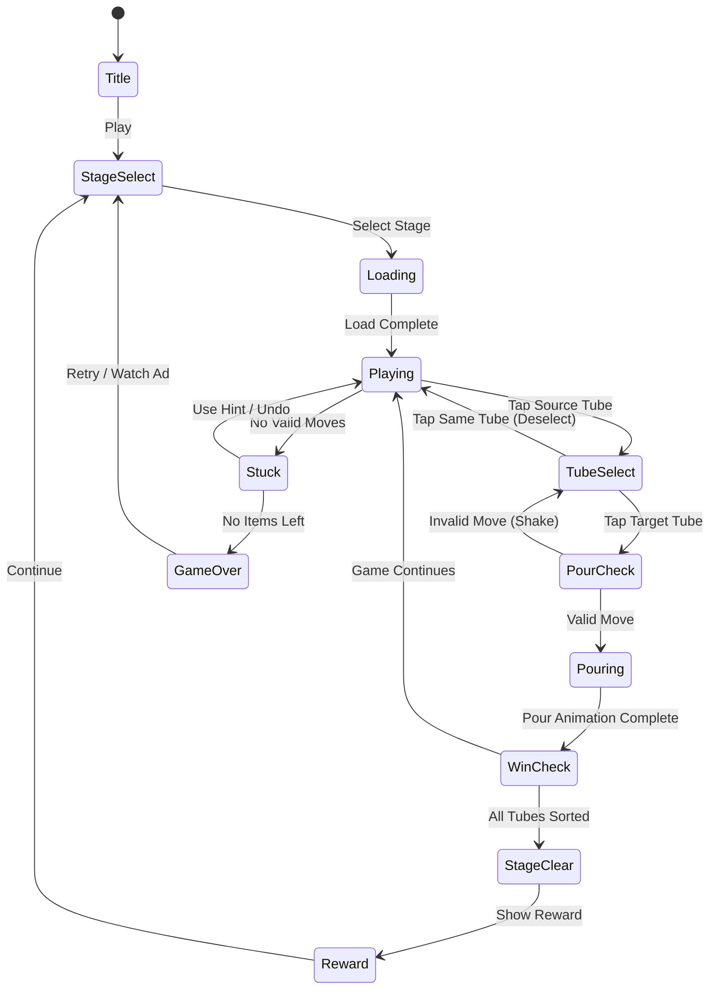

# Get Color - Water Sort Puzzle

> **레퍼런스**: Tripledot Studios Limited | 평점 4.7 | 장르: sort-puzzle | 랭크 #91
>
> 세 번째 물 분류 퍼즐. #29/#58 레퍼런스를 종합한 **최종 확정 기획서**.

## 개요

색깔 있는 물이 든 튜브들을 정렬하는 퍼즐 게임.
각 튜브의 물을 다른 튜브로 붓는 방식으로, 모든 튜브를 **단일 색상**으로 채우면 스테이지 클리어.

### 레퍼런스 비교 분석

| 항목 | #29 (기본형) | #58 (중간형) | #91 Get Color (최종) |
|------|-------------|-------------|---------------------|
| 튜브 수 | 6~8 | 8~10 | 6~12 (스테이지별) |
| 빈 튜브 | 1개 | 2개 | 2개 |
| 색상 수 | 4~6 | 6~8 | 4~10 |
| 붓기 단위 | 1칸 | 연속 동색 | 연속 동색 전체 |
| 실행취소 | 없음 | 3회 | 무제한 (광고/코인) |
| 힌트 | 없음 | 유료 | 유료 + 광고 |
| 핵심 차별점 | 심플 | 밸런스 | **UX 최적화** |

**결론**: Get Color는 **연속 동색 전체 이동** + **UX 최적화**가 핵심 차별점.
Tripledot는 "즉시 보상감"을 최대화하여 리텐션을 높이는 전략을 씀.

---

## 게임 규칙

### 기본 규칙

- N개의 튜브가 제공됨 (그 중 2개는 완전히 비어있음)
- 각 튜브는 최대 **4칸** 용량
- 플레이어는 한 튜브에서 다른 튜브로 물을 부을 수 있음
- **붓기 조건**: 목적지 튜브의 최상단 색 == 원본 튜브의 최상단 색 **또는** 목적지 튜브가 비어있음
- **붓기 단위**: 같은 색이 연속된 모든 칸을 한 번에 이동 (핵심 차별점)
- **용량 초과 불가**: 목적지 튜브 빈 공간 < 이동할 물의 양이면 이동 불가

### 클리어 조건

- 모든 튜브가 **단일 색상 4칸으로 가득 채워지거나 완전히 비어있을 때** 클리어

### 불가능 상태 감지

- 모든 가능한 이동이 없는 경우 → 자동으로 "막힘" UI 표시 (힌트 또는 실행취소 유도)

---

## 게임 플로우



---

## UI 레이아웃

```
┌─────────────────────────────┐
│  ← Back    Level 42   ⚙️   │  ← 상단 바
│  ████████████████ 42/120    │  ← 진행도 바
├─────────────────────────────┤
│                             │
│  ┌──┐ ┌──┐ ┌──┐ ┌──┐      │
│  │🔵│ │🔴│ │🟡│ │  │      │
│  │🔵│ │🔴│ │🟢│ │  │      │
│  │🔴│ │🟡│ │🔴│ │  │      │  ← 튜브 영역
│  │🟡│ │🟢│ │🟢│ │  │      │    (비어있는 튜브 포함)
│  └──┘ └──┘ └──┘ └──┘      │
│                             │
│  ┌──┐ ┌──┐                 │
│  │🟢│ │🔵│                 │
│  │🟡│ │🔵│                 │
│  │  │ │🔵│                 │
│  │  │ │  │                 │
│  └──┘ └──┘                 │
│                             │
├─────────────────────────────┤
│  ↩️ Undo(3)  💡 Hint(3)   │  ← 아이템 바
│  ➕ Add Tube               │
└─────────────────────────────┘
```

### 튜브 선택 UX

1. 첫 탭: 소스 튜브 **하이라이트** (발광 효과)
2. 두 번째 탭: 목적지 튜브
   - 유효: 붓기 애니메이션 실행
   - 무효: 흔들기(shake) 애니메이션 + 빨간 테두리

---

## 물 붓기 애니메이션 (Phaser.io 기술 명세)

### 씬 구성

```
GameScene
├── TubeManager        - 튜브 상태 관리 (배열 기반)
├── PourAnimator       - 붓기 애니메이션
│   ├── ArcTween       - 포물선 이동 트윈
│   └── WaterFill      - 튜브 내 물 높이 채움 애니메이션
├── InputHandler       - 탭/클릭 이벤트
├── WinChecker         - 클리어 판정
└── HUDScene           - 스코어/아이템 오버레이
```

### 튜브 데이터 구조

```typescript
interface Tube {
  id: number;
  capacity: 4;                    // 고정 4칸
  water: Color[];                 // 아래부터 쌓임 [bottom, ..., top]
  position: { x: number; y: number };
}

type Color = 'red' | 'blue' | 'green' | 'yellow' | 'purple' | 'orange' | 'pink' | 'cyan' | 'brown' | 'empty';
```

### 붓기 로직

```typescript
function pour(from: Tube, to: Tube): boolean {
  const fromTop = getTopColor(from);          // 최상단 색
  const fromCount = getTopColorCount(from);   // 연속 동색 수
  const toTop = getTopColor(to);
  const toSpace = to.capacity - to.water.length;

  if (toSpace === 0) return false;                         // 목적지 가득 참
  if (toTop !== 'empty' && toTop !== fromTop) return false; // 색 불일치

  const moveCount = Math.min(fromCount, toSpace);
  // moveCount만큼 from에서 제거 → to에 추가
  return true;
}
```

### 애니메이션 파이프라인

1. **이동 트윈**: 물 스프라이트를 포물선 경로로 목적지 위로 이동 (300ms)
2. **채움 트윈**: 목적지 튜브의 물 높이 증가 (200ms)
3. **제거 트윈**: 소스 튜브의 물 높이 감소 (동시)
4. **클리어 체크**: 애니메이션 완료 후 즉시 실행

### 물 렌더링 방식

- 각 튜브 = Phaser Graphics 객체 (마스크로 둥근 유리 효과)
- 물 칸 = 단순 Rectangle + 색상 채우기
- 경계선 = 얇은 흰 선 (칸 구분)
- 선택 효과 = 외곽선 + Phaser Tween (glow 펄싱)

---

## 스테이지 설계

### 난이도 곡선

| Stage | 색상 수 | 튜브 수 | 빈 튜브 | 예상 이동 수 | 난이도 |
|-------|---------|---------|---------|------------|--------|
| 1~10 | 3 | 5 | 2 | 5~10 | ★☆☆ |
| 11~30 | 4 | 6 | 2 | 10~15 | ★★☆ |
| 31~60 | 5~6 | 7~8 | 2 | 15~25 | ★★☆ |
| 61~100 | 7~8 | 9~10 | 2 | 25~40 | ★★★ |
| 101+ | 9~10 | 11~12 | 2 | 40+ | ★★★ |

### 스테이지 생성 알고리즘

1. 정답 상태(각 튜브 단색) 생성
2. 역방향으로 N번 랜덤 유효 이동 적용 → 초기 상태 도출
3. 최소 이동 수 BFS로 검증 (풀이 가능 보장)
4. 최소 이동 수 < 5이면 재생성

---

## 아이템 시스템

| 아이템 | 효과 | 기본 제공 | 획득 방법 |
|--------|------|----------|---------|
| Undo | 마지막 이동 취소 (무제한 연속 사용 가능) | 3회 | 광고 시청, 코인 구매 |
| Hint | 최적의 다음 이동 1회 표시 | 3회 | 광고 시청, 코인 구매 |
| Add Tube | 빈 튜브 1개 추가 | 1회 | 광고 시청, 코인 구매 |

### 아이템 획득 UX

- 아이템 소진 시: "광고 보고 3개 무료 받기" 팝업 즉시 노출
- 광고 거절 시: 코인으로 구매 유도 (코인 부족 시 → 인앱 결제)

---

## 수익화 전략

### 수익 구조 (3트랙 병행)

```
[광고] ─────────────────────────────────────────────
  • 스테이지 클리어 후 전면 광고 (5스테이지마다)
  • 아이템 소진 시 보상형 광고 (유저 선택)
  • 힌트/Undo/Add Tube 각 1회 → 보상형 광고

[코인] ─────────────────────────────────────────────
  • 코인으로 아이템 구매
  • 코인 획득: 스테이지 클리어, 일일 미션, 광고 시청
  • 코인 구매: 소액 인앱결제 (₩1,200 / ₩4,900 / ₩9,900)

[광고 제거 패키지] ──────────────────────────────────
  • ₩4,900 일회성 결제 → 전면 광고 영구 제거 (보상형 광고 유지)
  • 코인 500개 보너스 포함
```

### 수익화 밸런스 기준 (데이터 드리븐)

| 지표 | 목표 | 측정 방법 |
|------|------|---------|
| Day 1 Retention | > 40% | Firebase Analytics |
| Day 7 Retention | > 20% | Firebase Analytics |
| ARPU (Day 30) | > $0.15 | AdMob + IAP 합산 |
| 광고 시청률 (아이템 소진 시) | > 60% | Custom Event |
| IAP 전환율 | > 2% | 코인 구매 이벤트 |

---

## 사운드/이펙트

| 상황 | 사운드 | 이펙트 |
|------|--------|--------|
| 튜브 선택 | 유리 탭 효과음 | 하이라이트 발광 |
| 물 붓기 | 물 콸콸 소리 | 포물선 이동 + 채움 |
| 유효하지 않은 이동 | 낮은 효과음 | shake 애니메이션 |
| 튜브 완성 | 맑은 차임 | 체크마크 + 파티클 |
| 스테이지 클리어 | 밝은 팡파레 | 전체 튜브 폭죽 이펙트 |
| 게임 막힘 | 없음 | 힌트 버튼 강조 펄싱 |

---

## MVP 범위

### Phase 1 — MVP (1주 목표)

- [x] 기획서 작성
- [ ] 튜브 데이터 구조 + 붓기 로직 (lib)
- [ ] 기본 렌더링: 튜브 + 색깔 물 칸 (lib/Phaser)
- [ ] 탭 인풋 → 소스/목적지 선택 (lib)
- [ ] 붓기 유효성 검사 (lib)
- [ ] 간단한 붓기 애니메이션 (lib)
- [ ] 클리어 판정 (lib)
- [ ] Undo 1회 (lib)
- [ ] 20 스테이지 하드코딩 (prd → lib)
- [ ] 웹 빌드 (web)

### Phase 2 — 수익화 (2주차)

- [ ] 스테이지 알고리즘 생성 (100+ 스테이지)
- [ ] 아이템 시스템 (Undo/Hint/Add Tube)
- [ ] 광고 연동 (AdMob)
- [ ] 코인 시스템
- [ ] RN 래핑

### Phase 3 — 폴리싱 (데이터 보고 결정)

- [ ] 물 붓기 고급 애니메이션 (포물선 + 파티클)
- [ ] 튜브 완성 이펙트
- [ ] IAP 연동
- [ ] 일일 미션

---

## 구현 우선순위 결론

> **1주 안에 출시 가능한 최소 범위를 정의한다.**

1. **lib** → 붓기 로직 + 기본 렌더링 + 20 스테이지 (4~5일)
2. **web** → Phaser 통합 + 간단한 HUD (1~2일)
3. **rn** → WebView 래핑 + 스토어 등록 (1일)

물 정렬 게임은 **구현 난이도 대비 시장 검증이 가장 잘 된 장르**.
#29/#58 레퍼런스와 공통 인프라를 최대한 재사용하여 개발 시간을 단축한다.
**Get Color를 세 번째 물 정렬 게임으로 확정, 즉시 개발 착수.**
