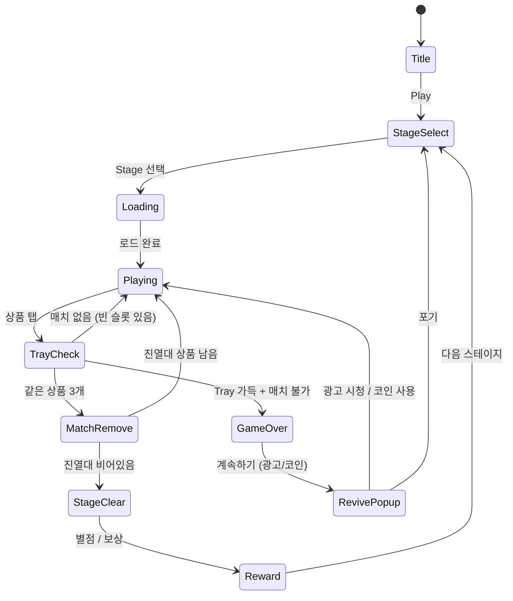

# Goods Sorting: 매치 3 퍼즐

> 편의점/마트 진열대 위의 상품을 같은 종류끼리 정리하는 정렬+매치3 하이브리드 퍼즐

## 개요

진열대에 뒤섞인 상품들을 탭해서 올바른 선반으로 이동시키고, 같은 상품 3개를 한 칸에 모으면 제거된다.
모든 상품을 제거하면 스테이지 클리어. 편의점/마트 테마로 친숙한 시각적 매력을 제공한다.

### 핵심 재미 루프
```
상품 탭 → 빈 선반 슬롯으로 이동 → 같은 상품 3개 모임 → 자동 제거 → 스테이지 클리어
```

---

## 게임 규칙

### 기본 규칙
- 진열대(Shelf)에 여러 종류의 상품이 뒤섞여 배치됨
- 상품을 탭하면 **하단 수납 영역(Tray, 최대 7칸)**으로 이동
- Tray 내 같은 상품 3개가 모이면 **자동 제거** (매치-3)
- Tray가 가득 차고 3매치 불가 상태 → **게임 오버**
- 진열대 모든 상품 제거 시 → **스테이지 클리어**

### 진열대(Shelf) 구조
- 진열대는 **여러 행(Row)** 으로 구성
- 각 행은 좌→우 순서로 상품이 쌓여 있음
- **앞(맨 오른쪽) 상품만 탭 가능** (스택 구조, LIFO)
- 뒤에 숨겨진 상품은 앞 상품 제거 후 접근 가능

### Tray(수납 슬롯) 규칙
- 최대 7칸의 임시 보관 슬롯
- 탭한 상품은 Tray로 이동, 같은 종류 옆에 자동 정렬
- 같은 상품 3개가 연속 배치되면 즉시 제거 + 점수 획득
- Tray 7칸이 모두 채워지면 게임 오버

### 상품 종류 (편의점/마트 테마)
| 카테고리 | 상품 예시 |
|---------|---------|
| 음료 | 콜라, 물, 우유, 에너지드링크 |
| 과자 | 초코파이, 새우깡, 포카칩, 쿠키 |
| 컵라면 | 신라면, 짜파게티, 육개장, 진라면 |
| 통조림 | 참치, 스팸, 옥수수, 골뱅이 |
| 신선식품 | 삼각김밥, 샌드위치, 도시락, 요거트 |
| 생활용품 | 칫솔, 샴푸, 세제, 휴지 |

---

## 게임 플로우



### 화면 흐름
1. **Title** → 로고, Play 버튼
2. **StageSelect** → 레벨 맵 (별점 표시)
3. **Playing** → 메인 게임 화면
4. **StageClear** → 별점(1~3), 코인 보상, 다음 레벨
5. **GameOver** → 실패 화면, 부활 광고 제안

---

## UI 레이아웃

```
┌─────────────────────────────┐
│  ← Level 5   ⭐ 1230  ⏱ 60  │  ← HUD (레벨, 점수, 타이머)
├─────────────────────────────┤
│                             │
│  [진열대 Row 1]             │
│  🥤🥤🍜🍜🥫 ← ← ← 탭 방향   │
│                             │
│  [진열대 Row 2]             │
│  🍪🍪🥛🍜🥤                 │  ← 진열대 (스택, 앞만 탭 가능)
│                             │
│  [진열대 Row 3]             │
│  🥫🍪🥛🥛🍪                 │
│                             │
│  [진열대 Row 4]             │
│  🥤🍜🥫🍪🥛                 │
│                             │
├─────────────────────────────┤
│  [ ][ ][ ][ ][ ][ ][ ]      │  ← Tray (7칸 수납 슬롯)
├─────────────────────────────┤
│  🔀 Shuffle  ↩ Undo  ➕ Slot│  ← 아이템 버튼
└─────────────────────────────┘
```

### 진열대 상세
- 각 Row는 **5~8칸** (난이도에 따라 증가)
- 맨 오른쪽 상품이 **활성(탭 가능)** → 밝게 표시
- 뒤 상품들은 **비활성(흐릿하게)** 표시
- 상품 제거 시 좌측 상품이 앞으로 슬라이드 애니메이션

### Tray 상세
- 상품 입장 시: 왼쪽부터 채워짐, 같은 상품 옆에 삽입
- 3매치 시: 반짝 이펙트 + 제거 애니메이션
- 7칸 가득 찰 때: 빨간 테두리 경고

---

## 스코어링 시스템

| 액션 | 점수 |
|------|------|
| 상품 3매치 제거 | +100 |
| 콤보 (연속 매치) | +100 × 콤보 배수 |
| 스테이지 클리어 | +500 |
| 남은 시간 보너스 | 남은 초 × 10 |
| 남은 이동 보너스 (무제한 모드) | - |

### 별점 기준 (스테이지 클리어 시)
| 별점 | 조건 |
|------|------|
| ⭐⭐⭐ | 시간 50% 이상 남음 + Tray 3칸 이하 사용 |
| ⭐⭐ | 시간 20% 이상 남음 |
| ⭐ | 시간 초과 없이 클리어 (부활 사용 시 최대 ⭐⭐) |

---

## 난이도 설계

### 레벨별 파라미터

| 레벨 구간 | 상품 종류 | Row 수 | Row 길이 | 시간(초) | 특수 조건 |
|----------|-----------|--------|---------|---------|---------|
| 1–5 | 3 | 2 | 3~4 | 120 | 없음 |
| 6–10 | 4 | 3 | 4~5 | 120 | 없음 |
| 11–15 | 5 | 3 | 5~6 | 100 | 잠긴 상품(1개) |
| 16–20 | 6 | 4 | 5~6 | 90 | 잠긴 상품(2개) |
| 21–25 | 7 | 4 | 6~7 | 80 | 철장 Row (순서 고정) |
| 26–30 | 8 | 5 | 6~8 | 70 | 폭탄 상품 (오염 효과) |

> 총 상품 수 = 상품 종류 × 3의 배수로 고정 (항상 완전 클리어 가능)

### 특수 상품/장애물

| 요소 | 설명 |
|------|------|
| 🔒 잠긴 상품 | 열쇠 아이템 또는 인접 매치로 해제 후 탭 가능 |
| 🧊 냉동 상품 | 같은 종류 2개 Tray에 넣어야 해제 |
| 📦 상자 상품 | 탭 시 2개의 랜덤 상품으로 분리 |
| ⚡ 번개 상품 | 3매치 시 같은 Row의 상품 1개 추가 제거 |

### 무한 모드 (Endless Mode)
- 레벨 30 클리어 후 해금
- 상품 종류 최대 10가지, Row 5개 고정
- 시간 제한 없음, 점수 무한 도전
- 글로벌 랭킹 연동 (MVP 이후 Phase 2)

---

## 아이템/도구

### 인게임 아이템

| 아이템 | 효과 | 획득 방법 |
|--------|------|---------|
| 🔀 Shuffle | 진열대 모든 상품 위치 랜덤 재배치 | 코인 30 or 광고 |
| ↩ Undo | Tray 마지막 상품 → 원위치 복귀 | 코인 20 or 광고 |
| ➕ Extra Slot | Tray 1칸 추가 확장 (해당 스테이지만) | 코인 50 or 광고 |
| 🗑 Remove | Tray 내 상품 1개 선택 제거 | 코인 80 or 광고 |
| ⏱ +30s | 시간 30초 추가 | 코인 40 or 광고 |

### 수익화 전략

#### 부활 시스템
- 게임 오버 시 "계속하기" 팝업 노출
- **광고 1회 시청** → Tray 3칸 비우고 재개
- **코인 100개** → 즉시 부활 (Tray 3칸 비움)
- 1스테이지 최대 2회 부활 가능

#### 코인 수급
- 스테이지 클리어: 10~30 코인
- 별 3개 클리어: 보너스 10 코인
- 광고 시청: 30 코인 (일 5회 제한)
- 인앱결제: 코인 패키지 (1,100원 ~ 11,000원)

#### 광고 노출 지점
1. 게임 오버 → 부활 광고
2. 스테이지 클리어 → 보상 2배 광고 (선택)
3. 아이템 사용 → 광고로 무료 사용 (선택)
4. 메인 화면 배너 (비방해적)

---

## 진행 구조

### 레벨 맵
```
[1] → [2] → [3] → [4] → [5]  ← Chapter 1: 편의점 입구
              ↓
[6] → [7] → [8] → [9] → [10] ← Chapter 2: 과자 코너
              ↓
...
[26]→[27]→[28]→[29]→[30]    ← Chapter 6: 창고 정리
              ↓
[∞ Endless Mode]
```

### 챕터 테마
| 챕터 | 테마 | 상품 카테고리 |
|------|------|------------|
| 1 | 편의점 입구 | 음료, 과자 |
| 2 | 과자 코너 | 과자, 컵라면 |
| 3 | 음료 냉장 코너 | 음료, 유제품 |
| 4 | 통조림 코너 | 통조림, 조미료 |
| 5 | 신선식품 코너 | 도시락, 샌드위치 |
| 6 | 창고 정리 | 전 카테고리 혼합 |

---

## 사운드/이펙트

| 상황 | 사운드/이펙트 |
|------|-------------|
| 상품 탭 | 통통 효과음 |
| 3매치 제거 | 팡 이펙트 + 반짝 파티클 |
| 콤보 | 상승 톤 연속음 (x2, x3...) |
| Tray 위험 (5칸 이상) | 긴장 BGM 전환 |
| 게임 오버 | 실패 사운드 + 화면 흔들림 |
| 스테이지 클리어 | 축하 팡파르 + 별 애니메이션 |
| 특수 상품 해제 | 잠금 해제 사운드 |

---

## MVP 범위

### Phase 1 - MVP (1~2주, 30레벨)
- [x] 기획서 작성
- [ ] 기본 진열대 + Tray 로직 (상품 탭 → Tray 이동 → 3매치 제거)
- [ ] 게임 오버 / 스테이지 클리어 판정
- [ ] 레벨 1~30 스테이지 데이터
- [ ] 편의점 상품 이미지 (8종 기본 세트)
- [ ] Shuffle / Undo 아이템
- [ ] 광고 부활 시스템
- [ ] 스테이지 셀렉트 화면 + 별점

### Phase 2 - 콘텐츠 확장
- [ ] 특수 상품 (잠금, 냉동, 상자, 번개)
- [ ] 무한 모드 + 글로벌 랭킹
- [ ] 코인 인앱결제 연동
- [ ] 챕터별 BGM/테마 이미지
- [ ] 데일리 챌린지 레벨

### Phase 3 - 소셜/리텐션
- [ ] 친구 랭킹
- [ ] 이벤트 레벨 (시즌 테마)
- [ ] 출석 체크 보상
- [ ] 소셜 공유 기능
