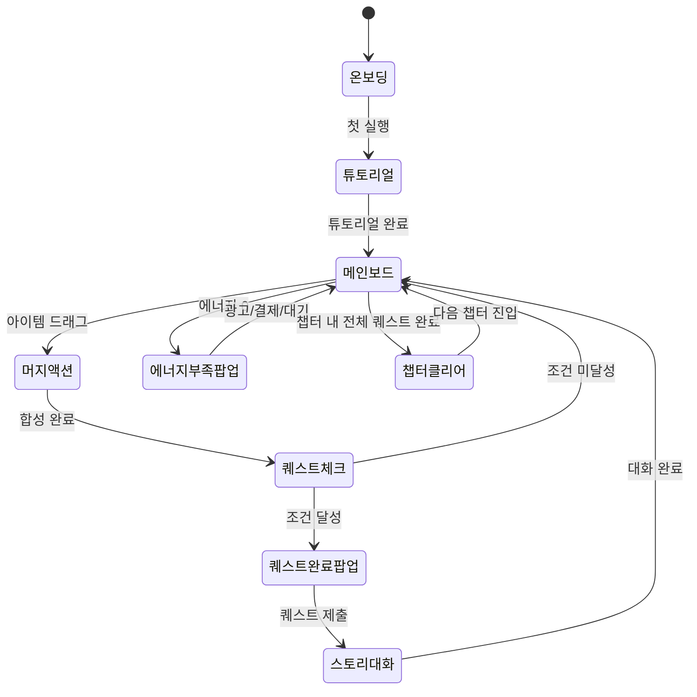

# 가십하버 (Gossip Harbor)

> 머지(Merge) + 스토리 하이브리드 게임. 항구 마을에서 아이템을 합성하며 주민들의 비밀을 파헤치는 이야기.

## 개요

플레이어는 낡은 항구 마을 "하버타운"에 새로 이사온 주인공이다.
마을 주민들은 저마다 비밀을 품고 있으며, 플레이어는 보드 위 아이템을 합성(Merge)해
퀘스트 아이템을 만들고 스토리를 풀어나간다.

- **장르**: 머지 퍼즐 + 스토리 어드벤처
- **테마**: 항구 마을, 가십, 비밀
- **플랫폼**: iOS / Android (RN WebView)
- **타겟**: 여성 25~45세, 캐주얼 게이머
- **개발 목표**: MVP 1주, 1챕터 완성

---

## 게임 규칙

### 머지(합성) 기본 규칙

- 보드 위 **같은 아이템 2개**를 드래그해 합치면 **상위 아이템 1개** 생성
- 합성 체인은 **레벨 1 → 10** (총 10단계)
- 상위 아이템일수록 희귀하며 스토리 퀘스트에 필요
- 합성 결과 아이템은 원위치(두 번째 아이템 자리)에 생성됨

### 머지 체인 (항구 테마)

| 레벨 | 아이템 | 이모지 | 비고 |
|------|--------|--------|------|
| 1 | 조개 껍데기 | 🐚 | 시작 아이템, 에너지로 생성 |
| 2 | 별조개 | ⭐🐚 | Lv1 × 2 |
| 3 | 진주 | 💎 | Lv2 × 2 |
| 4 | 낡은 편지 | 📜 | Lv3 × 2 |
| 5 | 봉인된 편지 | 📩 | Lv4 × 2 |
| 6 | 항구 지도 | 🗺️ | Lv5 × 2 |
| 7 | 오래된 열쇠 | 🗝️ | Lv6 × 2 |
| 8 | 보물 상자 | 📦 | Lv7 × 2 |
| 9 | 황금 나침반 | 🧭 | Lv8 × 2 |
| 10 | 하버타운의 비밀 | ✨ | Lv9 × 2, 최고 아이템 |

> Lv1 아이템 1개 생성에 에너지 1 소모. 상위 아이템은 에너지 소모 없음 (합성으로만 획득).

---

## 에너지 시스템

### 에너지 기본

| 항목 | 값 |
|------|-----|
| 최대 에너지 | 50 |
| 자연 회복 | 1 / 5분 |
| Lv1 아이템 생성 비용 | 에너지 1 |
| 광고 시청 보상 | +10 에너지 |
| 일일 보너스 | +20 에너지 |

### 에너지 소진 시 UX

```
┌─────────────────────────────┐
│  ⚡ 에너지가 부족합니다!      │
│                              │
│  다음 회복까지: 04:32         │
│                              │
│  [광고 보기 +10]  [충전 구매]  │
└─────────────────────────────┘
```

---

## 보드 시스템

### 보드 레이아웃

```
┌─────────────────────────────────┐
│  📖 챕터 1: 낯선 항구           │
│  ⚡ 35/50    📬 퀘스트: 진주 필요│
├─────────────────────────────────┤
│                                 │
│  [🐚][🐚][💎][  ][  ][  ]      │
│  [⭐][📜][  ][  ][  ][  ]      │
│  [  ][  ][  ][  ][  ][  ]      │  ← 6×5 기본 보드 (30칸)
│  [  ][  ][  ][  ][  ][  ]      │
│  [  ][  ][  ][  ][  ][  ]      │
│                                 │
├─────────────────────────────────┤
│  💛💛💛💛💛⬜⬜⬜⬜⬜  (버블 10) │  ← 버블 보관함
├─────────────────────────────────┤
│  [⚡ 아이템 생성]  [🔄 정리]    │
└─────────────────────────────────┘
```

### 보드 공간 관리

| 항목 | 기본값 | 확장 |
|------|--------|------|
| 보드 칸 수 | 30칸 (6×5) | +6칸씩 최대 54칸 |
| 버블 보관함 | 10칸 | +5칸씩 최대 25칸 |
| 공간 확장 비용 | 보석 30개 | 단계별 증가 |

### 버블 보관함

- 보드에서 아이템을 드래그해 버블에 임시 저장 (공간 확보용)
- 버블의 아이템은 다시 보드로 꺼낼 수 있음
- 버블 초과 시 꺼낼 수 없음 → 공간 확장 유도

---

## 스토리 시스템

### 구조

- **챕터**: 스토리 단위 (MVP: 1챕터, 풀버전: 6챕터)
- **챕터 내 퀘스트**: 3~5개 퀘스트
- **퀘스트 완료 조건**: 특정 아이템 N개 제출

### MVP 1챕터: "낯선 항구"

```
[퀘스트 1] 항구 도착
  → 조건: 진주(Lv3) 2개 제출
  → 보상: +30 에너지, 스토리 대화 잠금 해제
  → 스토리: 주인공이 항구에 도착. 수상한 노인 선장을 만남.

[퀘스트 2] 선장의 요청
  → 조건: 낡은 편지(Lv4) 1개 제출
  → 보상: 보석 20개, 스토리 대화 잠금 해제
  → 스토리: 선장이 오래전 잃어버린 편지를 찾아달라고 부탁.

[퀘스트 3] 마을 탐문
  → 조건: 봉인된 편지(Lv5) 1개 제출
  → 보상: 보드 +6칸 확장, 스토리 대화 잠금 해제
  → 스토리: 편지 속 비밀 — 선장에게 숨겨진 가족이 있었다.

[퀘스트 4] 비밀의 지도
  → 조건: 항구 지도(Lv6) 1개 제출
  → 보상: +50 에너지, 한정 머지 아이템 해제
  → 스토리: 지도가 가리키는 장소에 오래된 보물이 있다?

[챕터 1 완료]
  → 보상: 보석 100개, 챕터 2 잠금 해제 예고
  → 엔딩 컷씬: 선장의 눈물. 다음 챕터 티저.
```

### 스토리 대화 포맷 (텍스트 기반 간소화)

```
┌─────────────────────────────────┐
│  [선장 초상화]                   │
│                                  │
│  "이 편지가... 정말 남아있었군요. │
│   고맙소, 젊은이."               │
│                                  │
│              [다음 ▶]            │
└─────────────────────────────────┘
```

---

## 이벤트 시스템

### 시즌 이벤트 (Phase 2)

| 이벤트 | 내용 | 기간 |
|--------|------|------|
| 항구 축제 | 한정 머지 체인: 불꽃 → 폭죽 → 축포 | 7일 |
| 여름 보물 | 한정 아이템: 모래성 → 조개배 → 황금 조개 | 14일 |
| 할로윈 가십 | 한정 스토리 + 머지: 호박 → 마녀모자 → 저주 편지 | 10일 |

### 한정 머지 체인 규칙

- 시즌 이벤트 기간에만 등장
- 일반 체인과 별도 칸에 배치 (이벤트 보드)
- 이벤트 전용 보상(스킨, 보석, 에너지 대량)

---

## 수익화 모델

### IAP (인앱 결제)

| 상품 | 가격 | 내용 |
|------|------|------|
| 에너지 팩 Small | ₩1,200 | +50 에너지 |
| 에너지 팩 Large | ₩4,900 | +200 에너지 + 보석 30 |
| 보드 확장 | ₩2,500 | 보드 +6칸 영구 |
| 버블 확장 | ₩1,900 | 버블 +5칸 영구 |
| 스타터 팩 | ₩4,900 | 에너지 100 + 보석 50 + 보드확장 (첫구매 한정) |
| 월정액 패스 | ₩8,900 | 매일 에너지 +30, 광고 제거, 보석 10/일 |

### 광고 리워드

| 시청 위치 | 보상 |
|-----------|------|
| 에너지 부족 팝업 | +10 에너지 |
| 퀘스트 힌트 | 힌트 아이템 1개 무료 생성 |
| 스토리 이어보기 | 에너지 -5 대신 광고 시청으로 대체 |
| 일일 스핀 | 추가 1회 스핀 (보석/에너지 랜덤) |

### 보석(하드 커런시) 사용처

| 사용처 | 비용 |
|--------|------|
| 에너지 즉시 충전 (30) | 보석 15 |
| 보드 칸 확장 | 보석 30 |
| 버블 칸 확장 | 보석 20 |
| 막힌 칸 해제 | 보석 10 |
| 한정 아이템 구매 | 보석 50~100 |

---

## 리텐션 시스템

### 시간 게이트 (재방문 유도)

| 메커니즘 | 내용 |
|----------|------|
| 에너지 자연 회복 | 5분당 1 회복 → 2.5시간마다 50 풀충전 |
| 일일 보너스 | 접속 시 +20 에너지 + 보석 5 |
| 연속 접속 보너스 | 7일 연속: 대량 보상 (에너지 100 + 보석 30) |
| 스토리 푸시 알림 | "선장이 당신을 기다립니다..." |
| 에너지 풀충전 알림 | "에너지가 가득 찼어요!" |

### 푸시 알림 시나리오

```
D+0: 게임 설치 → 온보딩
D+1: "선장이 편지를 찾고 있어요. 도와주세요!"
D+3: "항구 축제 시작! 한정 아이템 놓치지 마세요."
D+7: "7일 연속 접속 보너스 대기 중!"
이탈 후 24h: "가십하버 주민들이 당신을 그리워해요."
이탈 후 72h: "돌아오면 에너지 30을 드릴게요!"
```

---

## 게임 플로우



---

## UI 레이아웃 상세

### 메인 보드 화면

```
┌─────────────────────────────────┐
│ ≡  가십하버    ⚡35  💎80  ⚙️  │  ← 상단 HUD
├─────────────────────────────────┤
│ 📖 챕터1: 낯선 항구  [퀘스트▼]  │  ← 챕터 & 퀘스트 배너
│ ▶ 진주 2개 제출 (1/2)          │
├─────────────────────────────────┤
│                                 │
│  [🐚][🐚][💎][⭐][  ][  ]      │
│  [🐚][📜][  ][  ][  ][  ]      │  ← 머지 보드
│  [  ][  ][  ][  ][  ][  ]      │
│  [  ][  ][  ][  ][  ][  ]      │
│  [  ][  ][  ][  ][  ][  ]      │
│                                 │
├─────────────────────────────────┤
│  💛💛⬜⬜⬜⬜⬜⬜⬜⬜          │  ← 버블 보관함
├─────────────────────────────────┤
│   [⚡ 아이템 생성(-1)]  [정리]   │
└─────────────────────────────────┘
```

### 퀘스트 패널 (확장 시)

```
┌─────────────────────────────────┐
│ 📋 진행 중인 퀘스트              │
├─────────────────────────────────┤
│ ✅ 퀘스트1: 항구 도착 (완료)     │
│ ▶ 퀘스트2: 선장의 요청           │
│    → 낡은 편지(Lv4) 1개 필요    │
│    → 진행: 0/1   [제출]         │
│ 🔒 퀘스트3: 마을 탐문            │
└─────────────────────────────────┘
```

### 스토리 대화 화면

```
┌─────────────────────────────────┐
│                                 │
│  ░░░░░░░░░░  배경: 항구 부두     │
│  ░░░░░░░░░░                     │
│  ░░░░░░░░░░                     │
│                                 │
│  ┌──────┐                       │
│  │선장  │  "이 편지가 아직..."   │
│  │초상화│                       │
│  └──────┘                       │
│                                 │
│  ░░░░░░░░░░░░░░░░░░░░░░░░░░░░░  │
│  이 편지가 아직 남아있었군요.    │
│  고맙소, 젊은이. 자네 덕분에    │
│  마음속 짐을 내려놓겠소.        │
│  ░░░░░░░░░░░░░░░░░░░░░░░░░░░░░  │
│                            [▶]  │
└─────────────────────────────────┘
```

---

## 튜토리얼 플로우 (온보딩)

```
Step 1: "조개 껍데기를 생성해보세요!" → 에너지 소모 안내 (강제 진행)
Step 2: "같은 아이템 2개를 합쳐보세요!" → 드래그 머지 시연
Step 3: "별조개가 생겼어요!" → 합성 성공 리워드 감각
Step 4: "퀘스트를 확인해보세요!" → 퀘스트 패널 오픈
Step 5: "선장이 기다리고 있어요!" → 첫 스토리 대화 트리거
```

- 튜토리얼 중 에너지 소모 없음 (무제한 제공)
- 튜토리얼 완료 보상: 에너지 30 + 보석 20

---

## 스코어링 / 진행도 시스템

| 지표 | 내용 |
|------|------|
| 레벨 | 퀘스트 완료 시 XP 획득 → 플레이어 레벨 상승 |
| XP 보상 | 퀘스트 완료: +50XP, 챕터 완료: +200XP |
| 레벨업 보상 | 레벨당 보석 10 + 에너지 20 |
| 업적 | "첫 합성", "진주의 달인(Lv3 100개)", "가십 수집가(스토리 50% 완료)" 등 |

---

## 난이도 / 밸런스 설계

### 아이템 합성 비용 분석 (Lv1 아이템 기준)

| 목표 아이템 | 필요 Lv1 수 | 필요 에너지 |
|-------------|------------|-------------|
| Lv2 | 2 | 2 |
| Lv3 (진주) | 4 | 4 |
| Lv4 (낡은 편지) | 8 | 8 |
| Lv5 (봉인된 편지) | 16 | 16 |
| Lv6 (항구 지도) | 32 | 32 |
| Lv7 (오래된 열쇠) | 64 | 64 |
| Lv8 (보물 상자) | 128 | 128 |
| Lv9 (황금 나침반) | 256 | 256 |
| Lv10 (비밀) | 512 | 512 |

> MVP에서는 Lv6까지만 사용 (챕터1 퀘스트 범위)

### 에너지 소비 시뮬레이션 (챕터 1 완료까지)

| 퀘스트 | 필요 아이템 | 필요 에너지 |
|--------|------------|-------------|
| Q1: 진주 ×2 | Lv3 ×2 = Lv1 ×8 | 8 |
| Q2: 낡은 편지 ×1 | Lv4 ×1 = Lv1 ×8 | 8 |
| Q3: 봉인된 편지 ×1 | Lv5 ×1 = Lv1 ×16 | 16 |
| Q4: 항구 지도 ×1 | Lv6 ×1 = Lv1 ×32 | 32 |
| **총합** | | **~64 에너지** |

> 자연 회복만으로 약 5.5시간 소요 → 에너지 구매 또는 3일 분산 플레이 유도

---

## 사운드/이펙트

| 상황 | 효과 |
|------|------|
| 아이템 생성 | "뿅" 짧은 팝 사운드 |
| 머지 성공 | "짠~" 상승 음 + 파티클 이펙트 |
| 퀘스트 완료 | 팡파레 + 골드 파티클 |
| 챕터 완료 | 특별 BGM + 축하 이펙트 |
| 에너지 부족 | 경고음 (부드럽게) |
| 스토리 대화 | 잔잔한 항구 BGM |

---

## MVP 범위

### Phase 1 — MVP (1주 목표)

- [x] 기획서 작성
- [ ] 머지 보드 (6×5, 아이템 드래그 & 합성)
- [ ] 에너지 시스템 (생성 비용, 자동 회복 타이머)
- [ ] 머지 체인 Lv1~6 (조개 → 항구 지도)
- [ ] 퀘스트 시스템 (챕터1, 퀘스트 4개)
- [ ] 텍스트 기반 스토리 대화 (챕터1 완결)
- [ ] 버블 보관함 (10칸)
- [ ] 기본 광고 리워드 (에너지 +10)

### Phase 2 (이후 개선)

- [ ] Lv7~10 머지 체인 + 챕터 2~6
- [ ] IAP 연동 (에너지/보석 구매)
- [ ] 보드 공간 확장 시스템
- [ ] 시즌 이벤트 (한정 머지 체인)
- [ ] 푸시 알림
- [ ] 업적 시스템
- [ ] 스토리 캐릭터 초상화 아트

---

## 기술 구현 참고사항 (lib/web/rn 팀용)

| 항목 | 내용 |
|------|------|
| 보드 데이터 | 2D 배열 `Cell[][]`, 각 셀에 `itemLevel: number \| null` |
| 머지 로직 | 드래그 대상 셀 2개가 같은 레벨 → `level + 1` 생성 |
| 에너지 | LocalStorage 기반 (energy, lastRechargeTime) |
| 퀘스트 상태 | `questProgress: { questId, current, required }[]` |
| 스토리 대화 | JSON 스크립트 파일 (`story/chapter1.json`) |
| 저장 방식 | 로컬 우선 (AsyncStorage / localStorage), 서버 동기화 Phase 2 |
