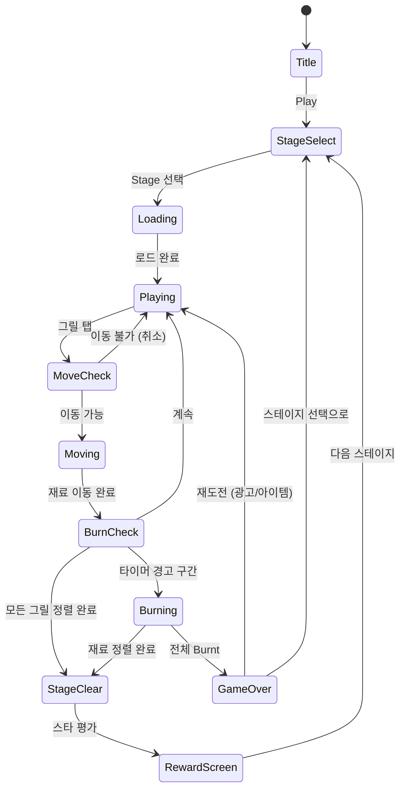

# Grill Sort

> 바비큐 그릴에 뒤섞인 고기와 재료를 종류별로 정렬하는 퍼즐 게임

## 개요

여러 개의 그릴 스테이션에 다양한 재료가 뒤섞여 있다. 플레이어는 재료를 하나씩 옮겨 각 그릴에 **같은 종류의 재료만** 남도록 정렬해야 한다. 시간이 지날수록 재료가 타기 시작하므로 빠른 판단과 이동이 필요하다. 모든 그릴 정렬 완료 시 스테이지 클리어.

---

## 게임 규칙

### 기본 규칙

- 화면에 **4~8개의 그릴 스테이션**이 배치됨
- 각 그릴에는 최대 **4~5개의 재료**가 스택(stack) 형태로 쌓여 있음
- 플레이어는 그릴 탭 → 상단 재료 선택 → 다른 그릴 탭 → 이동
- 이동 가능 조건:
  - 대상 그릴이 **비어 있음**, 또는
  - 대상 그릴 최상단 재료가 **같은 종류**이고, **가득 차지 않음**
- 모든 그릴이 **단일 종류로만 가득 채워지면** 스테이지 클리어

### 재료 종류 (기본 4종 → 최대 8종)

| 아이콘 | 재료 | 색상 코드 |
|--------|------|-----------|
| 🥩 | 소고기 (Beef) | 빨강 |
| 🐷 | 돼지고기 (Pork) | 분홍 |
| 🍗 | 닭고기 (Chicken) | 노랑 |
| 🌽 | 옥수수 (Corn) | 주황 |
| 🦐 | 새우 (Shrimp) | 연분홍 |
| 🍄 | 버섯 (Mushroom) | 갈색 |
| 🧅 | 양파 (Onion) | 보라 |
| 🥦 | 브로콜리 (Broccoli) | 초록 |

> MVP에서는 소고기·돼지고기·닭고기·옥수수 4종으로 시작

### 익힘 단계 (고급 스테이지, Phase 2)

- **Raw** (생) → 파랑 테두리
- **Medium** (중간) → 노랑 테두리
- **Well-done** (잘 익음) → 주황 테두리
- **Burnt** (탄 것) → 검정 테두리 + 연기 이펙트, 자동 제거 페널티

> Phase 1(MVP)에서는 익힘 단계 없이 종류 정렬만 구현

### 타기(Burn) 시스템

- 스테이지 시작 후 **타이머**가 작동
- 남은 시간이 30% 이하가 되면 랜덤 그릴에서 재료가 **연기 이펙트**와 함께 경고 상태로 전환
- 시간 내 미정렬 시 해당 재료 **Burnt** 처리 → 스코어 페널티
- 모든 재료가 Burnt가 되면 **게임 오버**

---

## 게임 플로우



---

## UI 레이아웃

```
┌──────────────────────────────┐
│  ⬅ Back   Lv.12   ⭐⭐☆     │  ← 상단 HUD
│  ⏱ 01:30          🔄 Moves  │
├──────────────────────────────┤
│                              │
│   🔥GRILL 1   🔥GRILL 2     │
│   ┌──────┐   ┌──────┐       │
│   │  🥩  │   │  🍗  │       │  ← 그릴 스테이션
│   │  🐷  │   │  🥩  │       │    (탭하면 선택/이동)
│   │  🍗  │   │  🌽  │       │
│   └──────┘   └──────┘       │
│                              │
│   🔥GRILL 3   🔥GRILL 4     │
│   ┌──────┐   ┌──────┐       │
│   │  🌽  │   │  🐷  │       │
│   │  🐷  │   │  🌽  │       │
│   │  🥩  │   │  🍗  │       │
│   └──────┘   └──────┘       │
│                              │
│   🔥GRILL 5   (Empty)       │
│   ┌──────┐   ┌──────┐       │
│   │  🍗  │   │      │       │  ← 빈 그릴 (버퍼)
│   │  🌽  │   │      │       │
│   └──────┘   └──────┘       │
│                              │
├──────────────────────────────┤
│  ⏪ Undo   💡 Hint   ⏱+30s  │  ← 아이템 바
└──────────────────────────────┘
```

### 선택 상태 UI

- 그릴 탭 시: 테두리 **노란색 하이라이트** + 상단 재료 위로 살짝 이동 (들어올림 애니메이션)
- 이동 가능한 그릴: **초록 테두리** 표시
- 이동 불가 그릴: **빨간 X** 표시 (일시적)

---

## 스코어링 시스템

| 액션 | 점수 |
|------|------|
| 재료 1개 정렬 이동 | +50 |
| 그릴 1개 완성 (단일 종류 채움) | +300 |
| 스테이지 클리어 | +500 |
| 남은 시간 보너스 | 남은초 × 20 |
| 콤보 클리어 (연속 그릴 완성) | +300 × 콤보 |
| Burnt 재료 페널티 | -200 |

### 스타 평가

| 조건 | 스타 |
|------|------|
| 클리어 + 남은 시간 66% 이상 + Burnt 0 | ⭐⭐⭐ |
| 클리어 + 남은 시간 33% 이상 | ⭐⭐ |
| 클리어 (기본) | ⭐ |

---

## 난이도 설계

### 난이도 변수

| 변수 | 설명 |
|------|------|
| 재료 종류 수 | 많을수록 복잡 |
| 그릴 수 | 재료 종류 + 빈 버퍼 그릴 수 |
| 스택 깊이 | 그릴당 쌓인 재료 수 |
| 타이머 | 짧을수록 어려움 |
| 빈 그릴 수 | 적을수록 이동 자유도 낮음 |

### 30레벨 밸런스 표

| 레벨 | 재료 종류 | 그릴 수 | 스택 깊이 | 빈 그릴 | 시간(초) |
|------|-----------|---------|-----------|---------|----------|
| 1–3 | 2 | 4 | 3 | 2 | 120 |
| 4–6 | 3 | 5 | 3 | 2 | 120 |
| 7–9 | 3 | 6 | 4 | 2 | 150 |
| 10–12 | 4 | 6 | 4 | 2 | 150 |
| 13–15 | 4 | 7 | 4 | 1 | 120 |
| 16–18 | 5 | 7 | 4 | 1 | 120 |
| 19–21 | 5 | 8 | 5 | 1 | 90 |
| 22–24 | 6 | 8 | 5 | 1 | 90 |
| 25–27 | 6 | 8 | 5 | 0 | 90 |
| 28–30 | 7–8 | 9 | 5 | 0 | 75 |

> 빈 그릴 0 = 최고 난이도. 모든 이동이 연쇄 계획 필요.

---

## 아이템 시스템

| 아이템 | 효과 | 획득 방법 |
|--------|------|-----------|
| ⏪ Undo | 마지막 이동 1회 취소 | 기본 3회 / 광고 시청으로 +3 |
| 💡 Hint | 최적 다음 이동 1회 표시 (화살표) | 코인 50 / 광고 |
| ⏱ +30s | 타이머 30초 추가 | 코인 30 / 광고 |
| 🔀 Shuffle | 모든 그릴 재료 랜덤 재배치 | 코인 80 |
| 🧲 Magnet | 같은 종류 재료를 한 그릴로 자동 모음 (1회) | 유료 IAP |

---

## 수익화 설계

### 광고 (무료 사용자)

| 노출 포인트 | 광고 종류 | 트리거 |
|-------------|-----------|--------|
| 게임 오버 후 재도전 | 리워드 광고 | 유저 선택 |
| 아이템 무료 획득 | 리워드 광고 | 유저 선택 |
| 스테이지 5개마다 | 인터스티셜 | 자동 (건너뛰기 가능) |

### 인앱 결제 (IAP)

| 상품 | 가격 | 내용 |
|------|------|------|
| 코인 팩 소 | $0.99 | 코인 500 |
| 코인 팩 중 | $2.99 | 코인 2000 |
| 광고 제거 | $1.99 | 영구 광고 제거 |
| 스타터 팩 | $3.99 | 광고 제거 + 코인 1000 + Magnet ×5 |

---

## 사운드 / 이펙트

| 이벤트 | 사운드 | 이펙트 |
|--------|--------|--------|
| 재료 탭 선택 | 지글지글 소리 | 재료 살짝 위로 튕김 |
| 재료 이동 | 슬라이드 소리 | 이동 궤적 파티클 |
| 그릴 완성 | 벨 소리 + 지글 업 | 불꽃 이펙트 + ✨ 파티클 |
| 스테이지 클리어 | 바비큐 축제 BGM | 연기 + 불꽃 전체 연출 |
| 타이머 경고 | 화재 경보음 (반복) | 그릴 빨간 테두리 깜빡임 |
| Burnt 발생 | 탁 하는 소리 | 검은 연기 파티클 |
| 게임 오버 | 슬픈 하강 효과음 | 화면 페이드 아웃 |
| 아이템 사용 | 팝 소리 | 아이템별 고유 이펙트 |

### 배경 요소

- 바비큐 파티 BGM (루프, 경쾌한 여름 느낌)
- 배경: 야외 바비큐 파티 장면, 연기 흘러가는 애니메이션
- 그릴 화염 이펙트: 재료가 쌓일수록 불꽃 커짐

---

## 기술 요구사항 (lib 팀 전달용)

### 핵심 데이터 구조

```typescript
type Ingredient = {
  type: 'beef' | 'pork' | 'chicken' | 'corn' | 'shrimp' | 'mushroom' | 'onion' | 'broccoli';
  burnLevel: 0 | 1 | 2 | 3; // 0=raw, 1=medium, 2=well-done, 3=burnt (Phase2)
};

type Grill = {
  id: number;
  capacity: number;       // 최대 스택 깊이 (4 or 5)
  stack: Ingredient[];    // 아래→위 순서
  isEmpty: boolean;
  isComplete: boolean;    // 단일 종류로 가득 참
};

type Stage = {
  id: number;
  grills: Grill[];
  timeLimit: number;      // 초
  targetIngredients: Ingredient['type'][];
};
```

### 핵심 게임 로직

- `canMove(from: Grill, to: Grill): boolean` — 이동 가능 여부 판단
- `moveIngredient(from: Grill, to: Grill): void` — 재료 이동 + 히스토리 기록
- `undoMove(): void` — 마지막 이동 취소
- `checkStageComplete(grills: Grill[]): boolean` — 클리어 판정
- `getHint(grills: Grill[]): Move` — 최적 다음 이동 계산

---

## MVP 범위

### Phase 1 (MVP — 1~2주 목표)

- [x] 기획서 작성
- [ ] 재료 4종, 그릴 4~6개, 스택 3~4 깊이
- [ ] 탭으로 재료 선택 → 다른 그릴로 이동
- [ ] 이동 가능/불가 판정 로직
- [ ] 타이머 (기본)
- [ ] 스테이지 클리어 / 게임 오버 판정
- [ ] Undo 아이템 (1회)
- [ ] 30 스테이지 레벨 데이터
- [ ] 기본 바비큐 테마 에셋 (심플 폴리곤 스타일)
- [ ] 스타 평가 시스템

### Phase 2 (출시 후 업데이트)

- [ ] 익힘 단계(Burn Level) 시스템
- [ ] Hint / Shuffle / Magnet 아이템
- [ ] 광고 통합 (리워드 + 인터스티셜)
- [ ] IAP 결제 통합
- [ ] 연기·불꽃 파티클 이펙트 고도화
- [ ] 바비큐 BGM / SFX 전체 적용
- [ ] 리더보드 / 소셜 공유
- [ ] 재료 8종 전체 해금
