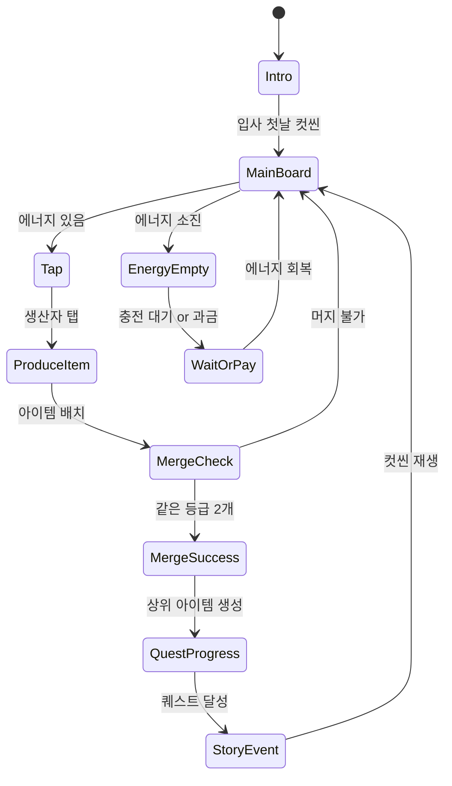

# 헬로 타운 : 신입사원 머지 성공 스토리

> 머지 + 오피스 경영 하이브리드. 신입사원이 합병(머지)을 통해 회사를 성장시키는 스토리.
> `lib/merge-core` 엔진 위에 오피스 테마를 얹은 첫 번째 머지 게임.

---

## 개요

플레이어는 작은 스타트업의 신입사원이 되어, 낡은 사무실 비품들을 **머지**해 업그레이드하고 회사를 성장시킨다.
스토리는 "신입사원의 첫날 → 팀장 → 임원 → CEO"로 이어지며, 머지로 오피스를 발전시킬수록 스토리가 진행된다.

### 핵심 차별화 포인트

- **친숙한 직장 스토리**: 한국 직장인 공감대 (야근, 회의, 커피, 승진)
- **오피스 아이템 머지**: 낡은 컴퓨터 → 최신 PC, 접이식 책상 → 프리미엄 스탠딩 데스크
- **빠른 스토리 진행감**: 매 5~10분마다 스토리 이벤트 발생
- **소셜 공유 포인트**: "나 드디어 CEO 됐다" 스크린샷 유도

---

## 게임 컨셉

| 항목 | 내용 |
|------|------|
| 장르 | 머지 퍼즐 + 경영 시뮬 |
| 테마 | 현대 오피스 / 직장 생활 |
| 타겟 | 20~35세 직장인, 캐주얼 게이머 |
| 세션 길이 | 3~10분 (에너지 소진 기준) |
| 플랫폼 | iOS / Android |

---

## 머지 체인 설계 (오피스 테마)

### 체인 1: 컴퓨터 체인 (메인 생산자)

| 레벨 | 아이템 | 이름 | 특이사항 |
|------|--------|------|----------|
| 1 | 🖥️ | 낡은 모니터 | 기본 생산자 (커피 생산) |
| 2 | 💻 | 중고 노트북 | 생산 속도 +20% |
| 3 | 🖥️✨ | 업무용 PC | 생산 속도 +50% |
| 4 | 💻🔥 | 고사양 워크스테이션 | 생산 속도 2배 |
| 5 | 🚀 | AI 슈퍼컴퓨터 | 자동 생산 활성화 |

### 체인 2: 책상 체인

| 레벨 | 아이템 | 이름 |
|------|--------|------|
| 1 | 🪑 | 접이식 보조 의자 |
| 2 | 🖊️ | 기본 업무 책상 |
| 3 | 📐 | L자형 책상 |
| 4 | 🏢 | 프리미엄 임원 책상 |
| 5 | 👑 | CEO 전용 집무실 |

### 체인 3: 커피 체인 (퀘스트 재료)

| 레벨 | 아이템 | 이름 | 에너지 가치 |
|------|--------|------|------------|
| 1 | ☕ | 자판기 커피 | +1 에너지 |
| 2 | ☕☕ | 아메리카노 | +2 에너지 |
| 3 | ☕👑 | 핸드드립 커피 | +5 에너지 |
| 4 | 🧋 | 프리미엄 콜드브루 | +10 에너지 |
| 5 | 🏆 | 한정판 스페셜티 | +25 에너지 |

### 체인 4: 서류 체인 (퀘스트 재료)

| 레벨 | 아이템 | 이름 |
|------|--------|------|
| 1 | 📄 | 업무 보고서 |
| 2 | 📋 | 기획서 |
| 3 | 📊 | 전략 보고서 |
| 4 | 📈 | 투자 제안서 |
| 5 | 🏆 | 성공 사례집 |

### 체인 5: 직원 체인 (스토리 연동)

| 레벨 | 아이템 | 이름 | 직급 |
|------|--------|------|------|
| 1 | 👤 | 인턴 | - |
| 2 | 👥 | 신입사원 | - |
| 3 | 👔 | 대리 | 팀 미션 해금 |
| 4 | 👔👔 | 팀장 | 부서 확장 해금 |
| 5 | 🎖️ | 임원 | 보너스 수익 |
| 6 | 👑 | CEO | 게임 엔딩 해금 |

---

## 게임 플로우



---

## UI 레이아웃

```
┌─────────────────────────────┐
│  💰 코인: 1,240   ⚡ 12/50   │  ← 상단 HUD
│  [스토리 진행도 ████░░ 60%]  │
├─────────────────────────────┤
│                             │
│  ┌──┐ ┌──┐ ┌──┐ ┌──┐ ┌──┐  │
│  │🖥│ │📄│ │☕│ │🖥│ │  │  │
│  └──┘ └──┘ └──┘ └──┘ └──┘  │
│  ┌──┐ ┌──┐ ┌──┐ ┌──┐ ┌──┐  │  ← 머지 보드
│  │💻│ │  │ │📋│ │☕│ │🖥│  │    (5×7 그리드)
│  └──┘ └──┘ └──┘ └──┘ └──┘  │
│  ┌──┐ ┌──┐ ┌──┐ ┌──┐ ┌──┐  │
│  │  │ │📄│ │💻│ │  │ │📋│  │
│  └──┘ └──┘ └──┘ └──┘ └──┘  │
│     ... (총 5×7 = 35칸)     │
│                             │
├─────────────────────────────┤
│ 현재 퀘스트: 커피 Lv3 × 2   │  ← 퀘스트 바
│ [████░░░░] 보상: 💎 ×3      │
├─────────────────────────────┤
│ [📦보관함]  [🛒상점]  [👤캐릭] │  ← 하단 메뉴
└─────────────────────────────┘
```

---

## 스토리 시스템

### 챕터 구성

| 챕터 | 제목 | 주요 퀘스트 조건 | 보상 |
|------|------|-----------------|------|
| 1 | 첫 출근의 긴장 | 컴퓨터 Lv2 × 1 | 직원 Lv1 × 2 |
| 2 | 첫 야근 | 서류 Lv3 × 2 | 책상 Lv3 |
| 3 | 팀장의 인정 | 컴퓨터 Lv3 + 서류 Lv4 | 직원 Lv3 (대리 승진) |
| 4 | 큰 프로젝트 수주 | 직원 Lv4 + 커피 Lv4 × 3 | 보드 확장 (5→6칸) |
| 5 | 임원 발탁 | 컴퓨터 Lv4 × 2 + 직원 Lv5 | 특수 아이템 해금 |
| 6 | CEO 등극 | 전 체인 Lv5 달성 | 엔딩 + 시즌2 예고 |

### 컷씬 연출 (텍스트 기반 MVP)

```
[챕터 1 클리어 컷씬]
상사: "이번에 입사한 신입이야? 컴퓨터는 잘 다뤄?"
플레이어: (낡은 모니터를 두드리며) "네! 열심히 하겠습니다!"
상사: "그래... 일단 이 보고서나 완성해봐."
→ [퀘스트 해금: 서류 Lv2 × 2 제출]
```

---

## 보드 설계

### 초기 보드 상태 (첫 플레이)

```
5 × 7 = 35칸
- 컴퓨터 Lv1 × 2 (생산자, 고정 배치)
- 빈 칸 × 33
- 첫 실행 시 튜토리얼: 탭 → 생산 → 머지 순서 안내
```

### 보드 확장

| 단계 | 크기 | 해금 조건 |
|------|------|-----------|
| 기본 | 5×7 (35칸) | 시작 |
| 확장 1 | 6×7 (42칸) | 챕터 4 클리어 or 💎 80개 |
| 확장 2 | 6×8 (48칸) | 챕터 6 클리어 or 💎 160개 |

---

## 수익화 설계

### 인앱 상품 구성

| 상품 | 가격 | 내용 | 비고 |
|------|------|------|------|
| 에너지 음료 팩 | ₩1,200 | 에너지 +50 | 충동 구매 유도 |
| 신입사원 스타터 팩 | ₩4,900 | 에너지 200 + 💎 50 + 특수 아이템 | 첫 과금 전환 |
| 월간 직장인 패스 | ₩9,900/월 | 매일 에너지 30 + 광고 제거 + 전용 스킨 | 구독 리텐션 |
| 보관함 확장 | ₩2,400 | 보관함 +10슬롯 (영구) | 1회성 |
| VIP 사원증 | ₩19,900/월 | 에너지 무제한 + 전용 컨텐츠 | 고과금층 |

### 광고 배치

| 위치 | 형식 | 보상 |
|------|------|------|
| 퀘스트 클리어 후 | 리워드 30초 | 보상 2배 |
| 에너지 0 시 | 리워드 30초 | 에너지 +15 |
| 보관함 꽉 찼을 때 | 리워드 30초 | 임시 보관함 확장 1시간 |
| 메인 화면 | 배너 (하단) | - (과금 시 제거) |

---

## 난이도 밸런스

### 에너지 소비 설계

```
- 에너지 최대치: 50
- 자연 회복: 5분당 1 (만충까지 250분 = 4시간 10분)
- 생산자 1회 탭: 에너지 1 소비
- 평균 세션: 에너지 20~30 소비 → 세션 길이 3~8분
- 하루 자연 회복량: 약 288 에너지 → 약 6~9회 세션
```

### 머지 체인 진행 속도

| 기간 | 목표 도달 레벨 | 비고 |
|------|---------------|------|
| D1 | 컴퓨터 Lv3 | 챕터 1~2 완료 |
| D3 | 컴퓨터 Lv4 | 챕터 3 완료 |
| D7 | 컴퓨터 Lv5 | 챕터 4~5 완료 |
| D14 | 전 체인 Lv4+ | 챕터 5~6 진행 중 |
| D30 | CEO 엔딩 | 과금 없이 달성 가능 목표 |

---

## 사운드 / 이펙트

| 이벤트 | 사운드 | 비주얼 이펙트 |
|--------|--------|--------------|
| 아이템 탭 | 클릭음 | 아이템 바운스 |
| 머지 성공 | 팡! 효과음 | 빛 이펙트 + 파티클 |
| 레벨업 아이템 등장 | 상승음 | 스케일 업 애니메이션 |
| 퀘스트 완료 | 팡파레 | 전체 화면 플래시 |
| 스토리 이벤트 | BGM 전환 | 캐릭터 슬라이드인 |
| 에너지 소진 | 낮은 알림음 | 에너지 바 흔들림 |
| 과금 유도 팝업 | 코인 효과음 | 골든 팝업 |

---

## MVP 범위

### Phase 1 - 핵심 루프 (1주)
- [ ] `lib/merge-core` 엔진 구현 의뢰 (Game Core 팀)
- [ ] 오피스 테마 IThemeConfig 작성
- [ ] 컴퓨터/커피/서류 체인 (Lv1~5) × 3개
- [ ] 5×7 보드, 생산자 2개 배치
- [ ] 머지 기본 인터랙션 (드래그 앤 드롭 or 탭-탭)
- [ ] 에너지 소비/회복 시스템
- [ ] 퀘스트 3개 (챕터 1)
- [ ] 로컬 저장

### Phase 2 - 스토리 + 수익화 (3~5일)
- [ ] 챕터 1~3 스토리 컷씬 (텍스트 기반)
- [ ] 보관함 시스템
- [ ] AdMob 리워드 광고 연동
- [ ] 인앱 결제 (에너지 팩)

### Phase 3 - 폴리시 (2~3일)
- [ ] 사운드/이펙트 추가
- [ ] 온보딩 튜토리얼
- [ ] 챕터 4~6
- [ ] 월간 패스 구독

---

## 기술 스택 연동

```
lib/merge-core (Phaser.io 기반 엔진)
       ↓
web/hello-town (React + Stitches UI, Phaser Scene 통합)
       ↓
hello-town/rn  (RN WebView 래핑, 인앱결제/광고 브릿지)
```

### RN 브릿지 이벤트 목록

| 이벤트 | 방향 | 설명 |
|--------|------|------|
| `REQUEST_AD_REWARD` | Web → RN | 리워드 광고 요청 |
| `AD_REWARD_COMPLETE` | RN → Web | 광고 시청 완료, 보상 지급 |
| `REQUEST_PURCHASE` | Web → RN | 인앱 결제 요청 |
| `PURCHASE_COMPLETE` | RN → Web | 결제 완료, 아이템 지급 |
| `SAVE_DATA` | Web → RN | 로컬 저장 (AsyncStorage) |
| `LOAD_DATA` | RN → Web | 저장 데이터 전달 |
