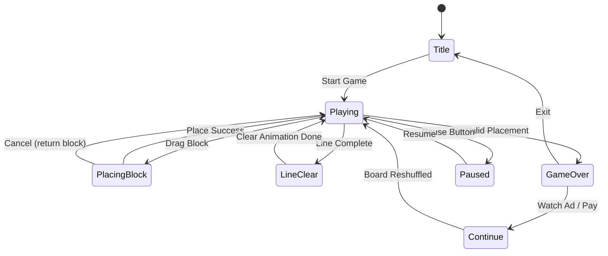

# Hexa Away

> 육각형 타일 블록 퍼즐 — 3방향 라인 클리어

## 개요

헥사고날 그리드 위에 다양한 모양의 헥사 블록을 배치하고, 완성된 라인을 제거하는 퍼즐 게임.
정사각형 그리드와 달리 **3축 방향 라인 클리어**가 가능하여 전략적 깊이가 높다.

- **장르**: Block Puzzle (1010! 스타일 + 헥사 그리드)
- **플레이 방식**: 끝없는(endless) 스테이지 → 놓을 공간이 없으면 게임 오버
- **타겟**: 캐주얼 퍼즐 유저, 10~40대

---

## 1. 코어 메카닉

### 기본 게임 루프

```
블록 3개 제공 → 보드에 드래그&드롭 → 라인 완성 시 자동 클리어 → 점수 획득
→ 3개 모두 배치되면 새 블록 3개 제공 → 반복
→ 배치 불가 시 게임 오버
```

### 세부 규칙

| 규칙 | 내용 |
|------|------|
| 블록 제공 | 매 턴 3개 (동시 표시, 순서 자유) |
| 배치 조건 | 비어 있는 셀에만 배치 가능 |
| 라인 클리어 | 3축 중 하나라도 완성되면 즉시 클리어 |
| 멀티 클리어 | 동시에 여러 라인 클리어 시 콤보 보너스 |
| 게임 오버 | 제공된 3개 블록 중 어느 것도 배치 불가 |
| 점수 | 배치 셀 수 + 클리어 셀 수 + 콤보 보너스 |

### 그리드 크기

| 옵션 | 크기 | 총 셀 수 | 라인 수 | 난이도 |
|------|------|----------|---------|--------|
| Standard | 반지름 4 (r=4) | 61 셀 | 9+9+9=27 | 기본 |
| Large | 반지름 5 (r=5) | 91 셀 | 11+11+11=33 | 여유 |

> MVP는 **반지름 4 (61셀)** 고정

---

## 2. 육각 그리드 특수성

### 좌표계: Cube Coordinates

헥사 그리드의 표준 좌표계. `q + r + s = 0` 항등식 성립.

```
     q축 →
   s축 ↗   r축 ↘

      (-2,0,+2) (-1,-1,+2) (0,-2,+2)
   (-2,+1,+1) (-1,0,+1) (0,-1,+1) (+1,-2,+1)
(-2,+2,0) (-1,+1,0) (0,0,0) (+1,0,-1) (+2,-2,0)
   (-1,+2,-1) (0,+1,-1) (+1,+1,-2) (+2,-1,-1)
      (0,+2,-2) (+1,+2,-3) (+2,+1,-3)
```

### 6방향 인접

```
     NW  NE
   W  (·)  E
     SW  SE
```

| 방향 | dq | dr | ds |
|------|----|----|----|
| E    | +1 | -1 |  0 |
| W    | -1 | +1 |  0 |
| NE   | +1 |  0 | -1 |
| SW   | -1 |  0 | +1 |
| NW   |  0 | -1 | +1 |
| SE   |  0 | +1 | -1 |

### 픽셀 변환 (Pointy-Top 방향 권장)

```
x = size * (√3 * q  +  √3/2 * r)
y = size * (          3/2  * r)
```

> **Pointy-Top 선택 이유**: 수평 라인이 가로로 뻗어 자연스럽고,
> 모바일 세로 화면에서 좌우 공간 활용 효율이 좋음.

---

## 3. 행(라인) 클리어 규칙

헥사 그리드는 **3축 방향**으로 라인을 정의한다. 정사각형의 가로/세로 2방향보다 많아 전략적.

### 3축 라인 정의

| 축 | 고정 변수 | 방향 | 설명 |
|----|---------|------|------|
| Q축 (수직) | q = 상수 | 위-아래 대각선 | q값이 같은 모든 셀 |
| R축 (역대각선) | r = 상수 | 왼-아래 대각선 | r값이 같은 모든 셀 |
| S축 (수평) | s = 상수 | 수평 (좌-우) | s값이 같은 모든 셀 |

### 라인 길이 (반지름 4 기준)

| s 또는 q 또는 r 값 | 셀 수 |
|-------------------|-------|
| 0                 | 9     |
| ±1                | 8     |
| ±2                | 7     |
| ±3                | 6     |
| ±4                | 5     |

> 라인마다 길이가 다름 → 짧은 라인이 먼저 채워짐 → **모서리 전략** 중요

### 라인 클리어 시각화

```
  S축 라인 (수평, s=0):
  ○─○─○─○─○─○─○─○─○  ← 9셀 모두 채우면 클리어

  Q축 라인 (q=0):
      ○
     ○
    ○
   ○
  ○  ← 수직 대각선

  R축 라인 (r=0):
  ○
   ○
    ○
     ○
      ○  ← 역 대각선
```

### 멀티 라인 콤보

- 1개 클리어: 기본 점수
- 2개 동시: ×1.5 보너스
- 3개 동시: ×2.5 보너스 (Perfect!)
- 4개 이상: ×4 보너스 (Hexa Clear!)

---

## 4. Phaser.io 헥사 그리드 구현

### 핵심 구현 전략

Phaser의 내장 `Phaser.Tilemaps` 헥사 지원은 단순 렌더링 용도. 게임 로직은 **커스텀 Cube Coordinate 클래스**로 별도 관리.

### 필수 클래스 설계

```typescript
// HexGrid.ts — 그리드 상태 관리
class HexGrid {
  radius: number;          // 4
  cells: Map<string, CellState>;  // "q,r,s" → state

  getNeighbors(q, r, s): HexCoord[];
  getLine(axis: 'q'|'r'|'s', value: number): HexCoord[];
  isLineFull(axis, value): boolean;
  clearLine(axis, value): HexCoord[];
  canPlacePiece(piece: HexPiece, origin: HexCoord): boolean;
  placePiece(piece: HexPiece, origin: HexCoord): void;
}

// HexPiece.ts — 블록 모양 정의
class HexPiece {
  cells: HexCoord[];   // 원점 기준 상대 좌표
  color: number;

  getRotated(steps: number): HexPiece;
  getBoundingBox(): { width, height };
}

// HexRenderer.ts — Phaser Scene 렌더링
class HexRenderer {
  hexSize: number;         // 픽셀 크기
  originX, originY: number;

  hexToPixel(q, r, s): {x, y};
  pixelToHex(x, y): HexCoord;
  drawGrid(grid: HexGrid): void;
  drawPiece(piece: HexPiece, origin: HexCoord): void;
  animateClear(cells: HexCoord[]): void;
}
```

### Phaser 씬 구조

```
MainScene
├── HexGrid (데이터 레이어)
├── HexRenderer (Phaser Graphics/Polygon)
├── PieceQueue (다음 3개 블록 관리)
├── DragSystem (드래그 인터랙션)
└── ScoreSystem
```

### 헥사 타일 렌더링

```typescript
// Pointy-Top 육각형 꼭짓점 계산
function hexagonPoints(cx: number, cy: number, size: number): number[] {
  const points = [];
  for (let i = 0; i < 6; i++) {
    const angle = Math.PI / 180 * (60 * i - 30); // pointy-top
    points.push(cx + size * Math.cos(angle));
    points.push(cy + size * Math.sin(angle));
  }
  return points;
}

// Phaser.GameObjects.Polygon 으로 렌더
const hex = scene.add.polygon(cx, cy, points, fillColor, 1.0);
hex.setStrokeStyle(1, 0x000000);
```

### 드래그 & 드롭 구현

1. 터치/클릭 시작 → 블록 픽업 (원본 위치에 고스트 표시)
2. 드래그 중 → `pixelToHex()` 로 가장 가까운 셀 계산 → 배치 가능 여부 하이라이트
3. 드롭 → `canPlacePiece()` 확인 → 배치 또는 원위치 반환
4. 배치 후 → 라인 체크 → 클리어 애니메이션 → 점수 갱신

---

## 5. 블록 종류

### 기본 원칙

- **1~4셀** 구성 블록
- 다양한 방향/형태로 회전 가능 (60도 단위, 6방향)
- MVP는 회전 없이 고정 방향으로 제공 (단순화)
- 블록 색상으로 시각적 구분

### 블록 카탈로그

```
[1셀]
  ●        Single

[2셀]
  ●●       Duo-E (동-서 방향)
  ●         Duo-SE (동남 방향)
   ●

[3셀 - 직선]
  ●●●      Line-3 (수평)

[3셀 - 꺾임]
  ●●       Bend-R
   ●

   ●●      Bend-L
  ●

  ●        Triangle
  ●●

[4셀 - 직선]
  ●●●●    Line-4

[4셀 - L자]
  ●        L-shape
  ●
  ●●

[4셀 - T자 (헥사)]
   ●
  ●●●     T-Hex

[4셀 - 다이아]
   ●
  ●●      Diamond
   ●
```

### 블록 등장 확률

| 크기 | 등장 확률 | 이유 |
|------|----------|------|
| 1셀 | 10% | 막힐 때 구원 역할 |
| 2셀 | 25% | 유연한 배치 |
| 3셀 | 45% | 핵심 볼륨 |
| 4셀 | 20% | 고점수 기회 |

### 난이도별 블록 풀 조정

| 레벨 | 최대 블록 크기 | 4셀 확률 |
|------|-------------|---------|
| 초반 (0~1000점) | 3셀 | 0% |
| 중반 (1000~5000점) | 4셀 | 10% |
| 후반 (5000점+) | 4셀 | 20% |

---

## 6. 수익화 전략

### 아이템 체계

| 아이템 | 기능 | 일일 무료 | 유료 획득 |
|--------|------|-----------|-----------|
| **힌트 (Hint)** | 현재 블록이 놓일 수 있는 최적 위치 강조 표시 (3초) | 3회 | 💎 50 |
| **되돌리기 (Undo)** | 마지막 배치 블록 회수 (게임 오버 직전 1회 무료) | 1회 | 💎 80 |
| **블록 교체 (Swap)** | 현재 3개 블록 세트를 새 3개로 교체 | 1회 | 💎 100 |
| **한 칸 지우기 (Erase)** | 보드에서 셀 1개 제거 | 0회 | 💎 120 |
| **게임 오버 연장 (Continue)** | 게임 오버 시 1회 보드 재배치 | 0회 | 광고 시청 or 💎 200 |

### 다이아몬드(💎) 가격표

| 패키지 | 💎 수량 | 가격 |
|--------|---------|------|
| Starter | 500 | $0.99 |
| Value | 1,200 | $1.99 |
| Best | 3,000 | $3.99 |
| Premium | 6,500 | $7.99 |

### 광고 수익화

| 위치 | 빈도 | 형태 |
|------|------|------|
| 게임 오버 시 | 항상 | 보상형 (Continue 기회) |
| 아이템 무료 충전 | 일 1회 | 보상형 (광고 시청 → 힌트 3개) |
| 인터스티셜 | 5판마다 | 강제 15초 |

### CPI 목표 (데이터 드리븐)

| 지표 | 목표 |
|------|------|
| CPI | $0.50 이하 |
| D1 리텐션 | 40% 이상 |
| D7 리텐션 | 20% 이상 |
| ARPU (30일) | $0.20 이상 |

---

## 게임 플로우



---

## UI 레이아웃

```
┌─────────────────────────────┐
│  ⭐ 12,450    🏆 Best: 18,200│  ← 현재 점수 / 최고 점수
├─────────────────────────────┤
│                             │
│         헥사 그리드          │
│       (반지름 4, 61셀)       │
│                             │
│    ⬡ ⬡ ⬡ ⬡ ⬡            │
│   ⬡ ⬡ ⬡ ⬡ ⬡ ⬡           │
│  ⬡ ⬡ ⬡ ⬡ ⬡ ⬡ ⬡          │
│   ⬡ ⬡ ⬡ ⬡ ⬡ ⬡           │
│    ⬡ ⬡ ⬡ ⬡ ⬡            │
│                             │
├─────────────────────────────┤
│   [블록1]  [블록2]  [블록3]  │  ← 다음 3개 블록 (드래그)
├─────────────────────────────┤
│  💡 Hint  ↩ Undo  🔄 Swap  │  ← 아이템 버튼
└─────────────────────────────┘
```

---

## 스코어링 시스템

| 액션 | 점수 |
|------|------|
| 블록 배치 (셀당) | +10 × 셀 수 |
| 라인 클리어 (셀당) | +50 × 클리어 셀 수 |
| 2라인 동시 클리어 | +200 보너스 |
| 3라인 동시 클리어 | +500 보너스 |
| 4라인+ 동시 클리어 | +1,000 보너스 |

---

## 사운드/이펙트

| 이벤트 | 사운드 | 이펙트 |
|--------|--------|--------|
| 블록 배치 | 클릭/톡 | 셀 채워짐 애니 |
| 라인 클리어 | 청량한 sweep | 셀 터지며 사라짐 |
| 콤보 클리어 | 상승 톤 | 파동 이펙트 |
| 게임 오버 | 저음 실패 | 화면 흔들림 |
| 아이템 사용 | 마법 효과음 | 반짝임 |

---

## MVP 범위

### Phase 1 (Week 1 — 코어 완성)
- [x] 기획서 작성
- [ ] HexGrid 데이터 구조 구현 (Cube Coordinates)
- [ ] Phaser Polygon 기반 헥사 타일 렌더링
- [ ] 블록 정의 (1~3셀 12종)
- [ ] 드래그&드롭 배치 로직
- [ ] 3축 라인 클리어 로직
- [ ] 게임 오버 판정
- [ ] 기본 점수 시스템

### Phase 2 (Week 2 — 폴리시 + 수익화)
- [ ] 블록 4셀 추가
- [ ] 콤보 시스템 + 보너스
- [ ] 힌트 / 되돌리기 아이템
- [ ] 클리어 애니메이션 (파티클)
- [ ] 최고 점수 저장 (localStorage)
- [ ] 광고 연동 (게임 오버 Continue)
- [ ] 사운드/이펙트
- [ ] RN WebView 래핑

---

## 7. 결론: 헥사 퍼즐 차별성 vs 구현 복잡도

### 차별점

| 항목 | 정사각형 퍼즐 (1010!) | Hexa Away |
|------|----------------------|-----------|
| 라인 방향 | 2 (가로/세로) | **3 (Q/R/S 3축)** |
| 전략 깊이 | 중간 | **높음 — 3축 교차 콤보** |
| 시각적 독특함 | 보통 | **높음 — 헥사 비주얼** |
| 친숙도 | 높음 | 중간 |

### 구현 복잡도 평가

| 항목 | 난이도 | 비고 |
|------|--------|------|
| Cube 좌표 수학 | ★★★☆☆ | 공식화되어 있음 (redblobgames 참고) |
| Phaser 헥사 렌더링 | ★★★☆☆ | Polygon 직접 그리기 |
| 라인 클리어 로직 | ★★☆☆☆ | 3축 for loop |
| 드래그&드롭 | ★★★☆☆ | 픽셀→헥사 좌표 변환 |
| 블록 배치 검증 | ★★☆☆☆ | 단순 충돌 체크 |
| **전체** | **★★★☆☆** | **1~2주 MVP 충분히 가능** |

### 판단

> **Go. 출시 권장.**
>
> - 구현 복잡도: 중간 (주 리스크는 헥사 좌표 수학이나, 공식이 잘 정립됨)
> - 시장성: 블록 퍼즐 장르는 검증된 고수요 장르 (상위 0.1% 매출)
> - 차별화: 헥사 그리드는 구글플레이 상위권에서도 희소 → CPI 경쟁력 有
> - 1주 코어 + 1주 폴리시로 출시 가능한 MVP 범위

### 참고 자료

- [Hexagonal Grids (redblobgames)](https://www.redblobgames.com/grids/hexagons/) — 헥사 수학의 바이블
- [Phaser Tilemaps — Hexagonal](https://phaser.io/examples/v3/view/tilemap/hexagonal) — Phaser 헥사 예제
- 레퍼런스: Hexa Away (GOODROID,Inc.), Hex FRVR, Hexologic
