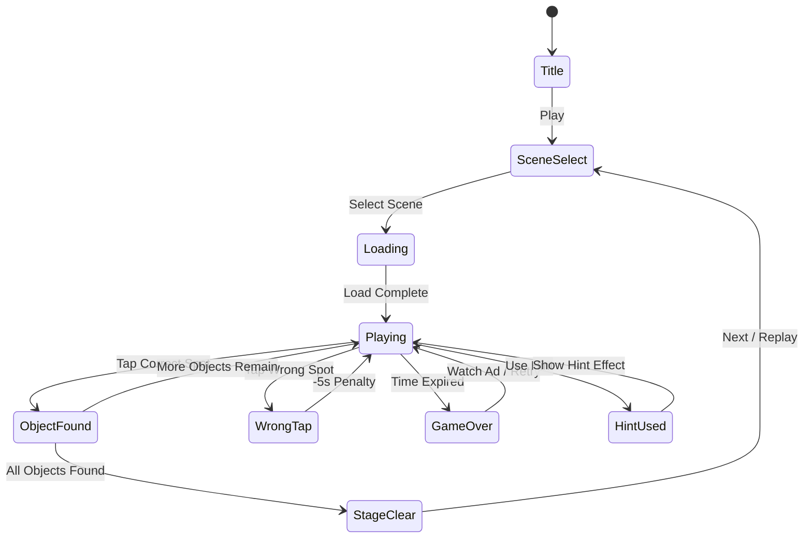

# Hidden Object — 숨은그림찾기

> 복잡한 장면 속에서 지정된 오브젝트를 찾아 탭하는 숨은그림찾기 게임.
> 에셋 의존도가 높지만 평점 4.9의 검증된 장르. AI 생성 에셋으로 빠르게 조달 가능.

## 개요

화면에 복잡하게 구성된 장면 이미지가 표시된다. 하단에 찾아야 할 오브젝트 목록이 주어지고,
플레이어는 장면을 탐색하며 해당 오브젝트를 탭하여 찾는다. 제한 시간 내에 모든 오브젝트를
찾으면 스테이지 클리어.

## 게임 규칙

### 기본 규칙

- 장면 이미지 위에 **5~15개 오브젝트**가 숨겨져 있음
- 하단 리스트에 찾아야 할 오브젝트 이름/실루엣 표시
- 오브젝트 위치를 탭하면 정답 판정 (허용 반경: 난이도별 조정)
- 잘못된 위치 탭 시 **패널티**: 시간 -5초 (또는 점수 감점)
- 제한 시간 내 전체 오브젝트 발견 시 **스테이지 클리어**
- 시간 초과 시 **게임 오버**

### 오브젝트 탐지 판정

```
탭 좌표와 오브젝트 중심 좌표 거리 ≤ 허용 반경 → 정답
허용 반경: Easy=60px, Normal=40px, Hard=25px (논리 좌표 기준)
```

### 핀치줌 & 스크롤

- 장면 이미지는 **1x~3x** 줌 지원
- 줌 인 시 스크롤로 장면 탐색 가능
- 줌 아웃 버튼 또는 핀치아웃으로 전체 보기 복귀
- Phaser.io `Camera.zoom` + 드래그 컨트롤로 구현

## 장면 설계

### 테마 목록 (10장면 MVP)

| # | 테마 | 오브젝트 수 | 난이도 |
|---|------|-------------|--------|
| 1 | 어지러운 방 (Messy Room) | 8 | Easy |
| 2 | 주방 (Kitchen) | 8 | Easy |
| 3 | 정원 (Garden) | 10 | Normal |
| 4 | 도서관 (Library) | 10 | Normal |
| 5 | 해변 (Beach) | 10 | Normal |
| 6 | 마법사의 실험실 (Wizard Lab) | 12 | Normal |
| 7 | 야시장 (Night Market) | 12 | Hard |
| 8 | 해적선 (Pirate Ship) | 12 | Hard |
| 9 | 크리스마스 거실 (Christmas) | 15 | Hard |
| 10 | 고대 유적 (Ancient Ruins) | 15 | Hard |

### 장면 이미지 스펙

- 해상도: **2048×1536px** (4:3, iPad 기준, 모바일은 크롭)
- 형식: WebP (품질 85%, 파일 크기 200KB~400KB 목표)
- 오브젝트 크기: 전체 이미지 대비 **2%~8%** (너무 작으면 플레이 불가)

## 에셋 파이프라인

### JSON 데이터 구조

```json
{
  "sceneId": "messy-room",
  "sceneName": "어지러운 방",
  "imageUrl": "scenes/messy-room.webp",
  "imageWidth": 2048,
  "imageHeight": 1536,
  "timeLimit": 120,
  "objects": [
    {
      "id": "obj-001",
      "name": "빨간 자전거",
      "nameEn": "Red Bicycle",
      "x": 342,
      "y": 890,
      "radius": 55,
      "silhouetteUrl": "silhouettes/red-bicycle.webp"
    }
  ]
}
```

### 좌표 등록 도구

- 간단한 웹 기반 어드민 툴: 이미지 위에 클릭 → 좌표 자동 기록
- 또는 스프레드시트(Google Sheets)로 수동 관리 후 JSON 변환 스크립트
- `scripts/coords-editor.html` — 단순 HTML+JS, 별도 서버 불필요

## 에셋 조달 전략 (핵심)

에셋 의존도가 높은 이 장르에서 **속도가 핵심**. 3가지 조달 레이어를 병행한다.

### Layer 1: AI 생성 (1~3일, 무료~저비용)

| 도구 | 용도 | 비용 |
|------|------|------|
| Midjourney / DALL-E 3 | 장면 배경 이미지 생성 | $10~30/월 |
| Stable Diffusion (로컬) | 대량 실루엣 이미지 | 무료 |
| Adobe Firefly | 상업용 라이선스 보장 배경 | CC 구독 |

**프롬프트 전략**:
```
"cluttered messy room interior, isometric view, flat illustration style,
vibrant colors, many hidden objects, no text, game asset, high detail"
```

### Layer 2: 무료 스톡 에셋 (즉시 사용 가능)

- **Freepik / Flaticon**: 일러스트 장면 (CC BY 라이선스)
- **OpenGameArt.org**: 게임 전용 무료 에셋
- **Pixabay / Unsplash**: 실사 배경 (상업용 무료)
- **Kenney.nl**: 아이콘/오브젝트 세트 (CC0)

### Layer 3: 외주 (필요시 보완)

- Fiverr: 장면 1개당 $50~150 (3~5일 소요)
- 10장면 외주 예산: ~$800 (최후 수단)

### MVP 에셋 조달 계획 (1주일)

```
Day 1-2: AI로 10개 장면 배경 생성 + 선별
Day 3:   Freepik에서 오브젝트 아이콘 200개 다운로드
Day 4:   좌표 등록 (장면당 30분 × 10 = 5시간)
Day 5:   실루엣 이미지 생성 (Stable Diffusion 배치)
```

## UI 레이아웃

```
┌─────────────────────────────┐
│ ⏱ 01:45   🔍 8/12   💡 ×2  │  ← 상단 HUD (타이머, 진행도, 힌트수)
├─────────────────────────────┤
│                             │
│    [   장면 이미지 영역   ]  │  ← 핀치줌/스크롤 가능
│    [  2048×1536 캔버스   ]  │    오브젝트 탭 감지
│                             │
│              🔍 [-]  [전체] │  ← 줌 컨트롤 (우하단)
├─────────────────────────────┤
│ 찾을 것: [🚲][🎩][🕯️][📚] │  ← 오브젝트 리스트 (발견시 ✓)
│          [🌂][❓][❓][❓] │    미발견은 실루엣 표시
└─────────────────────────────┘
```

### 오브젝트 발견 피드백

- 정답: 오브젝트 위에 **원형 파티클 효과** + 체크마크 오버레이
- 오답 탭: 화면 **빨간 테두리 플래시** + 진동 (햅틱)
- 마지막 오브젝트: **스테이지 클리어 애니메이션**

## 힌트 시스템

### 힌트 타입

| 타입 | 효과 | 비용 |
|------|------|------|
| 구역 힌트 | 오브젝트가 있는 화면 1/9 구역 강조 (3초) | 힌트 1개 |
| 글로우 힌트 | 오브젝트 주변 빛나는 원형 효과 (2초) | 힌트 2개 |
| 자동 완성 | 오브젝트 자동 선택 (1개) | 힌트 5개 |

### 힌트 획득

- 스테이지 시작 시 기본 **2개** 지급
- 광고 시청 → **+3개** 지급 (주요 수익원)
- IAP: 힌트팩 10개 ($0.99), 30개 ($1.99)

## 스코어링 시스템

| Action | Score |
|--------|-------|
| 오브젝트 발견 | +200 |
| 빠른 발견 보너스 (5초 내) | +100 |
| 노힌트 클리어 | +500 |
| 시간 보너스 | 남은초 × 5 |
| 잘못된 탭 패널티 | -50 |

### 별점 기준 (스테이지별)

| 별점 | 조건 |
|------|------|
| ⭐⭐⭐ | 힌트 0개, 시간 50% 이상 남김 |
| ⭐⭐ | 힌트 1개 이하, 클리어 |
| ⭐ | 클리어 (조건 미달) |

## 난이도 설계

| Level | 오브젝트 수 | 시간(초) | 탭 허용 반경 | 오브젝트 크기 |
|-------|-------------|----------|--------------|---------------|
| Easy | 8 | 180 | 60px | 크게 (4~8%) |
| Normal | 10~12 | 120 | 40px | 중간 (3~6%) |
| Hard | 12~15 | 90 | 25px | 작게 (2~4%) |

### 은폐 기법 (장면 디자인 가이드)

- **색상 혼합**: 오브젝트와 배경 색이 유사 (예: 갈색 책상 위 갈색 열쇠)
- **부분 가림**: 다른 오브젝트 뒤에 일부만 보임
- **예상 외 위치**: 위쪽 선반, 창문 밖 등
- **작은 크기**: 줌인 필요한 오브젝트 1~2개 배치

## 게임 플로우



## 수익화 전략

### 핵심 수익 구조

```
힌트 광고 (인터스티셜)  →  주 수익원 (DAU × 2~3회/일)
장면팩 IAP             →  $1.99~$3.99/팩 (5장면)
배너 광고              →  하단 고정 (플레이 중 제외)
```

### 장면 팩 구조

| 팩 | 테마 | 가격 | 장면 수 |
|----|------|------|---------|
| 기본팩 (무료) | 방, 주방, 정원 | Free | 3 |
| 모험팩 | 해적선, 유적, 정글 | $1.99 | 5 |
| 판타지팩 | 마법 성, 요정숲, 용의 동굴 | $1.99 | 5 |
| 시즌팩 | 크리스마스, 할로윈 등 | $0.99 | 3 |

### LTV 극대화

- 무료 3장면으로 후킹 → 광고 시청 유도 → IAP 전환
- 시즌 팩으로 재방문 유도 (크리스마스, 할로윈)
- 리더보드 + 소셜 공유 (바이럴)

## 기술 구현 노트 (개발팀용)

### Phaser.io 핵심 구현

```
Scene Image: Phaser.GameObjects.Image (2048×1536)
Camera Zoom: this.cameras.main.setZoom(scale)
Pinch Zoom: Phaser.Input.Pointer (distance 계산)
Object Hitbox: Phaser.Geom.Circle (x, y, radius)
Tap Detection: scene.input.on('pointerdown', handler)
Particle Effect: Phaser.GameObjects.Particles
```

### 데이터 로딩 전략

- 장면 JSON: 앱 번들에 포함 (오프라인 지원)
- 장면 이미지: CDN에서 on-demand 로드 (첫 플레이 시 캐시)
- 오프라인 플레이: 다운로드된 팩만 가능

### 성능 최적화

- 이미지 Lazy Load: 현재 장면 + 다음 1개만 메모리에
- WebP 사용으로 PNG 대비 30~50% 용량 절감
- 줌 시 LOD(Level of Detail): 줌 1x는 저해상도, 3x는 고해상도

## 사운드/이펙트

| 이벤트 | 효과 |
|--------|------|
| 오브젝트 발견 | 경쾌한 "딩동" + 파티클 폭발 |
| 잘못된 탭 | 낮은 "뚝" + 빨간 플래시 |
| 힌트 사용 | 마법 글로우 이펙트 |
| 스테이지 클리어 | 팡파레 + 별 애니메이션 |
| 게임 오버 | 시계 소리 → 실패 사운드 |
| BGM | 테마별 잔잔한 앰비언트 (반복 루프) |

## MVP 범위

### Phase 1 MVP (1주일 목표)

- [x] 기획서 작성
- [ ] 에셋 조달 (AI 생성 3장면 + 좌표 등록)
- [ ] 기본 장면 렌더링 + 탭 감지
- [ ] 오브젝트 정답/오답 판정
- [ ] 핀치줌 + 스크롤
- [ ] 힌트 (구역 힌트 1종)
- [ ] 타이머 + 클리어/실패 판정
- [ ] 3장면 (Easy 2 + Normal 1)

### Phase 2 (2주차)

- [ ] 광고 연동 (힌트 광고)
- [ ] 7장면 추가 (총 10장면)
- [ ] 스코어 + 별점 시스템
- [ ] 장면 선택 UI
- [ ] 실루엣 힌트 + 글로우 힌트

### Phase 3 (런칭 후)

- [ ] IAP (장면팩)
- [ ] 리더보드
- [ ] 시즌 팩

## 경쟁 분석 & 차별화

| 요소 | 경쟁작 | 우리 게임 |
|------|--------|-----------|
| 에셋 품질 | 정교한 수작업 일러스트 | AI 생성 (빠름) |
| 장면 수 | 50~200개 | 10개 (MVP) |
| 핵심 차별화 | - | 한국어 최적화, 가벼운 용량 |

> **핵심 인사이트**: 이 장르의 플레이어는 **에셋 품질보다 콘텐츠 양**에 민감.
> MVP 10장면으로 검증 후, 주 2~3장면 업데이트 루틴을 만드는 것이 핵심 전략.
