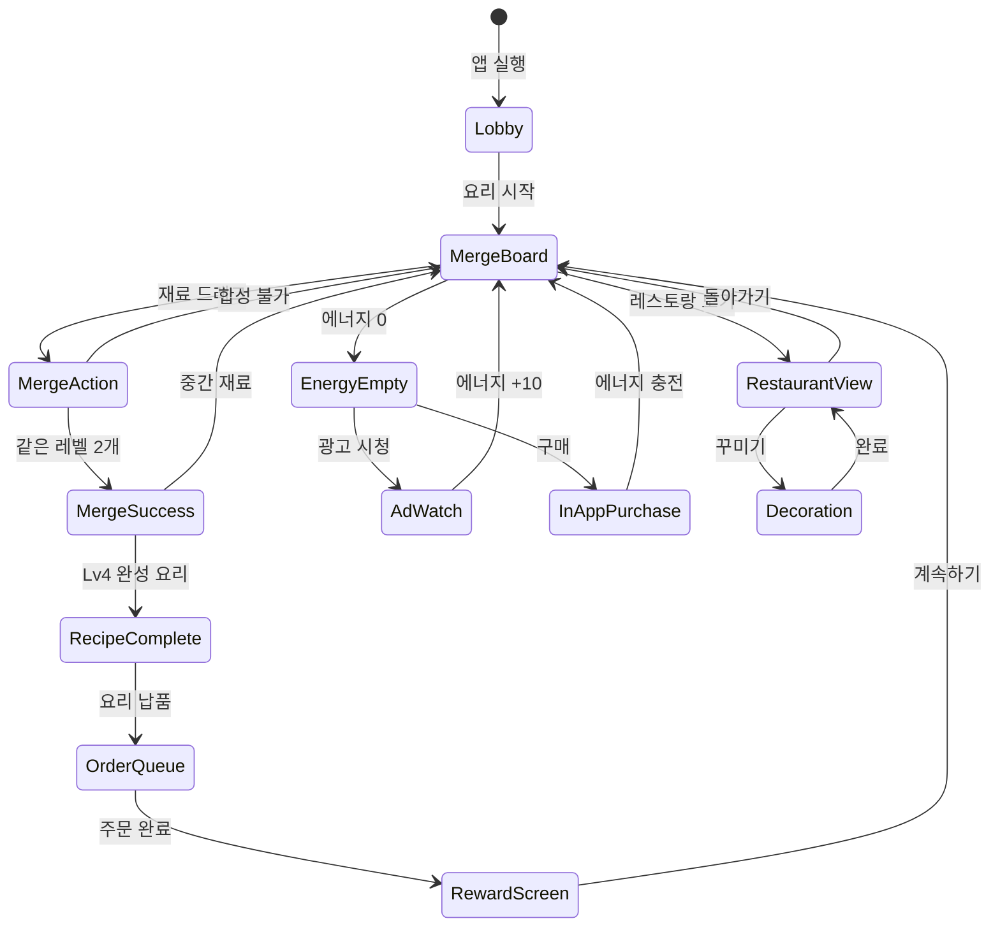

# 핫레스토랑: 머지&쿠킹

> 요리와 머지(합성)가 결합된 하이브리드 캐주얼 게임.
> 재료를 합성해 요리를 만들고, 고객 주문을 처리하며 레스토랑을 성장시킨다.

---

## 개요

| 항목 | 내용 |
|------|------|
| 장르 | 머지 + 레스토랑 경영 하이브리드 |
| 레퍼런스 | 핫레스토랑: 머지&쿠킹 (Microfun Limited, 평점 4.8, 랭크 #18) |
| 타겟 유저 | 캐주얼 게이머, 20~40대 여성 |
| 핵심 재미 | 재료 합성의 퍼즐 쾌감 + 주문 처리의 운영 긴장감 |
| 개발 목표 | MVP 1~2주, 머지 코어 + 5가지 레시피 + 간단한 주문 시스템 |

### 핵심 재미 루프 (Core Loop)

```
[에너지 소비] → [재료 획득] → [머지 보드에서 합성] → [요리 완성]
      ↑                                                        ↓
[에너지 충전]                                        [고객 주문 납품]
      ↑                                                        ↓
[시간 대기 or 과금]  ←←←←←←←←←←←←←←←←←←←←←←  [코인/경험치 획득]
                                                               ↓
                                              [레스토랑 업그레이드/꾸미기]
```

---

## 게임 규칙

### 1. 코어 머지 시스템

#### 머지 체인 (합성 단계)
재료는 같은 레벨 2개를 합치면 다음 단계로 진화한다.

```
Lv1 재료 + Lv1 재료 → Lv2 재료
Lv2 재료 + Lv2 재료 → Lv3 재료 (중간 식재료)
Lv3 재료 + Lv3 재료 → Lv4 완성 요리
```

**MVP 합성 체인 예시 (한식 세트)**

```
🥚밀가루(1) + 🥚밀가루(1) → 🍞반죽(2)
🍞반죽(2)  + 🍞반죽(2)  → 🥞도우(3)
🥞도우(3)  + 🥞도우(3)  → 🍕피자(4) ← 완성 요리

🥬채소(1) + 🥬채소(1) → 🥗샐러드믹스(2)
🥗샐러드믹스(2) + 🥗샐러드믹스(2) → 🥗프리미엄샐러드(3)
🥗프리미엄샐러드(3) + 🥗프리미엄샐러드(3) → 🥗셰프샐러드(4) ← 완성 요리
```

#### 기본 규칙
- 보드는 **4×6 그리드** (24칸), MVP 기준
- 같은 레벨의 재료 2개를 **드래그&드롭**으로 합성
- 완성 요리(Lv4)는 자동으로 **주문 대기열**로 이동하거나 보드에 보관
- 보드가 가득 차면 새 재료 생성 불가 → **전략적 공간 관리** 필수
- 일부 칸은 처음에 **잠금 상태** → 코인으로 해금 (수익화 포인트)

#### 재료 획득 방법
- **에너지 1개 소비** → 랜덤 Lv1 재료 1개 보드에 생성
- 광고 시청 → 보너스 재료 즉시 획득
- 레스토랑 수익 → 주기적으로 Lv1 재료 자동 생성 (패시브)

---

### 2. 레스토랑 운영 시스템

#### 고객 주문 처리
- 화면 상단에 **주문 큐** (최대 3개 동시 표시)
- 각 주문에는 **타이머** 존재 (시간 내 납품 못하면 불만족 → 코인 패널티)
- 완성 요리를 주문 슬롯에 드래그 → 납품 완료 → 코인 + 경험치 획득

**주문 난이도 구조**

| 단계 | 요리 수 | 타이머 | 보상 배율 |
|------|---------|--------|-----------|
| Easy | 1가지 | 120초 | ×1.0 |
| Normal | 2가지 | 90초 | ×1.5 |
| Hard | 3가지 | 60초 | ×2.0 |
| VIP | 특수 요리 | 45초 | ×3.0 |

#### 테이블 관리 (메타게임)
- 레스토랑 뷰: **5개 테이블** (MVP), 각 테이블에 고객 착석
- 테이블마다 주문 → 서빙 → 계산 → 다음 고객 사이클
- 테이블 업그레이드 시 회전율 증가 (수익화 포인트)
- 테이블 수 확장: 5 → 8 → 12 (코인 or 프리미엄)

---

### 3. 레시피 시스템

#### MVP 5가지 레시피

| 레시피 | 재료 체인 | 해금 조건 | 고객 유형 |
|--------|-----------|-----------|-----------|
| 🍕 피자 | 밀가루→반죽→도우→피자 | 기본 해금 | 일반 고객 |
| 🍜 라멘 | 면→숙성면→특제면→라멘 | Lv3 달성 | 젊은 고객 |
| 🥗 셰프샐러드 | 채소→믹스→프리미엄→셰프샐러드 | Lv5 달성 | 건강족 고객 |
| 🍰 케이크 | 밀가루→반죽→케이크반죽→케이크 | Lv8 달성 | VIP 고객 |
| 🥩 스테이크 | 고기→숙성→시즈닝→스테이크 | Lv12 달성 | VIP 고객 |

#### 레시피 해금 효과
- 새 레시피 = 새 고객 유형 유입 → 매출 다양화
- 레시피북 UI: 잠긴 레시피는 흐릿하게 표시 → 수집 욕구 자극
- 해금 시 **컷신 연출** (짧은 애니메이션 + 사운드)

---

### 4. 머지 보드 전략 요소

#### 공간 관리 전략
- 보드가 꽉 차면 새 재료 생성 불가 → **막힘(Stuck) 상태**
- 탈출 방법:
  1. 즉시 합성 가능한 조합 찾기
  2. 프리미엄 아이템 "셰프의 칼" 사용 → 재료 1개 제거
  3. 광고 시청 → 랜덤 재료 변환

#### 특수 아이템 (MVP 2종)
| 아이템 | 효과 | 획득 방법 |
|--------|------|-----------|
| 🔪 셰프의 칼 | 재료 1개 즉시 제거 | 퀘스트 보상, 광고, 과금 |
| ⭐ 매직 스푼 | 선택 재료를 Lv+1 즉시 업그레이드 | 특별 이벤트, 과금 |

#### 보드 칸 해금
- 초기: 4×4 (16칸) 활성, 나머지 8칸 잠금
- 잠금 해제: 코인 500 / 1,000 / 2,000 (점점 비싸짐)
- 잠금 칸은 자물쇠 아이콘으로 표시

---

### 5. 레스토랑 꾸미기 시스템

#### 인테리어 카테고리 (MVP 3종)

| 카테고리 | 변경 가능 요소 | 해금 방법 |
|----------|---------------|-----------|
| 바닥 | 기본 타일 / 원목 / 대리석 | 코인 or 프리미엄 |
| 벽지 | 기본 / 카페 / 파인다이닝 | 코인 or 프리미엄 |
| 조명 | 형광등 / 샹들리에 / 무드등 | 레벨 달성 |

#### 인테리어 효과 (게임플레이 연동)
- 단순 비주얼이 아닌 **경미한 보너스** 제공:
  - 원목 바닥: 고객 만족도 +5%
  - 파인다이닝 벽지: VIP 고객 방문 빈도 +10%
  - 샹들리에: 코인 획득량 +3%

---

### 6. 이벤트 시스템

#### 시즌 이벤트 (월 1회)
- **기간 한정 레시피** 등장 (예: 크리스마스 케이크, 설날 떡국)
- 이벤트 전용 재료 → 이벤트 기간에만 합성 가능
- 이벤트 완료 보상: 프리미엄 인테리어 아이템

#### VIP 고객 이벤트
- 특정 시간대(예: 점심 12~13시)에 VIP 고객 집중 방문
- VIP 고객: 주문 타이머 짧음, 보상 3배
- 알림: 푸시 노티로 이벤트 시작 안내 → **리텐션 드라이버**

#### 일일 퀘스트
- 예: "피자 5개 납품", "합성 10회 성공", "VIP 주문 처리"
- 완료 시: 에너지 +5, 코인 +200, 아이템 보상
- 스트릭 보너스: 7일 연속 완료 시 매직 스푼 지급

---

## 게임 플로우 (상태 머신)



---

## UI 레이아웃

### 메인 화면 (머지 보드)

```
┌─────────────────────────────┐
│  [레스토랑명]  Lv.5  ⚡12/20 │  ← 상단 HUD
│  💰 1,250  ⭐ 340  🔪 2    │
├─────────────────────────────┤
│  📋 주문: [피자🍕 90s] [라멘🍜 45s] [?]  │  ← 주문 큐
├─────────────────────────────┤
│  ┌──┬──┬──┬──┐             │
│  │🥚│🥚│  │🍞│  ← 잠금칸  │
│  ├──┼──┼──┼──┤             │
│  │🍞│🥞│🥞│🔒│             │  ← 머지 보드
│  ├──┼──┼──┼──┤             │
│  │  │🥬│🥬│🔒│             │
│  ├──┼──┼──┼──┤             │
│  │🍕│  │  │🔒│             │
│  └──┴──┴──┴──┘             │
│  (완성요리)↑ 주문 드래그     │
├─────────────────────────────┤
│  [+재료(⚡1)] [광고=재료] [🔪아이템]  │  ← 하단 액션
└─────────────────────────────┘
```

### 레스토랑 뷰

```
┌─────────────────────────────┐
│  [핫레스토랑]  [꾸미기] [통계]│
├─────────────────────────────┤
│                             │
│  [테1] 고객착석 → 주문중... │
│  [테2] 빈 테이블            │
│  [테3] 서빙완료 → 계산중    │
│  [테4] 고객착석 → 주문중... │
│  [테5] 🔒 잠금 (1000코인)  │
│                             │
├─────────────────────────────┤
│  오늘 매출: 💰 3,400        │
│  [머지 보드로] [업그레이드]  │
└─────────────────────────────┘
```

---

## 스코어링 시스템

### 코인 (주 재화)
| 획득처 | 코인량 |
|--------|--------|
| Easy 주문 완료 | 50~100 |
| Normal 주문 완료 | 100~200 |
| Hard 주문 완료 | 200~400 |
| VIP 주문 완료 | 500~1,000 |
| 일일 퀘스트 | 200 |
| 연속 합성 보너스 (3콤보↑) | +20% |

### 경험치 & 레벨
- 레벨업 시: 에너지 최대치 +2, 새 레시피 해금, 인테리어 옵션 해금
- 레벨 구간: 1~5 (튜토리얼), 6~15 (일반), 16~30 (고급), 31+ (엔드게임)

### 만족도 시스템
- 각 고객 주문 처리 시 **만족도 1~3별 평가**
  - 3별: 타이머 50% 이상 남김
  - 2별: 타이머 20~50% 남김
  - 1별: 타이머 거의 소진
  - 0별: 타이머 초과 (패널티)
- 주간 누적 만족도 → 주간 보상 등급 결정

---

## 난이도 설계

### 레벨별 진행

| 레벨 구간 | 활성 칸 | 동시 주문 | 초기 재료 체인 | 특징 |
|-----------|---------|-----------|---------------|------|
| 1~5 | 12칸 | 1개 | 3단계 | 튜토리얼, 실패 없음 |
| 6~10 | 16칸 | 2개 | 4단계 | 보드 관리 시작 |
| 11~20 | 20칸 | 3개 | 4단계 | VIP 고객 등장 |
| 21~30 | 24칸 | 3개 | 5단계 | 이벤트 재료 추가 |
| 31+ | 24칸(+확장) | 3~4개 | 5단계 | 엔드게임 콘텐츠 |

### 막힘 방지 메커니즘
- 보드 90% 이상 찼을 때 **경고 연출** (보드 빨간 테두리)
- 합성 가능한 조합 힌트 버튼 (에너지 1 소모)
- 자동 탈출 불가 시 광고 유도 팝업

---

## 사운드/이펙트

### 핵심 사운드 (MVP 필수)
| 이벤트 | 사운드 | 이펙트 |
|--------|--------|--------|
| 재료 드래그 | 물건 집는 소리 | 살짝 확대 |
| 합성 성공 | 경쾌한 "딩!" | 파티클 폭발 |
| 요리 완성 (Lv4) | 팡파레 짧게 | 황금빛 반짝임 |
| 주문 납품 | 동전 소리 | 코인 +n 표시 |
| 타이머 경고 | 심장박동 | 타이머 빨간색 깜빡임 |
| 레벨업 | 축하 팡파레 | 전체 화면 연출 |
| 보드 가득참 | 경보음 | 보드 빨간 테두리 |

### BGM
- 메인 화면: 경쾌한 카페 재즈
- 주문 러시: 빠른 비트 배경음
- VIP 이벤트: 특별 테마 음악

---

## 수익화 설계

### 에너지 시스템
- 에너지 최대치: 20 (초반), 레벨업 시 +2
- 에너지 회복: 5분당 1개 자동 충전
- 에너지 0 → 재료 생성 불가 (기다리거나 결제)
- 광고 시청 → 에너지 +10 (하루 5회 제한)
- 💎 다이아 구매 → 에너지 즉시 충전

### 인앱 구매 (IAP) 상품
| 상품 | 가격 | 내용 |
|------|------|------|
| 스타터팩 | $0.99 | 다이아 100 + 에너지 30 + 셰프칼 3개 |
| 에너지팩 | $1.99 | 에너지 완전충전 + 자동회복 2배(24h) |
| 보드확장 | $2.99 | 잠금칸 3개 즉시 해금 |
| 프리미엄패스 | $4.99/월 | 일일 에너지 +20, 광고 제거, 전용 인테리어 |
| 고래팩 | $9.99 | 다이아 600 + 매직스푼 5개 + VIP 테마 |

### 광고 (Ad)
- 보상형 광고: 에너지 +10, 아이템, 코인 2배 (30분)
- 인터스티셜: 레벨업 시, 게임오버 시 (하루 5회 제한)
- 배너: 사용 안 함 (UX 저해)

---

## MVP 범위 (1~2주 개발)

### MVP 포함 기능 ✅
- [ ] 4×4 머지 보드 (기본 16칸)
- [ ] 4단계 합성 체인 (Lv1→Lv2→Lv3→Lv4=완성요리)
- [ ] 5가지 레시피 (피자, 라멘, 셰프샐러드, 케이크, 스테이크)
- [ ] 주문 큐 (최대 3개, 타이머 포함)
- [ ] 에너지 시스템 (최대 20, 5분당 1 회복)
- [ ] 코인 & 경험치 + 레벨 시스템
- [ ] 일일 퀘스트 3종
- [ ] 광고 보상 (에너지 획득)
- [ ] 기본 인테리어 선택 (3종)
- [ ] 기본 사운드 & 이펙트

### MVP 제외 (Phase 2 이후) ❌
- 시즌 이벤트
- VIP 고객 이벤트
- 레스토랑 테이블 뷰 (초기에는 주문 큐로 단순화)
- SNS 공유
- 길드/랭킹 시스템
- 5단계 합성 체인

### 기술 스택 (lib/web/rn 파이프라인)
- `lib/hot-restaurant`: Phaser.io — 머지 보드 로직, 드래그&드롭, 합성 애니메이션
- `web/hot-restaurant`: React + Stitches — 주문 큐 UI, HUD, 인테리어 선택
- `hot-restaurant/rn`: React Native WebView — 앱 래핑, 푸시 알림 (에너지 충전 완료)

---

## 성공 지표 (KPI)

| 지표 | MVP 목표 | 3개월 목표 |
|------|----------|-----------|
| D1 리텐션 | 35%↑ | 40%↑ |
| D7 리텐션 | 15%↑ | 20%↑ |
| ARPU | $0.20 | $0.50 |
| 광고 시청율 | 30%↑ | 40%↑ |
| 세션 길이 | 8분↑ | 12분↑ |
