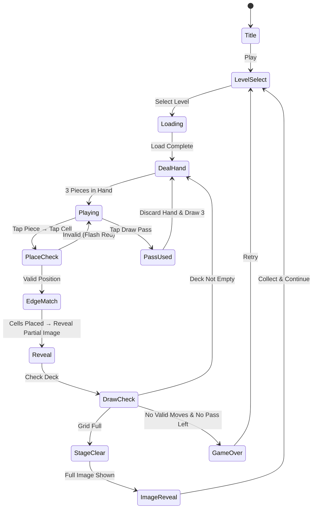

# Jigsolitaire - 지그소 솔리테어

> 직소 퍼즐과 솔리테어를 합친 퓨전 전략 퍼즐 게임.
> 덱에서 뽑은 조각을 전략적으로 배치해 숨겨진 이미지를 완성하라.

## 개요

플레이어는 매 턴 덱에서 조각 3개를 뽑아 핸드로 유지한다.
조각은 그리드 위에 **솔리테어 배치 규칙**에 따라 놓아야 하며,
그리드를 전부 채우면 숨겨진 이미지가 공개된다.

- **직소 요소**: 조각 형태(L/T/S/I/O), 이음 색상 매칭, 이미지 완성 보상
- **솔리테어 요소**: 덱 드로우, 핸드 관리, 제한 이동, 전략적 배치 순서

---

## 게임 규칙

### 기본 구조

- 그리드: N×N 셀 (레벨별 4×4 ~ 7×7)
- 각 셀은 숨겨진 이미지의 한 조각 (완성 전 뒤집힘 상태)
- 덱: 셀 수에 맞는 조각 카드 묶음 (1셀 = 1조각)
- 핸드: 항상 3개 조각 유지 (덱에서 자동 보충)

### 조각(피스) 종류

각 조각은 **형태(shape)** 와 **이음색(edge color)** 을 가진다.

| 형태 | 점유 셀 | 설명 |
|------|---------|------|
| I형 | 1×1 | 단일 셀 조각 |
| D형 | 1×2 | 가로/세로 2칸 도미노 |
| L형 | 1×3 (꺾임) | L자 3칸 |
| T형 | 1×3 (T) | T자 3칸 |
| S형 | 2×2 (대각) | S/Z 지그재그 |
| O형 | 2×2 | 정사각 4칸 |

> MVP에서는 I형 + D형만 구현. L/T/S/O는 Phase 2에 추가.

### 이음색 매칭 규칙 (핵심 전략)

- 각 조각의 **4면(상/하/좌/우)** 에는 이음색(R/G/B/Y/W 5종)이 할당됨
- 조각 배치 시, **맞닿는 면의 이음색이 일치해야 함**
- 단, 그리드 경계(벽)에 닿는 면은 색 무관

```
예시: 이음색 매칭

  [B]          ← 위쪽 이음색 = Blue
[G][조각][R]   ← 좌=Green, 우=Red
  [Y]          ← 아래쪽 = Yellow

인접 조각의 맞닿는 면도 같은 색이어야 배치 가능
```

### 배치 규칙 (솔리테어 변형)

1. **첫 조각**: 그리드 중앙 셀에 자유 배치 (색 무관)
2. **이후 조각**: 기존 배치된 조각과 **최소 1면 이상 인접**해야 함
3. 인접하는 모든 면의 이음색이 일치해야 배치 확정
4. 핸드 3개 중 어떤 조각도 배치 불가능 → **드로우 패스** 1회 가능
   - 드로우 패스: 핸드 3개 버리고 덱에서 새로 3개 뽑음 (레벨당 3회 제한)
5. 패스도 불가능하면 **게임 오버**

### 이동 제한 시스템

- 각 레벨은 **최대 이동 횟수(Move Limit)** 가 존재
- 조각 1개 배치 = 이동 1회 소모
- 이동 초과 전 그리드를 완성해야 클리어

---

## 게임 플로우



---

## UI 레이아웃

```
┌─────────────────────────────┐
│  ⭐ Score   🔢 Moves: 24/30  │  ← 상단 HUD
├─────────────────────────────┤
│                             │
│   ┌──┬──┬──┬──┬──┐          │
│   │██│██│🌸│██│██│          │
│   ├──┼──┼──┼──┼──┤          │
│   │██│🌸│🌸│🌸│██│          │  ← 퍼즐 그리드
│   ├──┼──┼──┼──┼──┤          │    (██=미완, 🌸=배치됨)
│   │██│██│🌸│██│██│          │
│   ├──┼──┼──┼──┼──┤          │
│   │██│██│██│██│██│          │
│   └──┴──┴──┴──┴──┘          │
│                             │
├─────────────────────────────┤
│  핸드 (3개 조각 선택)         │
│  ┌───┐  ┌───┐  ┌───┐        │
│  │ I │  │ D │  │ D │        │  ← 핸드 조각 (탭으로 선택)
│  └───┘  └───┘  └───┘        │
├─────────────────────────────┤
│  [🔀 Pass (3)] [↩️ Undo(2)]  │  ← 도구
└─────────────────────────────┘
```

### 조각 배치 인터랙션

1. 핸드에서 조각 탭 → 선택(하이라이트)
2. 그리드 셀 탭 → 배치 가능 여부 표시
   - 가능: 초록 오버레이
   - 불가(색 불일치): 빨간 오버레이 + 진동
3. 다시 셀 탭 → 배치 확정
4. 확정 시 셀이 조각 색으로 채워지며 이미지 일부 공개

---

## 스코어링 시스템

| Action | Score |
|--------|-------|
| 조각 1개 배치 | +10 |
| 이음색 완벽 매칭 (4면 모두) | +50 보너스 |
| 연속 배치 콤보 (3연속 이상) | ×콤보 배율 |
| 드로우 패스 미사용 클리어 | +300 |
| 이동 여유분 보너스 | 남은이동 × 5 |
| 레벨 클리어 | +500 |

### 별점 시스템 (리텐션)

| 조건 | 별점 |
|------|------|
| 클리어 | ⭐ |
| 이동 여유 50% 이상 | ⭐⭐ |
| 패스 미사용 + 이동 여유 70% | ⭐⭐⭐ |

---

## 난이도 설계

### 레벨 파라미터

| 레벨 구간 | 그리드 | 조각 형태 | 이음색 종류 | 최대 이동 | 패스 횟수 |
|-----------|--------|-----------|-------------|-----------|-----------|
| 1~5 | 4×4 | I형만 | 3색 (R/G/B) | 넉넉 (+8) | 5회 |
| 6~10 | 4×4 | I+D형 | 3색 | 보통 (+4) | 3회 |
| 11~15 | 5×5 | I+D형 | 4색 (+Y) | 보통 (+4) | 3회 |
| 16~20 | 5×5 | I+D+L형 | 4색 | 빡빡 (+2) | 2회 |
| 21~25 | 6×6 | I+D+L+T | 5색 (+W) | 빡빡 (+2) | 1회 |
| 26~30 | 7×7 | 전체 | 5색 | 최소 (+0) | 1회 |

> "최대 이동" = 필요 최소 이동 + 여유 수. 예: 4×4=16셀, 여유 +4 → 최대 20이동

### 튜토리얼 (레벨 1~3)

- 레벨 1: 4×4, I형만, 이음색 없음(자유 배치) → 규칙 체험
- 레벨 2: 4×4, I형, 2색 → 색 매칭 도입
- 레벨 3: 4×4, I+D형, 3색 → 다중 셀 조각 도입

---

## 시각 보상 시스템

### 이미지 공개 메카닉

- 각 레벨은 하나의 **테마 이미지** (예: 풍경, 동물, 캐릭터)
- 조각 배치 시 해당 셀에 이미지 픽셀이 공개됨 (flip 애니메이션)
- 연속 배치 시 물결처럼 번져나가는 공개 효과

### 이미지 컬렉션

- 클리어 후 완성 이미지를 **갤러리**에 수집
- 갤러리는 메인 화면에서 열람 가능
- **이미지 팩**(10장 묶음) 수익화 아이템으로 연결

### 파티클 이펙트

| 이벤트 | 이펙트 |
|--------|--------|
| 조각 배치 성공 | 반짝이 파티클 |
| 완벽 4면 매칭 | 골드 링 이펙트 |
| 이미지 전체 공개 | 폭죽 + 이미지 줌인 |
| 게임 오버 | 조각 흩어짐 |

---

## 수익화 설계

### 핵심 수익원

| 상품 | 가격 | 설명 |
|------|------|------|
| 이미지 팩 | $0.99 | 10개 레벨 + 새 이미지 테마 (예: 도시/자연/판타지) |
| 힌트 × 3 | $0.99 | 유효한 배치 위치 하이라이트 |
| 무한 패스 | $1.99/월 | 패스 횟수 무제한 (구독) |
| 광고 제거 | $2.99 | 영구 광고 제거 |

### 무료 루프

- 레벨 1~20 무료 (MVP 범위)
- 하트 시스템: 5개, 실패 시 1개 소모, 30분마다 1개 충전
- 광고 시청 → 패스 1회 추가 OR 하트 1개 복구

### 첫날 전환 훅

- 레벨 5 클리어 후: "프리미엄 이미지 팩 미리보기" 팝업
- 레벨 10 클리어 후: "다음 팩 50% 할인" (24시간 한정)

---

## 사운드/이펙트

| 이벤트 | 사운드 |
|--------|--------|
| 조각 선택 | 딸깍 (클릭감) |
| 배치 성공 | 퍽 + 단음 |
| 색 불일치 오류 | 짧은 버즈 |
| 완벽 매칭 보너스 | 맑은 차임 |
| 이미지 공개 중 | 부드러운 리빌 음악 |
| 레벨 클리어 | 밝은 팡파레 |
| 게임 오버 | 낮은 실패음 |

---

## MVP 범위

### Phase 1 — MVP (1주차 목표)

- [x] 기획서 작성
- [ ] 4×4 그리드, I형 조각만
- [ ] 이음색 매칭 없는 자유 배치 (튜토리얼용)
- [ ] 덱 드로우 + 핸드 3개 시스템
- [ ] 조각 배치 → 셀 공개 (단색 블록)
- [ ] 이동 제한 + 게임 오버/클리어 판정
- [ ] 10 레벨

### Phase 2 — 핵심 전략 루프 (2주차)

- [ ] 이음색 매칭 시스템 (3~5색)
- [ ] D형 + L형 조각 추가
- [ ] 실제 이미지 리빌 (레벨별 테마 이미지 10장)
- [ ] 패스 시스템 (횟수 제한)
- [ ] 별점 + 갤러리
- [ ] 20 레벨 완성

### Phase 3 — 수익화 루프

- [ ] 하트 시스템
- [ ] 이미지 팩 인앱 결제
- [ ] 광고 리워드 연동
- [ ] T/S/O형 조각 추가
- [ ] 레벨 30 확장

---

## 구현 난이도 분석

### 직소 조각 렌더링 복잡도

| 구현 방식 | 복잡도 | 권장 |
|-----------|--------|------|
| 베지어 곡선 직소 (동적 생성) | 🔴 높음 (2~3일) | ❌ MVP 제외 |
| SVG 폴리곤 직소 형태 | 🟡 중간 (1일) | Phase 2 |
| **PNG 스프라이트 조각** | 🟢 낮음 (반나절) | ✅ **MVP 채택** |
| 단순 사각형 (색상 구분) | 🟢 최저 (2시간) | ✅ 프로토타입 |

**MVP 결정**: 조각은 단순 **둥근 모서리 직사각형 + 색상** 으로 구현.
Phase 2에서 PNG 스프라이트로 교체하여 시각적 직소 느낌 추가.

### 기술 스택 매핑

| 레이어 | 구현 대상 | 예상 공수 |
|--------|-----------|-----------|
| `lib/jigsolitaire` | Phaser 씬, 그리드 로직, 이음색 매칭, 덱/핸드 상태 | 3~4일 |
| `web/jigsolitaire` | React 래퍼, 레벨셀렉트 UI, 갤러리 | 1~2일 |
| `jigsolitaire/rn` | WebView 래핑, 앱스토어 빌드 | 1일 |

**총 MVP 예상**: 5~7일 (1주 안에 가능)

### 핵심 알고리즘 (lib 팀 전달)

```
1. 그리드 셀 이음색 생성:
   - 각 내부 경계(셀과 셀 사이)에 무작위 색상 1개 할당
   - 셀의 이음색 = 4방향 각각 인접 경계의 색상
   - → 그리드 생성 시 1회 계산, 덱에 조각으로 담기

2. 배치 유효성 검사:
   - 인접 셀 존재 여부 확인
   - 맞닿는 모든 면의 이음색 일치 여부 확인
   - O(1) 체크 가능 (셀 좌표 기반)

3. 덱 셔플:
   - 그리드 셀들의 이음색 정보를 조각 카드로 변환
   - Fisher-Yates 셔플
```
