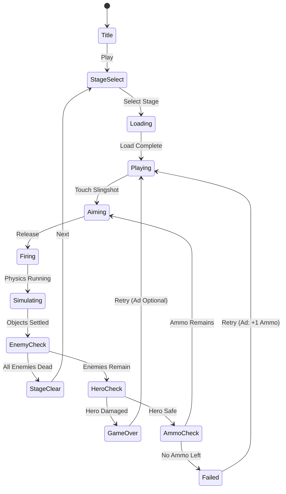

# 주공을 지켜라: 전부 없애기

> 물리 기반으로 적을 제거하고 주인공을 보호하는 퍼즐 게임.
> Angry Birds 스타일의 파괴 물리학에 "주인공 생존"이라는 목표를 더한 게임.

---

## 개요

각 스테이지에 주인공(주공)과 적들이 배치되어 있다. 플레이어는 투석기로 다양한 물리 오브젝트를 발사해 구조물을 무너뜨리고 모든 적을 제거해야 한다. 단, 주공이 데미지를 받으면 게임 오버. 모든 적을 제거하면 스테이지 클리어.

### 핵심 차별점

| 요소 | Angry Birds | 주공을 지켜라 |
|------|------------|--------------|
| 목표 | 적 구조물 파괴 | 적 제거 + **주공 보호** |
| 긴장감 | 탄환 낭비 방지 | 탄환 + 주공 생존 2중 제약 |
| 전략성 | 효율적 파괴 경로 | **아군 보호 경로** 계산 |

---

## 코어 메카닉

### 기본 루프

1. 스테이지 로드 → 주공·구조물·적 배치 확인
2. 투석기에서 탄환 선택
3. 조준 → 발사 (궤적 프리뷰)
4. 물리 시뮬레이션 → 구조물 붕괴 → 적 처치 판정
5. 주공 생존 확인 → 전멸 확인 → 남은 탄환 확인
6. 클리어 or 재도전

### 오브젝트 역할

| 오브젝트 | 역할 | 물리 특성 |
|---------|------|-----------|
| 주공 (⭐) | 보호 대상 | 고정 or 약간 이동 가능, HP 1 |
| 적 (💀) | 제거 대상 | HP 1, 충격 or 낙하로 처치 |
| 구조물 블록 | 지형/방패 | 재질별 강도 (나무/돌/금속) |
| 탄환 | 공격 수단 | 종류별 물리 특성 다름 |

### 탄환 종류

| 탄환 | 특성 | 전략적 용도 |
|------|------|------------|
| 표준 (🔵) | 직진, 중간 무게 | 범용 |
| 폭발 (💥) | 착탄 시 폭발 반경 | 밀집 적 처리 |
| 관통 (🔱) | 블록 1개 관통 후 진행 | 숨은 적 타격 |
| 분열 (✨) | 공중에서 3방향 분열 | 넓은 범위 커버 |
| 무거운 돌 (🪨) | 고중량, 짧은 사거리 | 구조물 붕괴 |

---

## 물리 퍼즐 설계

### 구조물 재질 시스템

```
나무 (HP 1) → 돌 (HP 2) → 금속 (HP 3)
충격 → 균열 → 파괴 3단계 시각 피드백
```

| 재질 | HP | 무게 | 탄성 | 파괴 이펙트 |
|------|-----|------|------|------------|
| 나무 | 1 | 낮음 | 낮음 | 나무 파편 |
| 돌 | 2 | 중간 | 중간 | 돌 파편 |
| 금속 | 3 | 높음 | 높음 | 불꽃 + 파편 |

### 체인 반응 설계 원칙

- **약점 포인트**: 구조물의 특정 부위를 타격하면 연쇄 붕괴
- **도미노 효과**: 블록 낙하 → 인접 블록 충격 → 연쇄 파괴
- **TNT 블록**: 충격 시 폭발하는 특수 블록 (스테이지 중반 이후 등장)
- **롤링 오브젝트**: 원형 돌, 굴러가며 여러 적 처치

### 주공 보호 메카닉

- 주공은 HP 1 (한 번 맞으면 게임 오버)
- 주공 주변 구조물이 "방패" 역할 → 의도적으로 파괴하면 위험
- 일부 스테이지에서 주공이 적과 가까이 배치 → 정밀 타격 요구
- **세이프티 존**: 주공 주위 일정 반경은 폭발 데미지 없음 (2스테이지 이후 제거)

---

## Phaser.io 물리 구현 (Matter.js)

### 핵심 물리 파라미터

```typescript
// Matter.js 설정
const physicsConfig = {
  gravity: { y: 1.5 },           // 중력 (표준보다 약간 강함 - 게임감)
  enableSleeping: true,           // 정지한 오브젝트 슬립 처리 (성능)
  constraintIterations: 4,
  positionIterations: 10,
  velocityIterations: 8,
};

// 재질별 물리 속성
const materials = {
  wood:  { density: 0.002, restitution: 0.1, friction: 0.8 },
  stone: { density: 0.006, restitution: 0.3, friction: 0.6 },
  metal: { density: 0.012, restitution: 0.6, friction: 0.4 },
};

// 탄환 발사
const launchBall = (scene, angle, power) => {
  const velocity = {
    x: Math.cos(angle) * power * 0.05,
    y: Math.sin(angle) * power * 0.05,
  };
  Matter.Body.setVelocity(ball, velocity);
};
```

### Phaser + Matter.js 통합 구조

```
Scene
├── MatterPhysics (Phaser 내장)
│   ├── World (중력, 경계)
│   ├── Bodies[] (블록, 적, 주공, 탄환)
│   └── CollisionEvents (충격 감지 → HP 감소)
├── Slingshot (투석기 UI + 발사 로직)
├── TrajectoryPreview (궤적 점선 프리뷰)
├── LevelLoader (JSON → 오브젝트 배치)
└── GameStateManager (클리어/실패 판정)
```

### 충돌 이벤트 처리

```typescript
this.matter.world.on('collisionstart', (event) => {
  event.pairs.forEach(({ bodyA, bodyB }) => {
    const impactForce = getImpactForce(bodyA, bodyB);

    // 블록 HP 감소
    if (isBlock(bodyA) && impactForce > BREAK_THRESHOLD) {
      damageBlock(bodyA, impactForce);
    }

    // 적 처치 (낙하 or 직격)
    if (isEnemy(bodyB) && impactForce > KILL_THRESHOLD) {
      killEnemy(bodyB);
    }

    // 주공 데미지 (게임 오버)
    if (isHero(bodyA) || isHero(bodyB)) {
      if (impactForce > HERO_DAMAGE_THRESHOLD) triggerGameOver();
    }
  });
});
```

### 성능 최적화

- 오브젝트 20개 이하로 제한 (모바일 60fps 유지)
- `enableSleeping: true` - 정지한 오브젝트 물리 계산 제외
- 파괴된 오브젝트 0.5초 후 월드에서 제거
- 파티클 이펙트는 Phaser 파티클 매니저 (Matter.js 외부)

---

## 레벨 디자인

### 레벨 JSON 구조

```json
{
  "id": "level_1",
  "background": "desert",
  "hero": { "x": 150, "y": 400 },
  "slingshot": { "x": 100, "y": 420 },
  "ammo": ["standard", "standard", "standard"],
  "enemies": [
    { "type": "pig", "x": 600, "y": 350 }
  ],
  "blocks": [
    { "type": "wood", "x": 550, "y": 370, "w": 80, "h": 20 },
    { "type": "stone", "x": 600, "y": 330, "w": 20, "h": 40 }
  ]
}
```

### 스테이지 구성 로드맵

| 스테이지 | 적 수 | 블록 복잡도 | 탄환 수 | 핵심 퍼즐 |
|---------|------|------------|--------|-----------|
| 1~3 | 1~2 | 단순 탑 | 3 | 직선 타격 |
| 4~6 | 2~3 | 2층 구조물 | 4 | 도미노 유발 |
| 7~9 | 3~4 | 복잡 요새 | 4~5 | TNT 활용 |
| 10~12 | 4~5 | 주공 근처 적 | 3~4 | 정밀 타격 |
| 13~15 | 5~6 | 혼합 재질 | 5 | 체인 반응 |

### 약점 설계 원칙

1. **키스톤 블록**: 제거 시 전체 구조물 붕괴하는 핵심 블록 (밝은 색으로 힌트)
2. **TNT 배치**: 적 밀집 구역 근처에 배치 → 1발로 다수 처치 가능성
3. **경사면 활용**: 탄환이 굴러내려가며 연쇄 충격
4. **거리 감각**: 1스테이지는 투석기에서 적까지 직선거리 유지

---

## UI 레이아웃

```
┌─────────────────────────────┐
│  ⭐ Score    💀 0/3    ⏸ Menu │  ← 상단 HUD
├─────────────────────────────┤
│                             │
│  [적] [블록]  [블록]  [적]  │
│         [블록블록]          │
│   ⭐주공    [적][블록]      │  ← 게임 월드
│                             │
│  🪃─ ─ ─ ─ ─ ─ ─ ─ ─       │  ← 궤적 프리뷰 (점선)
│   ⊙ ← 투석기               │
├─────────────────────────────┤
│  [🔵][🔵][💥]  남은 탄환   │  ← 탄환 큐
├─────────────────────────────┤
│  💡 힌트    🔄 재시작       │  ← 하단 도구
└─────────────────────────────┘
```

### 인터랙션 플로우

1. **조준**: 투석기 드래그 → 궤적 점선 실시간 표시
2. **발사**: 터치 릴리즈 → 탄환 발사
3. **관람**: 물리 시뮬레이션 진행 (자동)
4. **결과**: 전멸 확인 → 클리어 팝업 or 실패 팝업

---

## 스코어링 시스템

| 액션 | 점수 |
|------|------|
| 적 1마리 처치 | +200 |
| 탄환 1발로 2마리 이상 처치 | +200 × 처치 수 × 1.5 (콤보 보너스) |
| TNT 폭발로 처치 | +300 |
| 탄환 1발 남을 시 클리어 | +500 |
| 탄환 2발 이상 남을 시 클리어 | +500 × 남은 탄환 수 |
| 주공 생존 (피격 없음) | +300 |
| 스테이지 클리어 | +1,000 |

### 별점 시스템 (1~3성)

| 별 | 조건 |
|----|------|
| ⭐ | 클리어 |
| ⭐⭐ | 탄환 1발 이상 남기고 클리어 |
| ⭐⭐⭐ | 탄환 2발 이상 남기고 클리어 + 주공 피격 0 |

---

## 수익화 전략

### 핵심 수익 모델: 광고 + 소프트 통화

| 수익 유형 | 방식 | 구현 우선순위 |
|-----------|------|--------------|
| 리워드 광고 | 추가 탄환 1발 (+1회) | **P0** |
| 리워드 광고 | 힌트 보기 (약점 강조) | **P0** |
| 인터스티셜 | 스테이지 5회 플레이마다 노출 | P1 |
| 배너 광고 | 스테이지 셀렉트 하단 | P1 |
| IAP - 탄환팩 | 특수 탄환 10회 묶음 (₩1,200) | P2 |
| IAP - 힌트팩 | 힌트 20회 (₩2,500) | P2 |
| IAP - 광고 제거 | 배너/인터스티셜 제거 (₩3,900) | P2 |

### 리워드 광고 트리거 시나리오

```
실패 직전 (탄환 0, 적 1마리 남음)
  → "광고 보고 탄환 1발 추가?" 팝업
  → 수락 → 30초 광고 → 탄환 1발 지급
  → 클리어 시 만족감 극대화 → 광고 반감 낮음
```

---

## 구현 복잡도 분석

### 기술적 도전 요소

| 항목 | 난이도 | 이유 |
|------|--------|------|
| Matter.js 물리 통합 | 중 | Phaser 내장 지원, API 안정적 |
| 투석기 조준 + 궤적 | 중 | 포물선 수식으로 계산 가능 |
| 충돌 감지 + HP 시스템 | 중 | 이벤트 기반, 패턴 명확 |
| 레벨 JSON 에디터 | 낮음 | 수동 JSON 작성으로 MVP 가능 |
| 블록 파괴 이펙트 | 중 | Phaser 파티클 활용 |
| 모바일 60fps 최적화 | 높음 | 오브젝트 수 제한 필수 |
| 스테이지 밸런싱 | 높음 | 반복 테스트 필요 |

### 개발 일정 (1~2주 MVP)

```
Day 1~2: Phaser + Matter.js 환경 세팅, 투석기 발사 구현
Day 3~4: 블록/적/주공 물리 오브젝트, 충돌 감지
Day 5~6: 3스테이지 레벨 디자인 + 클리어/실패 판정
Day 7:   UI (HUD, 탄환 큐, 팝업), 사운드
Day 8~9: 리워드 광고 연동, 테스트
Day 10:  빌드 최적화, 버그 수정
```

### 재사용 가능한 공통 인프라

- `web/{game}` React 래퍼 → found3와 동일 구조 재사용
- `{game}/rn` WebView 브릿지 → 완전 재사용
- Phaser Scene 구조 → 신규 (물리 씬)

---

## 게임 플로우



---

## 사운드/이펙트

| 이벤트 | 사운드 | 이펙트 |
|--------|--------|--------|
| 투석기 드래그 | 삐걱 소리 | 고무줄 늘어남 애니메이션 |
| 탄환 발사 | 슝! | 속도선 |
| 블록 충돌 | 쿵/탁 (재질별) | 균열 텍스처 교체 |
| 블록 파괴 | 쾅/박살 | 파편 파티클 |
| 적 처치 | 비명 + 팝 | 별 이펙트 |
| TNT 폭발 | 쾅! | 원형 폭발 파티클 |
| 주공 피격 | 비명 | 화면 붉은 플래시 → 게임 오버 |
| 스테이지 클리어 | 환호 | 별 3개 애니메이션 |

---

## MVP 범위

### Phase 1 (MVP - 1~2주)

- [x] 기획서 작성
- [ ] Phaser + Matter.js 기본 물리 씬
- [ ] 투석기 드래그 → 발사 + 궤적 프리뷰
- [ ] 블록 (나무만) 파괴 로직
- [ ] 적 처치 + 주공 피격 판정
- [ ] 탄환 3종 (표준, 폭발, 분열)
- [ ] 스테이지 5개 (JSON 기반)
- [ ] 클리어/실패 판정 + 별점
- [ ] 리워드 광고 (+1 탄환)

### Phase 2

- [ ] 재질 3종 (나무/돌/금속)
- [ ] TNT 블록
- [ ] 스테이지 15개
- [ ] 인터스티셜 광고
- [ ] 스테이지 셀렉트 + 진행도 저장
- [ ] 사운드 및 파티클 이펙트

---

## 결론 및 투자 가치 판단

### 시장성

- **Angry Birds 장르**: 전 세계 누적 40억 다운로드, 모바일 물리 퍼즐 검증된 시장
- **캐주얼 + 물리**: CPI 낮음, 리텐션 중간, 세션 짧음 → 광고 수익 적합
- **별점 시스템**: 재도전 유도 → 광고 노출 극대화

### 리스크

| 리스크 | 수준 | 대응 |
|--------|------|------|
| 물리 밸런싱 오래 걸림 | 중 | 스테이지 5개로 MVP 제한 |
| 60fps 모바일 최적화 | 중 | 오브젝트 수 20개 캡 |
| Angry Birds 클론 인식 | 중 | 주공 보호 메카닉으로 차별화 강조 |

### 권고안

> **진행 권장.** 1~2주 MVP 목표 달성 가능. 물리 퍼즐 장르는 광고 수익 모델과 궁합이 좋고,
> 리워드 광고 트리거(실패 시 +1 탄환)가 자연스러워 ARPU 기대치 높음.
> Phase 1에서 5스테이지 + 리워드 광고만 완성해도 즉시 출시 가능.
> **주공 보호** 메카닉이 Angry Birds 대비 전략성을 높이므로 차별화 포인트로 마케팅 활용 가능.
