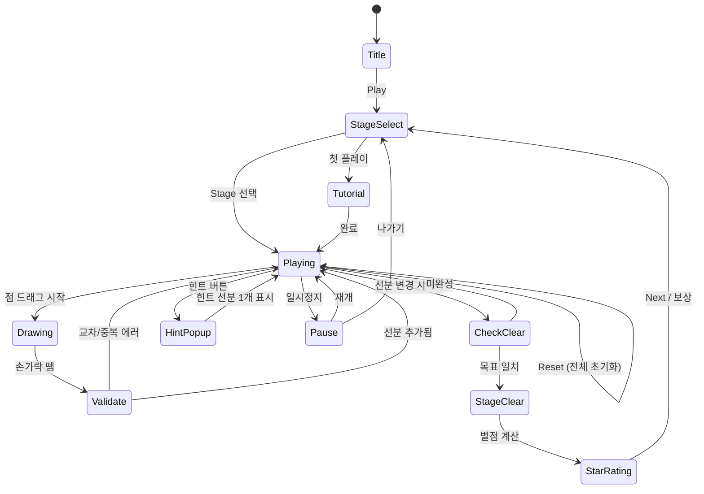

# 줄 그림: 리프트 퍼즐 (Line Drawing Lift Puzzle)

> **레퍼런스 앱**: 줄 그림: 리프트 퍼즐 | 개발사: The Fashion Valley | 평점: 4.8 | 장르: draw | 랭크: #109

## 개요

격자 위에 배치된 점(노드)들을 선으로 연결하여 목표 그림(도형/패턴)을 완성하는 퍼즐 게임.
한붓그리기와 달리 **손가락을 들었다 놓을 수 있음(리프트 허용)**.
대신 선분 개수 제한, 교차 금지 등 별도 제약 조건이 난이도를 결정함.

---

## 드로잉 퍼즐 장르 비교 분석

> 4개 레퍼런스 종합 분석 → 확정 기획 근거 도출

| 구분 | #25 한붓그리기 | #46 점잇기 | #54 플로우 퍼즐 | **#109 줄 그림 (본작)** |
|------|--------------|-----------|----------------|----------------------|
| **핵심 동작** | 손 안 떼고 모든 선 1회 통과 | 번호 순서대로 점 연결 | 같은 색 점 경로 연결 | 점 자유 연결 → 목표 도형 완성 |
| **리프트** | ❌ 금지 | ✅ 강제(순서 제한) | ✅ 컬러별 분리 | ✅ **자유 (핵심 차별점)** |
| **입력 자유도** | 매우 낮음 | 중간 | 중간 | **높음** |
| **창의성** | 낮음 | 낮음 | 중간 | **높음** |
| **퍼즐 다양성** | 중간 | 중간 | 높음 | **매우 높음** |
| **직관성** | 보통 | 매우 높음 | 높음 | **높음** |
| **재방문율** | 낮음 | 낮음 | 중간 | **높음** |
| **컨텐츠 확장** | 어려움 | 쉬움 | 쉬움 | **매우 쉬움** |
| **구현 난이도** | 중간 | 낮음 | 낮음 | **낮음** |

### 장르 분석 결론

**본작 채택 이유:**
1. **리프트 허용** → 진입 장벽 낮음 (더 넓은 유저층)
2. **목표 그림 완성** → 달성감 시각적으로 명확 (퍼즐팩 판매 동기)
3. **퍼즐 에디터 확장 용이** → 스테이지 콘텐츠 생산 비용 최소
4. **4.8점 검증** → 시장에서 이미 수요 확인

---

## 게임 규칙

### 기본 규칙

1. **격자(Grid)** 위에 여러 **점(Node)**이 배치됨
2. 플레이어는 점과 점 사이를 드래그하여 **선분(Segment)**을 그음
3. 모든 선분을 그어 **목표 도형 이미지**와 일치시키면 스테이지 클리어
4. **리프트 허용**: 손가락을 떼고 다른 점에서 다시 시작 가능
5. **교차 금지**: 선분끼리 교차하면 즉시 에러 표시 (빨간 하이라이트)
6. **중복 금지**: 같은 두 점 사이 선분은 1개만 허용

### 제약 조건 (난이도 조절 핵심)

| 제약 | 설명 |
|------|------|
| **선분 수 제한** | 정해진 횟수의 선분만 사용 가능 (난이도별 조절) |
| **필수 점** | 반드시 지나야 하는 점 (빨간 점으로 표시) |
| **교차 금지 구역** | 특정 영역은 선이 지나갈 수 없음 |
| **색상 분리** | 다른 색 점끼리는 연결 불가 (고급 스테이지) |

### 클리어 판정

- 목표 도형의 **모든 선분이 정확히 재현**됨
- 불필요한 추가 선분 없음 (정확 일치)
- 교차·중복 없음

---

## 게임 플로우



---

## UI 레이아웃

```
┌─────────────────────────────┐
│  ← Back   Stage 12   ⚙️    │  ← 상단 바 (뒤로/스테이지명/설정)
│           ⭐⭐⭐             │  ← 목표 별점 미리보기
├─────────────────────────────┤
│  ┌──────────────────────┐   │
│  │  [목표 도형 섬네일]   │   │  ← 목표 그림 (항상 노출)
│  └──────────────────────┘   │
├─────────────────────────────┤
│                             │
│   •─────•         •         │
│   │           ╲   │         │
│   •     •─────•   •         │  ← 게임 격자 + 현재 그림
│         │                   │
│   •─────•    [●]  •         │  (● = 필수 점, • = 일반 점)
│                             │
├─────────────────────────────┤
│  선분: 5/8   교차: ❌        │  ← 상태 표시
├─────────────────────────────┤
│  [↩ Undo]  [🔄 Reset]  [💡 Hint] │  ← 하단 도구
└─────────────────────────────┘
```

---

## 스코어링 / 별점 시스템

### 별점 기준 (스테이지당 최대 ⭐⭐⭐)

| 별점 | 조건 |
|------|------|
| ⭐ | 클리어 (힌트 사용, 선분 낭비 무관) |
| ⭐⭐ | 힌트 미사용 클리어 |
| ⭐⭐⭐ | 힌트 미사용 + 최소 선분(최적해)으로 클리어 |

### 총점 계산

```
스테이지 점수 = 기본점(100) + 선분절약(절약수 × 20) + 힌트미사용(50) + 속도보너스(남은초 × 5)
```

---

## 난이도 설계

| 챕터 | 스테이지 수 | 격자 | 점 수 | 선분 제한 | 제약 조건 | 예상 시간 |
|------|------------|------|-------|----------|----------|----------|
| 1 (Tutorial) | 10 | 3×3 | 4~6 | 없음 | 없음 | 20~30초 |
| 2 (Easy) | 20 | 4×4 | 6~9 | 없음 | 없음 | 30~60초 |
| 3 (Normal) | 30 | 5×5 | 9~12 | 선분 수 제한 | 필수 점 | 1~2분 |
| 4 (Hard) | 30 | 6×6 | 12~16 | 선분 수 제한 | 교차금지구역 | 2~3분 |
| 5 (Expert) | 20 | 7×7 | 16~20 | 선분 수 제한 | 색상 분리 | 3~5분 |

**총 110 스테이지 MVP** (챕터 1~3: 무료, 챕터 4~5: 퍼즐팩)

---

## 목표 도형 분류

| 카테고리 | 예시 도형 | 스테이지 활용 |
|---------|---------|-------------|
| 기하 | 삼각형, 사각형, 별, 다각형 | 챕터 1~2 |
| 사물 | 집, 배, 나무, 하트 | 챕터 2~3 |
| 동물 | 새, 물고기, 강아지 실루엣 | 챕터 3~4 |
| 패턴 | 격자, 나선, 눈송이 | 챕터 4~5 |

---

## Phaser.io 기술 명세

### 터치 드로잉 구현

```
InputSystem
├── pointerdown → 가장 가까운 Node snap (반경 30px)
├── pointermove → 드래그 중 임시 선(점선) 렌더링
└── pointerup   → 가장 가까운 Node snap → Segment 생성 시도
```

### 핵심 데이터 구조

```typescript
interface Node {
  id: string;
  x: number;        // 격자 좌표
  y: number;
  required: boolean; // 필수 점 여부
  color?: string;   // 색상 분리용
}

interface Segment {
  from: string;     // Node id
  to: string;       // Node id
}

interface Stage {
  grid: { cols: number; rows: number };
  nodes: Node[];
  targetSegments: Segment[];  // 목표 도형
  maxSegments?: number;       // 선분 수 제한 (null = 무제한)
}
```

### 교차 판정 알고리즘

```
두 선분 AB, CD 교차 여부:
→ 벡터 외적(cross product) + 방향 판별
→ T자 교차(공유 점) 허용
→ X자 교차만 에러 처리
시간복잡도: O(n) 현재 세그먼트 수 대비 (스테이지당 최대 50개 → 무시 가능)
```

### 클리어 판정

```
targetSegments를 Set<string>으로 정규화 ("x1,y1-x2,y2" 양방향 동일 처리)
currentSegments와 Set 비교
→ 동일 시 CLEAR 이벤트 발행
```

### 렌더링 스택

```
Layer 0: Grid (격자선, 연회색)
Layer 1: 목표 도형 오버레이 (반투명 점선, 클리어 전까지 가이드)
Layer 2: 현재 세그먼트 (실선, 파랑)
Layer 3: 노드 원형 (흰 테두리, 필수=빨강)
Layer 4: 에러 세그먼트 (빨간 깜빡임, 0.5초)
Layer 5: 힌트 세그먼트 (노란 강조)
Layer 6: HUD / UI
```

### 터치 최적화

- **Snap 반경**: 30px (모바일 핑거 타겟 기준)
- **Debounce**: pointermove 10ms throttle (불필요 렌더 방지)
- **Physics**: 사용 안 함 → Graphics API만 사용 (경량)

---

## 수익화 설계

### 핵심 수익 모델

| 모델 | 내용 | 목표 ARR |
|------|------|---------|
| **퍼즐팩 IAP** | 챕터 4~5 (50스테이지) 팩당 $1.99 | 주력 |
| **힌트 번들** | 힌트 20개 $0.99 / 100개 $2.99 | 보조 |
| **광고 제거** | $2.99 영구 | 보조 |
| **배너광고** | 스테이지 간 인터스티셜 (Free 유저) | 초기 |

### 힌트 시스템 상세

```
힌트 1회 사용 → 목표 도형의 선분 1개를 3초간 노란 강조 표시
→ 자동으로 그어주지 않음 (유저가 직접 그어야 함)
→ ⭐⭐⭐ 획득 불가 (힌트 사용 패널티)
무료 힌트: 1일 3회 (광고 시청 시 추가 1회)
```

### 리텐션 루프

```
Daily Mission → 3스테이지 클리어 → 힌트 코인 보상
Weekly Challenge → 특별 퍼즐 팩 무료 해금
```

---

## 사운드/이펙트

| 이벤트 | 사운드 | 이펙트 |
|--------|--------|--------|
| 선분 그리기 | 부드러운 획 소리 | 선이 부드럽게 나타남 |
| 에러 (교차) | 짧은 버즈 | 빨간 깜빡임 0.5초 |
| 스테이지 클리어 | 밝은 차임 | 도형 완성 → 색상 채움 애니 |
| ⭐⭐⭐ 달성 | 팡파레 | 파티클 + 별 애니 |
| 힌트 사용 | 마법 소리 | 노란 펄스 효과 |

---

## MVP 범위

### Phase 1 — MVP (1주, 출시 목표)

- [x] 기획서 작성
- [ ] Phaser.io 격자 + 노드 렌더링
- [ ] 드래그 입력 → 선분 생성 (교차 판정 포함)
- [ ] 클리어 판정 로직
- [ ] Undo / Reset
- [ ] 챕터 1~2 스테이지 데이터 (30개)
- [ ] 스테이지 선택 화면
- [ ] 배너 광고 연동

### Phase 2 — 수익화 강화 (2주차)

- [ ] 챕터 3~5 스테이지 데이터 (80개)
- [ ] 힌트 시스템 + IAP 연동
- [ ] 퍼즐팩 잠금/해제 UI
- [ ] 별점 시스템 + 클리어 애니메이션
- [ ] Daily Mission

### Phase 3 — 리텐션 (선택)

- [ ] 퍼즐 에디터 (UGC)
- [ ] 리더보드
- [ ] Weekly Challenge

---

## 드로잉 퍼즐 최종 결론: 확정 기획

### 4개 드로잉 퍼즐 중 **본작(#109) 우선 개발** 근거

1. **평점 4.8** → 4개 중 최고 검증값
2. **리프트 허용** → 가장 낮은 진입장벽 → CPI 최적
3. **시각적 성취감** (도형 완성) → SNS 공유 유도 → 바이럴 가능성
4. **퍼즐팩 IAP** → 한붓그리기/점잇기 대비 명확한 유료 컨텐츠 경계

### 개발 우선순위 (드로잉 장르 내)

```
1순위: #109 줄 그림 (본작) — 즉시 착수
2순위: #54 플로우 퍼즐   — 본작 출시 후 2주
3순위: #46 점잇기         — 3순위 (간단하나 수익화 약함)
4순위: #25 한붓그리기     — 보류 (진입장벽 높음)
```

### 1~2주 MVP 실행 계획

```
Day 1~2: lib/line-drawing — Phaser.io 격자/입력/판정 코어
Day 3~4: lib/line-drawing — 스테이지 데이터 30개 + 클리어 로직
Day 5:   web/line-drawing — React 래핑 + 스테이지 선택 UI
Day 6:   line-drawing/rn  — RN WebView 래핑
Day 7:   통합 테스트 + 광고 연동 → 출시
```
