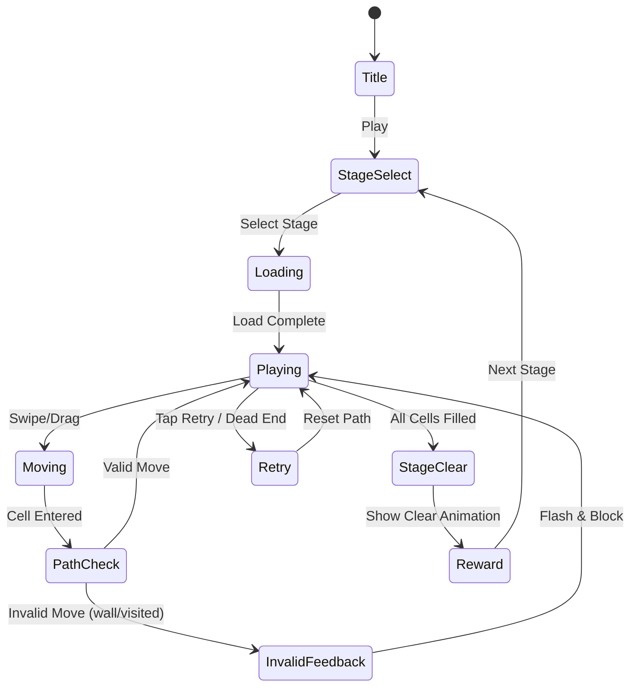

# Line Puzzle (단일 선 블록 채우기 퍼즐)

> 한붓그리기 방식으로 그리드의 모든 칸을 하나의 연속된 선으로 채우는 퍼즐 게임

## 개요

플레이어는 시작점에서 출발해 상하좌우로 이동하며 그리드의 **모든 칸을 정확히 한 번씩** 방문해야 한다.
한 번 지나간 칸은 다시 방문할 수 없으며, 모든 칸을 방문하면 스테이지 클리어.
수학적으로는 **Hamiltonian Path** 문제이며, 직관적이고 중독성 높은 퍼즐 장르다.

## 게임 규칙

### 기본 규칙
- 그리드(N×N)의 **모든 빈 칸을 한 번의 연속된 선으로 채워야** 함
- 이동 방향: **상·하·좌·우** (대각선 불가)
- 한 번 지나간 칸은 **재방문 불가**
- **시작점은 고정** (레벨마다 미리 지정)
- 끝점은 자유 (단, 모든 칸을 채워야 클리어)
- 막히거나 실수하면 **초기화(Retry)** 후 재도전

### 특수 칸 종류

| 칸 유형 | 아이콘 | 설명 |
|---------|--------|------|
| 일반 칸 | ⬜ | 자유롭게 지나갈 수 있는 기본 칸 |
| 벽 칸 | ⬛ | 지나갈 수 없음 (빈 칸 아님, 채울 필요 없음) |
| 시작점 | 🟢 | 선이 시작되는 고정 위치 |
| 포탈 칸 | 🔵🔴 | 동일 색상 포탈 쌍으로 이동 (양방향) |
| 방향 칸 | ➡️ | 해당 방향으로만 진입/탈출 가능 |
| 고정 경로 칸 | 🟡 | 반드시 지나가야 하는 필수 경유 칸 (힌트 역할) |

### 포탈 칸 규칙
- 포탈 진입 시 즉시 쌍 포탈로 이동
- 포탈 쌍은 색상으로 구분 (파랑↔파랑, 빨강↔빨강)
- 포탈은 지나간 칸으로 처리됨 (재진입 불가)
- 포탈을 통해 나온 방향은 진입 방향 그대로 유지

### 방향 칸 규칙
- 화살표 방향으로만 이동 가능 (진입 또는 탈출에 방향 제한)
- 예: →칸은 왼쪽에서 진입하여 오른쪽으로만 탈출 가능

## 게임 플로우



### 입력 방식
- **드래그**: 시작점에서 손가락을 떼지 않고 연속으로 드래그
- **탭**: 시작점 탭 → 이후 인접 칸 탭으로 경로 지정 (대안)
- 잘못된 이동: 진동 피드백 + 해당 칸 빨간 플래시 (경로 유지)
- 막힌 경우(Dead End): 자동 감지 후 Retry 버튼 강조

## UI 레이아웃

```
┌─────────────────────────────┐
│  ← Back    Level 12   ⏱ 0:42│  ← 상단 HUD
├─────────────────────────────┤
│                             │
│   ⬛ ⬜ ⬜ ⬜ ⬜           │
│   ⬜ ⬛ ⬜ ⬜ ⬜           │
│   ⬜ ⬜ 🟢 ⬜ ⬜           │  ← 게임 그리드
│   ⬜ 🔵 ⬜ 🔵 ⬜           │    (중앙 배치)
│   ⬜ ⬜ ⬜ ⬜ ⬜           │
│                             │
├─────────────────────────────┤
│   Moves: 18 / 23            │  ← 진행 표시
├─────────────────────────────┤
│  [↩ Undo]  [🔄 Retry]  [💡 Hint] │  ← 하단 도구
└─────────────────────────────┘
```

### 그리드 시각화 규칙
- 선이 지나간 경로: 색상 라인으로 표시 (이전 칸 → 현재 칸 애니메이션)
- 미방문 칸: 흰색/밝은 회색
- 벽 칸: 진한 회색/검정
- 경로 색상: 레벨별 고유 색 (파랑, 초록, 보라 등)
- 선 두께: 칸 크기의 40% (깔끔한 시각)

### 완성 연출
1. 마지막 칸 도달 → 선 전체가 골든/무지개 색으로 파동 효과
2. 별 3개 평가 팝업 (시간/힌트 사용 여부 기준)
3. "CLEAR!" 텍스트 + 파티클 이펙트
4. 다음 스테이지 또는 스테이지 선택으로 전환

## 스코어링 시스템

### 별점 기준 (레벨별 조정)

| 별점 | 조건 |
|------|------|
| ⭐⭐⭐ | 힌트 미사용 + 목표 시간 이내 |
| ⭐⭐ | 힌트 1회 이하 또는 시간 초과 |
| ⭐ | 클리어 (조건 무관) |

### 스코어 계산

| Action | Score |
|--------|-------|
| 스테이지 클리어 | +1000 |
| 남은 시간 보너스 | 남은초 × 20 |
| 힌트 미사용 | +500 |
| Undo 미사용 | +200 |
| Retry 횟수 패널티 | -100 × retry수 (최대 -500) |

## 난이도 설계

### 그리드 크기 & 단계

| 단계 | 그리드 | 레벨 범위 | 특수 칸 | 목표 시간 |
|------|--------|-----------|---------|-----------|
| Beginner | 4×4 | 1~10 | 없음 | 60초 |
| Easy | 5×5 | 11~20 | 벽 칸 | 90초 |
| Normal | 5×5 | 21~30 | 벽 + 고정경로 | 90초 |
| Hard | 6×6 | 31~40 | 벽 + 포탈 | 120초 |
| Expert | 6×6 | 41~50 | 전체 특수 칸 | 120초 |
| Master | 7×7 | 51~60 | 전체 + 방향칸 | 150초 |
| Extreme | 8×8 | 61~70 | 복합 | 180초 |

### 난이도 점층 원칙
- **Beginner~Easy**: 유일한 정답 경로 존재, 시작점 명확
- **Normal~Hard**: 복수 경로 존재, 최적 경로 탐색 필요
- **Expert 이상**: 특수 칸 조합으로 역발상 필요, 포탈 활용 필수

### 벽 칸 배치 원칙
- 전체 칸의 최대 20% (해법 존재 보장)
- 고립된 섬(닿을 수 없는 영역) 생성 금지
- 반드시 Hamiltonian Path 존재 검증 후 배치

## 퍼즐 생성 알고리즘

### 방식: Backwards Generation (역방향 생성)

1. 빈 그리드에서 **랜덤 Hamiltonian Path를 먼저 생성** (DFS + 백트래킹)
2. 생성된 경로를 정답으로 저장
3. 일부 칸에 특수 속성(포탈, 방향 제한) 부여
4. 난이도에 맞게 벽 칸 추가 (해법 검증 포함)
5. 정답 경로의 일부를 **힌트(고정 경로 칸)**로 표시

### 검증
- 모든 퍼즐은 **정확히 1개 이상의 해법** 보유 필수
- Easy 이하: 유일해(Unique solution) 권장
- Hard 이상: 복수해 허용 (난이도 감소 효과)

### MVP용 수동 큐레이션
- 50레벨은 알고리즘으로 생성 후 **수동 검수** (2~3시간 작업)
- JSON 포맷으로 레벨 데이터 저장

## 레벨 데이터 포맷

```json
{
  "id": 12,
  "name": "Winding Road",
  "grid": 5,
  "timeLimit": 90,
  "start": { "x": 2, "y": 2 },
  "cells": [
    { "x": 0, "y": 0, "type": "wall" },
    { "x": 1, "y": 3, "type": "portal", "pairId": "A" },
    { "x": 3, "y": 1, "type": "portal", "pairId": "A" },
    { "x": 2, "y": 4, "type": "direction", "dir": "right" }
  ],
  "solution": [[2,2],[2,1],[2,0],[1,0],[0,0],"..."],
  "hints": [{ "x": 4, "y": 4, "fixed": true }]
}
```

## 아이템 / 도구

| 도구 | 무료/유료 | 효과 |
|------|-----------|------|
| Undo | 무료 (무제한) | 마지막 한 칸 경로 되돌리기 |
| Retry | 무료 (무제한) | 경로 전체 초기화 |
| 힌트 (시작 방향) | 광고 리워드 | 시작점에서 첫 3칸 경로 표시 |
| 힌트 (경로 부분) | 인앱결제 / 보석 | 임의 구간 5칸 경로 표시 |
| 힌트 (전체 해법) | 인앱결제 / 보석 | 전체 경로 3초간 플래시 |

### 보석(Gem) 시스템
- 클리어 시 별점에 따라 보석 획득: ⭐=1, ⭐⭐=2, ⭐⭐⭐=3
- 보석으로 힌트 구매 가능
- 보석 부족 시 광고 시청 → 5보석 획득
- 인앱결제: 보석 팩 (1.99 / 4.99 / 9.99 USD)

## 수익화 전략

### 광고
- **인터스티셜**: 매 5레벨 클리어 후 (스킵 불가 5초)
- **리워드 광고**: 힌트(시작 방향) 요청 시
- **배너**: 스테이지 선택 화면 하단

### 인앱결제
- 보석 팩 (소액 결제)
- **"광고 제거"** (프리미엄): 2.99 USD
- **레벨팩 DLC**: 50레벨 추가팩 × 1.99 USD

### 핵심 수익화 원칙
- 코어 게임플레이는 100% 무료
- 힌트는 보석/광고로만 제공 (페이월 없음)
- 광고 강제는 클리어 후에만 (플레이 중 광고 금지)

## 사운드/이펙트

| 상황 | 사운드 | 비주얼 |
|------|--------|--------|
| 칸 이동 | 클릭/탁 효과음 | 선이 칸으로 슥 늘어남 |
| 잘못된 이동 | 짧은 에러음 | 해당 칸 빨간 플래시 |
| Undo | 되감기 효과음 | 선이 한 칸 줄어듦 |
| 막힘(Dead End) | 경고음 | 현재 칸 주황 깜빡임 |
| 클리어 | 승리 팡파레 | 골든 파동 + 파티클 |
| 힌트 표시 | 부드러운 팝음 | 해당 칸들 순차 하이라이트 |

## 기술 구현 노트 (Game Core 팀 참고)

### Phaser.io 구현 포인트
- 그리드: `Phaser.GameObjects.Grid` 또는 Rectangle 타일 배열
- 경로 렌더링: `Phaser.GameObjects.Graphics` (선 그리기)
- 드래그 입력: `Phaser.Input.Pointer` (pointerdown + pointermove)
- 포탈 이동: 좌표 즉시 전환 + 이동 연속성 유지
- Dead End 감지: 현재 위치의 인접 칸 중 미방문 칸 없는 경우 + 전체 미방문 칸 존재

### 상태 관리
```
GameState {
  grid: Cell[][]         // 그리드 상태
  path: Position[]       // 현재 경로 (스택)
  visited: Set<string>   // 방문한 칸 집합
  totalCells: number     // 채워야 할 전체 칸 수
  currentPos: Position   // 현재 위치
}
```

## MVP 범위

### Phase 1 — MVP (1주차)
- [x] 기획서 작성
- [ ] 4×4~5×5 기본 그리드 (벽 칸 포함)
- [ ] 드래그 입력 + 경로 렌더링
- [ ] Undo / Retry
- [ ] 클리어 판정 + 연출
- [ ] 10레벨 (Beginner 5 + Easy 5)
- [ ] 타이머 + 별점 시스템

### Phase 2 — 콘텐츠 확장 (2주차)
- [ ] 포탈 칸 구현
- [ ] 방향 칸 구현
- [ ] 힌트 시스템 + 보석 경제
- [ ] 광고 통합 (인터스티셜 + 리워드)
- [ ] 50레벨 완성
- [ ] 스테이지 선택 화면 (월드맵 스타일)

### Phase 3 — 확장 (여유 시)
- [ ] 퍼즐 자동 생성 알고리즘
- [ ] 6×6~8×8 Master/Extreme 레벨
- [ ] 일일 챌린지 퍼즐
- [ ] 리더보드 (클리어 시간 기준)
- [ ] 커스텀 선 색상 (코스메틱)
