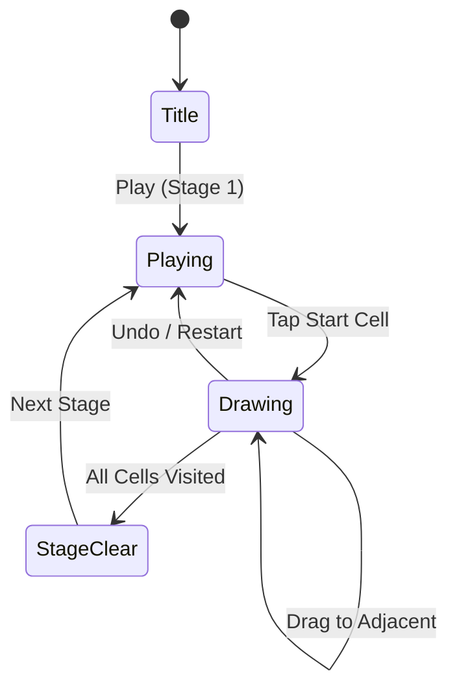

# Line Draw

> 격자 위 모든 칸을 한 번에 이어서 지나가는 한붓그리기 퍼즐

## 개요

격자 보드 위에서 시작점부터 손가락을 드래그하여 모든 칸을 정확히 한 번씩 방문하는 경로를 그리는 퍼즐 게임. 모든 칸을 빠짐없이 지나가면 스테이지 클리어.

## 게임 규칙

### 기본 규칙
- NxN 격자 보드가 주어짐
- 시작점(★)이 표시됨
- 플레이어는 시작점에서 드래그하여 상하좌우로 이동
- 각 칸은 정확히 **한 번만** 방문 가능
- 모든 칸을 방문하면 **스테이지 클리어**
- 막히면 Undo로 한 칸씩 되돌리거나 Restart로 처음부터

### 이동 규칙
- 상하좌우 인접한 칸으로만 이동 가능 (대각선 불가)
- 이미 방문한 칸으로는 이동 불가
- 벽(장애물)이 있는 칸으로는 이동 불가

## 게임 플로우



## UI 레이아웃

```
┌─────────────────────────┐
│  Stage 3   Moves: 12    │  ← 상단 HUD
├─────────────────────────┤
│                         │
│   ┌──┬──┬──┬──┐        │
│   │★ │──│──│  │        │
│   ├──┼──┼──┼──┤        │
│   │  │██│  │  │        │  ← 격자 보드
│   ├──┼──┼──┼──┤        │    ★ = 시작점
│   │  │  │  │  │        │    ██ = 벽
│   ├──┼──┼──┼──┤        │    ── = 경로
│   │  │  │  │  │        │
│   └──┴──┴──┴──┘        │
│                         │
├─────────────────────────┤
│   ↩️ Undo   🔄 Restart  │  ← 하단 버튼
└─────────────────────────┘
```

## 스코어링 시스템

| Action | Score |
|--------|-------|
| 칸 방문 | +10 |
| 스테이지 클리어 | +500 |

## 난이도 설계

| Stage | 격자 크기 | 벽 수 | 비고 |
|-------|-----------|-------|------|
| 1 | 3×3 | 0 | 튜토리얼 |
| 2 | 3×3 | 1 | 벽 도입 |
| 3 | 4×4 | 1 | 크기 확장 |
| 4 | 4×4 | 2 | |
| 5 | 5×5 | 2 | |
| 6 | 5×5 | 3 | |
| 7 | 5×5 | 4 | |
| 8 | 6×6 | 3 | |
| 9 | 6×6 | 4 | |
| 10 | 6×6 | 5 | |

## MVP 범위

### Phase 1 (MVP)
- [x] 기획서 작성
- [ ] NxN 격자 보드 렌더링
- [ ] 시작점 + 드래그 경로 그리기
- [ ] 한붓그리기 규칙 적용
- [ ] 클리어 판정
- [ ] 10 스테이지 (해밀턴 경로 보장)
- [ ] Undo / Restart
