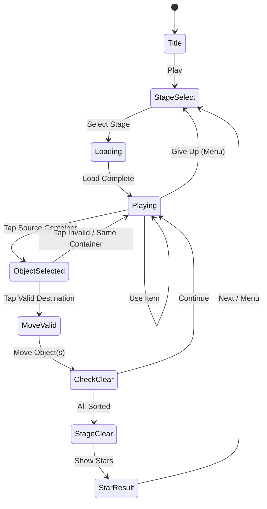

# 매직 정렬! (Magic Sort!)

> 섞인 오브젝트를 같은 종류끼리 컨테이너에 정리하는 중독성 높은 정렬 퍼즐

## 개요

여러 컨테이너(튜브)에 색상/테마 오브젝트가 뒤섞여 있다.
플레이어는 오브젝트를 하나씩 옮겨 각 컨테이너를 동일 종류로 가득 채우면 스테이지 클리어.
빈 컨테이너를 임시 버퍼로 활용하는 전략적 사고가 핵심 재미다.

**레퍼런스**: Ball Sort Puzzle, Water Sort Puzzle (Grand Games A.Ş., 장르 1위권)

---

## 게임 규칙

### 기본 구조

- **컨테이너**: 튜브 형태, 각 컨테이너는 **4칸** 용량
- **오브젝트**: 색상 볼 (MVP 테마), 모든 오브젝트는 N가지 색 중 하나
- **총 오브젝트 수**: `색상 수 × 4` (컨테이너 당 4개씩 완성 목표)
- **빈 컨테이너**: 1~2개 제공 (전략적 버퍼)

### 이동 규칙

1. 소스 컨테이너 탭 → 최상단 오브젝트 선택
2. 목적지 컨테이너 탭 → 아래 조건 충족 시에만 이동 가능:
   - 목적지가 **비어있음**, 또는
   - 목적지 최상단 오브젝트와 **같은 색**, 그리고 **빈 슬롯 있음**
3. 조건 불충족 시 원래 자리로 복귀 (흔들림 애니메이션)

### 연속 이동 (스택 이동)

- 소스 컨테이너 상단에 **동색 오브젝트가 연속으로 쌓인 경우**, 한 번의 이동으로 전부 이동
- 단, 목적지 남은 용량만큼만 이동 (초과 시 가능한 수만큼)

### 클리어 조건

- **모든 컨테이너**가 비어있거나, 하나의 색으로만 가득 찬 상태

### 게임 오버

- 없음 (무한 이동, 막히면 되돌리기 또는 메뉴로 복귀)
- 이동 횟수 카운트 → 별점 산정에 사용

---

## 게임 플로우



### 화면 흐름

| 화면 | 설명 |
|------|------|
| Title | 로고 + Play 버튼 |
| StageSelect | 레벨 맵 (5개씩 묶인 챕터) |
| Playing | 메인 게임 화면 |
| StarResult | 별점 + 다음 레벨 / 재도전 |
| Shop | 아이템 구매 (광고/IAP) |

---

## UI 레이아웃

```
┌─────────────────────────────┐
│  ← Back   Level 12   🔧     │  ← 상단 HUD (레벨, 메뉴)
│           Moves: 24         │
├─────────────────────────────┤
│                             │
│  ┌───┐ ┌───┐ ┌───┐ ┌───┐  │
│  │ 🔵 │ │ 🔴 │ │ 🟡 │ │   │  │
│  │ 🔵 │ │ 🔵 │ │ 🔴 │ │   │  │  ← 컨테이너 영역
│  │ 🔴 │ │ 🟡 │ │ 🟡 │ │   │  │    (4칸 / 튜브)
│  │ 🟡 │ │ 🔴 │ │ 🔵 │ │   │  │
│  └───┘ └───┘ └───┘ └───┘  │
│                             │
│  ┌───┐ ┌───┐               │
│  │ 🔴 │ │   │               │  ← 추가 컨테이너 행
│  │ 🟡 │ │   │               │
│  │ 🔴 │ │   │               │
│  │ 🔴 │ │   │               │
│  └───┘ └───┘               │
│                             │
├─────────────────────────────┤
│  [↩ Undo]  [+ Container]  [💡 Hint] │  ← 아이템 버튼
└─────────────────────────────┘
```

### 선택 상태 UI

- 선택된 컨테이너: 상단 오브젝트 위로 **띄움 애니메이션** (+10px 부상)
- 이동 가능한 목적지: **초록 하이라이트** 테두리
- 이동 불가 목적지: **빨간 하이라이트** (탭 시 흔들림)

---

## 스코어링 / 별점 시스템

### 별점 기준 (이동 횟수 기반)

| 별점 | 조건 |
|------|------|
| ⭐⭐⭐ | 최적 해 × 1.2 이하 이동 |
| ⭐⭐ | 최적 해 × 1.5 이하 이동 |
| ⭐ | 클리어 (이동 횟수 무관) |

> 최적 해는 레벨 생성 시 BFS로 사전 계산

### 클리어 보상

| 조건 | 보상 |
|------|------|
| 첫 클리어 (⭐) | 코인 50 |
| 첫 클리어 (⭐⭐) | 코인 100 |
| 첫 클리어 (⭐⭐⭐) | 코인 150 |
| 별점 향상 시 | 차액 코인 지급 |

---

## 난이도 설계

### 레벨 구조 (MVP: 50레벨)

| 레벨 구간 | 색상 수 | 컨테이너 (색+빈) | 난이도 특징 |
|-----------|---------|-----------------|------------|
| 1~5 | 3 | 3 + 2 | 튜토리얼, 빈 컨테이너 2개 |
| 6~15 | 4 | 4 + 2 | 기본 패턴 학습 |
| 16~25 | 5 | 5 + 1 | 빈 컨테이너 1개로 감소 |
| 26~35 | 6 | 6 + 1 | 섞임 복잡도 증가 |
| 36~45 | 7 | 7 + 1 | 고난도 배치 |
| 46~50 | 8 | 8 + 1 | 최고 난이도 |

### 레벨 생성 알고리즘

1. 완성 상태(각 컨테이너 단색)에서 **역방향으로 N회 랜덤 이동** 생성
2. 이동 횟수 N은 난이도에 따라 증가 (쉬움: 20회, 어려움: 60회)
3. BFS로 최단 해 계산 → 별점 기준값 설정
4. 해가 없으면 재생성

---

## 아이템 시스템

### 아이템 목록

| 아이템 | 효과 | 기본 보유 | 획득 방법 |
|--------|------|-----------|-----------|
| ↩ 되돌리기 (Undo) | 마지막 이동 1회 취소, 최대 5회 연속 가능 | 3회/레벨 | 광고 시청 (+3), IAP |
| ➕ 컨테이너 추가 | 빈 컨테이너 1개 추가 (레벨 당 1회) | 0 | 광고 시청, IAP |
| 💡 힌트 | 다음 최적 이동 하이라이트 표시 | 0 | 광고 시청 (+3), IAP |

### 아이템 UX 흐름

```
[아이템 버튼 탭]
      ↓
보유 수량 있음? ─Yes→ 즉시 사용
      │No
      ↓
광고 시청 팝업: "광고 보고 아이템 받기"
      ├─ 시청 완료 → 아이템 지급 + 즉시 사용
      └─ 거절 → 상점으로 이동 (IAP 구매)
```

---

## 시각적 테마

### 테마 구성 (Phase별 출시)

| 테마 | 오브젝트 | 컨테이너 | 출시 시점 |
|------|---------|---------|-----------|
| 🎨 컬러 볼 | 색상 볼 | 유리 튜브 | MVP (Phase 1) |
| 🍎 과일 | 사과/바나나/포도 등 | 바구니 | Phase 2 |
| 💎 보석 | 루비/사파이어/에메랄드 등 | 보석함 | Phase 2 |
| 🐾 동물 | 고양이/강아지/토끼 등 | 우리(cage) | Phase 3 |

### 테마 전환 방식

- 레벨팩 단위로 테마 변경 (예: 1~50 컬러 볼, 51~100 과일)
- 테마는 스킨 시스템으로 추후 판매 가능 (IAP)
- 게임 로직은 동일, 에셋만 교체

---

## 수익화 모델

### 무료 플레이 기본 구조

- 광고: 레벨 클리어/실패 시 **인터스티셜 광고** (3레벨마다 1회)
- 아이템: **보상형 광고**로 획득
- 광고 제거: **IAP** (₩3,900 / $2.99)

### IAP 상품 목록

| 상품 | 내용 | 가격 |
|------|------|------|
| 광고 제거 | 모든 배너/인터스티셜 제거 | ₩3,900 |
| 아이템 팩 소 | 되돌리기 ×10, 힌트 ×5 | ₩1,900 |
| 아이템 팩 대 | 되돌리기 ×30, 힌트 ×15, 컨테이너 ×10 | ₩4,900 |
| 레벨 스킵 | 현재 레벨 즉시 클리어 (별1) | ₩500 (1회) |

### 수익화 퍼널

```
신규 유저
    → 광고 노출 (인터스티셜)
    → 막히는 레벨에서 아이템 필요 → 광고 리워드 시청
    → 광고 피로도 → 광고 제거 IAP
    → 아이템 계속 소모 → 아이템 팩 IAP
```

---

## 사운드/이펙트

| 이벤트 | 사운드 | 시각 이펙트 |
|--------|--------|------------|
| 오브젝트 선택 | 경쾌한 팝 | 부상 애니메이션 |
| 이동 성공 | 착지 효과음 | 슬라이드 + 바운스 |
| 이동 불가 | 낮은 틱 | 흔들림 |
| 컨테이너 완성 | 맑은 차임 | 파티클 + 글로우 |
| 스테이지 클리어 | 축하 팡파레 | 폭죽 + 별 이펙트 |
| 힌트 표시 | 반짝임 효과음 | 펄스 하이라이트 |

---

## 튜토리얼 설계

### Level 1~3: 가이드 튜토리얼

| 단계 | 내용 |
|------|------|
| 1-1 | "컨테이너를 탭해서 오브젝트를 선택하세요" (화살표 유도) |
| 1-2 | "같은 색 컨테이너 또는 빈 컨테이너로 이동하세요" |
| 1-3 | "모든 컨테이너를 같은 색으로 채우면 클리어!" |
| 2-1 | "빈 컨테이너를 임시 공간으로 활용하세요" |
| 3-1 | 되돌리기 아이템 소개 |

---

## Phaser.io 구현 가이드 (lib 팀 전달)

### 핵심 데이터 구조

```typescript
// 컨테이너 상태
type Container = {
  id: number;
  items: Color[]; // 아래부터 쌓임, items[items.length-1]이 최상단
  capacity: number; // 기본 4
};

// 레벨 상태
type LevelState = {
  containers: Container[];
  moveCount: number;
  history: Container[][]; // Undo용 스냅샷
};
```

### 이동 유효성 검사

```typescript
function canMove(from: Container, to: Container): boolean {
  if (from.items.length === 0) return false;
  if (to.items.length >= to.capacity) return false;
  if (to.items.length === 0) return true; // 빈 컨테이너
  return topColor(from) === topColor(to);
}
```

### 이동 애니메이션 (Phaser Tween)

1. 선택: 오브젝트 Y -20px 이동 (0.15s ease-out)
2. 이동: 소스 → 목적지 호 형태 경로 이동 (0.3s)
3. 착지: 바운스 스케일 (0.9 → 1.0, 0.1s)
4. 완성: 컨테이너 글로우 + 파티클 burst

---

## MVP 범위

### Phase 1 (MVP, 1주 목표)

- [x] 기획서 작성
- [ ] 컬러 볼 테마 에셋 (6가지 색)
- [ ] 핵심 정렬 로직 (이동 유효성 + 클리어 판정)
- [ ] Phaser.io 튜브 컨테이너 렌더링 + 탭 인터랙션
- [ ] 이동 애니메이션 (선택 부상 + 슬라이드)
- [ ] 되돌리기 아이템 (3회/레벨)
- [ ] 50 레벨 데이터 (사전 생성)
- [ ] 스테이지 셀렉트 화면
- [ ] 별점 시스템 (3단계)

### Phase 2

- [ ] 과일 / 보석 테마 추가
- [ ] 보상형 광고 연동 (아이템)
- [ ] 인터스티셜 광고 연동
- [ ] IAP 연동 (광고 제거, 아이템 팩)
- [ ] 컨테이너 추가 아이템
- [ ] 힌트 아이템
- [ ] 사운드/이펙트 완성
- [ ] 무한 모드 (레벨 50 클리어 후)

### Phase 3

- [ ] 동물 테마
- [ ] 시즌 이벤트 레벨팩
- [ ] 친구 랭킹
- [ ] 일일 챌린지
