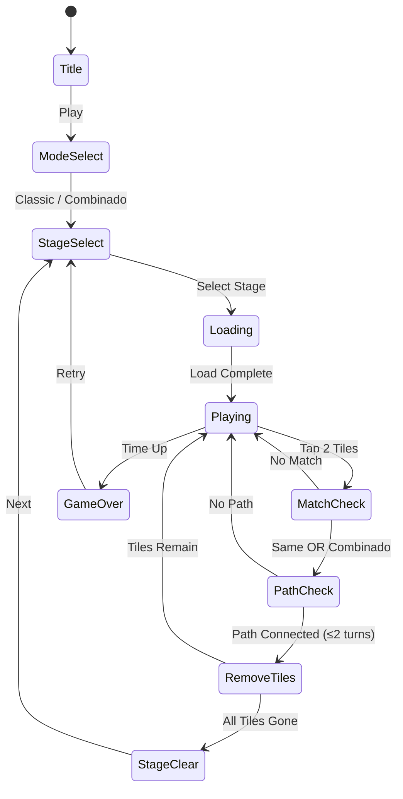

# Mahjong Combinado

> 마작 솔리테어 기반에 "조합 매칭" 메카닉을 추가한 캐주얼 퍼즐 게임.
> 전통 마작 매칭에 수비 전략 레이어를 더해 차별화.

---

## 1. #26 마작 원더스와 비교 분석

### 마작 원더스 (#26) — 추정 특성
| 항목 | 마작 원더스 (#26) | Mahjong Combinado (#44) |
|------|------------------|------------------------|
| 핵심 메카닉 | 전통 마작 솔리테어 (동일 타일 2개 매칭) | **조합 매칭**: 동일 타일 OR 합산 조합 타일 매칭 |
| 연결 규칙 | 노출된(free) 타일만 선택 | **경로 연결(Shisen-Sho)**: 최대 2번 꺾인 선으로 연결 가능 시 매칭 |
| 전략 깊이 | 레이어 언블로킹 | 경로 계획 + 조합 선택 |
| 차별화 포인트 | 왕더스/유적 테마, 다양한 레이아웃 | 수학적 조합 퍼즐, 콤보 체인 |
| 타깃 유저 | 전통 마작 팬 | 퍼즐 + 전략 팬, 숫자 게임 팬 |

### 핵심 차이점: "Combinado" 메카닉
- **원더스**: 동일한 타일 2개만 매칭 (완전 동일)
- **Combinado**: 동일 타일 OR **숫자 합이 목표값(10)이 되는 두 숫자 타일** 매칭
  - 예: `4`타일 + `6`타일 → 합 10 → 매칭 성립
  - 예: `🐉` + `🐉` → 동일 → 매칭 성립
- 이 규칙이 "더 많은 매칭 기회"와 "전략적 선택"을 동시에 제공

---

## 2. 마작 변형 규칙 (Combinado Rules)

### 기본 전제: Shisen-Sho + Combinado
전통 마작 솔리테어(레이어 언블로킹)가 아닌 **Shisen-Sho** 방식 기반:
- 모든 타일은 **평면 그리드**에 배치 (레이어 없음)
- 두 타일을 선택했을 때, **최대 2번 꺾이는 직선 경로**로 연결 가능하면 매칭

### 매칭 조건 (두 가지 중 하나 충족)
```
조건 A: 동일 타일 (Identical Match)
  → 같은 심볼/그림의 타일 2개 + 경로 연결 가능

조건 B: 조합 매칭 (Combinado Match) — 숫자 타일만 해당
  → 두 타일의 숫자 합 = 10 + 경로 연결 가능
  → 유효 조합: (1,9) (2,8) (3,7) (4,6) (5,5)
```

### 타일 종류
| 분류 | 타일 | 매칭 방식 |
|------|------|-----------|
| 숫자 타일 (18종) | 1~9 × 2세트 | 동일 매칭 + Combinado 매칭 |
| 심볼 타일 (8종) | 드래곤, 바람(4방위), 별, 달, 태양 | 동일 매칭만 |
| 와일드 타일 (2종) | 조커(🃏) | 모든 타일과 매칭 가능 |

### Combinado 콤보 시스템
- 연속으로 Combinado 매칭(조합 매칭) 시 콤보 점수 누적
- 콤보 3 이상: 보드 위 힌트 하이라이트 1회 무료 제공
- 콤보 5 이상: 시간 +10초 보너스

### 경로 연결 규칙 (Shisen-Sho)
```
유효한 경로 예시:

A ─────── B         (직선, 꺾임 0회) ✅
A ─┐
   └───── B         (꺾임 1회) ✅
A ─┐
   │   ┌─ B
   └───┘             (꺾임 2회) ✅
A ─┐
   │   ┌─ ?
   └───┘             (3회 이상) ❌
```
- 경로는 빈 칸 또는 보드 외곽을 통과할 수 있음
- 다른 타일을 통과할 수 없음

---

## 3. 배치 패턴 (레이아웃 템플릿)

모든 레이아웃은 **짝수 개 타일** (Combinado 매칭 고려해 4의 배수 권장)

### 레이아웃 1: 클래식 그리드 (입문)
```
┌──┬──┬──┬──┬──┬──┐
│  │  │  │  │  │  │
├──┼──┼──┼──┼──┼──┤
│  │  │  │  │  │  │
├──┼──┼──┼──┼──┼──┤
│  │  │  │  │  │  │
├──┼──┼──┼──┼──┼──┤
│  │  │  │  │  │  │
└──┴──┴──┴──┴──┴──┘
  6×4 = 24타일 (난이도 1~2)
```

### 레이아웃 2: 다이아몬드 (중급)
```
      ┌──┐
    ┌──┬──┬──┐
  ┌──┬──┬──┬──┬──┐
┌──┬──┬──┬──┬──┬──┬──┐
  └──┴──┴──┴──┴──┘
    └──┴──┴──┘
      └──┘
  마름모형 36타일 (난이도 3~4)
```

### 레이아웃 3: 나비 (고급)
```
┌──┬──┐     ┌──┬──┐
├──┼──┼──┬──┼──┼──┤
├──┼──┼──┼──┼──┼──┤
├──┼──┼──┴──┼──┼──┤
└──┴──┘     └──┴──┘
  나비형 28타일 (난이도 4~5)
```

### 레이아웃 4: 십자 (전문가)
```
   ┌──┬──┬──┐
   ├──┼──┼──┤
┌──┼──┼──┼──┼──┐
├──┼──┼──┼──┼──┤
├──┼──┼──┼──┼──┤
└──┼──┼──┼──┼──┘
   ├──┼──┼──┤
   └──┴──┴──┘
  십자형 40타일 (난이도 5+)
```

### 레이아웃 5: 스파이럴 (보스 스테이지)
```
┌──┬──┬──┬──┬──┬──┐
│  ├──┬──┬──┬──┤  │
│  │  ├──┬──┤  │  │
│  │  │  │  │  │  │
│  │  └──┴──┘  │  │
│  └──┴──┴──┴──┘  │
└──┴──┴──┴──┴──┴──┘
  나선형 48타일 (보스 스테이지)
```

### 난이도별 레이아웃 배정
| 스테이지 | 레이아웃 | 타일 수 | 시간(초) | Combinado 타일 비율 |
|----------|----------|---------|----------|-------------------|
| 1~5 | 클래식 그리드 | 24 | 180 | 60% |
| 6~10 | 다이아몬드 | 36 | 150 | 50% |
| 11~15 | 나비 | 28 | 120 | 40% |
| 16~20 | 십자 | 40 | 120 | 40% |
| 보스 | 스파이럴 | 48 | 90 | 30% |

---

## 4. 시각 스타일

### 메인 테마: "모던 오리엔탈"
전통 마작의 동양적 감성 + 현대적 플랫 디자인

#### 색상 팔레트
| 요소 | 색상 | Hex |
|------|------|-----|
| 배경 | 다크 옥색 | `#1A3A3A` |
| 타일 기본 | 크림 아이보리 | `#F5F0E8` |
| 타일 테두리 | 금색 | `#C9A84C` |
| 숫자 타일 텍스트 | 버건디 | `#8B1A1A` |
| 심볼 타일 텍스트 | 인디고 | `#2C3E6B` |
| 선택된 타일 글로우 | 골드 | `#FFD700` |
| 경로 표시 | 민트 반투명 | `#00FF9980` |
| Combinado 매칭 이펙트 | 오렌지→골드 그라데이션 | `#FF6B00→#FFD700` |

#### 타일 디자인
- 크기: 64×80px (가로×세로, 세로 직사각형)
- 모서리 반경: 8px
- 그림자: 오른쪽 하단 3px 오프셋 (입체감)
- 숫자: 굵은 세리프 폰트 (중앙 대형 표시)
- 심볼: 아이콘 스타일 (중앙 64px 아이콘)

#### 배경 테마 (언락 가능)
1. **기본 - 대나무 정원**: 흐릿한 대나무 패턴 배경
2. **고궁 - 금빛 전각**: 황금 건축물 테마 (인앱)
3. **야경 - 등불 축제**: 네온 등불 다크 테마 (인앱)
4. **수묵화 - 먹빛**: 흑백 수묵화 테마 (인앱)

#### 이펙트
- **동일 매칭**: 타일이 은색 빛으로 사라짐
- **Combinado 매칭**: 두 타일 사이 오렌지 불꽃 이펙트 → 합쳐지며 폭발
- **콤보**: 화면 상단 콤보 카운터 확대 + 배경 잠깐 밝아짐
- **게임오버**: 타일들이 보드 위에서 흐트러짐 (파티클)

---

## 5. #26 마작 원더스와 통합 전략

### 단일 앱 "마작 유니버스" 통합 방안

두 게임의 장점을 살려 **하나의 앱** 안에 두 모드로 통합:

```
마작 유니버스 (Mahjong Universe)
├── 클래식 모드 (= 마작 원더스 #26)
│   ├── 전통 타일 레이어 방식
│   ├── 동일 타일 2개 매칭
│   └── 피라미드/거북 등 전통 레이아웃
└── Combinado 모드 (= 마작 Combinado #44)
    ├── Shisen-Sho 경로 방식
    ├── 동일 + 조합 매칭
    └── 그리드 기반 레이아웃
```

### 통합의 이점
- 개발 자원 효율화: 타일 에셋, 사운드, 수익화 코드 공유
- 유저 리텐션: 한 모드에 지루해지면 다른 모드로 전환 (앱 이탈 방지)
- ASO: "마작" 키워드 단일 앱으로 검색 노출 극대화
- 광고 단가 상승: DAU 통합으로 광고 인벤토리 확대

### 공유 인프라 (lib/ 레벨)
```typescript
// lib/mahjong-universe/
├── src/
│   ├── tiles/          ← 타일 정의, 렌더링 (양쪽 공유)
│   ├── scoring/        ← 스코어 시스템 (양쪽 공유)
│   ├── modes/
│   │   ├── classic/    ← 원더스 로직
│   │   └── combinado/  ← Combinado 로직
│   └── layouts/        ← 레이아웃 템플릿 (양쪽 공유)
```

---

## 6. 마작 타일셋 (저작권 회피)

### 커스텀 심볼 체계

전통 마작 타일(대나무/만수/원)을 **완전히 새로운 테마**로 대체:

#### 테마: "동양 판타지 원소"

| 전통 마작 | 커스텀 심볼 | 설명 |
|-----------|-------------|------|
| 1만 (一萬) | 🔥 불꽃1 | 원소 숫자 타일 (1~9) |
| 2만 (二萬) | 🌊 물결2 | 원소 숫자 타일 |
| ... 숫자 계열 | 원소 아이콘 + 숫자 | 9개 × 2세트 |
| 동(東) | ⬆️ 상승풍 | 바람 방위 4종 |
| 서(西) | ⬇️ 하강풍 | |
| 남(南) | ➡️ 순풍 | |
| 북(北) | ⬅️ 역풍 | |
| 중(中) | 🐲 드래곤 | 드래곤 심볼 |
| 발(發) | ✨ 별빛 | 별 심볼 |
| 백(白) | 🌙 달빛 | 달 심볼 |

#### 숫자 타일 원소 배정
| 숫자 | 원소 | 색상 |
|------|------|------|
| 1 | 불 🔥 | 레드 |
| 2 | 물 💧 | 블루 |
| 3 | 나무 🌿 | 그린 |
| 4 | 금 ✨ | 골드 |
| 5 | 흙 🪨 | 브라운 |
| 6 | 번개 ⚡ | 옐로 |
| 7 | 바람 🌀 | 시안 |
| 8 | 얼음 🧊 | 아이스블루 |
| 9 | 공허 🌑 | 퍼플 |

### 저작권 안전성
- 모든 심볼은 독창적 디자인 (픽토그램 스타일 자체 제작)
- 숫자 + 원소 조합은 마작 타일의 기능적 구조만 차용 (저작권 비보호 영역)
- 타일 외형(색상, 배경, 폰트)은 완전 독자 디자인

---

## 7. 수익화 전략

### 수익 모델: Free-to-Play + IAP

#### 광고 수익 (주력)
| 광고 타입 | 트리거 | 예상 수익 |
|-----------|--------|-----------|
| 인터스티셜 | 스테이지 클리어 3회마다 | 높음 |
| 리워드 광고 | 힌트 1회 무료 획득 | 높음 (유저 자발적) |
| 배너 | 스테이지 셀렉트 화면 | 낮음 |

#### IAP (인앱 결제)
| 상품 | 가격 | 내용 |
|------|------|------|
| 힌트 팩 x5 | ₩1,200 | 경로 힌트 5회 |
| 셔플 팩 x3 | ₩1,200 | 보드 재배치 3회 |
| 시간 연장 팩 x5 | ₩1,200 | +30초 추가 5회 |
| 테마 팩 - 고궁 | ₩2,400 | 금빛 전각 테마 영구 |
| 테마 팩 - 야경 | ₩2,400 | 등불 야경 테마 영구 |
| 테마 팩 - 수묵화 | ₩2,400 | 흑백 수묵 테마 영구 |
| 광고 제거 | ₩4,900 | 광고 없는 플레이 영구 |
| VIP 번들 | ₩9,900 | 광고 제거 + 모든 테마 + 힌트 20개 |

#### 무료 경제 (리텐션용)
- 매일 로그인 보너스: 힌트 1개
- 5스테이지 클리어 시 셔플 1개
- 광고 시청 → 힌트 1개 즉시 지급

#### 핵심 밸런스 원칙
- 힌트 없이도 클리어 가능한 난이도 유지 (강매 금지)
- 단, 고급 스테이지(16+)는 힌트 없이 매우 어렵게 설계
- 광고 시청이 불편하지 않도록 스킵 가능 리워드 중심

---

## 8. 결론: 마작 장르 (#26 + #44) 단일 앱 전략

### 권고: 하나의 앱으로 통합 출시

> **"마작 유니버스 (Mahjong Universe)"** — 두 게임을 하나의 앱으로

#### 이유
1. **개발 속도**: 공통 타일/사운드/수익화 1회 개발, 2개 모드 출시 = 1.5배 속도
2. **시장 검증**: 두 메카닉 동시 A/B 테스트 가능 → 데이터 기반 집중 투자
3. **ASO 효율**: "마작" 앱 1개 → 리뷰/다운로드 집중, 스토어 노출 극대화
4. **리텐션**: 두 모드 간 전환으로 유저 체류 시간 증가

#### 개발 우선순위 (MVP 1~2주)
```
Week 1:
  - 타일 에셋 제작 (커스텀 원소 심볼)
  - lib/mahjong-universe: 타일 렌더링 + Shisen-Sho 경로 알고리즘
  - Combinado 매칭 로직

Week 2:
  - 클래식 모드 기본 레이아웃 3종
  - Combinado 모드 레이아웃 3종
  - 스코어/타이머/게임오버 UI
  - 광고 SDK 연동
  - web/rn 빌드
```

#### 성공 KPI (출시 후 4주)
| 지표 | 목표 |
|------|------|
| Day 1 Retention | > 40% |
| Day 7 Retention | > 20% |
| 평균 세션 시간 | > 8분 |
| ARPDAU | > ₩50 |
| 힌트 구매 전환율 | > 3% |

---

## 개요

마작과 유사한 경로-연결 퍼즐에 "조합 매칭(Combinado)" 메카닉을 추가한 캐주얼 퍼즐 게임.
숫자 타일의 합이 10이 되는 두 타일도 매칭 가능하여 전략적 선택의 폭이 넓음.

## 게임 규칙

### 기본 규칙
- 평면 그리드에 타일이 배치됨 (레이어 없음)
- 두 타일을 선택 시, **최대 2번 꺾이는 경로**로 연결 가능하면 매칭
- 매칭 조건: 동일 타일 OR 숫자 합 = 10 (Combinado)
- 모든 타일 제거 시 스테이지 클리어
- 시간 내 클리어 불가 시 게임 오버

### 아이템
| 아이템 | 효과 |
|--------|------|
| 힌트(🔍) | 매칭 가능한 타일 쌍 1개 하이라이트 |
| 셔플(🔀) | 보드 타일 위치 랜덤 재배치 |
| 시간 연장(⏰) | +30초 |

## 게임 플로우



## UI 레이아웃

```
┌─────────────────────────┐
│  ⏱ 2:30   ⭐ 1,240  🔍x2│  ← HUD (타이머, 점수, 힌트)
├─────────────────────────┤
│                         │
│  ┌─┐ ┌─┐ ┌─┐ ┌─┐ ┌─┐  │
│  │🔥│ │💧│ │🌿│ │✨│ │🪨│ │
│  │1 │ │2 │ │3 │ │4 │ │5 │ │
│  └─┘ └─┘ └─┘ └─┘ └─┘  │
│  ┌─┐ ┌─┐ ┌─┐ ┌─┐ ┌─┐  │  ← 타일 그리드
│  │⚡│ │🌀│ │🧊│ │🌑│ │🐲│ │
│  │6 │ │7 │ │8 │ │9 │ │  │ │
│  └─┘ └─┘ └─┘ └─┘ └─┘  │
│    [선택된 타일 글로우]   │
│                         │
├─────────────────────────┤
│  🔍 힌트  🔀 셔플  ⏰ +30 │  ← 아이템 바
└─────────────────────────┘
```

## 스코어링 시스템

| 액션 | 점수 |
|------|------|
| 동일 매칭 제거 | +100 |
| Combinado 매칭 제거 | +150 (보너스 +50%) |
| 콤보 (연속 Combinado) | +150 × 콤보 수 |
| 스테이지 클리어 | +500 |
| 남은 시간 보너스 | 남은초 × 10 |

## 난이도 설계

| 레벨 | 레이아웃 | 타일 수 | 시간(초) | Combinado 비율 |
|------|----------|---------|----------|---------------|
| 1~5 | 클래식 그리드 | 24 | 180 | 60% |
| 6~10 | 다이아몬드 | 36 | 150 | 50% |
| 11~15 | 나비 | 28 | 120 | 40% |
| 16~20 | 십자 | 40 | 120 | 40% |
| 보스 | 스파이럴 | 48 | 90 | 30% |

## 사운드/이펙트

- 타일 선택: 나무 두드리는 소리 (동양적)
- 동일 매칭: 은방울 소리
- Combinado 매칭: 불꽃 + 깊은 종소리 (차별화)
- 콤보: 상승하는 현악기 멜로디
- 스테이지 클리어: 가야금 축하 음악
- 게임 오버: 낮은 드럼 소리

## MVP 범위

### Phase 1 (MVP — 1주)
- [ ] 기획서 작성 ✅
- [ ] 커스텀 원소 타일 에셋 (18 숫자 + 8 심볼 + 2 와일드)
- [ ] Shisen-Sho 경로 알고리즘 (최대 2회 꺾임)
- [ ] Combinado 매칭 로직 (합 = 10)
- [ ] 클래식 그리드 레이아웃 (스테이지 1~5)
- [ ] 타이머 + 스코어 HUD
- [ ] 게임 오버 / 스테이지 클리어

### Phase 2 (출시 후)
- [ ] 다이아몬드/나비/십자/스파이럴 레이아웃
- [ ] 콤보 시스템 + 이펙트
- [ ] 테마 팩 (야경/고궁/수묵화)
- [ ] 광고 SDK + IAP 연동
- [ ] 클래식 모드 통합 (마작 원더스 #26 병합)
