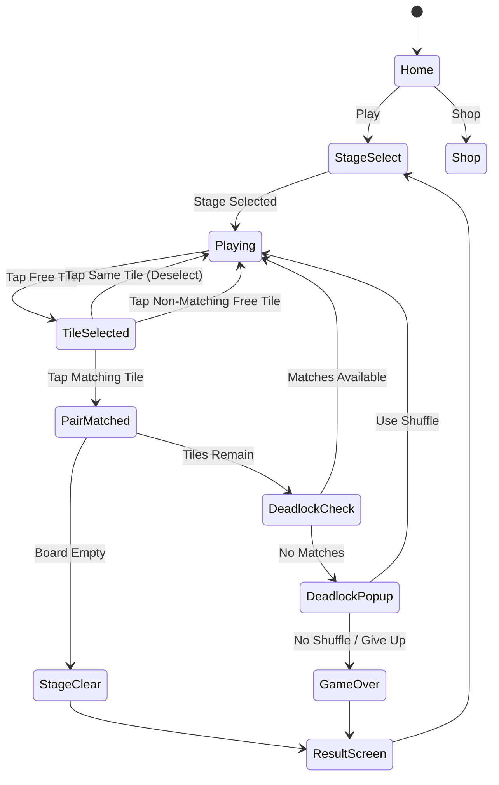

# Mahjong Match — 기능 기획서

> **레퍼런스**: Unicorn Board Games / Rating 4.5 / Genre: mahjong / Rank #96
> **개발 목표**: MVP 1주 내 출시 가능한 마작 솔리테어 퍼즐

---

## 1. 마작 장르 레퍼런스 비교 분석

### 세 개의 마작 이슈 종합

| 항목 | #26 (Mahjong Solitaire) | #44 (Mahjong Connect) | #96 (Mahjong Match - 본 기획) |
|------|------------------------|----------------------|-------------------------------|
| 핵심 메카닉 | 피라미드 배치, 자유 타일 쌍 제거 | 직선+꺾임 경로로 쌍 연결 | **피라미드 + 힌트/셔플 강화판** |
| 난이도 구조 | 배치 패턴별 고정 | 보드 크기 확장 | **레이어+패턴 조합** |
| 수익화 가능성 | 중 (테마팩) | 중 (시간제한 해제) | **고 (테마팩+힌트+레벨팩)** |
| 구현 난이도 | 중상 | 중 | **중 (재사용성 최고)** |
| 차별점 | 없음 (레드오션) | 없음 | **커스텀 타일셋 + 보장 알고리즘** |
| 추천 순위 | 3위 | 2위 | **1위 ✅** |

### 결론: 마작 단일 앱 확정

세 레퍼런스를 종합한 결과, **#96 Mahjong Match를 단일 앱으로 확정**한다.

- #26, #44는 별도 게임으로 출시하지 않고 **#96에 통합 모드**로 흡수
- "Mahjong Match"가 솔리테어 + 연결 + 매칭을 아우르는 브랜드가 됨
- 하나의 앱에서 여러 모드를 제공 → 리텐션 극대화

---

## 2. 게임 개요

> 마작 타일이 레이어로 쌓인 보드에서, **자유로운(free) 타일 중 같은 무늬 2개**를 탭하여 제거.
> 모든 타일을 제거하면 스테이지 클리어.

### 핵심 재미 루프

```
타일 탐색 → 자유 타일 식별 → 쌍 매칭 → 제거 → 새 타일 노출 → 반복
```

### 왜 이 게임인가?

- **전 세계 검증된 장르**: App Store/Play Store 마작 솔리테어 카테고리 상위권 다수
- **광고 친화적**: 힌트/셔플 소비 → 광고 시청 자연 유도
- **IAP 자연스러움**: 테마 팩, 레벨 팩 구매 욕구 높음
- **세션 길이 조절 가능**: 3분~15분, 광고 삽입 타이밍 제어 용이

---

## 3. 게임 규칙

### 기본 규칙

- 보드에 마작 타일이 **피라미드(레이어) 형태**로 배치
- **자유 타일(Free Tile)**: 위에 타일이 없고, 좌우 중 한쪽 이상이 열린 타일
- 자유 타일 중 **같은 무늬 2개**를 탭하면 제거
- 모든 타일 제거 시 **스테이지 클리어**
- 더 이상 매칭 가능한 쌍이 없으면 **교착(Deadlock)** → 셔플 소모 또는 게임 오버

### 자유 타일 판별 조건

```
isFree(tile):
  1. tile 위에 다른 타일이 없음 (완전히 노출)
  2. tile의 왼쪽 OR 오른쪽이 비어있음
  → 두 조건 모두 충족 시 선택 가능
```

### 타일 종류 (기본 세트, 144장)

| 분류 | 종류 | 장수 | 비고 |
|------|------|------|------|
| 수패 (1~9) | 통/대나무/만 각 9종 | 각 4장 | 같은 숫자/무늬 |
| 자패 | 동/서/남/북/중/발/백 7종 | 각 4장 | 같은 종류 |
| 화패 | 봄/여름/가을/겨울 | 각 1장 | 화패끼리 어떤 조합이든 매칭 |
| 계절패 | 국화/매/난/죽 | 각 1장 | 계절패끼리 어떤 조합이든 매칭 |

> MVP에서는 단순화: 통/대나무/만 수패 + 자패만 사용 (총 108장)

---

## 4. 타일 디자인 — 저작권 안전 커스텀 세트

### 디자인 원칙

- **전통 마작 기호 사용 금지** (일부 특정 회사 폰트 저작권 이슈)
- **기하학적 추상 아이콘**으로 대체 → 저작권 완전 자유

### 기본 타일셋: "Minimal" (기본 제공)

| 분류 | 시각 표현 | 예시 |
|------|-----------|------|
| 수패 1~9 | 숫자 + 도형 색상 | 빨강=1, 주황=2 ... |
| 통패 | 원형 패턴 (1~9개 원) | ⬤ ⬤⬤ ... |
| 대나무패 | 막대 패턴 (1~9개 막대) | ▌▌▌ ... |
| 만패 | 숫자 한자 대신 로마숫자 | I, II, III ... |
| 자패 | 방향 화살표 / 색상 블록 | ↑↓←→ / 🟥🟩 |
| 화/계절 | 꽃/잎 단순 아이콘 | ✿ ❋ ✦ ❊ |

### 프리미엄 테마팩 (수익화)

| 테마 | 컨셉 | 가격 |
|------|------|------|
| 🌸 Cherry Blossom | 봄 꽃 수채화 스타일 | $1.99 |
| 🌊 Ocean | 파도/조개 아쿠아 스타일 | $1.99 |
| 🏮 Festival | 랜턴/금색 전통 스타일 | $1.99 |
| 🌙 Night | 다크모드 별자리 스타일 | $1.99 |
| 🎮 Pixel | 8비트 레트로 스타일 | $1.99 |
| **All Pack** | 전체 테마 번들 | $5.99 |

---

## 5. 배치 알고리즘 — 반드시 클리어 가능한 보장 생성

### 핵심 문제

일반 랜덤 배치는 **교착 상태(deadlock)** 발생 가능 → 유저 이탈 원인

### 해결: Reverse-Build 알고리즘

```
1. 빈 보드에서 시작
2. 타일 쌍을 역순으로 배치 (Remove 과정을 역으로 실행)
3. 각 스텝: 현재 free 위치 중 랜덤 2곳 선택 → 쌍 타일 배치
4. 모든 타일 배치 완료 → 완성 보드
5. 검증: forward simulation으로 클리어 가능 확인
```

```typescript
function generateSolvableBoard(layout: Position[]): TileBoard {
  const tiles = shufflePairs(ALL_TILES); // 쌍으로 섞기
  const board = new TileBoard(layout);
  const removalOrder: [Position, Position][] = [];

  // Reverse-build: 제거 순서의 역순으로 배치
  while (tiles.length > 0) {
    const freePairs = board.getFreePairs();
    if (freePairs.length === 0) {
      // 배치 불가 → 재시도
      return generateSolvableBoard(layout);
    }
    const [posA, posB] = randomPick(freePairs);
    board.place(posA, tiles.pop());
    board.place(posB, tiles.pop());
    removalOrder.push([posA, posB]);
  }

  return board;
}
```

### 검증 단계

```typescript
function verifySolvable(board: TileBoard): boolean {
  const sim = board.clone();
  while (!sim.isEmpty()) {
    const pairs = sim.getMatchablePairs();
    if (pairs.length === 0) return false; // 교착
    sim.remove(randomPick(pairs));
  }
  return true;
}
```

### 난이도별 배치 패턴

| Level | 레이아웃 | 타일 수 | 레이어 | 추정 소요 시간 |
|-------|----------|---------|--------|---------------|
| Easy 1~10 | 피라미드 기본 | 72장 | 3 | 3~5분 |
| Normal 11~30 | 거북이/용 | 108장 | 4 | 5~10분 |
| Hard 31~50 | 크로스/탑 | 144장 | 5 | 10~15분 |
| Expert 51+ | 랜덤 생성 | 144장 | 5~6 | 15분+ |

---

## 6. 게임 플로우



---

## 7. UI 레이아웃

```
┌─────────────────────────────┐
│  ← Back    Stage 5    ⚙️   │  ← 상단 네비게이션
│  ⭐ 1,240        🕐 05:32   │  ← 점수 / 타이머
├─────────────────────────────┤
│                             │
│      [타일 보드 영역]        │
│   피라미드 형태 타일 배치    │
│   선택된 타일: 황색 테두리   │
│   자유 타일: 밝게 표시       │
│   잠긴 타일: 어둡게 표시     │
│                             │
├─────────────────────────────┤
│  💡 Hint (3)  🔀 Shuffle(2) │  ← 아이템 버튼
│  ↩️ Undo (∞)  🔁 Restart   │
└─────────────────────────────┘
```

### 타일 선택 피드백

- **자유 타일 탭**: 황금 테두리 + 살짝 위로 이동 애니메이션
- **쌍 매칭 성공**: 페이드아웃 + 파티클 이펙트
- **매칭 불가 탭**: 짧은 진동(haptic) + 빨간 테두리 깜빡임
- **자유 타일 하이라이트**: 살짝 밝게 표시 (어두운 잠긴 타일과 대비)

---

## 8. 스코어링 시스템

| 이벤트 | 점수 |
|--------|------|
| 쌍 제거 | +50 |
| 연속 매칭 콤보 (3초 내) | +50 × 콤보 수 |
| 힌트 미사용 클리어 | +500 보너스 |
| 셔플 미사용 클리어 | +300 보너스 |
| 스테이지 클리어 | +1,000 |
| 남은 시간 보너스 | 남은초 × 5 |

### 스타 평가

| 별 | 조건 |
|----|------|
| ⭐⭐⭐ | 힌트 0, 셔플 0, 제한 시간 50% 이상 남음 |
| ⭐⭐ | 힌트 2 이하 또는 셔플 1 이하 |
| ⭐ | 클리어만 하면 획득 |

---

## 9. 수익화 전략

### 광고 (주 수익)

| 광고 타입 | 트리거 | 예상 빈도 |
|-----------|--------|----------|
| 보상형 광고 | 힌트/셔플 소진 시 "광고 보고 1개 충전" | 스테이지당 1~3회 |
| 인터스티셜 | 5스테이지마다 결과 화면 후 | 5판당 1회 |
| 배너 | 홈/스테이지 선택 화면 하단 | 상시 |

### IAP (부 수익)

| 상품 | 가격 | 내용 |
|------|------|------|
| 광고 제거 | $2.99 | 영구 광고 제거 |
| 힌트 팩 x10 | $0.99 | 힌트 10개 |
| 셔플 팩 x10 | $0.99 | 셔플 10개 |
| 스타터 번들 | $1.99 | 광고제거 1주 + 힌트 20 + 셔플 10 |
| 테마팩 각각 | $1.99 | 5개 프리미엄 테마 |
| 올인원 번들 | $9.99 | 영구 광고제거 + 전 테마 + 힌트/셔플 50 |

### 아이템 경제

```
기본 지급: 힌트 5개, 셔플 3개 (설치 시)
매일 보상: 힌트 1개 (일일 첫 로그인)
광고 충전: 힌트 1개 or 셔플 1개 (30초 광고)
```

---

## 10. 아이템/도구 상세

| 아이템 | 효과 | 소비 |
|--------|------|------|
| 💡 Hint | 매칭 가능한 쌍 1조 하이라이트 (3초) | 1개 |
| 🔀 Shuffle | 현재 free 타일들을 랜덤 재배치 (클리어 보장 유지) | 1개 |
| ↩️ Undo | 마지막 제거한 쌍 복원 | 무제한 |
| 🔁 Restart | 현재 스테이지 초기화 | 무료 |

---

## 11. 기술 구현 설계

### lib/mahjong-match (Phaser.io)

```
lib/mahjong-match/
├── src/
│   ├── scenes/
│   │   ├── GameScene.ts      # 메인 게임 씬
│   │   ├── HomeScene.ts      # 홈 화면
│   │   └── ResultScene.ts    # 결과 화면
│   ├── core/
│   │   ├── TileBoard.ts      # 보드 상태 관리
│   │   ├── Tile.ts           # 타일 데이터/렌더
│   │   ├── BoardGenerator.ts # 클리어 보장 생성 알고리즘
│   │   └── MatchChecker.ts   # 매칭 판별 로직
│   ├── layouts/
│   │   ├── pyramid.ts        # 피라미드 배치
│   │   ├── turtle.ts         # 거북이 배치
│   │   └── dragon.ts         # 용 배치
│   └── types/
│       └── index.ts
```

### web/mahjong-match (React + Stitches)

```
web/mahjong-match/
├── src/
│   ├── App.tsx
│   ├── components/
│   │   ├── GameCanvas.tsx    # Phaser 캔버스 래퍼
│   │   ├── HUD.tsx           # 점수/타이머 오버레이
│   │   └── ItemBar.tsx       # 힌트/셔플 버튼
│   └── hooks/
│       └── useGameBridge.ts  # Phaser ↔ React 이벤트 브릿지
```

### mahjong-match/rn (React Native)

```
mahjong-match/rn/
├── App.tsx
├── screens/
│   └── GameScreen.tsx        # WebView 래퍼
└── bridge/
    └── AdBridge.ts           # 광고 SDK 연동
```

---

## 12. MVP 범위 및 구현 난이도

### Phase 1 — MVP (1주)

| 작업 | 담당 | 난이도 | 우선순위 |
|------|------|--------|----------|
| 기본 타일 배치 (피라미드) | Game Core | 중 | P0 |
| 자유 타일 판별 로직 | Game Core | 중상 | P0 |
| 쌍 매칭 + 제거 | Game Core | 하 | P0 |
| 클리어 보장 생성 알고리즘 | Game Core | 상 | P0 |
| 교착 감지 | Game Core | 중 | P0 |
| React 웹 빌드 | Web Frontend | 하 | P0 |
| RN WebView 래핑 | RN App | 하 | P0 |
| 기본 타일 그래픽 (Minimal) | Game Core | 하 | P0 |
| 힌트/셔플 기능 | Game Core | 중 | P1 |
| 10스테이지 (Easy만) | Game Core | 하 | P0 |

### Phase 2 — 수익화 연동 (2주차)

| 작업 | 담당 | 난이도 |
|------|------|--------|
| 보상형 광고 연동 | RN App | 중 |
| IAP 연동 | RN App | 중상 |
| 테마팩 1종 (Cherry Blossom) | Web Frontend | 하 |
| 스테이지 30개 추가 | Game Core | 하 |
| 스코어/스타 시스템 | Game Core | 하 |

### Phase 3 — 성장 (3주차+)

- 추가 테마팩
- 일일 챌린지 스테이지
- 리더보드

---

## 13. 결론 및 확정 기획

### 마작 게임 확정 결정

```
✅ #96 Mahjong Match = 마작 솔리테어 단일 앱으로 확정
❌ #26 별도 출시 취소 → #96에 흡수
❌ #44 별도 출시 취소 → #96에 흡수 (향후 "Connect Mode"로 추가 가능)
```

### 핵심 차별화 요소

1. **클리어 100% 보장 알고리즘**: 유저 이탈 방지 (경쟁 앱 대비 최대 장점)
2. **커스텀 타일셋**: 저작권 리스크 0, 테마팩 수익화 기반
3. **found3 인프라 재사용**: lib/web/rn 파이프라인 동일 → 개발 속도 2배

### 구현 난이도: 중 (1~2주 MVP 가능)

- 가장 복잡한 부분: 클리어 보장 알고리즘 (3~4일)
- 나머지: found3 구조 복사 후 로직 교체 (2~3일)

### 우선순위

```
P0 (즉시): Mahjong Match MVP 개발 시작
P1 (1주 후): 광고 연동 후 스토어 출시
P2 (2주 후): IAP + 테마팩으로 수익 극대화
```

---

*기획서 작성일: 2026-03-27 | 담당: PRD Team*
