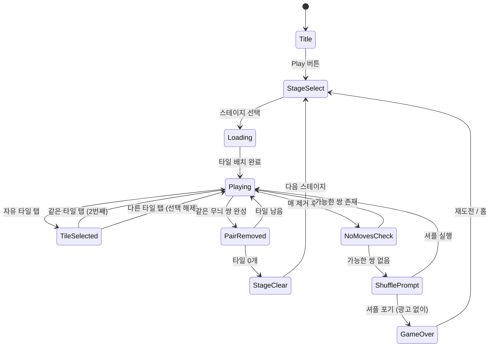

# 마작 원더스 (Mahjong Wonders)

> 클래식 마작 타일 매칭 게임. 자유로운 타일 쌍을 찾아 제거하고 모든 타일을 클리어하라.

## 개요

144개의 마작 타일이 피라미드형으로 쌓여 있다. 플레이어는 **양쪽이 열리고 위에 타일이 없는** 자유 타일 중 같은 무늬 2개를 선택해 제거한다. 모든 타일을 제거하면 스테이지 클리어.

## 게임 규칙

### 기본 규칙

- 타일은 여러 레이어로 쌓인 3D 구조로 배치됨
- 플레이어는 **자유 타일(free tile)** 중에서만 선택 가능
- 같은 무늬의 자유 타일 2개를 선택하면 쌍이 제거됨
- 모든 타일 제거 → 스테이지 클리어
- 자유 타일 중 매칭 가능한 쌍이 없으면 → 셔플 or 게임 오버

### 자유 타일(Free Tile) 조건

타일이 **자유 타일**이 되려면 다음 두 조건을 모두 만족해야 한다:

1. **좌우 중 최소 한쪽이 비어 있음** — 왼쪽 또는 오른쪽에 인접한 타일이 없음
2. **위에 타일이 없음** — 해당 타일 위를 덮는 타일이 없음

> 반드시 양쪽이 모두 열릴 필요는 없음 (한쪽만 열려도 선택 가능)

### 매칭 규칙

- 기본: 같은 무늬(숫자/문자/그림) 타일 2개 매칭
- 예외(꽃/계절 타일): 같은 그룹 내 어떤 조합이든 매칭 가능
  - 꽃 타일 4종류 서로 매칭 가능 (매화↔국화 등)
  - 계절 타일 4종류 서로 매칭 가능 (봄↔여름 등)

### 셔플 규칙

- 매칭 가능한 자유 타일 쌍이 0개가 되면:
  - **자동 감지** 후 셔플 버튼 활성화 알림
  - 셔플: 자유 타일의 위치를 유지하되 무늬를 재배분하여 최소 1쌍 이상 보장
  - 레이아웃 구조(위치/레이어)는 그대로 유지

### 힌트 규칙

- 힌트 사용 시 현재 매칭 가능한 쌍 1개를 하이라이트
- 하이라이트 타일 중 하나를 선택하면 나머지 짝도 자동 하이라이트
- 힌트는 소비성 아이템 (기본 제공 3회/스테이지)

## 타일 셋

### MVP: 단순화 커스텀 셋 (36종 72개)

개발 속도를 위해 전통 144개 대신 72개로 축소. 동일한 규칙 유지.

| 카테고리 | 종류 | 수량 |
|----------|------|------|
| 숫자 (1-9) × 3색 | 27종 | 각 2개 = 54개 |
| 특수 (바람 4 + 용 3) | 7종 | 각 2개 = 14개 |
| 꽃 그룹 | 2종 | 각 2개 = 4개 |
| **합계** | 36종 | **72개** |

> **Phase 2**: 전통 마작패 144개 도입 (만수패 36 + 통수패 36 + 죽수패 36 + 자패 28 + 화패 8)

### 타일 시각 디자인

```
┌────┐
│ 🀇 │  ← 전면: 무늬/숫자 아이콘
│    │
└────┘
```

- 크기: 약 48×64px (모바일 기준)
- 선택된 타일: 노란색 테두리 하이라이트
- 자유 타일: 밝은 배경
- 잠긴 타일: 약간 어두운 배경 (선택 불가 표시)

## 배치 패턴 (레이아웃)

### MVP: 거북이(Turtle) — 기본 배치

```
Layer 4:          [  ]
Layer 3:       [  ][  ]
Layer 2:    [  ][  ][  ][  ]
Layer 1: [  ][  ][  ][  ][  ][  ]
         ← 가로 12열, 세로 5행, 4레이어 →
```

실제 좌표 기반 배치 (col, row, layer):
- Layer 1: 12×5 = 60 타일 (빈자리 포함)
- Layer 2: 10×4 = 28 타일
- Layer 3: 8×3 = 12 타일
- Layer 4: 1 타일 (최상단)
- **MVP 합계: 72개 타일 (36쌍)**

### Phase 2 추가 배치

| 패턴 | 설명 | 타일 수 |
|------|------|---------|
| 피라미드(Pyramid) | 정삼각형 쌓기 | 120개 |
| 다리(Bridge) | 아치형 구조 | 96개 |
| 십자(Cross) | 십자 모양 평면 | 80개 |
| 용(Dragon) | S자 곡선 | 144개 |

> Phase 2에서 스테이지별 레이아웃 다양화. 각 레이아웃은 JSON 데이터로 관리.

## 게임 플로우



## UI 레이아웃

```
┌────────────────────────────────┐
│  Lv.12   ⏱ 02:45   ⭐ 2,400  │  ← 상단 HUD
│  ████████████░░░░  74% Clear  │  ← 진행도 바
├────────────────────────────────┤
│                                │
│       [  ][  ][  ][  ]         │  Layer 4
│      [  ][  ][  ][  ][  ]      │  Layer 3
│    [  ][  ][  ][  ][  ][  ]    │  Layer 2
│  [  ][  ][  ][  ][  ][  ][  ]  │  Layer 1
│                                │
│         (타일 보드 영역)         │
│                                │
├────────────────────────────────┤
│  💡 힌트 ×2   🔀 셔플 ×1      │  ← 아이템 바
│  [뒤로]              [홈]      │
└────────────────────────────────┘
```

### 상태별 UI 변화

| 상태 | 표시 |
|------|------|
| 자유 타일 | 밝은 배경, 탭 가능 |
| 잠긴 타일 | 어두운 배경, 탭 불가 |
| 선택된 타일 | 노란 테두리 + 살짝 위로 이동 |
| 힌트 타일 | 초록 테두리 + 펄스 애니메이션 |
| 제거 애니메이션 | 페이드아웃 + 스케일 축소 (0.2초) |
| 매칭 불가 상태 | 셔플 버튼 빨간 펄스 |

## 스코어링 시스템

| 액션 | 점수 |
|------|------|
| 쌍 제거 | +100 |
| 연속 제거 콤보 (3초 내 연속) | +100 × 콤보 수 |
| 스테이지 클리어 | +500 |
| 남은 시간 보너스 | 남은 초 × 5 |
| 힌트 미사용 클리어 | +300 |
| 셔플 미사용 클리어 | +200 |

### 별점 기준 (스테이지별)

| 별점 | 조건 |
|------|------|
| ⭐⭐⭐ | 힌트/셔플 미사용 + 시간 70% 이상 남음 |
| ⭐⭐ | 힌트/셔플 1회 이하 사용 or 시간 30% 이상 남음 |
| ⭐ | 클리어 달성 |

## 난이도 설계 (50 스테이지)

### MVP 레이아웃: 거북이(72개 타일) 고정

| 구간 | 스테이지 | 타일 수 | 힌트 제공 | 시간 제한 | 특징 |
|------|----------|---------|----------|----------|------|
| 튜토리얼 | 1-5 | 72 | 5회 | 없음 | 레이아웃 단순, 쌍 찾기 쉬움 |
| 입문 | 6-15 | 72 | 3회 | 없음 | 기본 배치, 랜덤 시드 |
| 중급 | 16-30 | 72 | 2회 | 300초 | 타일 겹침 깊이 증가 |
| 고급 | 31-45 | 72 | 1회 | 240초 | 쌍 매칭 경로 복잡 |
| 마스터 | 46-50 | 72 | 0회 | 180초 | 최적 경로 필수 |

> 타일 배치는 **역방향 생성(backward generation)**: 완성 가능한 해답 시퀀스를 먼저 만들고 역으로 배치 → 항상 클리어 가능한 보드 보장

## 아이템/도구

| 아이템 | 효과 | 기본 제공 | 수익화 |
|--------|------|----------|--------|
| 💡 힌트 | 매칭 가능 쌍 1개 하이라이트 (3초) | 3회/스테이지 | 소진 시 광고 시청 +2회 |
| 🔀 셔플 | 자유 타일 무늬 재배분 (해결 가능 보장) | 1회/스테이지 | 소진 시 광고 시청 +1회 |
| ↩️ 실행취소 | 마지막 매칭 쌍 복구 | 0회 기본 | 광고 시청 +3회 or 구매 |

## 수익화 모델

### 광고 (주요 수익원)

| 트리거 | 광고 유형 | 보상 |
|--------|----------|------|
| 힌트 소진 시 "더 받기" | 리워드 광고 (30초) | 힌트 +2 |
| 셔플 소진 시 "더 받기" | 리워드 광고 (30초) | 셔플 +1 |
| 게임 오버 후 "계속하기" | 리워드 광고 (30초) | 셔플 1회 + 힌트 2회로 재개 |
| 스테이지 완료 후 (10스테이지마다) | 전면 광고 | - |

### 인앱 구매 (부가 수익)

| 상품 | 내용 | 예상 가격 |
|------|------|----------|
| 광고 제거 | 영구 광고 제거 | $2.99 |
| 아이템 팩 S | 힌트 20 + 셔플 10 | $0.99 |
| 아이템 팩 L | 힌트 60 + 셔플 30 | $2.49 |
| 테마 팩: 전통 | 클래식 마작패 그래픽 | $1.99 |
| 테마 팩: 판타지 | 판타지 테마 타일 | $1.99 |

> **MVP 우선순위**: 광고 리워드만 먼저 구현. IAP는 Phase 2.

## 사운드/이펙트

| 이벤트 | 사운드 | 이펙트 |
|--------|--------|--------|
| 자유 타일 탭 | 나무 클릭음 | 살짝 위로 이동 |
| 잠긴 타일 탭 | 둔탁한 소리 | 흔들림 |
| 쌍 매칭 제거 | 경쾌한 종소리 | 페이드아웃 + 파티클 |
| 콤보 | 상승 톤 멜로디 | 콤보 숫자 팝업 |
| 힌트 사용 | 반짝임 사운드 | 초록 펄스 하이라이트 |
| 셔플 | 카드 섞는 소리 | 타일 이동 애니메이션 |
| 스테이지 클리어 | 팡파레 | 별 3개 날기 + 컨페티 |
| 게임 오버 | 실패 사운드 | 화면 흔들림 |
| 매칭 불가 감지 | 경고음 | 셔플 버튼 빨간 펄스 |

## 기술 구현 참고 (lib 팀 전달용)

### 타일 데이터 구조

```typescript
interface Tile {
  id: string;
  col: number;       // x 위치 (0.5 단위 허용 — 타일이 다른 타일 사이에 걸칠 수 있음)
  row: number;       // y 위치
  layer: number;     // z 레이어 (높이)
  suit: TileSuit;    // 타일 종류 (man/pin/sou/honor/flower)
  value: number;     // 타일 값 (1-9, 또는 특수)
  isFree: boolean;   // 자유 타일 여부 (실시간 계산)
  isSelected: boolean;
  isRemoved: boolean;
}

type TileSuit = 'man' | 'pin' | 'sou' | 'honor' | 'flower' | 'season';
```

### 자유 타일 계산 로직

```
isFree(tile) = isTopFree(tile) AND (isLeftFree(tile) OR isRightFree(tile))

isTopFree(tile) = 위 레이어에서 해당 타일 위치를 덮는 타일이 없음
isLeftFree(tile) = 같은 레이어에서 바로 왼쪽에 인접한 타일이 없음
isRightFree(tile) = 같은 레이어에서 바로 오른쪽에 인접한 타일이 없음
```

### 보드 생성 알고리즘 (역방향 생성)

1. 빈 레이아웃 배치 좌표 로드
2. 무작위 순서로 타일 쌍 72개(36쌍) 목록 생성
3. 역순으로 배치 (마지막에 제거될 쌍을 먼저 배치)
4. 각 단계에서 배치된 타일이 해당 시점의 자유 타일 조건 충족 확인
5. 완성된 보드는 항상 1가지 이상의 해결 경로 보장

### 매칭 가능 쌍 탐색

```
findAvailablePairs(tiles):
  freeTiles = tiles.filter(t => t.isFree)
  pairs = []
  for i in freeTiles:
    for j in freeTiles[i+1:]:
      if isMatch(i, j):
        pairs.append((i, j))
  return pairs
```

## MVP 범위

### Phase 1 — MVP (1~2주)

- [x] 기획서 작성
- [ ] 거북이 레이아웃 1종 (72타일)
- [ ] 자유 타일 판별 로직
- [ ] 타일 쌍 매칭 & 제거
- [ ] 역방향 보드 생성 (항상 클리어 가능)
- [ ] 매칭 불가 감지 + 셔플
- [ ] 힌트 기능 (하이라이트)
- [ ] 스코어링 + 타이머
- [ ] 50 스테이지 (시드 기반 랜덤)
- [ ] 광고 리워드 연동 (힌트/셔플)
- [ ] 스테이지 클리어/게임오버 화면

### Phase 2

- [ ] 전통 마작패 144개 도입
- [ ] 추가 레이아웃 4종 (피라미드/다리/십자/용)
- [ ] 실행취소 아이템
- [ ] 테마 팩 (전통/판타지)
- [ ] 인앱 구매
- [ ] 글로벌 리더보드
- [ ] 데일리 챌린지 (특수 레이아웃)
- [ ] 업적 시스템
