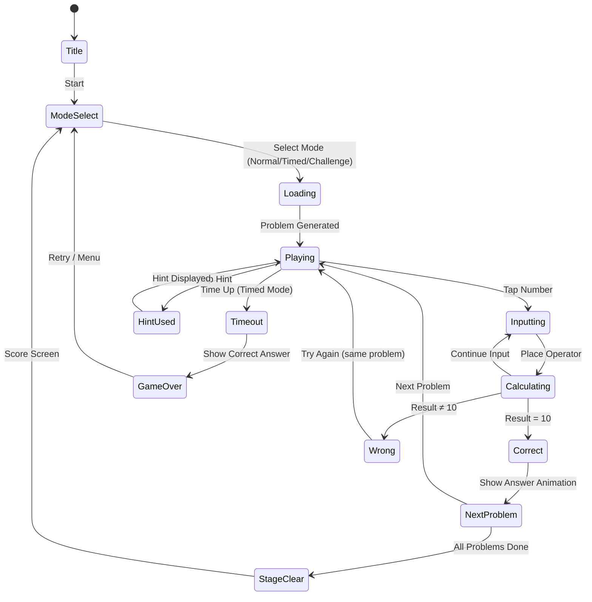

# 숫자 게임 - 10 만들기 (Make Ten)

> 주어진 4개의 숫자와 사칙연산으로 결과를 **10**으로 만드는 수학 로직 퍼즐 (24-game 변형)

## 개요

플레이어에게 1~9 사이의 숫자 4개가 주어진다. 덧셈, 뺄셈, 곱셈, 나눗셈을 자유롭게 조합하여 최종 결과가 **10**이 되는 수식을 완성해야 한다. 모든 숫자를 한 번씩 사용해야 하며, 연산 순서(괄호 포함)는 자유롭게 설정 가능하다.

**핵심 차별점**: 결과가 24가 아닌 10이라는 점에서 심리적으로 더 직관적이고 친근하다. "10 만들기"는 초등 수학의 기본 개념으로 교육 마케팅 앵글이 강력하다.

## 게임 규칙

### 기본 규칙

- 숫자 4개가 화면에 표시됨 (각 숫자는 **정확히 1번** 사용)
- 사칙연산 (+, -, ×, ÷)을 선택해 수식 구성
- 괄호 사용 가능 (연산 순서 변경)
- 최종 결과가 **10**이면 클리어
- 나눗셈 결과가 정수가 아닌 경우도 허용 (중간 계산 단계에서)
- 시간 제한 내에 정답을 맞추면 점수 획득

### 수식 입력 방식

1. **숫자 선택** → 수식 슬롯에 배치
2. **연산자 선택** → 두 숫자 사이에 삽입
3. **괄호 추가** → 계산 우선순위 설정 (선택)
4. **결과 확인** → 실시간 계산 결과 표시
5. **제출** → 정답이면 클리어, 오답이면 재시도

### 풀이 불가능 방지

- 문제 생성 시 반드시 풀이가 1개 이상 존재함을 검증
- 풀이 없는 문제는 생성 거부 (자동 재생성)

### 예시 문제

| 숫자 | 정답 예시 |
|------|-----------|
| 1, 2, 3, 4 | (1+2+3) × ... → 1×2+3+4=9 ❌ → (3-1)×(2+3)=10 ✓ |
| 2, 3, 4, 5 | 2×3+4×1... → (5-3)×(4+1)=10 ✓ |
| 1, 4, 5, 8 | (8÷4+1)×... → 8÷4×5-1... → 1×(8+5-4)... → (1+4)×... |
| 2, 2, 2, 8 | 8-2÷2×... → (8+2)×2÷2=10 ✓ |

## 게임 플로우



## UI 레이아웃

```
┌─────────────────────────────┐
│  🧮 10 만들기   ⏱ 01:23    │  ← 상단 HUD (타이머, 문제 번호)
│  문제 7 / 20   ⭐ 350점     │
├─────────────────────────────┤
│                             │
│   ╔═════╗  ╔═════╗         │
│   ║  3  ║  ║  5  ║         │  ← 숫자 카드 (탭하면 수식 슬롯으로)
│   ╚═════╝  ╚═════╝         │
│   ╔═════╗  ╔═════╗         │
│   ║  2  ║  ║  4  ║         │
│   ╚═════╝  ╚═════╝         │
│                             │
├─────────────────────────────┤
│  수식: [ 3 ][ × ][ 2 ][ + ][ 4 ] = ?  │  ← 수식 구성 슬롯
│        ← 실시간 계산 결과: 10 ✓        │
├─────────────────────────────┤
│  연산자:  [ + ] [ - ] [ × ] [ ÷ ]     │  ← 연산자 팔레트
│           [ ( ]            [ ) ]       │
├─────────────────────────────┤
│  [  지우기  ] [  힌트 💡  ] [  확인 ✓ ] │  ← 액션 버튼
└─────────────────────────────┘
```

### 정답 연출

```
┌─────────────────────────────┐
│                             │
│      ✨ 정답! ✨             │
│                             │
│   3 × 2 + 4 = 10  🎉       │
│                             │
│   +50점  ⏱ 보너스 +20점    │
│                             │
│      [ 다음 문제 → ]        │
└─────────────────────────────┘
```

## 스코어링 시스템

| Action | Score |
|--------|-------|
| 정답 (기본) | +50 |
| 시간 보너스 (30초 이내) | +30 |
| 시간 보너스 (15초 이내) | +50 |
| 힌트 미사용 클리어 | +20 |
| 콤보 (연속 정답) | +10 × 콤보 수 |
| 스테이지 전체 클리어 | +200 |
| 힌트 사용 패널티 | -10 |

### 별점 평가 (스테이지 클리어 시)

| 별점 | 조건 |
|------|------|
| ⭐⭐⭐ | 힌트 0개 + 80% 이상 시간 보너스 |
| ⭐⭐ | 힌트 2개 이하 |
| ⭐ | 클리어 (힌트 무제한) |

## 난이도 설계

### 난이도 분류 기준

| 레벨 | 숫자 범위 | 풀이 수 | 필요 연산 | 제한 시간 | 괄호 필요 |
|------|-----------|---------|-----------|-----------|-----------|
| 쉬움 (Easy) | 1~5 | 3개 이상 | 2~3개 | 90초 | 없음 |
| 보통 (Normal) | 1~9 | 2개 이상 | 3~4개 | 60초 | 선택적 |
| 어려움 (Hard) | 1~9 | 1개 | 4개 | 45초 | 필수 |
| 도전 (Expert) | 1~9 (중복 가능) | 1개 | 4개 + 중첩 괄호 | 30초 | 필수 |

### 스테이지 구성 (Normal 모드, 20문제/스테이지)

| 스테이지 | 쉬움 | 보통 | 어려움 | 도전 |
|----------|------|------|--------|------|
| 1 (입문) | 15 | 5 | 0 | 0 |
| 2 | 10 | 8 | 2 | 0 |
| 3 | 5 | 10 | 5 | 0 |
| 4 | 0 | 8 | 10 | 2 |
| 5 | 0 | 5 | 10 | 5 |

### 난이도 Easy 예시 문제 (풀이 직관적)

- 1, 2, 3, 4: `1+2+3+4=10` ✓
- 2, 3, 5, 0: `2+3+5+0=10` ✓
- 1, 1, 4, 4: `(1+1)×(4+1)=10`, `4×4-1-1=... ` 등

### 난이도 Hard 예시 문제 (괄호 필수)

- 1, 4, 5, 8: `(8÷4+1)×...` → `(8-5)×4-2...` → `8+4÷(5-... )` 다양한 시도 필요
- 3, 3, 7, 7: `(3+7)×(7-... )` → 7÷(3-7÷...)...

## 게임 모드

### 1. 일반 모드 (Normal Mode)
- 스테이지 기반 (20문제/스테이지)
- 힌트 3회 제공
- 시간 제한 있음 (개인 기록 갱신 목적)
- 별점 평가 → SNS 공유

### 2. 시간 도전 모드 (Speed Mode)
- 무한 문제, 최대한 많이 풀기
- 문제당 30초 타이머 (맞추면 +5초)
- 실시간 랭킹 (광고 제거 구매 시 고수 랭킹 진입)
- **수익화 핵심 모드**

### 3. 연습 모드 (Practice Mode)
- 시간 제한 없음
- 무한 힌트
- 정답 보기 가능
- 교육용 / 입문자용

### 4. 데일리 챌린지 (Daily Challenge)
- 하루 1문제, 전 세계 동일 문제
- 랭킹 공유 → 바이럴 유도
- **무료 제공** (앱 리텐션 핵심)

## #24 / #40 수학 퍼즐과의 비교

| 항목 | 10 만들기 (#99) | 24 게임 (#24) | #40 |
|------|-----------------|--------------|-----|
| 목표 | 10 만들기 | 24 만들기 | 미확인 |
| 숫자 범위 | 1~9 | 1~13 (카드) | 미확인 |
| 직관성 | 매우 높음 (10=기본) | 낮음 (24 왜?) | 미확인 |
| 교육 연령대 | 초등 1~6학년 | 초등 4~중학교 | 미확인 |
| 마케팅 앵글 | "10의 보수" 학습 | 수학 천재 챌린지 | 미확인 |
| 난이도 곡선 | 완만 (쉬운 진입) | 가파름 | 미확인 |

**10 만들기의 핵심 차별점**:
- "10"은 십진법의 기본 단위 → 전 연령대 공감
- 초등 교육과정 직결 ("10의 보수" 개념)
- 24보다 정답 경우의 수가 많아 플레이어가 덜 막힘
- 한국, 일본, 중국 등 아시아 수학 교육 커리큘럼과 직결

## 교육적 가치 및 마케팅

### 학습 효과

| 연령 | 학습 내용 | 교과 연계 |
|------|-----------|-----------|
| 초1~2 | 10의 보수, 덧뺄셈 | 1학년 수학 |
| 초3~4 | 곱셈/나눗셈 조합 | 3학년 수학 |
| 초5~6 | 연산 순서, 괄호 | 5학년 수학 |
| 중학생+ | 수식 최적화, 논리 | 중등 수학 |

### 마케팅 앵글

1. **교육 앱 마켓 공략**: "수학 두뇌 훈련", "초등 수학 게임" 키워드
2. **학부모 타겟**: "우리 아이 수학 재미있게"
3. **성인 두뇌 트레이닝**: "치매 예방", "두뇌 회전"
4. **SNS 바이럴**: 데일리 챌린지 결과 공유 → 친구 도전 유도
5. **학원/학교 연계**: 교사용 도구로 확장 가능성

### 타겟 유저

- **Primary**: 초등학생 자녀를 둔 부모 (교육 목적 설치)
- **Secondary**: 퍼즐 게임 애호가, 수학 좋아하는 성인
- **Tertiary**: 두뇌 트레이닝 원하는 40~60대

## 수익화 전략

### 무료 → 유료 전환 퍼널

```
앱 설치 (무료)
    ↓
연습 모드 + 일반 모드 1~2 스테이지 무료 체험
    ↓
3스테이지부터 광고 시청 or 구매 유도
    ↓
스피드 모드 진입 시 광고 or 구매
    ↓
전체 잠금 해제 구매
```

### 수익 모델

| 항목 | 가격 | 설명 |
|------|------|------|
| 광고 제거 | $1.99 | 핵심 단일 IAP |
| 힌트 팩 (10개) | $0.99 | 소액 IAP |
| 전체 스테이지 팩 | $2.99 | 스테이지 1~50 전체 |
| 프리미엄 (모든 포함) | $4.99 | 번들 |

### 광고 전략

- **삽입 광고**: 스테이지 클리어 후 (30% 확률)
- **보상형 광고**: 힌트 1개 = 광고 시청 (자발적)
- **배너 광고**: 게임 화면 하단 (비방해형)

### 수익 극대화 핵심

1. 힌트를 자연스럽게 소모시키는 문제 난이도 설계
2. 데일리 챌린지 → 앱 복귀 → 광고 노출
3. 스피드 모드 랭킹 경쟁 → 광고 제거 유도

## 사운드 / 이펙트

| 이벤트 | 사운드 | 시각 이펙트 |
|--------|--------|-------------|
| 숫자 선택 | 틱 소리 | 카드 슬롯으로 이동 애니메이션 |
| 연산자 선택 | 소프트 클릭 | 연산자 카드 배치 |
| 실시간 계산 업데이트 | 없음 | 결과 숫자 색상 변경 (빨강→초록) |
| 정답 | 팡! + 멜로디 | 골드 폭발 이펙트 + 점수 팝업 |
| 오답 | 부드러운 버저 | 화면 잔진동 (약) |
| 시간 10초 | 틱톡 소리 | 타이머 빨간색 + 박동 |
| 타임오버 | 실패음 | 정답 표시 |
| 콤보 | 상승 톤 | 콤보 카운터 팝업 |

## 문제 생성 알고리즘

### 핵심 로직

```
1. 숫자 4개 랜덤 선택 (난이도에 따라 범위 제한)
2. 가능한 모든 연산 조합 탐색 (완전 탐색)
   - 4개 숫자의 배치 순서: 4! = 24가지
   - 연산자 조합: 4^3 = 64가지 (중복 허용)
   - 괄호 패턴: 5가지 (이진 트리 구조)
   - 총 탐색 수: 24 × 64 × 5 = 7,680가지
3. 결과 = 10인 조합이 N개 이상이면 채택
4. N 미만이면 재생성
```

### 문제 풀이 수 기준

- Easy: 풀이 수 ≥ 3
- Normal: 풀이 수 ≥ 2
- Hard: 풀이 수 = 1
- Expert: 풀이 수 = 1 + 특정 괄호 패턴 필수

### 문제 풀이 불가 감지

- 플레이어가 1분 이상 시도 후 정답 없으면 힌트 자동 제안
- "이 문제 건너뛰기" 옵션 제공 (광고 시청 or 보석 소모)

## MVP 범위

### Phase 1 (MVP - 1주 목표)

- [x] 기획서 작성
- [ ] 문제 생성 알고리즘 (lib)
  - [ ] 완전 탐색으로 풀이 가능 문제 생성
  - [ ] 난이도별 문제 풀링 (미리 100문제 생성)
- [ ] 기본 UX (web)
  - [ ] 숫자 카드 표시
  - [ ] 연산자 팔레트
  - [ ] 수식 슬롯 + 실시간 계산
  - [ ] 정답/오답 판정
- [ ] 스코어링 기본 (점수 + 시간 보너스)
- [ ] 5 스테이지 (Easy~Normal)

### Phase 2 (출시 후 1주)

- [ ] 스피드 모드
- [ ] 데일리 챌린지
- [ ] 힌트 시스템
- [ ] 광고 연동
- [ ] 효과음 + 애니메이션

### Phase 3 (데이터 기반 확장)

- [ ] 랭킹 시스템
- [ ] IAP (힌트 팩, 광고 제거)
- [ ] 50 스테이지 완성
- [ ] 교육 모드 (학부모 리포트)

## 기술 구현 메모 (개발팀 참고)

- **lib/make10**: 문제 생성 + 정답 검증 로직 (순수 TypeScript)
- **web/make10**: Phaser 없이 React만으로 구현 가능 (수식 UI)
  - 단, Phaser 사용 시 카드 드래그앤드롭 구현 용이
- **정답 검증**: 분수 처리 필요 (나눗셈 중간 결과)
  - 분수 라이브러리 또는 직접 분자/분모 관리
- **문제 풀 전략**: 빌드 시 미리 생성하거나 런타임 생성 (100문제 기준 10ms 이내)
