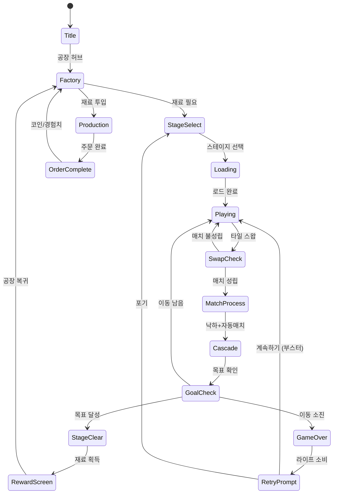

# 매치 팩토리 (Match Factory)

> **레퍼런스**: Peak 개발, App Store 평점 4.5, 장르 Match-3, 글로벌 랭크 #52
>
> 물건을 매칭하여 공장을 돌리는 퍼즐 게임. 매치-3 코어 + 공장 메타 레이어 조합.

## 개요

보드에 배치된 오브젝트 타일을 스왑 매칭으로 3개 이상 연결해 제거하면서 공장 재료를 수집한다.
수집한 재료로 공장 라인을 가동하여 제품을 생산하고, 주문을 완료하는 것이 목표.
"매칭 퍼즐로 실제 공장을 돌린다"는 명확한 목적 의식이 플레이어 재방문을 유도한다.

---

## 1. 코어 매치-3 메카닉

### 기본 규칙 (스왑 매칭)

- **보드**: 7×9 그리드 (기본)
- **스왑**: 인접 타일 2개를 교환. 교환 후 3개 이상 같은 색/종류가 가로·세로로 연결되면 매치 성립
- **중력**: 매치 제거 후 위 타일이 아래로 낙하, 상단에서 새 타일 생성
- **캐스케이드**: 낙하 후 자동 매치 발생 시 연속 제거 (콤보)
- **최소 매치**: 3개 / 특수 타일 생성 조건: 4개, 5개, L/T자형

### 특수 타일 (Power-ups)

| 생성 조건 | 타일 | 효과 |
|-----------|------|------|
| 4개 직선 | 로켓 🚀 | 가로 또는 세로 한 줄 전체 제거 |
| 5개 직선 | 레이저 ⚡ | 가로+세로 십자 전체 제거 |
| L/T자형 4개 | 다이너마이트 💥 | 3×3 범위 폭발 제거 |
| 5개 이상 / 2개 특수 조합 | 공장 기계 🏭 | 같은 색 타일 전체 제거 |

### 오브젝트 타입

| 카테고리 | 타일 예시 | 설명 |
|----------|-----------|------|
| 원자재 | 철광석⛏️, 나무🪵, 모래🏖️, 고무🫙 | 직접 수집 가능한 기본 재료 |
| 부품 | 나사🔩, 회로기판🔌, 유리🪟 | 2단계 가공 재료 |
| 장애물 | 상자📦, 체인⛓️, 얼음🧊 | 수집 불가, 일정 횟수 매칭으로 제거 |

### 장애물 시스템

| 장애물 | 제거 방법 | 등장 스테이지 |
|--------|-----------|--------------|
| 상자 | 인접 매치 1회 | 스테이지 5+ |
| 체인 | 인접 매치 2회 | 스테이지 20+ |
| 얼음 | 인접 매치 또는 폭발 1회 | 스테이지 15+ |
| 용암타일 | 특수 타일로만 제거 | 스테이지 40+ |

---

## 2. 공장 메타게임

### 개념

스테이지 클리어로 수집한 재료는 플레이어의 **공장 창고**에 쌓인다.
공장에는 여러 생산 라인이 있으며, 각 라인은 재료를 소비해 제품을 생산한다.
제품은 **주문서(Orders)**를 통해 납품하여 코인/경험치를 획득한다.

### 공장 HUB 화면

```
┌─────────────────────────────────────┐
│  🏭 나의 공장         Lv.7  💰 1,240  │
├─────────────────────────────────────┤
│                                     │
│  ┌─────────┐  ┌─────────┐           │
│  │ 제철소  │  │ 목공소  │           │
│  │ ⛏️→🔩  │  │ 🪵→🪑  │           │
│  │ 생산중🟢│  │ 재료 부족│           │
│  └─────────┘  └─────────┘           │
│                                     │
│  ┌─────────┐  ┌─────────┐           │
│  │ 유리공장│  │ [잠금🔒] │           │
│  │ 🏖️→🪟  │  │  Lv.10  │           │
│  │  2:30⏱ │  │  필요   │           │
│  └─────────┘  └─────────┘           │
│                                     │
├─────────────────────────────────────┤
│  📋 주문서                           │
│  납품: 나사 15개, 유리 10개 → 💰500  │
│  마감: 3시간 남음                    │
├─────────────────────────────────────┤
│       [ 퍼즐 플레이 ]                │
└─────────────────────────────────────┘
```

### 공장 레벨업 구조

| 공장 레벨 | 잠금 해제 생산 라인 | 생산 슬롯 수 |
|-----------|---------------------|-------------|
| 1 | 제철소 (철광석→나사) | 1 |
| 3 | 목공소 (나무→목재) | 2 |
| 5 | 유리공장 (모래→유리) | 2 |
| 8 | 고무공장 (고무→타이어) | 3 |
| 12 | 전자공장 (회로+유리→스마트폰) | 3 |
| 18 | 자동차공장 (나사+타이어+유리→자동차) | 4 |

---

## 3. 생산 체인 시스템

### 3단계 생산 구조

```
[Stage 클리어] → 원자재 수집
      ↓
[1차 가공] 원자재 → 부품
  철광석 → 나사, 철판
  나무   → 목재, 합판
  모래   → 유리, 시멘트
  고무   → 타이어, 호스
      ↓
[2차 가공] 부품 조합 → 완제품
  나사 + 철판        → 공구 세트
  목재 + 철판        → 가구
  유리 + 회로기판    → 디스플레이
  타이어 + 나사 + 철판 → 자동차 부품
      ↓
[주문 납품] 완제품 → 코인 + 경험치
```

### 생산 시간 & 수율

| 생산 단계 | 예시 | 생산 시간 | 수율 |
|-----------|------|-----------|------|
| 1차 가공 | 철광석 5개 → 나사 3개 | 30분 | 0.6x |
| 2차 가공 | 나사 3 + 철판 2 → 공구세트 1 | 1시간 | 복합 |
| 완제품 조합 | 공구세트 2 + 목재 5 → 가구 1 | 2시간 | 고부가가치 |

> **핵심 설계 원칙**: 생산 시간이 자연스러운 재방문 주기를 만든다.
> 30분 → 2시간 → 6시간 주기로 플레이어가 앱을 열도록 유도.

### 생산 가속

- **광고 시청**: 30분 단축 (무제한)
- **다이아몬드**: 즉시 완료 (1다이아 = 1시간 단축)
- **공장 업그레이드**: 생산 시간 영구 감소 (코인 소비)

---

## 4. 로얄매치(#11) vs 매치 팩토리 비교 분석

### 구조 비교

| 항목 | 로얄매치 (#11) | 매치 팩토리 (#52) |
|------|---------------|-----------------|
| 메타게임 테마 | 왕국 건설·장식 | 공장 가동·생산 |
| 재방문 동기 | 다음 방 꾸미기 | 생산 완료·주문 납품 |
| 자원 루프 | 별★ → 인테리어 | 재료 → 가공 → 완제품 |
| 목적감 | 심미적 만족 | 생산적 성취감 |
| 타겟 유저 | 캐주얼·여성 중심 | 좀 더 폭넓은 남녀 |
| 수익화 포인트 | 라이프, 부스터, 코인 | + 공장 확장 슬롯 IAP |
| 핵심 감성 | "예쁜 왕국 만들기" | "내 공장 돌아가는 맛" |

### 매치 팩토리의 차별화 강점

1. **생산 체인의 명확한 목적**: "이 스테이지에서 나사 20개를 캐야 공장이 돌아간다" — 플레이 이유가 구체적
2. **시간 기반 재방문**: 생산 타이머가 자연스러운 푸시 알림 명분 제공
3. **수집 → 제조 → 납품** 루프가 뇌에 명확한 진행감 제공 (로얄매치의 꾸미기보다 목적이 선명)
4. **남성 유저 포용**: 공장/제조 테마는 로얄매치의 왕국 인테리어보다 남성 유저 유입에 유리
5. **주문서 시스템**: 마감 기한이 있는 주문 = 긴박감 + 자연스러운 과금 트리거

### 매치 팩토리의 약점

1. **진입 장벽**: 생산 체인이 복잡하면 캐주얼 유저 이탈 가능 → **MVP에서는 1차 가공만 구현**
2. **대기 시간 불만**: 생산 타이머가 너무 길면 이탈 → 초반 30분 이내로 조정
3. **로얄매치가 이미 1위**: 매칭 퀄리티 경쟁에서 이기기 어려움 → 공장 메타의 차별성이 핵심

---

## 5. 스테이지 설계

### 스테이지 목표 유형

| 목표 유형 | 설명 | 예시 |
|-----------|------|------|
| 재료 수집 | 특정 오브젝트 N개 수집 | 철광석 30개 수집 |
| 주문 완료 | 공장 주문 재료 조달 | 나사용 철광석 20개 + 나무 15개 |
| 장애물 제거 | 보드 위 장애물 모두 제거 | 상자 12개 모두 제거 |
| 복합 목표 | 위 조합 | 철광석 20개 + 상자 6개 제거 |

### 스테이지 진행 예시 (초반 1-20)

| 스테이지 | 목표 | 이동 횟수 | 특이점 |
|----------|------|-----------|--------|
| 1 | 철광석 20개 | 25 | 튜토리얼: 스왑 설명 |
| 2 | 나무 15개 | 20 | 튜토리얼: 콤보 설명 |
| 3 | 철광석 15 + 나무 10 | 25 | 첫 복합 목표 |
| 5 | 철광석 20 + 상자 제거 6 | 22 | 첫 장애물 |
| 10 | 나사 주문 재료 조달 | 30 | 첫 공장 연계 스테이지 |
| 15 | 얼음 타일 + 재료 수집 | 28 | 얼음 장애물 등장 |
| 20 | 목재 주문 + 유리 재료 | 32 | 2차 가공 연계 |

### 스테이지 난이도 파라미터

| Level 구간 | 보드 크기 | 오브젝트 종류 | 장애물 밀도 | 이동 횟수 여유 |
|------------|-----------|--------------|------------|--------------|
| 1-10 | 7×8 | 4종 | 없음~낮음 | 넉넉 (125%) |
| 11-30 | 7×9 | 5종 | 낮음~중간 | 보통 (110%) |
| 31-60 | 8×9 | 6종 | 중간 | 빡빡 (105%) |
| 61-100 | 8×9 | 7종 | 높음 | 빡빡 (102%) |
| 100+ | 8×10 | 7종+ | 매우 높음 | 도전적 |

---

## 6. 수익화 전략

### 수익화 모델: F2P + IAP

#### 라이프 시스템

- 최대 5라이프, 1라이프 30분마다 회복
- 실패 시 라이프 1 소비
- **구매**: 라이프 5개 = $0.99 / 무제한 라이프 24시간 = $2.99

#### 부스터 (In-level)

| 부스터 | 효과 | 가격 |
|--------|------|------|
| 추가 이동 +5 | 이동 5회 추가 | $0.99 / 💎5 |
| 행 폭탄 | 가로 1줄 제거 | $0.99 / 💎3 |
| 섞기 | 보드 전체 재배치 | 💎2 |
| 색 폭탄 | 지정 색 전체 제거 | 💎5 |

#### 공장 확장 IAP

| 상품 | 내용 | 가격 |
|------|------|------|
| 생산 슬롯 +1 | 공장 동시 생산 라인 추가 | $2.99 (영구) |
| 생산 시간 -20% | 전 공장 생산 속도 향상 | $4.99 (영구) |
| 창고 확장 | 재료 최대 보관량 +50 | $1.99 (영구) |
| 공장 스타터 팩 | 슬롯+1 + 다이아 50개 | $4.99 (첫구매 할인) |

#### 다이아몬드 (프리미엄 화폐)

| 패키지 | 다이아 | 가격 | 단가 |
|--------|--------|------|------|
| 소형 | 50 | $0.99 | $0.020/개 |
| 중형 | 150 | $2.99 | $0.020/개 |
| 대형 | 500 | $7.99 | $0.016/개 |
| 특대 | 1200 | $16.99 | $0.014/개 |

#### 구독 패스 (핵심 수익원)

- **공장 패스** $4.99/월:
  - 매일 다이아 15개
  - 라이프 무한 (1시간/일)
  - 생산 시간 -10%
  - 스테이지 클리어 시 코인 +50%

### 수익화 퍼널

```
신규 유저 → 라이프 소진(3-5일차) → 첫 과금($0.99)
         → 공장 막힘(7일차) → 슬롯 확장 구매($2.99)
         → 하드 스테이지(14일차) → 구독 패스 검토($4.99/월)
```

---

## 7. 매치-3 엔진 공통화 방안

### 현황 분석

모노레포 내 매치-3 게임 후보:
- **#3** (추후 확인 필요) - 매치-3 변형
- **#11 로얄매치** - 스왑 매치-3
- **#52 매치 팩토리** - 스왑 매치-3 + 공장 메타

### 공통화 대상: `lib/match3-core`

```
lib/match3-core/
├── src/
│   ├── Board.ts          # 그리드 상태 관리 (N×M)
│   ├── Matcher.ts        # 3+ 매치 감지 알고리즘
│   ├── Gravity.ts        # 타일 낙하 + 보충 로직
│   ├── SwapHandler.ts    # 스왑 유효성 검사
│   ├── SpecialTiles.ts   # 로켓/폭탄/레이저 생성 규칙
│   ├── CascadeEngine.ts  # 콤보/캐스케이드 처리
│   ├── Obstacles.ts      # 장애물 타입 + 제거 조건
│   └── types.ts          # 공통 타입 정의
├── package.json
└── README.md
```

### 게임별 커스터마이징 포인트

| 커스터마이징 | 로얄매치 | 매치 팩토리 |
|-------------|---------|------------|
| 타일 테마 | 왕국 오브젝트 | 공장 원자재/부품 |
| 목표 조건 | 레이어 제거, 타일 수집 | 재료별 수집량 |
| 특수 타일 | 왕의 부스터 | 공장 기계 타일 |
| 보드 형태 | 자유형 보드 | 직사각형 표준 |
| 메타 연동 | 별★ 지급 | 재료 인벤토리 지급 |

### 공통화 구현 우선순위

1. **즉시 공통화**: Board, Matcher, Gravity, SwapHandler (순수 로직, 게임 독립적)
2. **추상화 후 공통화**: SpecialTiles, Obstacles (플러그인 방식으로 게임별 등록)
3. **게임별 별도 구현**: 메타 연동, UI, 씬 구성

### 기대 효과

- 매치-3 코어 개발 시간: 게임당 1주 → **3일**로 단축
- 버그 수정이 모든 매치-3 게임에 동시 적용
- 신규 매치-3 게임 추가 시 메타 레이어만 구현하면 됨

---

## 8. 매치-3 장르 우선순위 판단

### 장르 평가 매트릭스

| 기준 | 로얄매치(#11) | 매치 팩토리(#52) | Found3(#?) |
|------|-------------|----------------|-----------|
| 시장 검증 | ⭐⭐⭐⭐⭐ 최고 매출 | ⭐⭐⭐⭐ 상위권 | ⭐⭐⭐ 중간 |
| 구현 난이도 | 중간 | 중간-높음 | 낮음 |
| 차별화 가능성 | 낮음 (경쟁 포화) | 중간 (공장 테마) | 높음 (독창성) |
| 메타게임 복잡도 | 높음 | 높음 | 없음 |
| 1주 MVP 가능? | 코어만 가능 | 코어만 가능 | **가능** |
| 수익화 포텐셜 | 높음 | 높음 | 중간 |

### 권장 로드맵 (3개월 생존 전략)

```
Month 1: found3 (기구현 중) + match-factory MVP
  - match3-core lib 먼저 구축 (3일)
  - match-factory 코어 매치-3 (4일)
  - 공장 메타는 Phase 2로 미룸

Month 2: 데이터 수집
  - found3 CPI/ROAS 확인
  - match-factory 코어만 있어도 시장 반응 테스트 가능
  - 반응 좋으면 공장 메타 추가, 없으면 다음 게임

Month 3: 성과 기반 집중
  - 성과 좋은 게임에 공장 메타 완성
  - 성과 없으면 lib/match3-core 활용해 다른 매치-3 변형
```

### 결론 및 권장사항

**매치 팩토리 개발 추천 — 단, 단계적 접근 필요**

1. **즉시**: `lib/match3-core` 공통 엔진 구축 → 모든 매치-3 게임의 기반
2. **Week 1**: 매치 팩토리 코어 매치-3만 출시 (메타 없이)
3. **Week 2**: 공장 메타 1차 가공 추가 (원자재→부품만)
4. **데이터 확인 후**: CPI가 로얄매치 대비 합리적이면 메타 풀 구현

> ⚠️ **주의**: 공장 메타를 처음부터 완전 구현하면 2주+ 소요.
> MVP는 "매치-3 + 재료 수집 카운터"만으로도 시장 반응을 볼 수 있다.
> 메타는 데이터 확인 후 추가하라.

---

## 게임 플로우



---

## UI 레이아웃

### 인게임 화면

```
┌─────────────────────────────┐
│ ❤️❤️❤️  Lv.12   ⏱ 이동:25  │  ← HUD
│ 🎯 철광석 15/30  나무 8/20  │  ← 목표 진행도
├─────────────────────────────┤
│                             │
│  ⛏️ 🪵 🪵 ⛏️ 🏖️ 🪵 ⛏️   │
│  🪵 ⛏️ 🏖️ 🪵 ⛏️ 🏖️ 🪵   │
│  📦 ⛏️ 🪵 📦 🏖️ ⛏️ 🏖️   │  ← 게임 보드
│  🏖️ 🪵 ⛏️ 🏖️ 🪵 ⛏️ 🪵   │    (7×8 그리드)
│  ⛏️ 🏖️ 🪵 ⛏️ 🏖️ 🪵 ⛏️   │
│  🪵 ⛏️ 🏖️ 🪵 ⛏️ 🏖️ 🪵   │
│  ⛏️ 🪵 ⛏️ 🏖️ 🪵 ⛏️ 🏖️   │
│  🏖️ ⛏️ 🪵 ⛏️ 🏖️ 🪵 ⛏️   │
│                             │
├─────────────────────────────┤
│  💥Bomb  🚀Rocket  🔀Mix    │  ← 부스터
└─────────────────────────────┘
```

---

## 사운드/이펙트

| 이벤트 | 사운드 | 이펙트 |
|--------|--------|--------|
| 타일 스왑 | 슬라이드 효과음 | 타일 이동 애니 |
| 매치 성공 | 팡! + 공장 기계음 | 타일 제거 + 파티클 |
| 콤보 | 상승 톤 (횟수별) | 화면 진동 |
| 특수 타일 발동 | 폭발음/레이저음 | 대형 이펙트 |
| 스테이지 클리어 | 축하 팡파레 | 재료 수집 연출 |
| 공장 생산 완료 | 공장 완성음 | 제품 생산 애니 |
| 주문 납품 | 코인 획득음 | 코인 파티클 |
| 게임 오버 | 실패음 | 화면 페이드 |

---

## MVP 범위

### Phase 1 - 코어 매치-3 (Week 1, 5일)

- [ ] `lib/match3-core` 기본 구조 (Board, Matcher, Gravity)
- [ ] 스왑 유효성 검사 + 매치 감지
- [ ] 타일 낙하 + 보충 (캐스케이드)
- [ ] 재료 수집 목표 시스템
- [ ] 이동 횟수 제한 + 게임오버
- [ ] 기본 10 스테이지

### Phase 2 - 공장 메타 기초 (Week 2, 5일)

- [ ] 공장 허브 UI
- [ ] 1차 가공 생산 (원자재→부품, 30분 타이머)
- [ ] 주문서 시스템 (기본 5종)
- [ ] 라이프 시스템 + 광고 회복
- [ ] 특수 타일 2종 (로켓, 다이너마이트)

### Phase 3 - 수익화 + 폴리싱 (데이터 확인 후)

- [ ] IAP 연동 (부스터, 공장 확장)
- [ ] 구독 패스
- [ ] 2차 가공 + 완제품 시스템
- [ ] 스테이지 50개 확장
- [ ] 장애물 추가 (체인, 얼음, 용암)
- [ ] 푸시 알림 (생산 완료, 주문 마감)
