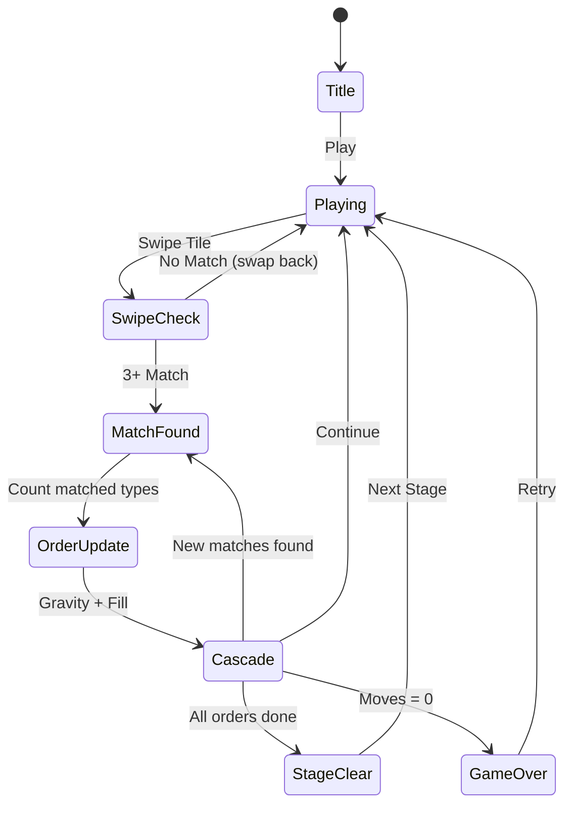

# Match Factory

> 스와이프 매치-3 퍼즐 + 주문(Order) 수집 시스템

## 개요

8×8 보드에서 타일을 스와이프하여 같은 종류 3개 이상을 매치시켜 제거한다.
각 스테이지마다 "주문(Order)"이 주어지며, 정해진 무브 안에 주문 수량을 모두 채우면 클리어.

## 게임 규칙

### 기본 규칙
- 8×8 격자 보드에 다양한 음식 타일이 배치됨
- 인접한 타일을 스와이프하여 교환
- 가로/세로 3개 이상 같은 타일이 연결되면 매치 → 제거
- 제거된 자리에 위 타일이 떨어지고 (중력), 빈자리에 새 타일 생성
- 연쇄 매치(캐스케이드) 자동 처리

### 주문 시스템 (핵심 차별점)
- 스테이지마다 1~3개의 주문이 주어짐
- 예: "🍎 8개 수집", "🧀 10개 수집"
- 매치로 제거된 타일이 해당 주문에 자동 집계
- 모든 주문 완료 → 스테이지 클리어
- 무브 소진 시 주문 미완 → 게임 오버

### 클리어 조건
- ✅ 클리어: 모든 주문 달성
- ❌ 게임 오버: 남은 무브 0 + 주문 미달

## 게임 플로우



## UI 레이아웃

```
┌──────────────────────────┐
│ Stage 1   Score: 1,200   │  ← HUD
│ Moves: 15    Combo: x3   │
├──────────────────────────┤
│ 🍎 5/8  🧀 3/10         │  ← 주문 진행 상황
├──────────────────────────┤
│                          │
│  ┌──┬──┬──┬──┬──┬──┬──┬──┐
│  │🍎│🧀│☕│🥚│🍊│🍎│🧀│☕│
│  ├──┼──┼──┼──┼──┼──┼──┼──┤
│  │🥚│🍊│🍎│☕│🧀│🥚│🍊│🍎│  ← 8×8 보드
│  ├──┼──┼──┼──┼──┼──┼──┼──┤
│  │...                    │
│  └──┴──┴──┴──┴──┴──┴──┴──┘
│                          │
└──────────────────────────┘
```

## 스코어링 시스템

| Action | Score |
|--------|-------|
| 3-매치 | 100 |
| 4-매치 | 200 |
| 5+-매치 | 500 |
| 콤보 배수 | × combo |

## 난이도 설계

| Stage | 타일 종류 | 무브 | 주문 |
|-------|----------|------|------|
| 1 | 6 | 25 | 🍎×8, 🧀×7 |
| 2 | 7 | 22 | 🍎×10, ☕×10 |
| 3 | 7 | 20 | 🍎×12, 🧀×10, ☕×8 |
| 4 | 8 | 18 | 🍊×12, 🥚×10, ☕×10 |
| 5 | 8 | 15 | 🍎×15, 🧀×12, ☕×10 |

## MVP 스코프 (Phase 1)

1. **lib/matchfactory** — Phaser 코어
   - 8×8 보드 + 스와이프 매치-3
   - 중력 + 캐스케이드
   - 주문 추적
   - 5 스테이지

2. **web/arcade** — React UI
   - HUD (스테이지, 스코어, 무브, 주문 진행)
   - ClearScreen (클리어/게임오버)
   - 라우팅 (/games/matchfactory/v1)
