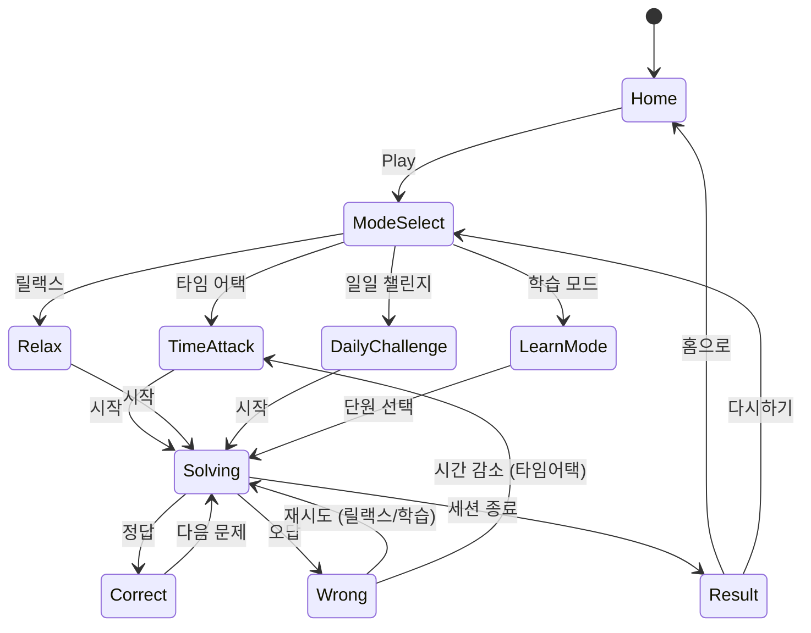

# 수학퍼즐: 연산 & 계산 (MathPuzzle)

> **레퍼런스**: #40 Tripledot Studios — 연산 & 계산 - 숫자 게임 (Rating 4.8)
> **장르**: Math Puzzle / Casual Education
> **목표**: 1~2주 MVP 출시, 수학 퍼즐 장르 단일 앱으로 #24 크로스매스와 통합

---

## 개요

빈칸에 숫자 또는 연산자를 채워 등식(equation)을 완성하는 수학 퍼즐 게임.
직관적인 조작, 짧은 세션(1~3분), 점진적 난이도로 캐주얼 유저와 교육 목적 유저 모두 공략.

### #24 크로스매스 vs #40 수학퍼즐 — 메카닉 비교

| 항목 | #24 크로스매스 | #40 수학퍼즐 (본 기획) |
|------|---------------|----------------------|
| 핵심 구조 | 십자 격자 — 가로/세로 모두 등식 성립 (크로스워드 스타일) | 단일 등식 — 빈칸에 숫자/연산자 삽입 |
| 도전 유형 | 격자 전체 완성 | 문제 단위 연속 풀이 |
| 세션 길이 | 중간 (5~10분) | 짧음 (1~3분) |
| 학습 적합성 | 복합 연산 훈련 | 단계별 연산 집중 훈련 |
| 타깃 유저 | 숫자 퍼즐 마니아 | 캐주얼 + 학습 목적 |
| 모바일 광고 친화성 | 스테이지 완료 후 | 문제 세트 완료 후 / 힌트 시청 |

**결론**: 메카닉이 달라 게임성 충돌 없음 → **단일 앱 통합 권장** (아래 섹션 참조)

---

## 코어 메카닉

### 기본 규칙

빈칸(`?`)이 포함된 수식이 주어진다. 플레이어는 제시된 후보 숫자/연산자 중 올바른 것을 선택해 등식을 완성한다.

```
예시 1:  ? + 4 = 9       → 답: 5
예시 2:  3 ? 4 = 12      → 답: ×
예시 3:  ? × ? = 12      → 답: 3, 4  (또는 2, 6)
예시 4:  12 ÷ ? = ?      → 답: 3, 4  (복수 빈칸)
```

### 입력 방식

- 숫자 패드(0~9) + 연산자 버튼(+ − × ÷) 제공
- 빈칸 탭 → 하이라이트 → 숫자/연산자 선택 → 자동 다음 빈칸 이동
- 복수 답이 가능한 경우 모든 유효 답 허용 (예: 2×6=12, 3×4=12 모두 정답)

### 힌트 시스템

| 힌트 종류 | 효과 | 비용 |
|----------|------|------|
| 후보 제거 | 오답 후보 2개 제거 | 코인 10 또는 광고 시청 |
| 빈칸 공개 | 빈칸 하나 자동 완성 | 코인 20 또는 광고 시청 |
| 풀이 보기 | 전체 정답 표시 (스코어 없음) | 코인 50 |

---

## 게임 모드

### 1. 타임 어택 (Time Attack)

- 제한 시간 내 최대한 많은 문제 풀기
- 정답 시 +시간 보너스, 오답 시 -시간 패널티
- 리더보드 연동 (소셜 경쟁)
- 세션: 60초 / 90초 / 120초 선택

```
┌─────────────────────────┐
│  ⏱ 00:45    💯 Score: 12 │
├─────────────────────────┤
│                         │
│    ? + 6 = 13           │
│                         │
│  [ 5 ] [ 7 ] [ 8 ] [ 9 ]│  ← 후보 버튼
│                         │
│  ✅ +3초    ❌ -5초     │
└─────────────────────────┘
```

### 2. 릴랙스 (Relax / Zen)

- 시간 제한 없음
- 오답 피드백만 제공, 패널티 없음
- 일반 광고 미노출 (프리미엄 분위기)
- 힌트 자유 사용 (코인 기반)
- 세션: 무제한, 유저 페이스

### 3. 일일 챌린지 (Daily Challenge)

- 매일 오전 0시 갱신, 동일 문제 세트 전 세계 동시 도전
- 완료 시 특별 뱃지 + 리더보드 순위
- 난이도 고정 (중급~고급)
- 연속 참여 스트릭 → 보너스 코인

### 4. 학습 모드 (Learn — 교육 요소)

- 연산별 집중 훈련: 덧셈 / 뺄셈 / 곱셈 / 나눗셈 / 혼합 / 분수 / 소수
- 풀이 후 "왜 이게 답인가?" 설명 팝업 제공
- 진도율 시각화 (연산별 숙련도 바)
- 부모 리포트: 주간 학습 통계 (선택적 기능, Phase 2)

---

## 난이도 진행

### 레벨 구조

| 단계 | 난이도 | 수 범위 | 빈칸 수 | 연산 종류 | 예시 |
|------|--------|---------|---------|-----------|------|
| 1 | 입문 | 1~9 | 1 | + − | `? + 3 = 7` |
| 2 | 초급 | 1~20 | 1 | + − × | `4 × ? = 16` |
| 3 | 초중급 | 1~50 | 1~2 | + − × ÷ | `? × ? = 24` |
| 4 | 중급 | 1~99 | 2 | 혼합 | `? + ? × 3 = 15` |
| 5 | 중고급 | 두 자리 | 2~3 | 혼합 + 연산자 빈칸 | `12 ? 4 ? 2 = 4` |
| 6 | 고급 | 분수 | 2 | 분수 + 소수 | `1/? + 1/4 = 3/4` |
| 7 | 전문가 | 소수 | 2~3 | 혼합 | `0.? × 4 = 2.4` |

### 연산별 스킬 트리 (학습 모드)

```
덧셈 기초 → 받아올림 → 세 자리 덧셈
    ↓
뺄셈 기초 → 받아내림 → 혼합 덧/뺄셈
    ↓
곱셈 기초 → 구구단 → 두 자리 곱셈
    ↓
나눗셈 기초 → 나머지 → 혼합 사칙
    ↓
분수 → 소수 → 복합 식
```

---

## 게임 플로우



---

## UI 레이아웃

### 메인 게임 화면

```
┌─────────────────────────┐
│  ← Back   🔊   ❓ Hint  │  ← 상단 바
├─────────────────────────┤
│                         │
│  Level 3 · Problem 7/20 │  ← 진행도
│  ██████████░░░░ 50%     │
│                         │
├─────────────────────────┤
│                         │
│   ┌─────────────────┐   │
│   │  ? × 4 = 24     │   │  ← 등식 카드
│   │  [___]          │   │
│   └─────────────────┘   │
│                         │
├─────────────────────────┤
│                         │
│  [ 3 ] [ 6 ] [ 8 ] [12] │  ← 후보 보기
│                         │
│  ┌───┬───┬───┐          │
│  │ 1 │ 2 │ 3 │          │
│  ├───┼───┼───┤          │
│  │ 4 │ 5 │ 6 │          │  ← 숫자 패드
│  ├───┼───┼───┤          │
│  │ 7 │ 8 │ 9 │          │
│  ├───┼───┼───┤          │
│  │ ⌫ │ 0 │ ✓ │          │
│  └───┴───┴───┘          │
└─────────────────────────┘
```

### 결과 화면

```
┌─────────────────────────┐
│      🎉 세션 완료!       │
│                         │
│  정답률:   18/20  90%   │
│  소요 시간:    4분 12초  │
│  획득 코인:    ⭐ 45     │
│  최고 콤보:    🔥 5연속   │
│                         │
│  [다시하기]  [공유]  [홈] │
└─────────────────────────┘
```

---

## 스코어링 시스템

| 액션 | 점수 |
|------|------|
| 정답 (기본) | +100 |
| 연속 정답 콤보 × n | +100 × n |
| 힌트 미사용 정답 | +50 보너스 |
| 타임 어택 스피드 보너스 | 남은 시간(초) × 5 |
| 일일 챌린지 완료 | +500 |
| 오답 (타임 어택) | -시간 5초 |

### 코인 시스템

- 세션 완료: 정답 수 × 2 코인
- 일일 챌린지: 10 코인
- 7일 스트릭: 50 코인
- 광고 시청: 10~20 코인

---

## #24 크로스매스와 통합 전략

### 권장 결론: **단일 앱 "수학 퍼즐 유니버스"로 통합**

#### 이유

| 관점 | 분리 출시 | 통합 출시 |
|------|----------|----------|
| 마케팅 비용 | UA 2배 지출 | 단일 CPI로 유저 획득 |
| 앱스토어 리뷰 | 각각 리뷰 축적 | 리뷰 집중 → 랭킹 유리 |
| 개발 인프라 | 중복 코드 | lib/web/rn 완전 공유 |
| 수익화 | 각각 과금 설계 | 통합 코인/구독으로 ARPU ↑ |
| 리텐션 | 단일 메카닉 피로 | 모드 다양성으로 DAU 유지 |

#### 앱 구조 (통합 시)

```
수학 퍼즐 유니버스
├── 크로스매스 (#24) — 격자 완성형
│   ├── Classic
│   ├── Daily
│   └── Tournament
└── 등식 퍼즐 (#40) — 빈칸 완성형
    ├── Time Attack
    ├── Relax
    ├── Daily Challenge
    └── 학습 모드
```

#### 기술 구현 방향

- `lib/mathpuzzle/` 에 두 게임 코어 모두 포함 (또는 `lib/crossmath`, `lib/eqpuzzle` 별도 후 `web/mathpuzzle`에서 통합)
- 공통 코인/진행도 상태 관리 (Zustand)
- 메인 허브 UI → 모드 선택 구조

---

## 수익화

### 무료 기본 / 프리미엄 구조

| 항목 | 무료 | 프리미엄 ($2.99/월 또는 $9.99/영구) |
|------|------|--------------------------------------|
| 게임 모드 | 타임 어택, 릴랙스 (광고 포함) | 전체 모드 광고 제거 |
| 학습 모드 | 덧셈/뺄셈만 | 전체 연산 + 분수/소수 |
| 일일 챌린지 | ✅ | ✅ + 히스토리 조회 |
| 힌트 | 광고 시청 | 코인 소모 (광고 없음) |
| 문제 팩 | 기본 300문제 | 무제한 + 매주 신규 팩 |
| 오프라인 | ❌ | ✅ |
| 부모 리포트 | ❌ | ✅ |

### 광고 배치 (무료 유저)

- 세션 완료 후 전면 광고 (5문제당 1회)
- 힌트 요청 시 보상형 광고 (스킵 불가 15초)
- 배너 광고는 미사용 (UX 저해, 수학 집중 방해)

### 인앱 구매

- 코인 팩: 100코인 $0.99 / 500코인 $3.99
- 프리미엄 문제 팩: 연산별 특화 100문제 팩 $0.99
- 광고 제거 (영구): $4.99

---

## 사운드/이펙트

| 이벤트 | 사운드 | 비주얼 |
|--------|--------|--------|
| 정답 | 경쾌한 딩동 | 초록 플래시 + 파티클 |
| 오답 | 낮은 버즈음 | 빨간 흔들림 (shake) |
| 콤보 | 상승 톤 시퀀스 | 콤보 카운터 팝업 |
| 타임 워닝 | 빠른 비프 | 타이머 빨간색 전환 |
| 세션 클리어 | 축하 팡파르 | 별/코인 쏟아지는 이펙트 |
| 일일 챌린지 완료 | 특별 팡파르 | 뱃지 획득 애니메이션 |

---

## MVP 범위

### Phase 1 — MVP (1주)

- [ ] 기획서 작성 ← **현재**
- [ ] `lib/mathpuzzle/` 코어 로직
  - [ ] 등식 생성기 (난이도 1~3)
  - [ ] 정답 검증 로직
  - [ ] 타임 어택 모드 엔진
- [ ] `web/mathpuzzle/` 웹 빌드
  - [ ] 등식 카드 UI
  - [ ] 숫자 패드 컴포넌트
  - [ ] 타임 어택 / 릴랙스 모드
  - [ ] 세션 결과 화면
- [ ] `mathpuzzle/rn/` RN 래핑

### Phase 2 — 확장 (2주차)

- [ ] 일일 챌린지 (서버 문제 동기화)
- [ ] 학습 모드 + 스킬 트리
- [ ] 힌트 시스템
- [ ] 코인 + 인앱 결제
- [ ] #24 크로스매스 통합 (단일 앱화)
- [ ] 리더보드

### Phase 3 — 수익화

- [ ] 프리미엄 구독 도입
- [ ] 문제 팩 스토어
- [ ] 부모 리포트 기능
- [ ] A/B 테스트 (광고 빈도, 과금 전환점)

---

## 성공 지표 (KPI)

| 지표 | 목표 (1개월) |
|------|-------------|
| DAU | 1,000+ |
| D1 리텐션 | 40%+ |
| D7 리텐션 | 20%+ |
| 세션 길이 | 5분+ |
| 프리미엄 전환율 | 3%+ |
| 광고 eCPM | $5+ |
