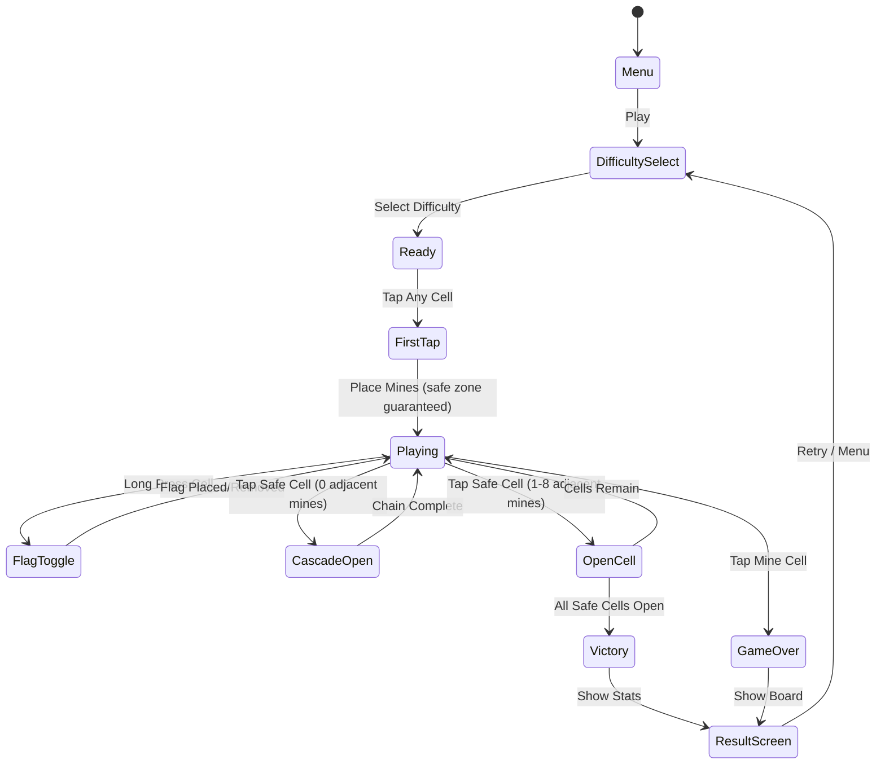

# Minesweeper (지뢰 찾기)

> PC 고전 게임의 대명사. 숫자 힌트로 지뢰 위치를 추론하는 논리 퍼즐.
> **MVP 목표: 3일 이내 구현 가능한 코어 우선 출시**

## 개요

보드에 숨겨진 지뢰를 건드리지 않고 모든 안전한 칸을 열면 승리. 열린 칸에 표시된 숫자는 인접 8칸의 지뢰 수를 나타낸다. 이 숫자 힌트를 논리적으로 추론해 지뢰 위치를 파악하고 깃발을 꽂는다.

## 게임 규칙

### 기본 규칙

- 보드의 각 칸은 **지뢰** 또는 **안전 칸** 중 하나
- 안전 칸을 탭하면 열리며, 인접 지뢰 수(0~8)가 표시됨
- 숫자 0인 칸은 **자동 연쇄 오픈** (인접 0칸 포함)
- 지뢰 칸을 탭하면 즉시 **게임 오버** (모든 지뢰 노출)
- 모든 안전 칸을 열면 **승리**

### 첫 클릭 안전 보장

- 첫 번째 탭은 **항상 안전** — 지뢰는 첫 탭 이후 배치됨
- 첫 탭 위치와 인접 8칸은 절대 지뢰 불가 (3×3 안전 영역)
- 이로 인해 첫 클릭 직후 항상 일정 영역이 열림 (UX 핵심)

### 깃발(Flag) 시스템

- 모바일: 길게 누르기(Long Press, 500ms) → 깃발 꽂기/제거 토글
- 깃발이 꽂힌 칸은 탭해도 열리지 않음 (실수 방지)
- 상단 HUD에 `남은 지뢰 수 = 총 지뢰 - 꽂은 깃발 수` 표시
- 깃발은 힌트일 뿐, 승리 조건과 무관 (안전 칸 전체 오픈이 조건)

### 승리/패배 조건

| 조건 | 결과 |
|------|------|
| 모든 안전 칸 오픈 | 승리 — 남은 지뢰에 자동 깃발 꽂힘 |
| 지뢰 칸 탭 | 패배 — 모든 지뢰 위치 노출 |

## 게임 플로우



## UI 레이아웃

```
┌──────────────────────────────┐
│  💣 Mines: 40  ⏱ 00:00      │  ← 상단 HUD
│  [Easy] [Medium] [Expert]    │  ← 난이도 탭 (인게임 전환)
├──────────────────────────────┤
│                              │
│  ┌──┬──┬──┬──┬──┬──┬──┬──┬──┐│
│  │  │  │  │  │  │  │  │  │  ││
│  ├──┼──┼──┼──┼──┼──┼──┼──┼──┤│
│  │  │1 │  │  │  │  │  │  │  ││  ← 게임 보드
│  ├──┼──┼──┼──┼──┼──┼──┼──┼──┤│    (Easy: 9×9)
│  │  │1 │2 │  │  │  │  │  │  ││
│  ├──┼──┼──┼──┼──┼──┼──┼──┼──┤│
│  │  │🚩│  │  │  │  │  │  │  ││
│  └──┴──┴──┴──┴──┴──┴──┴──┴──┘│
│                              │
├──────────────────────────────┤
│  [🔄 New Game]  [📊 Stats]   │  ← 하단 버튼
└──────────────────────────────┘
```

### 셀 상태별 시각 표현

| 상태 | 표시 |
|------|------|
| 미오픈 | 회색 블록 (입체감) |
| 오픈 0 | 빈 칸 (밝은 배경) |
| 오픈 1~8 | 숫자 (색상 구분: 1=파랑, 2=초록, 3=빨강, 4=진파랑, 5=갈색, 6=청록, 7=검정, 8=회색) |
| 깃발 | 🚩 아이콘 |
| 지뢰(패배 시) | 💣 아이콘 (오답 깃발 ❌ 표시) |
| 승리 시 지뢰 | 🚩 자동 플래그 |

## 난이도 설계

| 난이도 | 보드 크기 | 지뢰 수 | 지뢰 밀도 |
|--------|-----------|---------|-----------|
| Easy | 9 × 9 | 10 | ~12% |
| Medium | 16 × 16 | 40 | ~16% |
| Expert | 30 × 16 | 99 | ~21% |

> Expert는 가로 스크롤 없이 보기 위해 폰트/셀 크기 자동 조정

### 셀 크기 적응형 설계

- Easy: 셀 36px (여유 있음)
- Medium: 셀 22px
- Expert: 셀 16px (최소 터치 영역, 깃발은 길게 누르기)

## 통계 시스템

### 저장 데이터 (로컬, AsyncStorage)

```typescript
interface Stats {
  easy: DifficultyStats;
  medium: DifficultyStats;
  expert: DifficultyStats;
}

interface DifficultyStats {
  gamesPlayed: number;
  gamesWon: number;
  currentStreak: number;
  bestStreak: number;
  bestTime: number | null;  // seconds, null if never won
  totalTime: number;        // for average calculation
}
```

### 표시 항목

| 항목 | 설명 |
|------|------|
| 승률 | wins / gamesPlayed × 100% |
| 최고 기록 | 난이도별 최단 클리어 시간 |
| 현재 연승 | 연속 승리 횟수 |
| 최고 연승 | 역대 최고 연속 승리 |

## 일일 챌린지 (Daily Challenge)

### 개요

- 매일 UTC 00:00 기준으로 전 세계 모든 유저가 **동일한 보드**에 도전
- 시드(Seed) 기반 보드 생성: `seed = YYYYMMDD + difficulty`
- Medium 난이도 고정 (16×16, 지뢰 40개)

### 규칙

- 하루 1회만 기록 등록 가능 (재도전 가능하나 최초 완료 기록만 카운트)
- 클리어 시간으로 랭킹 집계
- 실패해도 다시 도전 가능 (기록 없음으로 처리)

### 공유 기능

클리어 후 결과를 텍스트로 공유:

```
지뢰 찾기 Daily #2026-03-27
Medium (16×16 / 40지뢰)
⏱ 1:42.3
🏆 전체 상위 12%

⬜⬜⬜🟨⬜⬜🟥⬜
⬜⬜🟨🟨🟨⬜⬜⬜
...
```

> 이모지 그리드로 스포일러 없이 플레이 패턴 공유 (Wordle 스타일)

## 수익화

### Phase 1 (MVP 출시 직후)

| 항목 | 내용 |
|------|------|
| 배너 광고 | 게임 결과 화면 하단 |
| 전면 광고 | 게임 오버 시 (3회에 1번) |
| 광고 제거 IAP | $1.99 (원타임 구매) |

### Phase 2 (데이터 확인 후)

| 항목 | 가격 | 내용 |
|------|------|------|
| 테마 팩 | $0.99/팩 | 다크모드, 레트로 윈도우, 네온, 파스텔 등 |
| 힌트 (Safe Open) | 광고 시청 or $0.99/10개 | 안전한 칸 1개 자동 오픈 |
| 힌트 (Mine Reveal) | 광고 시청 or $1.99/5개 | 지뢰 위치 1개 표시 |

### 수익화 우선순위

1. **광고 제거** — 전환율 높음, 마찰 최소
2. **테마 팩** — 재방문 유저 대상, 개발 비용 낮음
3. **힌트** — 캐주얼 유저 구제용, 게임 밸런스 주의

## 사운드/이펙트

| 상황 | 사운드/이펙트 |
|------|--------------|
| 셀 오픈 | 가벼운 클릭음 |
| 연쇄 오픈 | 파도처럼 퍼지는 애니메이션 |
| 깃발 꽂기 | 콕 박히는 효과음 |
| 승리 | 팡파레 + 셀 플립 애니메이션 |
| 패배 | 폭발 효과음 + 지뢰 순차 노출 |
| 신기록 | 별 이펙트 + 특별 사운드 |

> MVP에서는 사운드 생략 가능, 햅틱 피드백만 구현

## MVP 범위

### Phase 1 — MVP (3일 목표)

- [x] 기획서 작성
- [ ] 9×9 Easy 보드 생성 및 렌더링
- [ ] 탭으로 셀 열기 + 연쇄 오픈 로직
- [ ] 길게 누르기로 깃발 토글
- [ ] 첫 클릭 안전 보장 (지뢰 배치 지연)
- [ ] 승리/패배 판정 + 결과 화면
- [ ] 3가지 난이도 전환
- [ ] 기본 타이머

### Phase 2 — 통계 & 리텐션

- [ ] 로컬 통계 저장 (승률, 최고 기록, 연승)
- [ ] 일일 챌린지 (시드 기반 동일 보드)
- [ ] 클리어 결과 공유 (이모지 그리드)
- [ ] 광고 연동 (배너 + 전면)
- [ ] 광고 제거 IAP

### Phase 3 — 수익화 확장

- [ ] 테마 팩 (스킨 시스템)
- [ ] 힌트 시스템
- [ ] 온라인 일일 챌린지 랭킹

## 기술 고려사항 (개발팀 참고)

### 코어 로직 (lib/minesweeper)

- 보드 상태: 2D 배열 `Cell[][]`
- 지뢰 배치: Fisher-Yates 셔플 기반 랜덤 (첫 클릭 이후)
- 연쇄 오픈: BFS/DFS (숫자 0인 셀 기준)
- 시드 기반 RNG: 일일 챌린지용 (`mulberry32` 등 간단한 PRNG)

### 터치 UX 핵심

- Long Press threshold: **500ms** (너무 짧으면 실수, 너무 길면 불편)
- 탭 취소: Long Press 시작 시 탭 이벤트 캔슬
- 진동 피드백: 깃발 꽂기 시 햅틱 (Expo Haptics)

### 셀 크기 계산

```
cellSize = Math.floor(screenWidth / cols) - 1
```

Expert(30열) 기준 iPhone 14 기준 약 12.7px → 최소 제스처 영역 확보 필요
