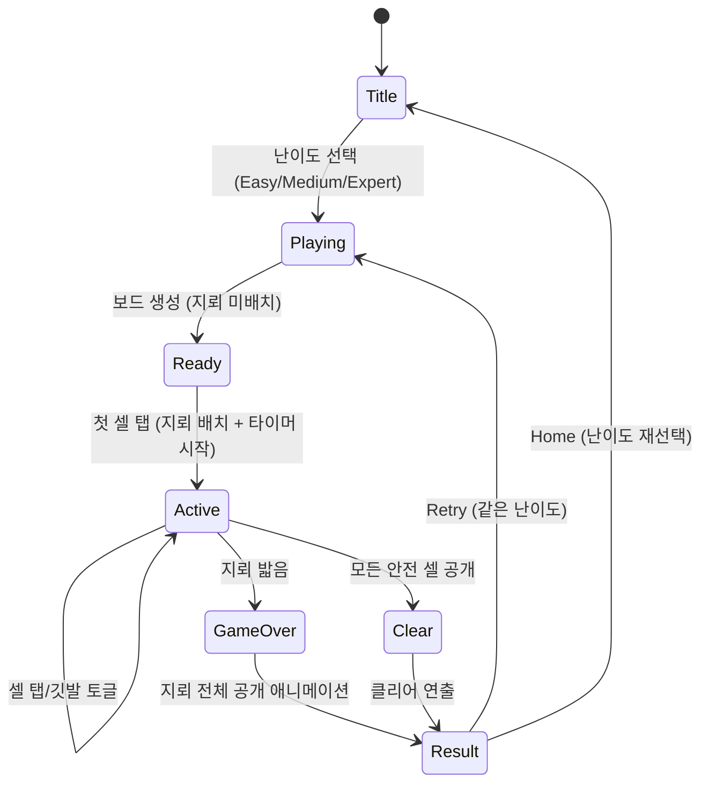

# Minesweeper

> 클래식 지뢰찾기 — 숨겨진 지뢰를 피하며 모든 안전한 셀을 공개하는 퍼즐 게임

## 개요

격자 보드에 지뢰가 숨겨져 있다. 플레이어는 셀을 하나씩 공개하며, 숫자 힌트를 단서로 지뢰 위치를 추론한다. 지뢰가 아닌 모든 셀을 공개하면 클리어. 지뢰를 밟으면 게임 오버.

## 게임 규칙

### 기본 규칙
- 격자 보드에 지뢰가 무작위로 배치됨
- 셀 탭 → 공개 (reveal)
- 셀 롱프레스(300ms) → 깃발 토글 (flag)
- 공개된 셀에 숫자 표시 = 인접 8칸의 지뢰 수
- 숫자 0인 셀 공개 시 인접 빈 셀 자동 전파 (flood-fill)
- 지뢰 셀 공개 → 게임 오버
- 지뢰 아닌 모든 셀 공개 → 클리어

### First-Click-Safe
- 첫 번째 탭은 반드시 안전 (지뢰 없음)
- 지뢰는 첫 클릭 이후 배치됨 (클릭 위치 + 인접 8칸 제외)
- 타이머도 첫 클릭 시점부터 시작

### 깃발 (Flag)
- 지뢰로 의심되는 셀에 깃발 표시
- 깃발이 있는 셀은 탭해도 공개되지 않음 (오탭 방지)
- 깃발 다시 롱프레스 → 깃발 해제
- HUD에 남은 지뢰 수 표시 (총 지뢰 − 깃발 수)

## 게임 플로우



## UI 레이아웃

```
┌─────────────────────────────┐
│  💣 12   ⏱ 0:45   Medium   │  ← HUD (남은지뢰, 타이머, 난이도)
├─────────────────────────────┤
│                             │
│  ■ ■ ■ ■ ■ ■ ■ ■ ■        │
│  ■ 1 1 ■ ■ ■ ■ ■ ■        │
│  ■ 1   1 1 ■ ■ ■ ■        │
│  ■ 1     1 ■ ■ ■ ■        │  ← 셀 보드
│  ■ ■ 1   1 2 🚩 ■ ■       │    (탭=공개, 롱프레스=깃발)
│  ■ ■ ■ 1 1 ■ ■ ■ ■        │
│  ■ ■ ■ ■ ■ ■ ■ ■ ■        │
│  ■ ■ ■ ■ ■ ■ ■ ■ ■        │
│  ■ ■ ■ ■ ■ ■ ■ ■ ■        │
│                             │
└─────────────────────────────┘
```

- HUD: React 컴포넌트 (Stitches)
- 보드: Phaser 캔버스 (ADR-002 준수)
- 결과 화면: React 컴포넌트 (Phaser 오버레이 사용 금지)

## 스코어링 시스템

| Metric | 설명 |
|--------|------|
| 경과 시간 | 첫 클릭부터 클리어까지 소요 시간 |

- 지뢰찾기는 전통적으로 시간이 유일한 스코어 지표
- 점수 체계 없음 — 빠른 클리어가 곧 고득점
- 게임 오버 시에도 경과 시간 표시

## 난이도 설계

| Level | 격자 | 지뢰 수 | 지뢰 밀도 | 셀 크기 (추정) |
|-------|------|---------|-----------|---------------|
| Easy | 9×9 | 10 | 12.3% | ~39px |
| Medium | 16×16 | 40 | 15.6% | ~22px |
| Expert | 16×16 | 56 | 21.9% | ~22px |

> 클래식 PC 지뢰찾기의 Expert는 30×16(99mines)이나, 모바일에서 30열은 셀 ~12px로 터치 불가.
> 모바일 최적화를 위해 Expert도 16×16 격자에 지뢰 수만 증가시켜 난이도를 높임.

## 인터랙션 상세

| 입력 | 동작 | 조건 |
|------|------|------|
| 셀 탭 | 공개 (reveal) | hidden 상태일 때만 |
| 셀 롱프레스 (300ms) | 깃발 토글 | hidden/flagged 상태일 때 |
| 드래그 이탈 | 롱프레스 취소 | 다른 셀로 이동 시 |

## 햅틱 이벤트

| 시점 | 이벤트명 | 패턴 |
|------|----------|------|
| 셀 탭 (공개) | `cell-tapped` | Heavy × 1 |
| 깃발 토글 | `cell-flagged` | Heavy × 1 |
| 지뢰 터짐 (게임 오버) | `mine-exploded` | Heavy × 3 |
| 클리어 (승리) | `game-cleared` | Heavy × 6 (60ms 간격) |

## MVP 범위

### Phase 1 (MVP) — PR #154
- [x] 기획서 작성
- [ ] 기본 셀 보드 (Easy/Medium/Expert)
- [ ] 탭→공개, 롱프레스→깃발
- [ ] First-click-safe 지뢰 배치
- [ ] Flood-fill 자동 공개
- [ ] 타이머 + 남은 지뢰 수 HUD
- [ ] 게임 오버 / 클리어 판정
- [ ] 결과 화면 (React)
- [ ] 햅틱 이벤트 연동

### Phase 2 (후속)
- [ ] 롱프레스 깃발 가이드 (첫 플레이 시)
- [ ] 이모지(💣🚩) → SVG/PNG 아이콘 전환
- [ ] 3D 입체 버튼 스타일링
- [ ] 타이머 표시 비강조화
- [ ] 난이도별 베스트 타임 기록
