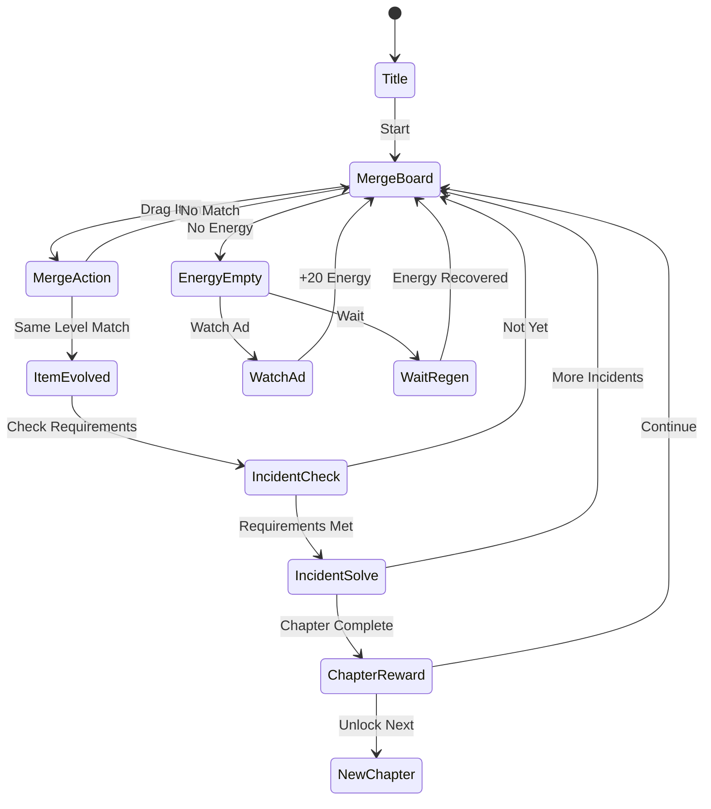

# 미스터리 타운 — 합치기 & 사건

> **장르**: Merge Puzzle + Mystery Story
> **레퍼런스 순위**: #106 (Cedar Games Studio, 평점 4.8)
> **MVP 목표**: 1~2주 개발, 빠른 출시

---

## 개요

마을에서 연속 사건이 발생한다. 플레이어는 수사관이 되어 **아이템을 합성(머지)** 하며 단서를 발굴하고, 사건을 해결한다.
머지 보드 위에서 아이템을 조합해 더 고급 아이템으로 진화시키고, 수집한 아이템으로 스토리 챕터를 해제한다.

**핵심 재미 루프**:
```
아이템 머지 → 단서 획득 → 사건 해결 → 보상 & 다음 챕터 해제 → 반복
```

---

## 게임 규칙

### 머지 보드

- N×M 그리드 (기본 5×9, 확장 가능)
- 각 칸에 아이템 배치
- **같은 레벨 아이템 2개를 드래그해 합치면 → 다음 레벨 아이템 생성**
- 빈 칸에 에너지 소비로 새 아이템 생성 가능
- 보드가 꽉 차면 머지 불가 → 공간 관리가 핵심 긴장감

### 아이템 진화 트리 (미스터리 테마)

```
Lv1  발자국     × 2
Lv2  단서 노트   × 2
Lv3  돋보기      × 2
Lv4  탐정 배지   × 2
Lv5  용의자 사진 × 2
Lv6  수갑        × 2
Lv7  사건 파일   × 2
Lv8  ⭐ 해결 트로피 (희귀, 챕터 보상용)
```

> 각 레벨업 시 애니메이션 + 사운드 이펙트로 도파민 루프 강화

### 사건(챕터) 시스템

- 챕터당 **3~5개 사건** 존재
- 각 사건은 **요구 아이템** 명시 (예: "돋보기 Lv3 × 2, 탐정 배지 Lv4 × 1")
- 요구 아이템 제출 → 사건 해결 → 스토리 컷신 + 별 보상
- 챕터 완료 → 새 마을 구역 해제 (공간 확장 또는 새 테마 스킨)

### 에너지 시스템

| 행동 | 에너지 소비 |
|------|------------|
| 새 아이템 생성 | -5 |
| 머지 | 0 (무료) |
| 사건 힌트 보기 | -10 |
| 보드 공간 확장 | 젬 or 광고 |

- 최대 에너지: 50, 자동 회복: 1/3분
- 광고 시청 → 즉시 +20 에너지

---

## 머지 장르 레퍼런스 분석

머지 장르 10개 레퍼런스(#5, #10, #18, #23, #30, #34, #47, #62, #106, #113)에서 추출한 공통 패턴과 핵심 메카닉:

| 카테고리 | 공통 패턴 | 미스터리 타운 적용 |
|----------|----------|-------------------|
| **머지 메카닉** | 2+2=다음 단계, 드래그 앤 드롭 | 동일 적용 |
| **진행 동기** | 스토리/맵 해제 | 사건 챕터 해제 |
| **긴장감** | 보드 공간 제한 | 5×9 그리드, 공간 확장 유료화 |
| **루프 길이** | 세션 5~10분 | 에너지 소진까지 1회 세션 |
| **수익화** | 에너지 + 광고 + 젬 | 동일 3층 구조 |
| **재방문** | 자동 생산 아이템** | 보드에 자동 생성 아이템 배치 |
| **소셜** | 리더보드, 친구 선물 | 챕터 진행도 공유 |
| **고수익 포인트** | 공간 확장 IAP | "새 구역 해제" 젬 판매 |
| **핵심 차별화** | 테마 스토리 | 미스터리 사건 해결 서사 |
| **리텐션 훅** | 챕터 클리프행어 | 다음 사건 예고 ("범인이 또 나타났다!") |

### 상위 레퍼런스 메카닉 통합

- **#5, #10**: 기본 머지 + 자동 생성 아이템 타이머 → `autoSpawn` 모듈로 공통화
- **#18, #23**: 맵 확장 기반 진행 → `boardExpansion` 모듈로 공통화
- **#30, #34**: 스토리 챕터 + 컷신 → `storyChapter` 모듈로 공통화
- **#47, #62**: 에너지 + 광고 수익화 → `energySystem` + `adReward` 모듈로 공통화
- **#106** (이 게임): 미스터리 테마 사건 해결 → 테마 스킨 레이어
- **#113**: 리더보드 + 소셜 → `leaderboard` 모듈 (Phase 2)

---

## lib/merge-core 공통 엔진 설계

### 전략 방향

> **하나의 엔진, N개의 테마 게임**
> `lib/merge-core`는 테마에 무관한 순수 머지 로직만 담는다.
> 각 게임은 테마 설정(아이템 트리, 스킨, 스토리)만 주입해 신규 게임을 만든다.

### 패키지 구조

```
lib/
└── merge-core/          ← 공통 머지 엔진 (신규)
    ├── src/
    │   ├── engine/
    │   │   ├── MergeBoard.ts       # 그리드 상태 관리
    │   │   ├── MergeItem.ts        # 아이템 레벨/타입 정의
    │   │   ├── MergeEngine.ts      # 머지 판정 + 진화 로직
    │   │   └── BoardExpansion.ts   # 보드 확장 로직
    │   ├── systems/
    │   │   ├── EnergySystem.ts     # 에너지 생성/소비
    │   │   ├── AutoSpawn.ts        # 자동 아이템 생성 타이머
    │   │   ├── StoryChapter.ts     # 챕터/사건 진행 관리
    │   │   └── AdReward.ts         # 광고 보상 인터페이스
    │   ├── types/
    │   │   ├── ItemConfig.ts       # 아이템 트리 설정 타입
    │   │   ├── ChapterConfig.ts    # 챕터/사건 설정 타입
    │   │   └── BoardConfig.ts      # 보드 크기/규칙 설정 타입
    │   └── index.ts
    └── package.json
```

### 핵심 인터페이스

```typescript
// 아이템 트리 설정 (테마별로 주입)
interface ItemConfig {
  id: string;
  level: number;
  name: string;
  sprite: string;       // 스프라이트 키 (테마마다 다름)
  maxLevel: boolean;
}

// 챕터/사건 설정 (스토리 테마마다 주입)
interface ChapterConfig {
  id: string;
  title: string;
  incidents: Incident[];
}

interface Incident {
  id: string;
  description: string;
  requirements: { itemLevel: number; count: number }[];
  reward: Reward;
}

// 엔진 초기화 (테마 설정 주입)
const engine = new MergeEngine({
  boardConfig: { cols: 5, rows: 9 },
  itemConfigs: MYSTERY_TOWN_ITEMS,    // 테마별 아이템 트리
  chapterConfigs: MYSTERY_TOWN_CHAPTERS, // 테마별 챕터
  energyConfig: { max: 50, regenRate: 3 }, // 분당 회복
});
```

### 테마 게임 생성 방법

```
lib/merge-core (엔진) + 테마 설정 파일 → 새 게임
```

| 게임 이름 | 테마 | 아이템 트리 예시 | 개발 기간 |
|----------|------|----------------|----------|
| 미스터리 타운 | 탐정/사건 | 발자국→해결 트로피 | 2주 |
| 마법사 타워 | 판타지/마법 | 마나→전설 마법서 | 3일 (엔진 재사용) |
| 우주 탐험대 | SF/우주 | 암석→행성 | 3일 |
| 요리 왕국 | 요리/레스토랑 | 재료→미슐랭 요리 | 3일 |
| 동물의 숲 | 동물/자연 | 씨앗→신비 동물 | 3일 |

> **첫 번째 게임(미스터리 타운)으로 엔진 확정 → 이후 테마 게임은 3일 내 출시 가능**

---

## 게임 플로우 (상태 머신)



---

## UI 레이아웃

```
┌─────────────────────────────┐
│ 🔍 미스터리 타운   ⚡50  💎 120 │  ← HUD (에너지/젬)
│ [챕터1: 실종 사건 ████░░ 3/5] │  ← 챕터 진행바
├─────────────────────────────┤
│                             │
│  [🔍][📋][🔍][  ][📋]       │
│  [  ][🔎][📋][🔍][  ]       │
│  [📋][  ][🔎][  ][🔍]       │  ← 머지 보드 (5×9)
│  [🔍][🔎][  ][📋][🔎]       │
│  [  ][🔍][📋][🔎][  ]       │
│  [📋][  ][🔍][  ][📋]       │
│  [🔎][📋][  ][🔍][🔎]       │
│  [  ][🔍][🔎][📋][  ]       │
│  [📋][  ][  ][🔍][📋]       │
│                             │
├─────────────────────────────┤
│  🎯 현재 사건: "범인의 발자국"  │
│  필요: 돋보기 Lv3 × 2         │  ← 현재 목표
│  [진행도: ░░░░░]              │
├─────────────────────────────┤
│  [➕ 아이템 생성 -5⚡] [힌트 -10⚡] │  ← 액션 버튼
└─────────────────────────────┘
```

---

## 스코어링 시스템

| 행동 | 점수 / 보상 |
|------|------------|
| 아이템 머지 (레벨업) | +10 × 레벨 |
| 최고 레벨 달성 | +500 |
| 사건 해결 | +200 + 별 ⭐ |
| 챕터 완료 | 젬 💎 50 |
| 연속 머지 콤보 | 점수 × 1.5배 |

---

## 난이도 설계

| 챕터 | 테마 | 보드 크기 | 요구 아이템 최대 레벨 | 사건 수 |
|------|------|----------|---------------------|--------|
| 1 | 실종 사건 | 5×7 | Lv3 | 3 |
| 2 | 도난 사건 | 5×8 | Lv4 | 4 |
| 3 | 협박 편지 | 5×9 | Lv5 | 4 |
| 4 | 연쇄 사건 | 6×9 | Lv6 | 5 |
| 5 | 최후의 범인 | 7×9 | Lv7 | 5 |

---

## 수익화 설계

### 3층 수익화 구조

```
Layer 1: 광고 (무료 유저 수익화)
Layer 2: 에너지 패키지 (소과금 유저)
Layer 3: 공간 확장 / 젬 패키지 (고과금 유저)
```

### 상세 설계

| 상품 | 가격 | 내용 | 구매 동기 |
|------|------|------|----------|
| 에너지 30 광고 | 무료 | 광고 30초 → +20⚡ | 에너지 소진 시 |
| 에너지 팩 | $0.99 | +100⚡ | 빠른 진행 욕구 |
| 보드 확장 (+1열) | 젬 50 | 한 열 추가 | 보드 꽉 찼을 때 |
| 젬 팩 소 | $1.99 | 젬 100 | 진입 상품 |
| 젬 팩 중 | $4.99 | 젬 600 | 중과금 |
| 젬 팩 대 | $9.99 | 젬 1500 | 고과금 |
| 프리미엄 패스 | $2.99/월 | 에너지 무제한 + 광고 제거 | 구독 |
| 스타터 팩 | $2.99 (1회) | 젬 300 + 에너지 200 | 첫 결제 전환 |

### 광고 배치 전략

| 광고 타입 | 트리거 | 빈도 |
|----------|--------|------|
| 리워드 광고 | 에너지 소진 시 자발적 | 무제한 |
| 인터스티셜 | 챕터 완료 후 | 2회 이상 클리어마다 1회 |
| 배너 | 메인 보드 하단 | 상시 (프리미엄 제거) |

---

## 사운드 / 이펙트

| 상황 | 효과 |
|------|------|
| 아이템 머지 | 반짝임 + 업그레이드 효과음 |
| 레벨 최고치 달성 | 골든 파티클 + 팡파레 |
| 사건 해결 | 드라마틱 리졸브 사운드 + 컷신 |
| 챕터 완료 | 화려한 축하 연출 |
| 보드 꽉 참 경고 | 붉은 테두리 경고 + 진동 |
| 에너지 소진 | 부드러운 알림 → 광고 유도 팝업 |

---

## 테마 양산 전략

### 엔진 재사용 로드맵

```
Month 1: 미스터리 타운 출시 → lib/merge-core 확정
Month 2: 마법사 타워 / 우주 탐험대 (각 3~4일 개발)
Month 3: 요리 왕국 / 동물의 숲 (각 2~3일 개발)
```

### 새 테마 게임 추가 시 필요 작업

| 작업 | 담당 | 시간 |
|------|------|------|
| 아이템 트리 설계 (PRD) | PRD팀 | 0.5일 |
| 스프라이트 에셋 제작 | 외주/AI | 1일 |
| ItemConfig 작성 | Game Core | 0.5일 |
| ChapterConfig 작성 | Game Core | 0.5일 |
| 테마 스킨 적용 (web) | Web Frontend | 0.5일 |
| RN 래핑 | RN App | 0.5일 |
| **합계** | | **~3일** |

### lib/merge-core 의존 구조

```
lib/merge-core     ← 공통 엔진 (1회 개발)
  ↑                      ↑
lib/mystery-town   lib/wizard-tower   lib/space-explorer
  ↑                      ↑                   ↑
web/mystery-town   web/wizard-tower   web/space-explorer
  ↑                      ↑                   ↑
mystery-town/rn    wizard-tower/rn    space-explorer/rn
```

---

## MVP 범위

### Phase 1 — MVP (1~2주)

- [x] 기획서 작성
- [ ] `lib/merge-core` 기본 엔진 구현
  - [ ] MergeBoard (그리드 + 상태)
  - [ ] MergeEngine (2+2 머지 로직)
  - [ ] EnergySystem (소비/회복)
  - [ ] StoryChapter (챕터 진행)
- [ ] `lib/mystery-town` 테마 설정
  - [ ] 아이템 트리 Lv1~Lv7
  - [ ] 챕터 1~3 사건 데이터
- [ ] `web/mystery-town` 웹 빌드
  - [ ] 머지 보드 UI (Phaser 또는 DOM)
  - [ ] 드래그 앤 드롭 머지
  - [ ] 챕터 진행 HUD
  - [ ] 기본 광고 SDK 연동
- [ ] `mystery-town/rn` RN 래핑

### Phase 2 (출시 후 1주 이내)

- [ ] AutoSpawn (자동 아이템 생성 타이머)
- [ ] 보드 확장 IAP
- [ ] 에너지 패키지 IAP
- [ ] 리더보드
- [ ] 푸시 알림 (에너지 회복 완료)

### Phase 3 (데이터 기반)

- [ ] 두 번째 테마 게임 출시
- [ ] A/B 테스트 (에너지 가격 / 광고 빈도)
- [ ] 사건 챕터 5개 이상 추가

---

## 결론 — 머지 장르 전략

### 왜 머지인가

1. **개발 효율**: 핵심 루프가 단순(드래그+합치기), 빠른 MVP 가능
2. **시장 검증**: 4.8점 레퍼런스 포함 10개 상위권 게임 → 수요 확인
3. **수익 모델 명확**: 에너지 + 공간 + 광고 3층 구조, 높은 ARPU 잠재력
4. **테마 확장성**: lib/merge-core 공통화로 신규 게임 비용 90% 절감

### 3개월 생존 시나리오

| 월 | 목표 | 지표 |
|----|------|------|
| 1월 | 미스터리 타운 출시 | D1 리텐션 40%, CPI $1.5 이하 |
| 2월 | 2번째 테마 출시 + 데이터 분석 | ROAS 100% 달성 |
| 3월 | 성과 게임 집중 투자 / 테마 2개 추가 | 월 매출 $50K+ |

### 핵심 위험과 대응

| 위험 | 대응 |
|------|------|
| 머지 보드가 너무 어려움 | 챕터 1을 극도로 쉽게 → D1 리텐션 우선 |
| 광고 피로도 높음 | 자발적 리워드 광고 중심, 인터스티셜 최소화 |
| 에너지 장벽으로 이탈 | 에너지 회복을 빠르게(3분/1) + 무료 광고 보상 충분히 |
| 테마가 안 먹힘 | 2주 CPI 데이터 후 테마 피벗 가능 (엔진 재사용) |
