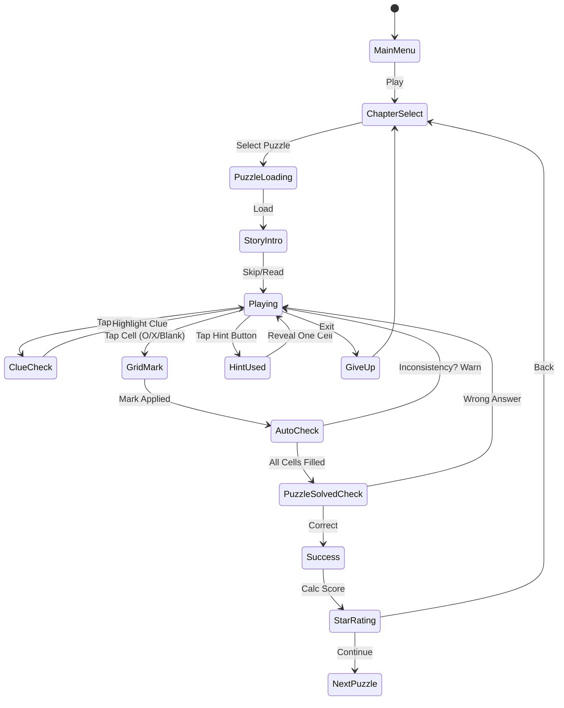

# 옆자리는 누구? (Neighbor Puzzle)

> 단서를 읽고 논리적으로 추론하는 로직 그리드 퍼즐게임

## 개요

**"옆자리는 누구?"** 는 전통적인 논리 그리드 퍼즐(Logic Grid Puzzle)을 모바일에 최적화한 추리 퍼즐 게임이다.
각 문제마다 짧은 스토리 상황이 주어지고, 플레이어는 단서를 읽고 O/X 마킹으로 후보를 좁혀 정답을 도출한다.

- **장르**: brain-logic / puzzle
- **레퍼런스**: #60 (Rating 4.5, FTY LLC.)
- **핵심 재미**: "아하!" 순간 — 논리적 추론이 맞아떨어지는 쾌감
- **타겟**: 두뇌 자극을 즐기는 20~40대, 스도쿠/크로스워드 팬

---

## 게임 규칙

### 기본 개념

- **퍼즐 구성**: N명의 인물(또는 사물) × M개 속성 카테고리
- **목표**: 모든 인물의 속성 조합을 정확히 맞추기
- **수단**: 주어진 단서(Clues)를 논리적으로 조합하여 O/X 그리드 채우기

### 예시 퍼즐 (3인 × 2속성)

```
상황: 회사 식당에서 세 사람이 나란히 앉았다. 각자 다른 음료를 마신다.
인물: 김민준, 이서연, 박지호
속성1 (자리): 왼쪽, 가운데, 오른쪽
속성2 (음료): 커피, 주스, 녹차

단서:
① 김민준은 가장 왼쪽에 앉지 않는다.
② 이서연은 주스를 마시는 사람 바로 옆에 앉는다.
③ 오른쪽에 앉은 사람은 녹차를 마신다.

정답: 이서연-왼쪽-커피, 김민준-가운데-주스, 박지호-오른쪽-녹차
```

### 단서 유형

| 유형 | 예시 | 설명 |
|------|------|------|
| **직접 단서** | "김민준은 커피를 마신다" | 인물-속성 직접 매핑 |
| **부정 단서** | "이서연은 왼쪽에 앉지 않는다" | 특정 조합 제외 |
| **인접 단서** | "빨간 옷 사람은 고양이 옆에 앉는다" | 두 속성 간 상대적 위치 |
| **순서 단서** | "박지호는 이서연보다 오른쪽에 앉는다" | 상대적 순서 제약 |
| **조건 단서** | "주스를 마시는 사람은 2번 자리가 아니다" | 두 속성 간 부정 관계 |

---

## 게임 플로우



---

## UI 레이아웃

### 메인 플레이 화면

```
┌───────────────────────────────┐
│ ← Back    챕터1-3    🏆 1200  │  ← 상단 HUD
│ ⭐⭐⭐ 목표: 힌트 없이 클리어  │
├───────────────────────────────┤
│ 📖 스토리                      │
│ "오늘 점심, 세 동료가 자리를..."│  ← 스토리 배너 (접기 가능)
├───────────────────────────────┤
│         로직 그리드             │
│                                │
│       [자리]  왼  중  오        │
│ 김민준       [ ] [O] [ ]       │
│ 이서연       [O] [ ] [ ]       │  ← 인물-속성 그리드
│ 박지호       [ ] [ ] [O]       │
│                                │
│       [음료]  커피 주스 녹차   │
│ 김민준       [ ] [O] [ ]       │
│ 이서연       [O] [ ] [ ]       │
│ 박지호       [ ] [ ] [O]       │
│                                │
│ (속성이 많을수록 그리드 추가)   │
├───────────────────────────────┤
│ 💡 단서 목록                   │
│ ① 김민준은 가장 왼쪽... [✓]   │
│ ② 이서연은 주스 마시는... [ ]  │  ← 단서 패널 (스크롤)
│ ③ 오른쪽 사람은 녹차... [ ]   │
├───────────────────────────────┤
│  [✓ 정답 확인]   [💡 힌트 x3] │  ← 액션 버튼
└───────────────────────────────┘
```

### 셀 상태 사이클

```
탭 1회: [빈칸] → [O] (이 조합이 맞다)
탭 2회: [O]   → [X] (이 조합이 아니다)
탭 3회: [X]   → [빈칸] (초기화)
```

### 자동 추론 보조 (QoL)

- 한 행/열에서 O가 확정되면 나머지 셀 자동 X 마킹 (설정에서 ON/OFF)
- 모순 발생 시 해당 셀 빨간색 경고

---

## 난이도 설계

### 난이도 단계

| 레벨 | 인물 수 | 속성 카테고리 | 단서 수 | 난이도명 |
|------|---------|--------------|---------|---------|
| 1 | 3명 | 2가지 | 4~5개 | 입문 |
| 2 | 3명 | 3가지 | 6~8개 | 초급 |
| 3 | 4명 | 2~3가지 | 7~10개 | 중급 |
| 4 | 4명 | 4가지 | 10~14개 | 고급 |
| 5 | 5명 | 3~4가지 | 13~18개 | 심화 |
| 6 | 6명 | 4가지 | 18~24개 | 전문가 |

> MVP에서는 레벨 1~3까지 구현 (인물 3~4명, 속성 2~3가지)

### 단서 복잡도 진행

```
레벨 1: 직접 단서 70% + 부정 단서 30%
레벨 2: 직접 단서 50% + 부정/인접 단서 50%
레벨 3: 직접 단서 30% + 부정/인접/순서 단서 70%
레벨 4+: 조건 단서 포함, 간접 추론 필수
```

---

## 스토리 챕터 구성

### MVP 30문제 챕터 구성

| 챕터 | 테마 | 문제 수 | 난이도 |
|------|------|---------|--------|
| 1. 회사 식당 | 동료들의 점심 자리 | 5문제 | 입문 |
| 2. 반 친구들 | 학교 교실 자리 배치 | 5문제 | 입문 |
| 3. 아파트 이웃 | 층별 이웃 정보 추론 | 5문제 | 초급 |
| 4. 카페 손님 | 테이블별 주문 맞추기 | 5문제 | 초급 |
| 5. 동물 농장 | 동물들의 우리 찾기 | 5문제 | 중급 |
| 6. 국제 여행 | 항공편 좌석 추론 | 5문제 | 중급 |

### 스토리 포맷

```markdown
[챕터 제목] 배경 그림

"오늘 회사 식당에서 김민준, 이서연, 박지호가 나란히 앉았어요.
세 사람은 각자 다른 음료를 주문했는데...
과연 누가 어디에 앉아서 무엇을 마셨을까요?"

[단서 보기] 버튼
```

---

## 퍼즐 자동 생성 시스템 (탐구)

MVP 이후 문제 수를 무한 확장하기 위한 자동 생성 로직 탐구.

### 생성 알고리즘 개요

```
1. 정답 테이블 생성:
   - N명 × M속성 무작위 배치
   - 각 속성은 N개의 유일한 값으로 구성

2. 단서 추출:
   - 정답에서 역으로 "참인 단서" 생성
   - 유형 믹스: 직접/부정/인접/순서
   - 최소 필요 단서 수 계산 (유일 해 보장)

3. 검증:
   - Constraint Propagation으로 유일 해 확인
   - 단서 과잉 시 일부 제거
   - 힌트 없이 풀 수 있는지 시뮬레이션
```

> MVP에서는 수동 제작 30문제 출시 → 이후 자동 생성 도입

---

## 힌트 시스템

### 힌트 종류

| 타입 | 설명 | 비용 |
|------|------|------|
| **단서 하이라이트** | "이 단서를 먼저 써보세요" 표시 | 힌트 1개 |
| **셀 공개** | 특정 셀의 O/X 정답 공개 | 힌트 1개 |
| **오류 검출** | 틀린 마킹 위치 알림 | 힌트 2개 |
| **자동 풀이** | 1단계 추론 자동 진행 | 힌트 2개 |

### 힌트 획득

- 첫 플레이: 무료 힌트 5개 제공
- 광고 시청: 힌트 3개 획득
- IAP: 힌트 팩 구매

---

## 수익화 모델

### IAP (인앱 결제)

| 상품 | 가격 | 내용 |
|------|------|------|
| 힌트 팩 Small | ₩1,200 | 힌트 10개 |
| 힌트 팩 Large | ₩3,900 | 힌트 40개 + 광고 제거 1주 |
| 문제 팩 A | ₩2,400 | 추가 챕터 30문제 (중급) |
| 문제 팩 B | ₩3,900 | 추가 챕터 30문제 (고급) |
| 광고 제거 (영구) | ₩5,900 | 광고 완전 제거 |
| 올인원 패스 | ₩9,900 | 모든 문제 팩 + 광고 제거 + 힌트 50개 |

### 광고

| 유형 | 시점 | 보상 |
|------|------|------|
| 리워드 광고 | 힌트 부족 시 자발적 시청 | 힌트 3개 |
| 인터스티셜 | 챕터 클리어 후 (2회에 1번) | 없음 |
| 배너 | 하단 영구 노출 (광고 제거 시 숨김) | 없음 |

---

## 스코어링 시스템

### 별점 기준 (문제당 최대 ⭐⭐⭐)

| 조건 | 별 |
|------|-----|
| 정답 맞춤 | ⭐ 1개 |
| 힌트 0~1개 사용 | ⭐ 2개 |
| 힌트 없이 + 오류 없이 클리어 | ⭐ 3개 |

### 누적 점수

| 액션 | 점수 |
|------|------|
| 문제 클리어 | +500 |
| 힌트 미사용 보너스 | +300 |
| 오류 없음 보너스 | +200 |
| 시간 보너스 | +최대 200 (빨리 풀수록) |

---

## 사운드/이펙트

| 이벤트 | 효과 |
|--------|------|
| 셀 O 마킹 | 경쾌한 클릭음 |
| 셀 X 마킹 | 낮은 클릭음 |
| 자동 추론 발동 | 부드러운 연쇄음 |
| 모순 경고 | 짧은 경고음 + 진동 |
| 문제 클리어 | 밝은 팡파레 |
| 힌트 사용 | 전구 켜지는 효과음 |

---

## MVP 범위

### Phase 1 — MVP (1~2주)

- [x] 기획서 작성
- [ ] 로직 그리드 UI (3인 × 2속성 기준)
- [ ] 셀 O/X/빈칸 3단계 탭 사이클
- [ ] 단서 목록 패널 (스크롤)
- [ ] 정답 확인 로직
- [ ] 수동 제작 30문제 (챕터 1~6)
- [ ] 힌트 시스템 (셀 공개 1종)
- [ ] 기본 스코어링 (별점)

### Phase 2 — 고도화

- [ ] 4인 이상 퍼즐 지원
- [ ] 자동 추론 보조 기능
- [ ] 모순 경고 시각화
- [ ] 퍼즐 자동 생성 엔진
- [ ] 추가 챕터 (IAP)
- [ ] 광고 연동
- [ ] 리더보드

### Phase 3 — 성과 기반

- [ ] 일일 퍼즐 (Daily Challenge)
- [ ] 사용자 퍼즐 공유
- [ ] 다국어 지원 (영어, 일본어)

---

## 기술 구현 노트

> (Game Core 팀에 전달)

### 핵심 데이터 구조

```typescript
// 퍼즐 정의
interface Puzzle {
  id: string;
  chapter: number;
  title: string;
  story: string;
  entities: string[];      // ["김민준", "이서연", "박지호"]
  categories: Category[];  // 속성 카테고리 목록
  clues: Clue[];          // 단서 목록
  solution: Record<string, Record<string, string>>; // 정답 테이블
}

interface Category {
  name: string;            // "자리"
  values: string[];        // ["왼쪽", "가운데", "오른쪽"]
}

interface Clue {
  id: number;
  text: string;            // 표시 텍스트
  type: ClueType;          // 'direct' | 'negative' | 'adjacent' | 'order' | 'conditional'
  // 자동 검증용 메타 (선택)
  entity?: string;
  category?: string;
  value?: string;
  negated?: boolean;
}
```

### 그리드 상태 관리

```typescript
// 플레이어 마킹 상태
type CellState = 'empty' | 'true' | 'false';  // 빈칸, O, X

interface GridState {
  // grid[entity][category][value] = CellState
  grid: Record<string, Record<string, Record<string, CellState>>>;
}
```

### Phaser 씬 구성

```
NeighborPuzzleScene
├── StoryScene (스토리 인트로)
├── PuzzleScene (메인 플레이)
│   ├── GridComponent (로직 그리드)
│   ├── ClueListComponent (단서 패널)
│   └── HUDComponent (힌트, 확인 버튼)
└── ResultScene (별점, 다음 문제)
```
