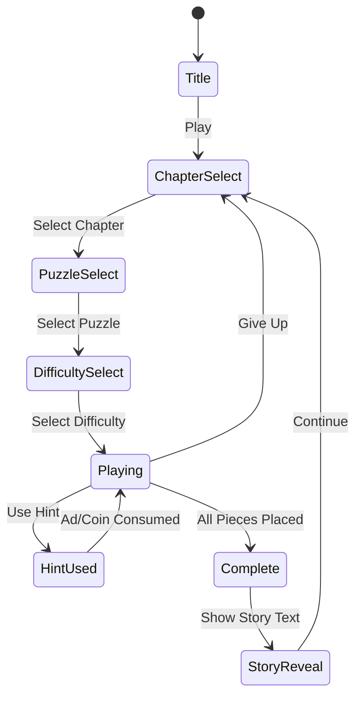

# Quebra-cabeças do Pesadelo (악몽의 퍼즐)

> 악몽 테마의 직소 퍼즐 게임. 어둠 속 이미지를 조각 맞추며 공포와 미스터리를 풀어나간다.

---

## 시장 분석 요약

| 항목 | 분석 |
|------|------|
| 참조 앱 평점 | 4.2 / 5.0 |
| 장르 | 직소 퍼즐 (Casual / Puzzle) |
| 평점 4.2의 한계 원인 | 이미지 다양성 부족, 힌트 시스템 미흡, 수익화 과도 |
| 우리의 차별점 | 악몽 테마 + 진행형 스토리텔링 + 합리적 수익화 |
| 구현 난이도 | ★★★☆☆ (중간) — 2주 MVP 가능 |
| 시장성 판단 | **출시 권장** — 퍼즐 장르는 꾸준한 수요, 테마로 차별화 가능 |

---

## 개요

플레이어는 분열된 악몽 이미지 조각들을 맞추며 숨겨진 장면을 완성한다. 각 이미지는 하나의 악몽 챕터이며, 모든 조각을 맞추면 짧은 스토리 텍스트가 공개된다. 호러/미스터리 팬층을 타겟으로 하며, 일반 퍼즐 앱과 테마로 차별화한다.

---

## 코어 메카닉

### 기본 플레이

1. 화면에 **빈 퍼즐 보드**(목표 이미지 실루엣)가 표시됨
2. 이미지 조각들이 **흩어진 상태**로 주변에 배치됨
3. 플레이어가 조각을 **드래그**하여 올바른 위치에 놓음
4. 조각이 정확한 위치 근처에 드롭되면 **자동 스냅** (허용 오차: 조각 크기의 20%)
5. 모든 조각을 맞추면 **완성 연출** → 스토리 공개

### 조각 인터랙션

- **드래그**: 손가락/마우스로 조각 이동
- **회전 없음** (MVP): 방향이 고정된 단순 배치 (난이도 조절 단순화)
- **스냅**: 정확한 위치 근처에 드롭 시 자동 맞춤
- **잘못된 위치**: 조각이 원래 자리로 돌아감 (부드러운 애니메이션)
- **힌트 강조**: 힌트 사용 시 해당 조각 위치가 반짝임

---

## 악몽 테마 디자인

### 아트 스타일

- **다크 팔레트**: 딥 퍼플, 블러드 레드, 머드 브라운, 해골 화이트
- **비네팅 효과**: 화면 가장자리 어둡게 처리
- **퍼즐 조각 테두리**: 갈라진 듯한 불규칙한 검은 선
- **배경**: 연기 파티클 또는 느린 왜곡 애니메이션 (CSS/Phaser 이펙트)
- **폰트**: 손으로 쓴 듯한 공포 스타일 (Google Fonts: Creepster, Nosifer)

### 이미지 카테고리 (챕터 구성)

| 챕터 | 테마 | 이미지 예시 |
|------|------|-------------|
| 1. 어둠의 숲 | 미스터리 | 안개 낀 숲, 이상한 문, 발자국 |
| 2. 저주받은 집 | 호러 | 폐가 외관, 깨진 창문, 다락방 |
| 3. 심해의 공포 | 크리쳐 | 심해 괴물, 난파선, 발광 생물 |
| 4. 악몽의 도시 | 디스토피아 | 뒤틀린 건물, 붉은 하늘, 그림자 |
| 5. 최후의 꿈 | 보스 챕터 | 악몽의 근원, 엔딩 장면 |

### 스토리텔링

- 각 이미지 완성 후 **2~3줄 텍스트** 공개 (한국어)
- 예시: _"어둠 속에서 눈이 당신을 바라보고 있다. 도망쳐도 소용없다. 이미 늦었다."_
- 챕터 내 이미지를 모두 완성하면 **챕터 엔딩 텍스트** 공개

---

## 조각 시스템

### 난이도별 구성

| 난이도 | 조각 수 | 격자 | 권장 대상 |
|--------|---------|------|-----------|
| Easy | 9 | 3×3 | 캐주얼, 첫 플레이어 |
| Normal | 16 | 4×4 | 일반 유저 |
| Hard | 25 | 5×5 | 코어 퍼즐 팬 |
| Expert | 36 | 6×6 | 도전적 유저 |
| Nightmare | 49 | 7×7 | 하드코어 + 브랜딩 |

> MVP에서는 **9/16/25** 3단계만 구현. 36/49는 Phase 2.

### 조각 생성 로직

```
원본 이미지 (예: 400×400px)
  → 격자로 균등 분할 (3×3이면 133×133px × 9조각)
  → 각 조각에 불규칙 마스크 적용 (직소 모양, SVG 클립패스)
  → 조각들을 랜덤 위치로 흩어놓기
  → 보드 위 목표 위치는 반투명 실루엣으로 표시
```

### 직소 조각 모양

- MVP: **직사각형 조각** (구현 단순화 — 1주 목표)
- Phase 2: 전통적인 직소 요철 모양 (SVG path 또는 Canvas clip)

---

## 힌트 시스템

| 힌트 종류 | 효과 | 비용 |
|-----------|------|------|
| 가이드라인 표시 | 보드 위 격자선 표시 (위치 가이드) | 광고 시청 또는 코인 |
| 조각 강조 | 랜덤 1개 조각의 목표 위치 반짝임 (3초) | 코인 |
| 외곽 자동 완성 | 가장자리 조각 자동 배치 | 프리미엄 or 광고 |
| 미리보기 | 완성 이미지를 3초간 표시 | 광고 시청 |

> **외곽 자동 완성**은 전통 직소 퍼즐 전략 (가장자리부터 맞추기)을 게임 메카닉으로 흡수.

---

## 에셋 조달 방안

### 옵션 A: AI 생성 이미지 (권장)

- **도구**: Midjourney, Stable Diffusion, DALL-E 3
- **프롬프트 예시**: `dark surreal nightmare forest, horror art style, deep purple tones, no text, square format 512x512`
- **비용**: Midjourney Basic $10/월 → 이미지 무제한 생성
- **라이선스**: Midjourney Basic 플랜은 상업적 사용 불가 → **Standard 플랜 $30/월** 필요
- **산출물**: 챕터당 5~10장, 총 25~50장 확보 가능

### 옵션 B: 라이선스 이미지

- **소스**: Unsplash (무료, CC0), Pixabay (무료, CC0)
- **필터링**: dark, horror, mystery 키워드
- **단점**: 호러 테마 고품질 이미지 수가 제한적

### 옵션 C: 혼합 전략 (최종 권장)

1. **출시 MVP**: AI 생성 이미지 15장 (5챕터 × 3장)
2. **Phase 2**: 추가 AI 생성 팩 확보 → 유료 콘텐츠로 활용
3. **저작권 관리**: 모든 이미지 생성 기록 보관 (프롬프트, 날짜)

---

## 4.2 평점 원인 분석

참조 앱(Quebra-cabeças do Pesadelo, 4.2점) 의 한계:

| 문제 | 분석 | 우리의 대응 |
|------|------|-------------|
| 이미지 다양성 부족 | 초기 이미지 20장 이하, 빠른 소진 | AI로 50장+ 확보, 챕터 구조 |
| 힌트 강요 유료화 | 힌트가 너무 비싸거나 광고 과다 | 합리적 광고 1회 = 힌트 1회 |
| 완성 후 보상 없음 | 퍼즐 완성이 허무함 | 스토리 텍스트 + 갤러리 저장 |
| 튜토리얼 부재 | 첫 플레이어 혼란 | 첫 실행 시 3단계 온보딩 |
| 난이도 점프 | Easy → Hard 격차 큼 | 5단계 세분화 |
| 호러 테마 미흡 | 테마가 피상적 | BGM + 파티클 + 스토리 강화 |

---

## 게임 플로우



---

## UI 레이아웃

```
┌─────────────────────────────┐
│  ← Back   Chapter 2 / 3    │  ← 상단 HUD (챕터 진행)
│           💀 0:00           │  ← 타이머 (Hard+ 모드)
├─────────────────────────────┤
│                             │
│  ┌─────────────────────┐    │
│  │  [  ][  ][  ]       │    │
│  │  [  ][  ][  ]  목표 │    │  ← 퍼즐 보드
│  │  [  ][  ][  ]  보드 │    │    (실루엣 표시)
│  └─────────────────────┘    │
│                             │
│  흩어진 조각들:              │
│   🧩  🧩  🧩  🧩  🧩       │  ← 조각 트레이
│   🧩  🧩  🧩  🧩           │
│                             │
├─────────────────────────────┤
│  💡 힌트   👁 미리보기   🔄  │  ← 도구 바
└─────────────────────────────┘
```

---

## 스코어링 시스템

| 이벤트 | 점수 |
|--------|------|
| 조각 정확히 배치 | +10 |
| 힌트 없이 클리어 | +200 보너스 |
| 첫 시도 클리어 | +100 보너스 |
| 타이머 클리어 (Hard+) | 남은 시간 × 2 |

> MVP에서는 점수 시스템 단순화 가능. 완성 여부만 추적해도 충분.

---

## 사운드/이펙트

| 상황 | 효과 |
|------|------|
| 배경 BGM | 저음 앰비언트 호러 음악 (루프, 무료 CC0 소스) |
| 조각 드래그 시작 | 긁히는 소리 |
| 조각 스냅 성공 | 짧은 딸깍 소리 + 파티클 |
| 잘못된 위치 | 낮은 톤 효과음 |
| 퍼즐 완성 | 유리 깨지는 소리 + 화면 진동 효과 |
| 스토리 공개 | 타자기 효과음으로 텍스트 등장 |

> 무료 효과음: freesound.org (CC0 필터), mixkit.co

---

## 수익화 전략

### 광고 (주 수입원)

| 위치 | 광고 타입 | 빈도 |
|------|-----------|------|
| 챕터 완성 후 | 전면 광고 | 챕터 완성마다 |
| 힌트 요청 시 | 보상형 광고 | 선택적 |
| 5분 이상 플레이 | 배너 광고 | 지속 노출 |

### 인앱 결제

| 상품 | 가격 | 내용 |
|------|------|------|
| 광고 제거 | $1.99 | 영구 광고 제거 |
| 이미지 팩 (챕터) | $0.99/팩 | 추가 챕터 5장 |
| 코인 번들 | $0.99 | 힌트 코인 50개 |
| 올인원 | $3.99 | 광고 제거 + 모든 현재 팩 |

### 수익화 원칙 (4.2점 방지)

- 힌트는 **광고 시청으로 무료** 획득 가능 (강제 결제 없음)
- 챕터 1은 **완전 무료** (첫 15장)
- 추가 챕터 잠금은 앱 안정화 후 Phase 2에서 적용

---

## 난이도 설계

| 단계 | 조각 수 | 타이머 | 힌트 허용 | 챕터 |
|------|---------|--------|-----------|------|
| Easy | 9 | 없음 | 무제한 | 1~2 |
| Normal | 16 | 없음 | 3회 | 1~3 |
| Hard | 25 | 5분 | 2회 | 2~4 |
| Expert | 36 | 3분 | 1회 | 3~5 |
| Nightmare | 49 | 2분 | 0회 | 5 |

---

## MVP 범위

### Phase 1 — MVP (1~2주 목표)

- [x] 기획서 작성
- [ ] Easy/Normal/Hard 3단계 (9/16/25 조각)
- [ ] 직사각형 조각 (요철 없음)
- [ ] 드래그 & 스냅 인터랙션
- [ ] 챕터 1 이미지 5장 (AI 생성)
- [ ] 퍼즐 완성 → 스토리 텍스트 공개
- [ ] 힌트 2종 (가이드라인, 조각 강조)
- [ ] 보상형 광고 연동
- [ ] 다크 테마 UI + 앰비언트 BGM 1곡

### Phase 2

- [ ] Expert/Nightmare 난이도 (36/49 조각)
- [ ] 전통 직소 요철 모양 조각
- [ ] 챕터 2~5 이미지 추가 (25~40장)
- [ ] 인앱 결제 (이미지 팩, 광고 제거)
- [ ] 완성 갤러리 (클리어한 이미지 보관함)
- [ ] 타이머 챌린지 모드
- [ ] 리더보드 (클리어 시간 랭킹)

---

## 기술 구현 가이드 (lib 팀 참고)

```
lib/nightmare-puzzle/
  src/
    scenes/
      GameScene.ts      # 퍼즐 보드 + 조각 인터랙션
      MenuScene.ts      # 챕터/난이도 선택
      CompleteScene.ts  # 완성 연출 + 스토리 텍스트
    core/
      PuzzleBoard.ts    # 격자 생성, 조각 위치 관리
      PuzzlePiece.ts    # 조각 드래그, 스냅 로직
      ImageSlicer.ts    # 이미지를 격자로 분할
    data/
      chapters.ts       # 챕터/이미지/스토리 데이터
```

### 핵심 기술 결정 사항

- **이미지 분할**: Canvas API로 이미지를 격자 분할 → 각 조각을 Phaser Image로 생성
- **드래그**: Phaser의 `setInteractive()` + `setDraggable()` 사용
- **스냅**: 드롭 위치와 목표 위치 거리 계산 → 허용 범위 내 자동 배치
- **이미지 로딩**: 외부 이미지는 base64 또는 번들 포함 (CDN 지연 방지)
