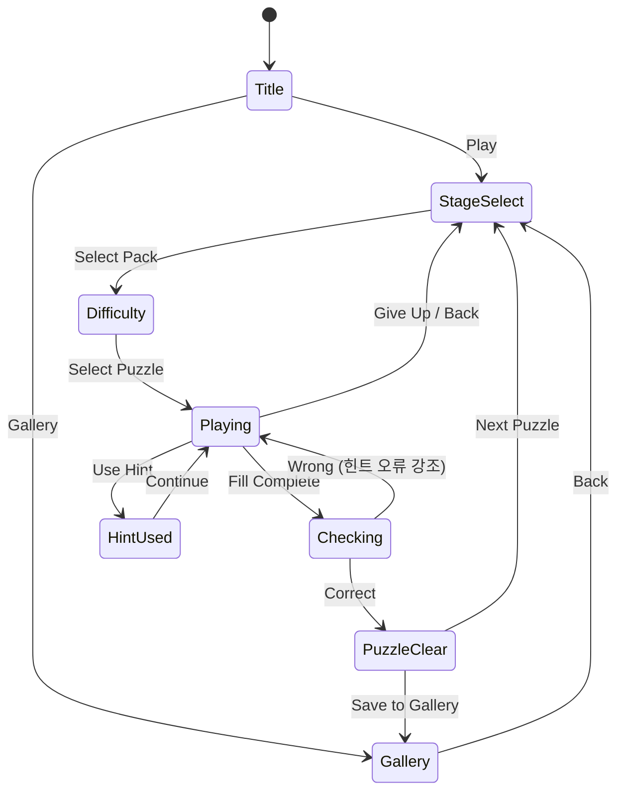

# Nonogram

> 숫자 힌트를 보고 칸을 칠해 픽셀 아트를 완성하는 로직 퍼즐 게임 (피크로스 방식)

## 개요

격자(Grid) 위의 각 행/열에 주어진 숫자 힌트를 보고, 규칙에 따라 칸을 채워 숨겨진 픽셀 아트 그림을 완성한다.
퍼즐을 완성하면 완성된 그림이 갤러리에 저장되며, 수집 욕구를 자극한다.

- **장르**: Brain / Logic Puzzle
- **타겟 유저**: 퍼즐 게임 팬, 픽셀 아트 감성을 즐기는 캐주얼 유저
- **레퍼런스**: Picross S (Nintendo), Nonogram.com, Pixel Art Nonogram

## 게임 규칙

### 기본 규칙

- 격자(Grid)의 각 **행(Row)** 과 **열(Column)** 에 숫자 힌트가 표시됨
- 숫자 = 해당 라인에서 **연속으로 채워진 칸의 그룹 크기**
- 숫자가 여러 개인 경우 그룹 사이에 **최소 1칸 이상** 빈 칸 존재
- 힌트에 맞게 모든 칸을 정확히 채우면 **퍼즐 클리어**

### 예시 (5×5)

```
힌트 [3, 1] → ■ ■ ■ □ ■  (연속 3칸, 빈칸 1개 이상, 연속 1칸)
힌트 [5]    → ■ ■ ■ ■ ■  (모두 채움)
힌트 [1, 1] → ■ □ □ □ ■  (가능한 배치 중 하나)
```

### 조작

| 조작 | 동작 |
|------|------|
| 칸 탭(단일 터치) | 채우기 (■) |
| 칸 길게 누름 | X 표시 (빈 칸으로 확정) |
| X 표시된 칸 탭 | X 해제 |
| ■ 채워진 칸 탭 | 채우기 해제 |
| 드래그 | 여러 칸 연속 채우기/X 표시 |

### 자동 완성 규칙

- 행/열의 힌트 합 + 최소 공백 = 격자 크기일 때 → 전체 자동 배치 강조
- 완성된 행/열 힌트 번호 자동 회색 처리 (완료 표시)

### 오류 표시 (옵션)

- 힌트를 초과해서 채웠을 때 빨간색 강조
- 완성 시 틀린 부분 빨간색으로 표시 후 수정 유도 (Strict 모드에서는 오류 즉시 표시)

## 게임 플로우



## UI 레이아웃

### 메인 게임 화면

```
┌──────────────────────────────────┐
│  ← Back    Puzzle 12/50  ⏱ 03:24 │  ← 상단 HUD
├──────────────────────────────────┤
│        │  2  │  3 1│  1  │  2  3 │
│        │     │     │     │       │  ← 열 힌트
├────────┼─────┼─────┼─────┼───────┤
│  3     │  ■  │  ■  │  ■  │  □  □ │
│  1 1   │  □  │  ■  │  □  │  ■  □ │  ← 행 힌트 + 격자
│  2     │  ■  │  ■  │  □  │  □  □ │
│  1     │  □  │  □  │  ■  │  □  □ │
│  3     │  ■  │  ■  │  ■  │  □  □ │
├──────────────────────────────────┤
│  💡 Hint    ✏️ Erase    ✅ Check  │  ← 하단 도구
└──────────────────────────────────┘
```

### 스테이지 선택 화면

```
┌──────────────────────────────────┐
│         Nonogram Puzzles          │
├──────────────────────────────────┤
│  [5×5 Starter]  [10×10 Classic]  │
│  [15×15 Expert] [20×20 Master]   │  ← 팩 선택
├──────────────────────────────────┤
│  ┌────┐ ┌────┐ ┌────┐ ┌────┐    │
│  │ 🐱 │ │ 🌸 │ │ ?? │ │ 🔒 │    │  ← 퍼즐 썸네일
│  │ ★★★│ │ ★★☆│ │    │ │    │    │     (완성/미완/잠금)
│  └────┘ └────┘ └────┘ └────┘    │
└──────────────────────────────────┘
```

### 갤러리 화면

```
┌──────────────────────────────────┐
│           My Gallery              │
├──────────────────────────────────┤
│  ┌────┐ ┌────┐ ┌────┐ ┌────┐    │
│  │픽셀│ │픽셀│ │픽셀│ │ ?? │    │  ← 완성된 픽셀아트
│  │ 아 │ │ 아 │ │ 아 │ │잠김│    │
│  └────┘ └────┘ └────┘ └────┘    │
│   Cat    Flower  Bunny            │
└──────────────────────────────────┘
```

## 스코어링 시스템

| Action | 점수 |
|--------|------|
| 퍼즐 클리어 | +1000 |
| 힌트 미사용 클리어 | +500 보너스 |
| 오류 없이 클리어 | +300 보너스 |
| 빠른 클리어 (목표 시간 내) | +200 보너스 |
| 힌트 사용 1회 | -100 |
| 별점 3개 조건 | 오류 0 + 힌트 0 + 시간 내 |
| 별점 2개 조건 | 오류 3 이하 또는 힌트 1 이하 |
| 별점 1개 조건 | 클리어만 해도 획득 |

## 난이도 설계

### 그리드 크기별 특성

| 단계 | 크기 | 예상 풀이 시간 | 힌트 복잡도 | 대상 유저 |
|------|------|---------------|-------------|-----------|
| Starter | 5×5 | 1~3분 | 1~2개 숫자 | 입문 |
| Classic | 10×10 | 5~15분 | 2~4개 숫자 | 일반 |
| Expert | 15×15 | 15~30분 | 3~6개 숫자 | 숙련 |
| Master | 20×20 | 30~60분 | 4~8개 숫자 | 고수 |
| Color | 10×10+ | 10~20분 | 색상별 힌트 | 특수 |

### 퍼즐 생성 원칙

- **유일해 보장**: 주어진 힌트로 정답이 정확히 1개만 존재해야 함
- **시작점 제공**: 즉시 확정 가능한 행/열이 최소 2개 이상 존재
- **논리적 풀이 가능**: 추측 없이 논리만으로 풀 수 있어야 함 (Expert 이하)
- **Master급**: 일부 가정(assumption)이 필요한 고난도 허용

### 퍼즐 팩 구성 (MVP)

| 팩 | 크기 | 퍼즐 수 | 테마 |
|----|------|---------|------|
| Animals | 5×5 | 20 | 귀여운 동물 |
| Nature | 5×5 | 20 | 꽃, 나무, 자연 |
| Classic Mix | 10×10 | 10 | 랜덤 믹스 |

> **MVP 총합**: 50퍼즐 (5×5 × 40 + 10×10 × 10)

## 퍼즐 자동 생성 알고리즘

### 이미지 → 노노그램 변환 파이프라인

```
원본 이미지 (PNG/SVG)
    ↓ 리사이즈 → N×N 격자
    ↓ 흑백 변환 (임계값 기준 이진화)
    ↓ 픽셀 배열 → 힌트 추출
    ↓ 유일해 검증 (백트래킹 솔버)
    ↓ 검증 실패 시 → 픽셀 조정 후 재시도
    → 노노그램 퍼즐 JSON 출력
```

### 힌트 추출 로직

```
각 행에 대해:
  연속 ■ 그룹을 왼쪽→오른쪽 스캔
  그룹 크기를 순서대로 배열 → 행 힌트

각 열에 대해:
  연속 ■ 그룹을 위→아래 스캔
  그룹 크기를 순서대로 배열 → 열 힌트
```

### 퍼즐 JSON 포맷

```json
{
  "id": "animals_001",
  "title": "Cat",
  "size": { "rows": 5, "cols": 5 },
  "rowHints": [[2], [1,1], [3], [1,1], [2]],
  "colHints": [[1], [3,1], [3], [3,1], [1]],
  "solution": [
    [0,1,1,0,0],
    [1,0,0,1,0],
    [0,1,1,1,0],
    [1,0,0,0,1],
    [0,1,1,0,0]
  ],
  "thumbnail": "base64...",
  "difficulty": "starter",
  "pack": "animals",
  "estimatedTime": 120
}
```

## 힌트 시스템

| 힌트 종류 | 동작 | 비용 |
|-----------|------|------|
| 행/열 자동 완성 | 선택한 라인의 확정 가능한 칸을 모두 채움 | 힌트 1개 |
| 단일 칸 공개 | 랜덤한 미채움 칸 1개를 정답으로 표시 | 힌트 1개 |
| 오류 검사 | 현재 채운 칸 중 틀린 칸 강조 표시 | 힌트 1개 |
| 자동 X 표시 | 절대 채울 수 없는 칸에 X 자동 표시 | 무료 (설정) |

### 힌트 보유량

- 일일 무료 힌트: 3개
- 광고 시청 → 힌트 +2
- 인앱 구매로 힌트 팩 구매 가능

## 사운드/이펙트

| 이벤트 | 사운드 | 이펙트 |
|--------|--------|--------|
| 칸 채우기 | 톡 (낮은 톤) | 칸 채워지는 애니메이션 |
| X 표시 | 틱 (높은 톤) | X 슬라이드 인 |
| 행/열 완성 | 차임 효과음 | 힌트 번호 회색 전환 + 빛남 |
| 퍼즐 클리어 | 팡파레 | 격자 전체 빛남 → 픽셀아트 줌인 |
| 오류 발생 | 낮은 버즈 | 틀린 칸 빨간 깜빡임 |
| 갤러리 추가 | 팝 사운드 | 그림 슬라이드 인 |

## 수익화 전략

### 무료 기본 제공

- Animals 팩 (5×5 × 20) 전체 무료
- 일일 힌트 3개 무료
- 광고 포함 (배너 + 퍼즐 클리어 후 전면 광고)

### 인앱 구매 (IAP)

| 상품 | 가격 | 내용 |
|------|------|------|
| 힌트 팩 Small | $0.99 | 힌트 10개 |
| 힌트 팩 Large | $2.99 | 힌트 50개 |
| Classic Pack | $1.99 | 10×10 × 20퍼즐 |
| Expert Pack | $2.99 | 15×15 × 20퍼즐 |
| Master Pack | $3.99 | 20×20 × 15퍼즐 |
| Color Pack | $2.99 | 색상 노노그램 × 15퍼즐 |
| Full Bundle | $7.99 | 광고 제거 + 모든 팩 |
| No Ads | $2.99 | 광고 제거만 |

### 수익화 예상

- DAU 1,000 기준 일일 광고 수익: $30~50
- IAP 전환율 2~3% 가정 시 월 $1,000~3,000 목표

## MVP 범위

### Phase 1 (MVP, 1~2주)

- [ ] 기획서 작성
- [ ] 5×5 그리드 렌더링 (Phaser)
- [ ] 힌트 표시 (행/열)
- [ ] 칸 채우기 / X 표시 조작
- [ ] 퍼즐 클리어 판정 로직
- [ ] 유일해 검증 포함 자동 생성 알고리즘
- [ ] 50개 퍼즐 JSON 데이터 (자동 생성)
- [ ] 스테이지 선택 화면
- [ ] 퍼즐 클리어 연출 (기본)
- [ ] 별점 시스템 (3성)

### Phase 2 (출시 후 1주)

- [ ] 갤러리 화면 + 픽셀아트 수집
- [ ] 10×10 퍼즐 팩 추가
- [ ] 힌트 시스템 (행/열 자동완성, 오류 검사)
- [ ] 타이머 표시 + 빠른 클리어 보너스
- [ ] 완성된 행/열 힌트 자동 회색 처리
- [ ] 광고 통합 (배너 + 전면)

### Phase 3 (데이터 기반 결정)

- [ ] 15×15, 20×20 Expert/Master 팩
- [ ] 색상 노노그램 (컬러 팩)
- [ ] 인앱 구매 통합
- [ ] 광고 제거 구매
- [ ] 일일 퍼즐 (매일 새 퍼즐)
- [ ] 리더보드 (빠른 클리어 경쟁)

## 기술 고려사항 (lib 팀 참고)

- **퍼즐 솔버**: 백트래킹 기반 유일해 검증 필요 (생성 시 1회)
- **그리드 렌더링**: Phaser Graphics로 격자 + 픽셀 채우기
- **터치 입력**: Phaser Input 멀티터치 → 드래그 채우기
- **퍼즐 데이터**: JSON 번들 → 앱 내 포함 (네트워크 불필요)
- **상태 관리**: 현재 채움 상태 배열 + 실행 취소 스택
- **성능**: 20×20 = 400칸 → Phaser로 충분히 처리 가능

## 참고 레퍼런스

- **Nonogram.com**: 웹 기반 무료 노노그램, 일일 퍼즐 모델
- **Picross S (Nintendo)**: 클래식 UI/UX 기준점
- **Pixel Art Nonogram**: 모바일 최적화 UI 참고
