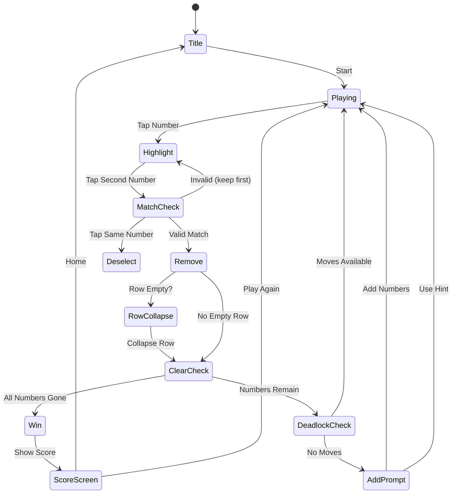

# Number Match — 숫자 로직 퍼즐

> **레퍼런스**: Easybrain "Number Match" (Play Store #66, Rating 4.5)
> **장르**: Math / Logic Puzzle
> **MVP 목표**: 1주 내 출시

## 개요

숫자가 채워진 그리드에서 **같은 숫자 쌍** 또는 **합이 10인 숫자 쌍**을 찾아 제거하는 로직 퍼즐.
인접하거나 빈칸을 건너 연결되는 두 숫자를 탭해 제거하고, 모든 숫자를 지우면 클리어.
막히면 남은 숫자를 아래에 복사하여 무한히 이어가는 **무한 모드** 방식.

---

## 코어 메카닉

### 매칭 조건 (둘 중 하나 충족 시 제거 가능)

| 조건 | 예시 |
|------|------|
| 같은 숫자 | `5` ↔ `5` |
| 합이 10 | `3` ↔ `7`, `1` ↔ `9`, `2` ↔ `8` 등 |

> `5 + 5 = 10` 이므로 같은 숫자 `5`끼리는 두 조건 모두 해당

### 연결 조건 (둘 중 하나 충족 시 연결 가능)

| 유형 | 설명 |
|------|------|
| **직접 인접** | 수평/수직으로 바로 옆 (빈칸 없음) |
| **빈칸 건너 인접** | 같은 행/열에서 사이의 숫자가 모두 제거된 경우 |
| **행 끝-다음 행 시작** | 한 행의 마지막 칸과 다음 행의 첫 번째 칸이 논리적으로 인접 |

```
예시 (9칸 행):
[1][2][_][_][_][_][_][3][4]
                         ↑↑
                    3과 4는 직접 인접
[1]과 [4]는 빈칸 건너 연결 (3이 제거되면)

행 경계 연결:
[_][_][_][_][_][_][_][_][5]  ← 이 행 끝
[5][_][_][_][_][_][_][_][_]  ← 다음 행 시작
위의 5와 아래의 5는 행 경계로 인접 → 매칭 가능
```

---

## 게임 규칙

### 초기 그리드

- **9열** 고정 (가로 9칸)
- 초기 숫자: 1~9가 랜덤 배치된 **N행** (기본 10행 = 90개 숫자)
- 숫자 구성: 1~9 랜덤, 단 항상 **짝이 존재**하도록 생성
  - 생성 방식: 쌍(pair) 기반 생성 → 매칭 가능한 쌍을 먼저 만들고 섞기

### 플레이 흐름

1. 플레이어가 첫 번째 숫자 탭 → 하이라이트
2. 두 번째 숫자 탭 → 매칭 조건 + 연결 조건 동시 검사
3. **성공**: 두 숫자 제거 + 점수 획득
4. **실패**: 하이라이트 해제 (첫 번째 선택으로 유지 또는 취소)
5. 한 행이 전부 비워지면 → **해당 행 즉시 제거** (위 행들이 아래로 내려옴)
6. 더 이상 매칭 가능한 쌍이 없으면 → **숫자 추가 (Add)** 사용 가능
7. 모든 숫자 제거 → **게임 클리어**

### 숫자 추가 (Add / Continue)

- 현재 남아있는 모든 숫자를 **순서대로** 그리드 하단에 복사하여 추가
- Add 횟수 제한 없음 (무한 모드)
- Add 사용 횟수는 스코어에 영향 (패널티)

---

## #61 사과게임과 비교

| 항목 | 넘버 매치 (#66) | 사과게임 (#61) |
|------|----------------|----------------|
| **그리드 방향** | 세로 스크롤 (행 추가) | 고정 그리드 |
| **매칭 방식** | 두 숫자 순차 탭 | 드래그로 영역 선택 |
| **연결 규칙** | 인접 + 빈칸 건너 + 행 경계 | 직사각형 영역 내 합 = 10 |
| **게임 종료** | 모든 숫자 제거 (무한 추가) | 시간 내 최대 점수 |
| **모드** | 무한 (끝없이 추가) | 타임 어택 |
| **난이도 상승** | 행 축적 → 복잡도 증가 | 없음 (단일 스테이지) |
| **핵심 차별점** | 장기 세션, 전략적 계획 | 단기 세션, 반사적 반응 |
| **구현 난이도** | 낮음 (그리드 + 매칭 로직) | 낮음 (영역 선택 + 합 계산) |

**결론**: 두 게임은 "합이 10" 이라는 핵심 규칙을 공유하지만, 게임 구조가 완전히 다름.
넘버 매치는 **장기 세션 퍼즐**, 사과게임은 **캐주얼 타임 어택**. 경쟁이 아닌 **포트폴리오 보완** 관계.

---

## 게임 플로우



---

## UI 레이아웃

```
┌─────────────────────────────┐
│  ☰ Menu    🔢 Number Match  │  ← 상단 헤더
│  Score: 1,250  Moves: 47    │
├─────────────────────────────┤
│                             │
│  [1][2][3][4][5][6][7][8][9]│
│  [2][3][4][5][6][7][8][9][1]│  ← 숫자 그리드
│  [3][ ][ ][ ][6][ ][ ][ ][1]│    (9열 × N행)
│  [4][5][6][ ][ ][ ][ ][8][9]│    스크롤 가능
│  [7][8][ ][ ][ ][ ][ ][ ][3]│
│  ...                        │
│                             │
├─────────────────────────────┤
│  [↩️ Undo] [💡 Hint] [➕ Add]│  ← 하단 도구
└─────────────────────────────┘

선택 상태:
- 미선택: 기본 배경
- 첫 번째 선택: 파란색 하이라이트
- 제거 애니메이션: 페이드 아웃 + 스케일 다운
- 행 붕괴 애니메이션: 위 행이 부드럽게 내려옴
```

---

## 스코어링 시스템

| 액션 | 점수 |
|------|------|
| 숫자 쌍 제거 | +10 |
| 연속 제거 (콤보, 5초 내) | +10 × 콤보 수 |
| 행 완전 제거 | +50 |
| Add 사용 | -100 (패널티) |
| 힌트 사용 | -50 (패널티) |
| Undo 사용 | 점수 복원 없음 |
| 최종 클리어 | +500 |

---

## 난이도 설계

### 초기 그리드 생성 전략

```
Easy   : 짝이 많고 인접 배치 (매칭 쉽게 보임)
Normal : 랜덤 배치 (표준)
Hard   : 짝이 분산 배치 + 행 경계 연결 필요
```

### 레벨별 설정

| 레벨 | 초기 행 수 | 생성 방식 | 설명 |
|------|-----------|-----------|------|
| Easy | 5행 (45개) | 인접 쌍 우선 | 튜토리얼 |
| Normal | 10행 (90개) | 랜덤 | 기본 |
| Hard | 15행 (135개) | 분산 배치 | 고난도 |

> MVP에서는 Normal 단일 모드로 시작, 이후 Easy/Hard 추가

---

## 아이템 / 도구

| 아이템 | 효과 | 무료/유료 |
|--------|------|-----------|
| **Undo** | 직전 제거 복원 (1수) | 3회 무료, 이후 광고 or 코인 |
| **Hint** | 매칭 가능한 쌍 1개 하이라이트 | 3회 무료, 이후 광고 or 코인 |
| **Add** | 남은 숫자 하단 복사 추가 | 무제한 무료 (게임 핵심 메카닉) |

---

## 수익화 전략

### 광고 (주요 수익원)

| 광고 유형 | 노출 시점 |
|-----------|-----------|
| 배너 광고 | 게임 하단 상시 |
| 전면 광고 | 게임 클리어 / 게임 오버 시 |
| 보상형 광고 | Undo/Hint 추가 사용 시 ("광고 보고 계속하기") |

### 인앱 결제 (부가 수익)

| 상품 | 내용 |
|------|------|
| 광고 제거 | 1회성 구매 |
| 코인 팩 | Undo/Hint 대량 구매 |
| 테마 팩 | 숫자 스킨/배경 변경 |

### MVP 수익화 우선순위

1. **보상형 광고** (Undo/Hint 연동) — 가장 자연스러운 게임플레이 통합
2. **전면 광고** (클리어/재시작 시)
3. **배너 광고**
4. 인앱 결제는 Phase 2 이후

---

## 사운드 / 이펙트

| 이벤트 | 효과 |
|--------|------|
| 숫자 탭 | 경쾌한 클릭음 |
| 매칭 성공 | 팝/띵 효과음 |
| 콤보 | 상승 음계 (콤보 수 비례) |
| 행 제거 | 슬라이드 다운 + whoosh 사운드 |
| Add 사용 | 숫자 등장 효과음 |
| 클리어 | 축하 효과 + 파티클 |
| 힌트 | 반짝임 애니메이션 |

> MVP에서는 효과음만, BGM은 Phase 2

---

## 기술 구현 포인트 (lib 팀 전달 사항)

### 그리드 자료구조

```
grid: (number | null)[][]  // null = 제거된 칸
rows: 9열 고정
```

### 핵심 알고리즘

1. **연결 판정**: BFS/직선 탐색으로 두 셀 간 경로 확인
   - 같은 행: 사이 모두 null인지
   - 행 경계: 첫 행의 마지막 ~ 다음 행의 첫 번째
   - 같은 열: 위아래로 null만 존재하는지
2. **빈 행 감지**: 행의 모든 값이 null이면 행 삭제
3. **데드락 감지**: 전체 그리드에서 유효한 쌍이 없으면 Add 알림

### 상태 관리

```typescript
interface GameState {
  grid: (number | null)[][]
  score: number
  moves: number
  addCount: number
  selectedCell: [number, number] | null
  history: GridSnapshot[]  // Undo용
}
```

---

## MVP 범위

### Phase 1 — MVP (1주 목표)

- [x] 기획서 작성
- [ ] 9×10 초기 그리드 생성 (쌍 보장)
- [ ] 숫자 탭 → 선택/해제
- [ ] 매칭 판정 (같은 숫자 / 합 10)
- [ ] 연결 판정 (인접 + 빈칸 건너 + 행 경계)
- [ ] 숫자 제거 + 빈 행 붕괴
- [ ] Add 기능 (하단 복사 추가)
- [ ] 클리어 판정
- [ ] 기본 스코어 표시
- [ ] 배너 광고 + 보상형 광고 (Undo/Hint)

### Phase 2 — 성과 확인 후

- [ ] Undo / Hint 아이템
- [ ] 콤보 시스템
- [ ] 데드락 자동 감지 + Add 팝업
- [ ] Easy/Hard 난이도
- [ ] 사운드/이펙트
- [ ] 인앱 결제 (광고 제거, 코인)
- [ ] 리더보드

---

## 시장성 판단

| 항목 | 평가 |
|------|------|
| 시장 검증 | ✅ Play Store #66, Rating 4.5 — 충분히 검증됨 |
| 구현 난이도 | ✅ 낮음 — 그리드 + 매칭 로직, Phaser 없이도 가능 |
| 사용자 유지 | ✅ 무한 모드 + 숫자 중독성 — 장기 세션 |
| CPI 예상 | ✅ 수학 퍼즐 장르 CPI 낮음 ($0.3~0.8) |
| 광고 수익 | ✅ 세션 길수록 광고 노출 증가 |
| **최종 판단** | **우선 개발 권장** — 1주 MVP 충분히 가능 |
