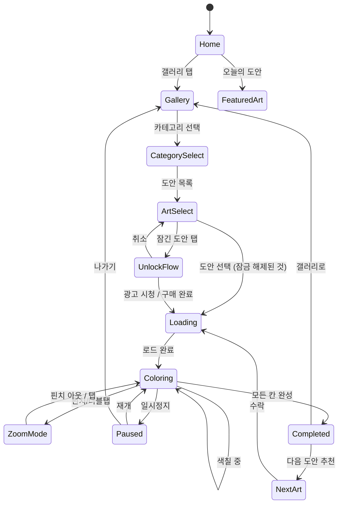

# 픽셀 아트 - 숫자 색칠게임 책

> 숫자에 따라 칸을 색칠해 완성되는 힐링 픽셀 아트 퍼즐 게임.
> 레퍼런스: Easybrain "Pixel Art - Color by Number" (App Store 4.5★, Top #116)

## 개요

화면에 숫자가 적힌 픽셀 칸들이 표시된다. 각 숫자는 하나의 색상에 대응한다.
플레이어는 하단 팔레트에서 색상을 선택한 뒤 같은 숫자의 칸을 탭하거나 드래그해 채운다.
모든 칸을 올바르게 채우면 도안이 완성되고 완성 애니메이션이 재생된다.

### 장르 포지셔닝

- **힐링 / 캐주얼**: 실패 없음, 무한 시간, 스트레스 없는 경험
- **ASMR 감성**: 색칠 소리, 부드러운 효과, 완성의 만족감
- **수집형 콘텐츠**: 도안 갤러리, 완성작 저장 → 재방문 유도

## 게임 규칙

### 기본 규칙

- 도안은 N×M 픽셀 그리드로 구성
- 각 칸에는 색상 번호(1~50)가 표시됨
- 팔레트에서 색상 선택 → 해당 번호 칸 색칠
- **실패 조건 없음** — 틀려도 다시 칠하면 됨 (힐링 장르 핵심)
- 모든 칸이 올바른 색으로 채워지면 **완성**

### 색칠 인터랙션

| 인터랙션 | 동작 |
|----------|------|
| 팔레트 색상 탭 | 해당 색상 선택 (활성화) |
| 칸 탭 | 선택된 색상으로 1칸 색칠 |
| 칸 드래그 | 선택된 색상으로 연속 색칠 |
| 같은 번호 칸 자동 하이라이트 | 현재 선택 색상의 빈 칸 강조 표시 |
| 확대/축소 (핀치/더블탭) | 세부 영역 탐색 |
| 드래그 이동 | 확대 상태에서 캔버스 이동 |

### 완성 판정

- 실시간 체크: 마지막 칸 색칠 시 즉시 완성 감지
- 완성 조건: 전체 칸 중 빈 칸 = 0 && 모든 색상이 정확히 일치

### 힌트 시스템

- **번호 힌트**: 특정 번호의 모든 빈 칸 일시적 하이라이트
- **자동완성 (프리미엄)**: 특정 색상 번호 전체 자동 채우기 (1회권 또는 광고 시청)
- **진행도 표시**: 색상별 완성율 (팔레트 아이콘에 % 표시)

## 게임 플로우



## UI 레이아웃

### 메인 홈 화면

```
┌─────────────────────────┐
│  🎨 Pixel Art           │  ← 앱 로고/타이틀
│                         │
│  ┌──────────────────┐   │
│  │  오늘의 도안      │   │  ← 피처드 도안 (Daily)
│  │  [미완성 썸네일]  │   │
│  │  계속하기 ▶       │   │
│  └──────────────────┘   │
│                         │
│  [동물] [풍경] [판타지] [음식]  │  ← 카테고리 탭
│                         │
│  ┌──┐ ┌──┐ ┌──┐ ┌──┐   │
│  │🐱│ │🌲│ │🏰│ │🍕│   │  ← 도안 그리드 (4열)
│  └──┘ └──┘ └──┘ └──┘   │
│     (스크롤 가능)        │
└─────────────────────────┘
```

### 색칠 화면 (메인 플레이)

```
┌─────────────────────────┐
│  ← 뒤로   진행도 73%  ⚙ │  ← 상단 HUD
├─────────────────────────┤
│                         │
│  ┌───────────────────┐  │
│  │  3  2  1  2  3    │  │
│  │  2  1  1  1  2    │  │  ← 픽셀 그리드 캔버스
│  │  1  1 [빈] 1  1   │  │    (핀치로 확대/축소)
│  │  2  1  1  1  2    │  │
│  │  3  2  1  2  3    │  │
│  └───────────────────┘  │
│                         │
├─────────────────────────┤
│  남은 칸: 47            │  ← 색상별 잔여 칸 수
├─────────────────────────┤
│ ●1 ●2 ●3 ●4 ●5 ●6 ●7  │  ← 색상 팔레트 (스크롤)
│      [선택됨: ●3]       │
└─────────────────────────┘
```

### 완성 화면

```
┌─────────────────────────┐
│                         │
│   ✨ 완성! ✨            │
│                         │
│  ┌───────────────────┐  │
│  │                   │  │
│  │   완성된 픽셀아트  │  │  ← 완성 이미지 (반짝 애니메이션)
│  │                   │  │
│  └───────────────────┘  │
│                         │
│  소요 시간: 12분 34초   │
│  갤러리에 저장됨 🖼      │
│                         │
│  [공유하기]  [다음 도안] │
└─────────────────────────┘
```

## 진행/보상 시스템

> 힐링 장르이므로 점수/랭킹 대신 **수집·완성 보람**에 집중

| 시스템 | 내용 |
|--------|------|
| 완성 갤러리 | 완성한 도안을 갤러리에 보존, 언제든 감상 가능 |
| 일일 도안 | 매일 새 도안 1개 무료 제공 → 리텐션 훅 |
| 연속 출석 | 7일 연속 → 프리미엄 도안 팩 1개 증정 |
| 공유 기능 | 완성작 SNS 공유 → 바이럴 유도 |
| 통계 | 완성 도안 수, 총 색칠 시간, 가장 많이 쓴 색상 |

## 난이도 설계

| 등급 | 그리드 크기 | 색상 수 | 총 칸 수 | 대상 |
|------|------------|---------|---------|------|
| 입문 (Easy) | 10×10 | 5~10 | 100 | 어린이, 처음 유저 |
| 기본 (Normal) | 20×20 | 10~20 | 400 | 일반 유저 |
| 고급 (Hard) | 40×40 | 20~35 | 1,600 | 코어 팬 |
| 마스터 | 80×80 | 35~50 | 6,400 | 헤비 유저 |

- 그리드 크기가 클수록 완성 만족감 ↑, 플레이 타임 ↑
- 입문/기본 도안은 무료로 다수 제공 → 진입 장벽 최소화
- 고급/마스터 도안은 프리미엄 팩

## 카테고리 & 도안 기획

| 카테고리 | 도안 예시 | 타겟 |
|----------|-----------|------|
| 동물 | 고양이, 강아지, 팬더, 여우 | 전연령 |
| 자연/풍경 | 일몰, 바다, 숲, 산 | 성인 |
| 판타지 | 드래곤, 마법사, 성, 유니콘 | 10~20대 |
| 음식 | 피자, 케이크, 스시, 라면 | 전연령 |
| 명화 픽셀화 | 모나리자, 별이 빛나는 밤 | 성인 |
| 시즌/이벤트 | 크리스마스, 핼러윈, 설날 | 전연령 |
| 오리지널 IP | 자체 마스코트 캐릭터 | 브랜드 구축 |

> **MVP 우선순위**: 동물 10개 + 자연 5개 + 판타지 5개 = 20개 도안으로 출시

## 수익화 전략

### 모델: F2P + IAP + 광고

| 수익원 | 내용 | 예상 기여도 |
|--------|------|-------------|
| 프리미엄 도안 팩 | 카테고리별 10~20개 팩 ($0.99~$2.99) | 40% |
| 광고 제거 (구독) | 월 $2.99 / 연 $14.99 | 30% |
| 자동완성 아이템 | 색상 1개 자동완성 (광고 시청 or $0.99) | 20% |
| 무제한 팩 (영구) | 전체 도안 잠금해제 $9.99 | 10% |

### 무료/유료 콘텐츠 경계

- **무료**: 카테고리별 도안 3~5개, 일일 도안, 10×10~20×20 도안
- **유료**: 40×40 이상 도안, 명화 픽셀화, 시즌 한정 팩, 광고 없는 경험

### 광고 배치 (광고 미제거 유저)

- 도안 완성 후 축하 화면에서 전면 광고 (건너뛰기 가능)
- 힌트/자동완성 사용 시 보상형 광고 (강제 아님)
- 배너 광고 없음 (힐링 UX 훼손 방지)

## 에셋 자동화 파이프라인

> 핵심 경쟁력: 도안 수 = 콘텐츠 수명. 자동화 없이는 지속 불가.

### 파이프라인 구조

```
[이미지 소스]
    │
    ├─ 저작권 무료 이미지 (Unsplash, Pixabay)
    ├─ AI 생성 이미지 (Stable Diffusion, Midjourney)
    └─ 오리지널 제작

    ↓

[픽셀화 처리 스크립트 (Python)]
    1. 이미지 리사이즈 → 타겟 그리드 크기 (10~80px)
    2. 색상 감소 (K-Means 클러스터링, K=10~50)
    3. 색상 번호 매핑 생성
    4. JSON 데이터 출력 { grid: [[1,2,...]], palette: [{id:1, hex:"#FF0000"},...] }

    ↓

[검수 툴 (웹 기반 내부 툴)]
    - 완성 미리보기
    - 색상 수 조정
    - 난이도 확인 (빈도 분포)
    - 승인/반려

    ↓

[게임 에셋 등록]
    - CDN 업로드
    - 메타데이터 DB 저장 (카테고리, 난이도, 출시일)
```

### 기술 스택 (에셋 파이프라인)

- Python (Pillow, scikit-learn) — 픽셀화 + 색상 분류
- Node.js 스크립트 — JSON 포맷 변환 및 CDN 업로드
- Firebase / Supabase — 도안 메타데이터 관리

### 목표 생산 속도

| 단계 | 목표 |
|------|------|
| MVP (1주차) | 수동 20개 도안 |
| Month 1 | 파이프라인 구축 → 주 50개 자동 생산 |
| Month 2+ | 주 200개 이상 (AI 이미지 소스 활용) |

## 사운드 / 이펙트

| 상황 | 효과 |
|------|------|
| 칸 색칠 | 부드러운 색칠 소리 (마카/수채화 느낌) |
| 색상 팔레트 선택 | 경쾌한 클릭음 |
| 색상 1개 완성 | 작은 성취 사운드 + 팔레트 아이콘 체크 |
| 도안 완성 | 반짝 이펙트 + 따뜻한 완성 BGM |
| BGM | 잔잔한 Lo-fi / 앰비언트 (볼륨 조절 가능) |

## MVP 범위

### Phase 1 (1주 목표 — 출시 가능 수준)

- [x] 기획서 작성
- [ ] 픽셀화 파이프라인 기본 버전 (Python 스크립트)
- [ ] 20개 도안 수동 제작 (10×10~20×20)
- [ ] 코어 색칠 엔진 (lib): 그리드 렌더링, 색상 선택, 칸 색칠, 완성 판정
- [ ] 확대/축소 (핀치, 더블탭)
- [ ] 드래그 색칠
- [ ] 완성 화면 + 갤러리
- [ ] 웹 빌드 (web/pixel-art)
- [ ] RN 래핑 (pixel-art/rn)

### Phase 2 (2주차)

- [ ] 일일 도안 시스템
- [ ] 힌트 / 자동완성 아이템
- [ ] 보상형 광고 연동
- [ ] 도안 팩 IAP
- [ ] 완성작 공유 기능
- [ ] 카테고리 화면

### Phase 3 (Month 2~3)

- [ ] AI 도안 자동 생산 파이프라인 완성
- [ ] 구독 모델 (광고 제거)
- [ ] 연속 출석 보상
- [ ] 시즌/이벤트 도안
- [ ] 통계 화면

## 기술 구현 노트 (lib 팀 전달용)

### 데이터 포맷

```typescript
// 도안 데이터 구조
interface PixelArtData {
  id: string;
  title: string;
  category: string;
  difficulty: 'easy' | 'normal' | 'hard' | 'master';
  width: number;   // 그리드 가로 칸 수
  height: number;  // 그리드 세로 칸 수
  palette: Array<{
    id: number;    // 1-based 색상 번호
    hex: string;   // '#FF0000'
    name?: string; // 색상 이름 (선택)
  }>;
  grid: number[][];  // [row][col] → paletteId (0 = 배경/투명)
}

// 플레이 상태
interface PlayState {
  artId: string;
  filledCells: boolean[][];  // 올바르게 채워진 칸
  selectedColorId: number;
  completedColors: Set<number>;  // 완성된 색상 번호들
  isCompleted: boolean;
  elapsedSeconds: number;
}
```

### 핵심 렌더링 고려사항

- 80×80 = 6,400칸 → Canvas 기반 렌더링 필수 (DOM 렌더링 불가)
- Phaser.io Graphics 또는 OffscreenCanvas 활용
- 줌 레벨에 따라 번호 텍스트 표시/숨김 (확대 시 표시)
- 색칠된 칸은 색상 표시, 미색칠 칸은 번호 + 회색 배경
