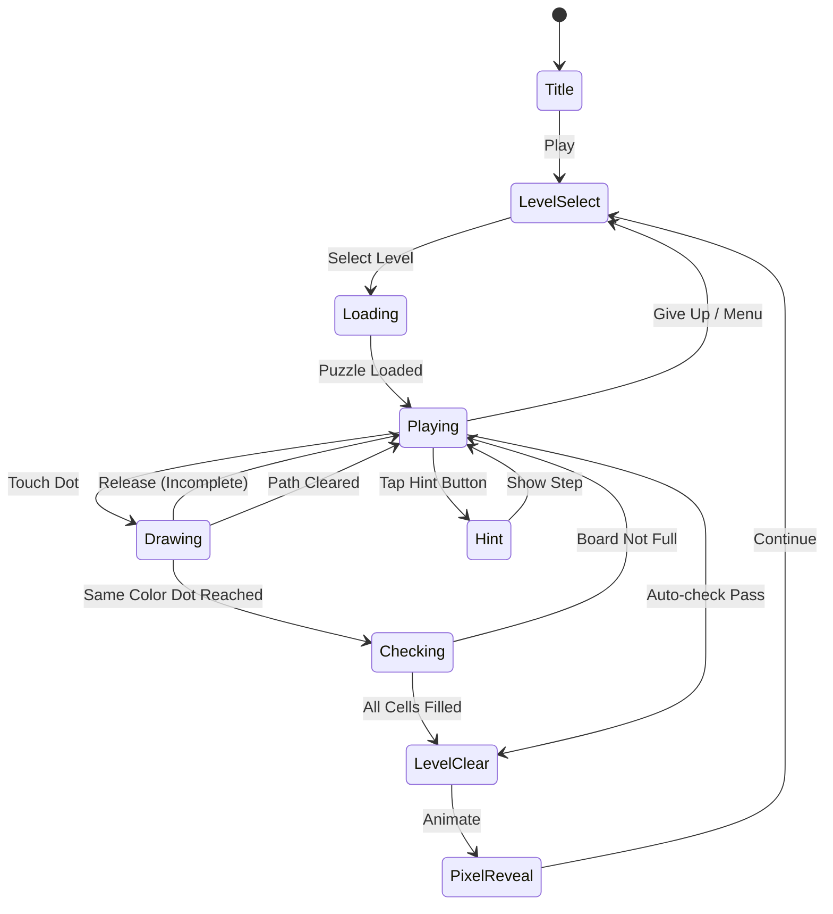

# Pixel Flow

> 픽셀 단위의 흐름(Flow) 연결 퍼즐. 같은 색 두 점을 경로로 연결하고 모든 칸을 채워라.

## 개요

격자(Grid) 위에 다양한 색상의 점(Dot) 쌍이 배치되어 있다. 플레이어는 드래그로 같은 색 두 점을 경로(Path)로 연결하며, 모든 경로가 교차 없이 보드의 **모든 칸을 빈틈없이 채우면** 퍼즐 클리어. 클리어 시 격자가 픽셀 아트로 변환되며 시각적 보상을 제공한다.

## 게임 규칙

### 기본 규칙

- 격자에 색상 쌍(Dot Pair)이 배치됨 (최소 4쌍 ~ 최대 14쌍)
- 플레이어는 드래그로 같은 색 두 점을 연결하는 경로를 그림
- 경로는 **상하좌우**로만 이동 가능 (대각선 불가)
- 경로끼리 **교차 또는 겹칠 수 없음**
- 보드의 **모든 칸이 경로로 채워져야** 클리어 (빈 칸 불허)
- 기존 경로 위로 드래그하면 해당 경로 **초기화**

### 경로 조작

| 액션 | 동작 |
|------|------|
| Dot에서 드래그 시작 | 새 경로 그리기 시작 |
| 같은 색 Dot 도달 | 경로 완성 |
| 기존 경로 위 드래그 | 해당 색상 경로 초기화 후 재작성 |
| 경로 중간 탭 | 해당 색상 경로 전체 삭제 |
| 화면 밖 드래그 종료 | 현재 경로 삭제 (미완성) |

### 클리어 조건

1. 모든 색상 쌍이 연결됨
2. 보드의 모든 칸이 경로로 덮임
3. 어떤 경로도 교차하지 않음

→ 세 조건 동시 충족 시 자동 클리어 판정

## 게임 플로우



## UI 레이아웃

### 메인 게임 화면

```
┌─────────────────────────────┐
│  ← Back    Lv.42   ⚙ Menu  │  ← 상단 네비게이션
│           8×8 Grid          │
├─────────────────────────────┤
│                             │
│  ┌──┬──┬──┬──┬──┬──┬──┬──┐  │
│  │🔴│  │  │  │  │  │  │🔵│  │
│  ├──┼──┼──┼──┼──┼──┼──┼──┤  │
│  │  │  │🟢│  │  │🟡│  │  │  │
│  ├──┼──┼──┼──┼──┼──┼──┼──┤  │
│  │  │  │  │  │  │  │  │  │  │  ← 게임 보드
│  ├──┼──┼──┼──┼──┼──┼──┼──┤  │    (Dot + Path)
│  │  │🟣│  │  │  │  │🟠│  │  │
│  ├──┼──┼──┼──┼──┼──┼──┼──┤  │
│  │  │  │  │🔴│  │  │  │  │  │
│  ├──┼──┼──┼──┼──┼──┼──┼──┤  │
│  │  │  │  │  │🔵│  │  │  │  │
│  ├──┼──┼──┼──┼──┼──┼──┼──┤  │
│  │🟡│  │  │  │  │  │  │🟢│  │
│  ├──┼──┼──┼──┼──┼──┼──┼──┤  │
│  │  │  │🟠│  │  │🟣│  │  │  │
│  └──┴──┴──┴──┴──┴──┴──┴──┘  │
│                             │
│  채움: ██████░░ 75%         │  ← 진행률 표시
│                             │
├─────────────────────────────┤
│  [↩ Undo]  [💡 Hint x3]  [🔄 Reset]  │  ← 도구바
└─────────────────────────────┘
```

### 클리어 → 픽셀 아트 공개 화면

```
┌─────────────────────────────┐
│        ✨ SOLVED! ✨         │
├─────────────────────────────┤
│                             │
│  ┌─────────────────────┐   │
│  │ ██  ████  ██  ████  │   │
│  │ ██  █  █  ██  █  █  │   │
│  │ ████  ██████  ██████│   │  ← 픽셀 아트 공개
│  │ █  █  █  █  █  █  █ │   │    (애니메이션)
│  │ ████  ████  ████  █ │   │
│  └─────────────────────┘   │
│     "Baby Dragon" #42       │  ← 아트 제목
│                             │
│  ⭐⭐⭐  완벽 클리어!        │
│  힌트 미사용 +50 코인       │
│                             │
├─────────────────────────────┤
│  [다음 퍼즐▶]  [공유📤]  [홈🏠] │
└─────────────────────────────┘
```

### 레벨 선택 화면

```
┌─────────────────────────────┐
│       Pixel Flow            │
│   [5×5] [6×6] [7×7] [8×8]  │  ← 그리드 크기 탭
│   [9×9] [10×10] [12×12] [14×14]  │
├─────────────────────────────┤
│  Pack 1: "Animals"          │
│  ┌──┬──┬──┬──┬──┐           │
│  │✅│✅│✅│🔒│🔒│  1~5      │
│  ├──┼──┼──┼──┼──┤           │
│  │🔒│🔒│🔒│🔒│🔒│  6~10     │
│  └──┴──┴──┴──┴──┘           │
│                             │
│  Pack 2: "Space" 🔒         │  ← 유료 팩
│  [잠금 해제 - 1,200원]       │
└─────────────────────────────┘
```

## 퍼즐 생성 알고리즘

### 자동 생성 파이프라인

```
1. 색상 쌍 배치 (k = 색상 수)
   └─ 격자 크기에 따라 k 결정 (5×5: 4~5쌍, 14×14: 12~14쌍)

2. 해결 경로 생성 (DFS 기반)
   ├─ 랜덤 시작점에서 DFS 탐색
   ├─ 백트래킹으로 모든 칸 채우는 경로 탐색
   └─ 성공 시 해당 경로를 "정답"으로 저장

3. 역방향 Dot 배치
   └─ 각 경로의 양 끝점을 Dot으로 지정

4. 풀이 가능성 검증
   ├─ 자동 솔버로 재검증 (BFS)
   └─ 실패 시 2번부터 재시도 (최대 10회)

5. 난이도 스코어링
   ├─ 경로 분기점 수 (많을수록 어려움)
   ├─ 최단 해결 경로 vs 오답 유인 경로 비율
   └─ 목표 난이도와 스코어 비교 → 통과/재생성
```

### 난이도별 생성 파라미터

| 단계 | 그리드 | 색상 수 | 최소 경로 곡률 | 오답 유인율 |
|------|--------|---------|--------------|-----------|
| 입문 | 5×5 | 4~5 | 낮음 | 0% |
| 쉬움 | 6×6~7×7 | 5~7 | 낮음 | 10% |
| 보통 | 8×8~9×9 | 6~9 | 중간 | 25% |
| 어려움 | 10×10~12×12 | 8~11 | 높음 | 40% |
| 전문가 | 13×13~14×14 | 10~14 | 매우 높음 | 55% |

## 픽셀 아트 시스템

### 개념

- 각 퍼즐은 **특정 픽셀 아트**와 1:1 연결
- 경로의 색상 = 픽셀 아트의 해당 색상 영역
- 클리어 시 경로가 픽셀 아트로 **모핑(morph) 애니메이션**

### 아트 컬렉션

| 팩 번호 | 테마 | 아트 수 | 상태 |
|--------|------|--------|------|
| Pack 0 | Tutorial | 10 | 무료 (시작 시 제공) |
| Pack 1 | Animals | 30 | 무료 (광고 시청 가능) |
| Pack 2 | Space | 30 | 유료 (1,200원) |
| Pack 3 | Fantasy | 30 | 유료 (1,200원) |
| Pack 4 | City | 30 | 유료 (1,200원) |
| Daily | 오늘의 퍼즐 | 1/일 | 무료 (로그인) |

### 아트 공개 애니메이션

1. 클리어 판정 → 전체 플래시 (0.1초)
2. 경로 색상이 픽셀 아트 색상으로 페이드 (0.5초)
3. 픽셀 파티클 효과 (0.3초)
4. 아트 제목 + 수집 UI 표시

## 스코어링 시스템

| 액션 | 보상 |
|------|------|
| 퍼즐 클리어 | +100 코인 |
| 힌트 미사용 클리어 | +50 코인 추가 |
| Undo 미사용 클리어 | +30 코인 추가 |
| 일일 퍼즐 클리어 | +200 코인 |
| 첫 클리어 | 업적 달성 |
| 연속 클리어 (Streak) | +10 코인 × streak 수 |

> 코인은 힌트 구매 및 아이템에 사용

## 도구 및 아이템

| 도구 | 효과 | 기본 제공 | 유료 |
|------|------|----------|------|
| Hint (힌트) | 다음 이동할 경로 1칸 표시 | 3개 | 코인 30개 |
| Undo | 마지막 드래그 1단계 되돌리기 | 무제한 | - |
| Reset | 현재 퍼즐 전체 초기화 | 무제한 | - |
| Auto-Solve | 전체 자동 풀이 (아트 미공개) | - | 코인 100개 |

## 수익화 전략

### 광고 (Ad)

| 위치 | 형식 | 트리거 |
|------|------|--------|
| 레벨 클리어 후 | 전면 광고 (Interstitial) | 3번에 1번 |
| 힌트 부족 시 | 보상형 광고 (Rewarded) | 사용자 선택 |
| 무료 팩 언락 | 보상형 광고 | 팩당 1회 |

### 인앱 결제 (IAP)

| 상품 | 가격 | 내용 |
|------|------|------|
| 광고 제거 | 3,900원 | 영구 광고 제거 |
| 코인 팩 소형 | 990원 | 코인 300개 |
| 코인 팩 중형 | 2,500원 | 코인 900개 |
| 코인 팩 대형 | 6,900원 | 코인 3,000개 |
| 퍼즐 팩 (개별) | 1,200원 | 팩 1개 (30퍼즐) |
| 전체 팩 번들 | 4,900원 | 모든 팩 (Space+Fantasy+City) |
| 프리미엄 패스 | 9,900원/월 | 광고 제거 + 월 코인 1,000개 + 신규 팩 |

### 수익화 핵심 원칙

- 무료 플레이 가능성 보장 (강제 결제 없음)
- 힌트 → 광고 시청으로 충분히 획득 가능
- 코인 획득 루프: 클리어 → 코인 → 힌트 → 더 많은 클리어

## 난이도 설계

### 그리드별 기본 스펙

| 그리드 | 칸 수 | 색상 수 | 예상 풀이 시간 | 대상 |
|--------|------|--------|--------------|------|
| 5×5 | 25 | 4~5 | ~30초 | 튜토리얼 |
| 6×6 | 36 | 5~6 | ~1분 | 입문 |
| 7×7 | 49 | 6~7 | ~2분 | 쉬움 |
| 8×8 | 64 | 6~9 | ~3분 | 보통 |
| 9×9 | 81 | 7~10 | ~5분 | 보통+ |
| 10×10 | 100 | 8~11 | ~7분 | 어려움 |
| 12×12 | 144 | 10~12 | ~10분 | 고급 |
| 14×14 | 196 | 12~14 | ~15분 | 전문가 |

### 100 레벨 분배 (MVP)

| 레벨 구간 | 그리드 | 난이도 |
|----------|--------|--------|
| 1~15 | 5×5 | 입문 |
| 16~30 | 6×6 | 쉬움 |
| 31~50 | 7×7~8×8 | 보통 |
| 51~70 | 8×8~9×9 | 보통+ |
| 71~85 | 10×10 | 어려움 |
| 86~100 | 12×12~14×14 | 고급 |

## 사운드/이펙트

| 상황 | 사운드 | 시각 효과 |
|------|--------|---------|
| 드래그 시작 | 틱 효과음 | Dot 확대 애니메이션 |
| 경로 그리기 | 부드러운 클릭음 (칸마다) | 경로 색상 채움 |
| 경로 완성 | 연결음 (짧고 밝음) | Dot 글로우 효과 |
| 경로 초기화 | 지우개 소리 | 경로 페이드 아웃 |
| 마지막 경로 연결 | 기대감 상승 효과음 | 전체 화면 펄스 |
| 클리어 | 승리 효과음 + 픽셀 파티클 | 픽셀 아트 모핑 애니메이션 |
| 힌트 사용 | 전구 소리 | 해당 칸 하이라이트 |

## 튜토리얼

### 온보딩 흐름 (5×5 퍼즐 기반)

1. **Step 1**: "같은 색 점을 연결하세요" → 빨강 점 드래그 안내
2. **Step 2**: "모든 칸을 채워야 합니다" → 빈 칸 하이라이트
3. **Step 3**: "경로는 교차할 수 없습니다" → 교차 시도 시 진동 + 안내
4. **Step 4**: 자유 플레이 → 클리어 → 픽셀 아트 공개 체험

> 튜토리얼은 스킵 가능. 재시작 가능 (설정 내)

## MVP 범위

### Phase 1 (MVP - 1~2주 목표)

- [x] 기획서 작성
- [ ] 5×5~9×9 격자 렌더링
- [ ] 드래그 경로 그리기 + 교차 방지
- [ ] 클리어 판정 로직 (모든 칸 채움 체크)
- [ ] DFS 기반 퍼즐 자동 생성
- [ ] 100레벨 퍼즐 데이터 (자동 생성)
- [ ] 픽셀 아트 공개 애니메이션 (간소화)
- [ ] 힌트 시스템 (3개 기본 제공)
- [ ] 레벨 선택 화면
- [ ] 보상형 광고 (힌트 획득)

### Phase 2 (출시 후 1주)

- [ ] 10×10~14×14 대형 격자
- [ ] 전면 광고 (3레벨마다)
- [ ] 인앱 결제 (광고 제거, 코인 팩)
- [ ] 퍼즐 팩 시스템
- [ ] 일일 퍼즐
- [ ] 코인 경제 시스템
- [ ] Undo / Reset 도구

### Phase 3 (데이터 기반 피벗)

- [ ] 픽셀 아트 컬렉션 확장
- [ ] 소셜 공유 (클리어 스크린샷)
- [ ] 리더보드 (일일 퍼즐)
- [ ] 프리미엄 패스
