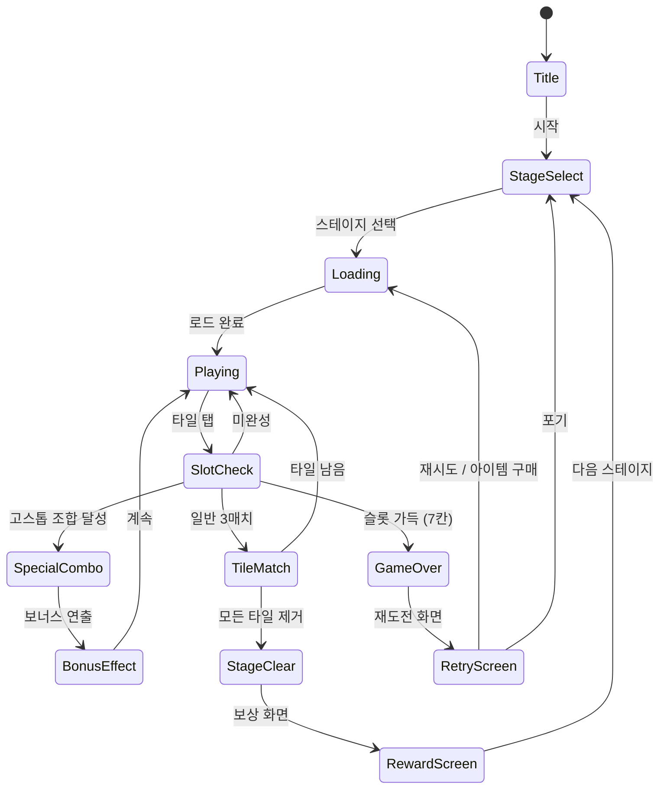

# 퍼즐쓰리고 (Puzzle3Go)

> 화투 패를 이용한 한국 전통 매치-3 퍼즐 게임

## 개요

화투 48장(12개월 × 4장)을 타일로 활용한 매치-3 퍼즐.
단순 색/모양 매칭을 넘어, 한국인에게 친숙한 화투의 **월별 패 / 패 등급(광·띠·피)** 체계를
매칭 보너스와 연결해 "고스톱 감성"을 퍼즐에 녹인다.

### 핵심 차별점

- **화투 테마**: 단순 아이콘이 아닌 실제 화투 아트 스타일
- **등급 매칭**: 광 > 띠 > 피 계층 구조가 점수·콤보에 반영
- **고스톱 조합**: 고스톱의 '광', '비', '청단/홍단' 조합을 스페셜 클리어 트리거로 차용
- **한국 시장 직접 겨냥**: 30–50대 화투 친숙 세대 + 10–20대 레트로 감성 세대

---

## 화투 타일 시스템

### 48장 구성 (12월 × 4장)

| 월 | 식물 | 광 (1점) | 띠 (1점) | 피 (0.5점) |
|----|------|----------|----------|------------|
| 1월 | 솔 | 학·솔 광 | 홍단 | 피 × 2 |
| 2월 | 매화 | - | 홍단 | 매화·새 띠, 피 × 2 |
| 3월 | 벚꽃 | 막·벚꽃 광 | 홍단 | 피 × 2 |
| 4월 | 흑싸리 | - | 띠 | 피 × 2 (두꺼비) |
| 5월 | 난초 | - | 띠 | 피 × 2 |
| 6월 | 모란 | - | 청단 | 피 × 2 |
| 7월 | 홍싸리 | - | 청단 | 피 × 2 (猪) |
| 8월 | 공산명월 | 공산 광 | - | 기러기 피, 피 |
| 9월 | 국화 | - | 청단 | 술잔 피, 피 |
| 10월 | 단풍 | - | 청단 | 사슴 피, 피 |
| 11월 | 오동 | 봉황 광 | - | 피 × 3 (우산) |
| 12월 | 비 | 비·광 광 | 띠 | 제비 피, 피 |

### 패 등급 (게임 내 가중치)

| 등급 | 기호 | 배율 | 특징 |
|------|------|------|------|
| 광 (光) | ⭐ | ×3 | 희귀, 스페셜 이펙트 |
| 십끗 (띠) | 🎀 | ×2 | 중간, 청단/홍단 구분 |
| 피 (皮) | 🃏 | ×1 | 기본 |

---

## 게임 규칙

### 기본 매치-3 규칙

- 보드에 화투 타일이 여러 레이어로 배치
- 하단 **슬롯(최대 7칸)**에 타일을 모아 **같은 타일 3개** → 자동 제거
- 슬롯이 꽉 차면 (7칸 차고 3매치 불가) **게임 오버**
- 모든 타일을 제거하면 **스테이지 클리어**

### 화투 고유 매칭 규칙

#### 기본 매치: 같은 월 × 같은 등급
예: 1월 피 3장 → 제거 (기본 점수)

#### 크로스 매치: 같은 등급 × 다른 월
예: 광 3장 (월 불문) → **광 매치** (3배 점수 + 특수 이펙트)

#### 고스톱 조합 매치 (스페셜)
슬롯 제거 시 특정 조합이 맞으면 추가 보상 발생:

| 조합 이름 | 조건 | 보상 |
|----------|------|------|
| 오광 (五光) | 광 5장 모두 모음 | 스테이지 즉시 클리어 |
| 사광 (四光) | 비 광 제외 광 4장 | +2000점 + 주변 타일 제거 |
| 삼광 (三光) | 비 광 제외 광 3장 | +1000점 |
| 비광 (雨光) | 비 광 + 다른 광 2장 | +500점 |
| 홍단 | 1월·2월·3월 띠 | +800점 |
| 청단 | 6월·9월·10월 띠 | +800점 |
| 초단 | 4월·5월·7월 띠 | +600점 |
| 고도리 | 2월 새·4월 두꺼비·8월 기러기 | +700점 + 타임 추가 |

---

## 게임 플로우



---

## UI 레이아웃

```
┌──────────────────────────────┐
│  스테이지 3  ⏱ 2:30  ⭐ 1250  │  ← HUD
├──────────────────────────────┤
│                              │
│  ┌──┐ ┌──┐ ┌──┐ ┌──┐        │
│  │1광│ │8광│ │3막│ │6청│      │
│  └──┘ └──┘ └──┘ └──┘        │
│    ┌──┐ ┌──┐ ┌──┐           │
│    │2띠│ │4피│ │7피│          │  ← 타일 보드
│    └──┘ └──┘ └──┘           │    (다중 레이어)
│  ┌──┐ ┌──┐ ┌──┐ ┌──┐        │
│  │12피││9술│ │5피│ │11봉│     │
│  └──┘ └──┘ └──┘ └──┘        │
│                              │
├──────────────────────────────┤
│ [ ][ ][ ][ ][ ][ ][ ]       │  ← 슬롯 7칸
├──────────────────────────────┤
│  🔀 섞기   ↩ 되돌리기  💡 힌트 │  ← 아이템
└──────────────────────────────┘
```

### 고스톱 조합 UI
- 슬롯 상단에 현재 진행 중인 조합 게이지 표시 (예: 홍단 2/3)
- 조합 달성 시 전통 북 효과음 + 금색 파티클 이펙트
- "홍단!" "삼광!" 텍스트 팝업 (고스톱 게임 감성)

---

## 스코어링 시스템

### 기본 점수

| 액션 | 점수 |
|------|------|
| 피 3매치 | +100 |
| 띠 3매치 | +200 |
| 광 3매치 | +300 |
| 연속 콤보 (n번째) | × n 배율 |
| 스테이지 클리어 | +500 |
| 남은 시간 보너스 | 남은초 × 10 |

### 고스톱 조합 보너스

| 조합 | 점수 | 추가 효과 |
|------|------|-----------|
| 오광 | +5000 | 즉시 클리어 |
| 사광 | +2000 | 주변 타일 5개 제거 |
| 삼광 | +1000 | 슬롯 1칸 비움 |
| 비광 | +500 | - |
| 홍단·청단 | +800 | 타임 +15초 |
| 초단 | +600 | - |
| 고도리 | +700 | 타임 +10초 |

---

## 난이도 설계

| 레벨 | 월 종류 | 타일 수 | 레이어 | 시간(초) | 특이사항 |
|------|--------|---------|--------|----------|---------|
| 1–5 | 4 | 12 | 1 | 120 | 피만 사용, 튜토리얼 |
| 6–15 | 6 | 24 | 2 | 150 | 띠 추가 |
| 16–30 | 8 | 36 | 2 | 150 | 광 첫 등장 |
| 31–50 | 10 | 42 | 3 | 180 | 고스톱 조합 힌트 |
| 51+ | 12 | 48 | 3–4 | 180 | 모든 조합 활성화 |

> 고스톱 조합은 16레벨부터 단계적으로 해금 (신규 유저 부담 최소화)

---

## 아이템 시스템

| 아이템 | 효과 | 획득 방법 |
|-------|------|-----------|
| 섞기 (Shuffle) | 보드 타일 랜덤 재배치 | 광고 시청 / 코인 |
| 되돌리기 (Undo) | 마지막 선택 취소 | 광고 시청 / 코인 |
| 힌트 (Hint) | 가능한 3매치 경로 표시 | 광고 시청 / 코인 |
| 피 제거 | 슬롯의 피 1장 보드로 반환 | 유료 |
| 타임 추가 | +30초 | 유료 / 광고 |
| 광 끌어오기 | 보드에서 광 1장 슬롯으로 | 프리미엄 유료 |

---

## 사운드/이펙트

| 상황 | 효과 |
|------|------|
| 타일 선택 | 화투 패 뒤집는 소리 |
| 피 3매치 | 가벼운 효과음 |
| 띠 3매치 | 중간 효과음 + 반짝임 |
| 광 3매치 | 묵직한 효과음 + 금빛 파티클 |
| 고스톱 조합 | 전통 북 소리 + 텍스트 팝업 |
| 스테이지 클리어 | 국악 축하 멜로디 |
| 게임 오버 | 묵직한 실패음 |
| BGM | 전통 국악 + 모던 팝 혼합 (세대 통합) |

---

## MVP 범위

### Phase 1 (MVP — 1주 목표)

- [ ] 기획서 확정
- [ ] 화투 48장 타일 아트 (기본 픽셀/플랫 스타일)
- [ ] 기본 매치-3 (같은 타일 3개 = 제거)
- [ ] 슬롯 시스템 (7칸)
- [ ] 게임 오버 / 클리어 판정
- [ ] 스테이지 1–10 (피·띠만)
- [ ] 기본 점수 시스템

### Phase 2 (2주차)

- [ ] 광 타일 + 광 매치 이펙트
- [ ] 고스톱 조합 3종 (홍단·청단·삼광)
- [ ] 다중 레이어 보드
- [ ] 아이템 (섞기·되돌리기·힌트)
- [ ] 광고 연동 (아이템 무료 획득)
- [ ] 스테이지 1–30 완성

### Phase 3 (출시 후)

- [ ] 고스톱 조합 전체 (오광·사광·고도리)
- [ ] IAP 패키지 (코인·아이템 번들)
- [ ] 일일 챌린지 / 이벤트 스테이지
- [ ] 소셜 (카카오 랭킹)
- [ ] 스테이지 50+

---

## 수익화 전략

### 한국 시장 특화 IAP

| 상품 | 가격 | 내용 |
|------|------|------|
| 코인 소량 | ₩1,200 | 코인 500 |
| 코인 중량 | ₩4,900 | 코인 2,500 |
| 코인 대량 | ₩9,900 | 코인 6,000 |
| 광 패스 | ₩2,900/주 | 광 아이템 무제한 |
| 화투 테마팩 | ₩3,900 | 고급 화투 스킨 |
| 시즌 패스 | ₩9,900/월 | 일일 코인 + 스킨 |

### 광고 수익

- **보상형 광고**: 아이템 획득 (Rewarded Video)
- **인터스티셜**: 스테이지 실패 후 재시작 시
- **배너 제거**: ₩990 인앱 결제 (저가 진입점)

### 수익화 포인트

1. **게임 오버 지점** — "계속하기" 유료 아이템 유도
2. **고스톱 조합 거의 달성 순간** — "조합 완성 아이템" 유도
3. **하드 스테이지 클리어 직전** — "힌트·타임 추가" 유도

---

## 시장 분석 및 전략 판단

### 원작 게임 분석 (평점 4.0)

**잠재력 요인:**
- 화투는 한국 30–60대에게 강력한 문화적 친숙감
- 고스톱 메카닉 차용 → 단순 매치-3 대비 깊이감
- 레트로 붐으로 10–20대에게도 어필 가능

**문제점 요인 (4.0 평점의 원인 추정):**
- 초반 튜토리얼 부족 — 화투 규칙 모르면 조합 이해 어려움
- 고스톱 조합이 너무 복잡 → 캐주얼 유저 이탈
- 과금 유도가 너무 공격적이라는 리뷰 다수

**우리의 대응:**
- 조합은 단계적 해금 (16레벨 이후)
- 인터랙티브 튜토리얼 (첫 5스테이지 가이드)
- 첫 광고 시청은 스테이지 5 이후 (초반 경험 보호)

### 한국 특화 테마 전략 가치

| 요소 | 평가 |
|------|------|
| 차별화 | ★★★★★ — 글로벌 매치-3 시장에서 한국 화투는 독보적 |
| 타깃 크기 | ★★★★☆ — 국내 30–50대 모바일 캐주얼 게이머 주력 |
| 진입 장벽 | ★★★☆☆ — 화투 모르는 유저에게 러닝 커브 존재 |
| 수익 잠재력 | ★★★★☆ — 문화 친숙도 기반 IAP 전환율 기대 |
| 개발 속도 | ★★★★☆ — found3 파이프라인 재사용 가능 |

### 결론 및 권고

**Go 결정.**

이유:
1. **found3 파이프라인 재사용** — 슬롯 매치-3 코어 로직 그대로 활용, 화투 테마와 고스톱 조합 레이어만 추가
2. **한국 시장에서 유일한 포지션** — 글로벌 매치-3(캔디크러시 등)와 직접 경쟁 회피
3. **MVP 1주 가능** — 코어 메카닉은 이미 found3로 검증됨
4. **문화 마케팅 레버리지** — "화투 매치-3" 키워드 자체가 바이럴 잠재력 보유
5. **30–50대 고ARPU 타깃** — 한국 캐주얼 게임 최고 지출 연령대

**리스크 완화:**
- 고스톱 조합은 Phase 2로 후순위 → MVP는 단순 화투 매치-3로 속도 우선
- 화투 아트는 저작권 리스크 없는 자체 플랫 스타일로 제작
- 튜토리얼 강화로 화투 생소한 유저 대응
