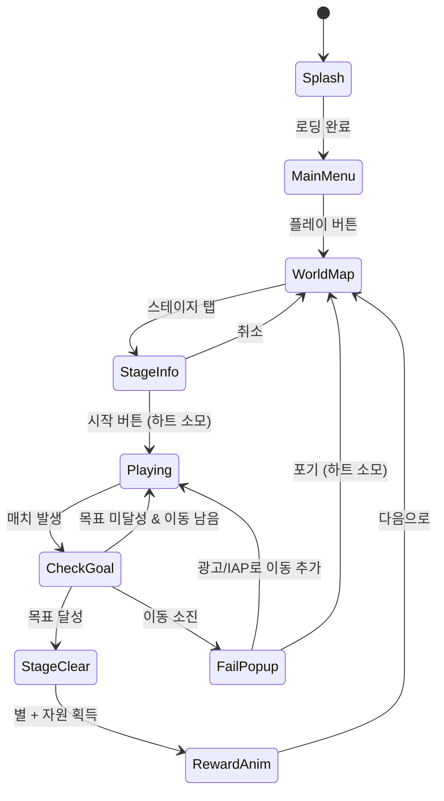

# 로얄 킹덤 (Royal Kingdom)

> 매치-3에 왕국 건설 메타가 결합된 하이브리드 캐주얼 퍼즐

## 개요

| 항목 | 내용 |
|------|------|
| 장르 | 매치-3 퍼즐 + 왕국 건설 메타게임 |
| 레퍼런스 | Royal Kingdom (Dream Games, App Store #3) |
| MVP 목표 | 매치-3 코어 + 30 스테이지 |
| 개발 기간 | 1~2주 (MVP) |
| 수익화 | 하트 시스템 + 부스터 IAP + 광고 리워드 |

플레이어는 보드 위 타일을 스왑하여 3개 이상 같은 색 타일을 매칭, 스테이지 목표를 달성하고 왕국을 건설해 나간다.

---

## 1. 코어 매치-3 메카닉

### 1.1 기본 규칙

- **보드 크기**: 기본 9×9 (스테이지별 변형 가능, 7×7 ~ 9×9)
- **스왑 방식**: 인접한 두 타일을 드래그하여 위치 교환
- **유효 스왑**: 스왑 후 3개 이상 같은 색 타일이 수평/수직으로 연속하면 유효
- **무효 스왑**: 매치가 발생하지 않으면 타일이 원위치로 돌아감
- **연쇄(Cascade)**: 타일 제거 후 위에서 새 타일이 떨어지며 추가 매치 자동 처리
- **이동 횟수 제한**: 스테이지마다 제한된 이동 횟수 내에 목표 달성
- **타일 색상**: 기본 6가지 (빨강, 파랑, 초록, 노랑, 보라, 주황)

### 1.2 매치 유형 및 특수 타일 생성

| 매치 유형 | 조건 | 생성 특수 타일 |
|-----------|------|----------------|
| 기본 매치 | 3개 직선 | 없음 (단순 제거) |
| T/L자 매치 | 5개 T/L 형태 | 폭탄 (Bomb) |
| 4개 직선 | 4개 직선 | 라인 클리어 (Rocket) |
| 5개 직선 | 5개 직선 | 레인보우 (Rainbow) |

> **규칙**: 매치 중심 또는 스왑한 타일 위치에 특수 타일 생성

### 1.3 스왑 방향과 라인 클리어 방향

- **가로 4매치** → 세로 라인 클리어 로켓 (위아래 전체 열 제거)
- **세로 4매치** → 가로 라인 클리어 로켓 (좌우 전체 행 제거)

---

## 2. 특수 타일 시스템

### 2.1 특수 타일 종류

#### 🚀 로켓 (Rocket / 라인 클리어)
- **발동**: 탭 또는 매치 시
- **효과**: 가로 또는 세로 한 줄 전체 제거
- **비주얼**: 발사체가 줄을 따라 날아가며 제거

#### 💣 폭탄 (Bomb)
- **발동**: 탭 또는 매치 시
- **효과**: 주변 3×3 범위 (총 9칸) 제거
- **비주얼**: 폭발 이펙트

#### 🌈 레인보우 (Rainbow / Color Ball)
- **발동**: 탭 또는 다른 타일과 스왑
- **단독 탭**: 보드에서 가장 많은 색상 타일 전체 제거
- **스왑 발동**: 스왑한 타일과 같은 색상 전체 제거
- **비주얼**: 무지개 구슬

### 2.2 특수 타일 조합 이펙트 매트릭스

| 조합 | 효과 |
|------|------|
| 로켓 × 로켓 | 가로 + 세로 동시 십자 라인 클리어 |
| 로켓 × 폭탄 | 3행 또는 3열 동시 제거 (라인 3줄) |
| 로켓 × 레인보우 | 레인보우가 로켓으로 변환 → 보드 내 같은 색 타일 모두 로켓으로 변환 후 발동 |
| 폭탄 × 폭탄 | 5×5 범위 (총 25칸) 제거 |
| 폭탄 × 레인보우 | 레인보우가 폭탄으로 변환 → 보드 내 같은 색 타일 모두 폭탄으로 변환 후 발동 |
| 레인보우 × 레인보우 | 보드 전체 타일 제거 (화면 클리어) |

> **구현 우선순위**: MVP에서는 단독 발동만 구현, 조합은 v1.1에서 추가

---

## 3. 스테이지 설계

### 3.1 목표 유형

| 목표 타입 | 설명 | 아이콘 |
|-----------|------|--------|
| **점수 달성** | 제한 이동 내 목표 점수 초과 | ⭐ |
| **타일 수집** | 특정 색상 타일 N개 제거 | 🍎 |
| **장애물 제거** | 특정 장애물 N개 파괴 | 🧊 |
| **복합 목표** | 위 목표 2~3가지 동시 달성 | 🎯 |

### 3.2 스테이지 구성 (MVP 30스테이지)

| 구간 | 스테이지 | 특징 | 신규 도입 요소 |
|------|----------|------|----------------|
| 튜토리얼 | 1~5 | 기본 매치, 특수 타일 소개 | 기본 6색 타일 |
| 초반 | 6~10 | 단일 목표, 여유 이동 | 얼음 장애물 |
| 중반 | 11~20 | 복합 목표, 이동 압박 | 체인, 나무상자 |
| 후반 | 21~28 | 다중 장애물, 타이트한 이동 | 돌, 잡초 |
| 보스 | 5, 15, 30 | 특수 규칙 + 고난이도 | 보스 장애물 |

### 3.3 스테이지 별 파라미터 (예시)

```
Stage 1:  보드 7×7, 이동 20회, 목표: 빨강 10개 수집
Stage 5:  보드 8×8, 이동 25회, 목표: 점수 5000점 (보스)
Stage 10: 보드 9×9, 이동 22회, 목표: 얼음 15개 + 초록 20개
Stage 15: 보드 9×9, 이동 20회, 목표: 체인 10개 + 점수 8000점 (보스)
Stage 30: 보드 9×9, 이동 30회, 목표: 전 장애물 클리어 (보스)
```

### 3.4 이동 소진 후 처리

- 이동 소진 시 "클리어 가능 판단" 알고리즘 실행
- 클리어 가능 타일이 남아 있으면 **추가 이동 구매** 팝업 (IAP/광고)
- 불가능하면 즉시 실패 처리

---

## 4. 장애물 시스템

### 4.1 장애물 종류 (6종)

#### 🧊 얼음 (Ice)
- **외형**: 타일 위에 얼음 레이어
- **HP**: 1
- **제거 조건**: 인접 타일 매치 1회 또는 특수 타일 발동
- **효과**: 해당 타일이 매치에 참여할 수 없음 (얼음 해제 전까지)

#### ⛓ 체인 (Chain)
- **외형**: 타일 위에 쇠사슬
- **HP**: 2
- **제거 조건**: 인접 매치 2회 또는 특수 타일 발동
- **효과**: 해당 타일 스왑 불가

#### 📦 나무상자 (Wooden Box)
- **외형**: 나무 상자 타일 (색상 없음)
- **HP**: 1
- **제거 조건**: 인접 타일 매치 1회 (특수 타일도 가능)
- **효과**: 보드 공간 차지, 매치 불가

#### 🪨 돌 (Stone)
- **외형**: 돌 타일 (색상 없음)
- **HP**: 2
- **제거 조건**: 특수 타일만 가능 (일반 매치 인접으로 불가)
- **효과**: 이동 불가, 매치 불가

#### 🌿 잡초 (Weed / Vine)
- **외형**: 타일 주변을 덮는 덩굴
- **HP**: 1, 단 **매 턴 인접 타일로 1칸 확산**
- **제거 조건**: 잡초가 퍼진 타일 인접 매치 1회
- **특이사항**: 확산 속도로 긴박감 부여, 일정 턴 내 미제거 시 보드 점령

#### 🔒 철제 상자 (Iron Box / 보스 전용)
- **외형**: 철제 자물쇠 상자
- **HP**: 3
- **제거 조건**: 특수 타일 조합만 가능
- **효과**: 보스 스테이지에만 등장, 클리어 시 대량 자원 드롭

### 4.2 장애물 등장 시기

| 장애물 | 첫 등장 스테이지 |
|--------|-----------------|
| 얼음 | 6 |
| 나무상자 | 11 |
| 체인 | 14 |
| 돌 | 21 |
| 잡초 | 24 |
| 철제 상자 | 30 (보스) |

---

## 5. 메타게임: 왕국 건설 (Phase 2)

> **MVP에서는 미구현. 스테이지 클리어 보상으로 자원만 지급.**
> Phase 2에서 왕국 건설 UI 및 건물 시스템 추가.

### 5.1 자원 시스템

| 자원 | 획득처 | 용도 |
|------|--------|------|
| 금화 (Gold) | 스테이지 클리어, 별 보상 | 건물 건설/업그레이드 |
| 목재 (Wood) | 나무상자 장애물 제거 | 건물 건설 |
| 돌 (Stone) | 돌 장애물 제거 | 건물 업그레이드 |

### 5.2 왕국 맵 구조

```
┌─────────────────────────────┐
│         왕국 건설 뷰         │
│  ┌──┐  ┌──┐  ┌──┐          │
│  │성│  │농│  │광│  ...      │
│  │채│  │장│  │산│           │
│  └──┘  └──┘  └──┘          │
│                              │
│  [스테이지 맵으로]  [건설]    │
└─────────────────────────────┘
```

### 5.3 건물 목록 (Phase 2)

| 건물 | 건설 비용 | 효과 (시각적 보상) |
|------|-----------|-------------------|
| 왕궁 | 스테이지 1 클리어 시 자동 | 왕국 중심부 |
| 농장 | 금화 100 + 목재 50 | 배경 변화 |
| 광산 | 금화 150 + 돌 30 | 배경 변화 |
| 마켓 | 금화 200 + 목재 80 | 배경 변화 |
| 성벽 | 금화 300 + 돌 100 | 배경 확장 |
| 탑 | 금화 500 + 목재 200 | 엔딩 빌딩 |

### 5.4 건설 UX

1. 스테이지 클리어 → 자원 획득 애니메이션
2. 왕국 뷰로 전환 → 건설 가능한 건물 하이라이트
3. 건물 탭 → 건설 확인 팝업 (비용 표시)
4. 건설 애니메이션 (2~3초) → 왕국 외관 변화
5. 소셜 시스템 (Phase 3): 친구 왕국 방문

---

## 6. 스테이지 맵 (월드맵 진행 구조)

### 6.1 월드맵 레이아웃

```
[월드맵 뷰]

  월드 1: 초원의 왕국 (1~10)
  월드 2: 숲의 요새 (11~20)
  월드 3: 사막의 성채 (21~30)

  각 월드: 10스테이지 + 보스 1 (5, 10번째)
```

### 6.2 진행 구조

```
[스테이지 노드 형태]

Stage1 → Stage2 → Stage3 → Stage4 → [BOSS Stage5]
                                            ↓
                              Stage6 → Stage7 → ...
```

- 각 스테이지 노드: 별 0~3개 표시 (클리어 여부, 달성 정도)
- **3성 조건**: 이동 횟수 여유 50% 이상 남기고 클리어
- **잠금 해제**: 이전 스테이지 클리어 시 자동 해제

### 6.3 보스 스테이지 특징

| 보스 스테이지 | 특수 규칙 |
|---------------|-----------|
| 5 (초원 보스) | 제한 이동 20회, 잡초 등장, 타일 수집 30개 |
| 15 (숲 보스) | 철제 상자 5개, 체인 10개, 이동 25회 |
| 30 (사막 보스) | 모든 장애물 등장, 이동 30회, 3단계 클리어 |

### 6.4 보스 3단계 클리어 (Stage 30)

```
Phase 1: 얼음/체인 제거 (이동 10회)
Phase 2: 돌/나무상자 제거 (이동 10회)
Phase 3: 철제 상자 + 잡초 제거 (이동 10회)
```

각 Phase 사이 체력바 연출 + 짧은 애니메이션

---

## 7. 수익화

### 7.1 라이프 시스템 (하트)

| 항목 | 값 |
|------|---|
| 최대 하트 | 5개 |
| 실패 시 소모 | 1개 |
| 자연 회복 | 30분당 1개 |
| 풀 회복 시간 | 2시간 30분 |
| 하트 구매 | 보석 20개 = 하트 5개 |
| 무한 하트 | 보석 80개 = 24시간 |

### 7.2 부스터 시스템

#### 사전 부스터 (스테이지 시작 전)

| 부스터 | 효과 | 가격 |
|--------|------|------|
| 추가 이동 (+5) | 시작 이동 횟수 5 추가 | 보석 20개 |
| 레인보우 볼 | 시작 시 레인보우 1개 배치 | 보석 25개 |
| 폭탄 | 시작 시 폭탄 1개 배치 | 보석 20개 |

#### 중간 부스터 (플레이 중)

| 부스터 | 효과 | 가격 |
|--------|------|------|
| 셔플 | 보드 전체 타일 재배치 | 보석 30개 |
| 해머 | 타일/장애물 1개 제거 | 보석 30개 |
| 색 변환 | 선택 타일을 다른 색으로 변환 | 보석 25개 |

#### 실패 후 계속하기

| 옵션 | 조건 |
|------|------|
| 이동 +5 계속하기 | 보석 60개 |
| 광고 시청 | 이동 +3 무료 (1회/스테이지) |

### 7.3 인앱 결제 상품 (보석)

| 상품명 | 보석 | 가격 (USD) |
|--------|------|-----------|
| 한 줌의 보석 | 50 | $0.99 |
| 보석 자루 | 150 | $2.99 |
| 보석 상자 | 400 | $6.99 |
| 보석 금고 | 1000 | $14.99 |
| 왕국의 보물 (첫 구매 2배) | 2500 | $29.99 |

### 7.4 광고 리워드

| 광고 | 보상 |
|------|------|
| 스테이지 실패 시 | 이동 +3 (리워드 광고) |
| 메인 화면 | 하트 1개 (리워드 광고, 4시간마다) |
| 부스터 대신 광고 | 해머 또는 셔플 1회 (1일 3회) |
| 배너 광고 | 메인 화면 하단 (비IAP 유저 대상) |

---

## 8. MVP 범위 및 구현 우선순위

### 8.1 MVP 포함 (Week 1~2)

- [x] 9×9 보드, 스왑 매칭, 연쇄 처리
- [x] 6색 기본 타일
- [x] 특수 타일 단독 발동 (로켓, 폭탄, 레인보우)
- [x] 스테이지 목표: 타일 수집 + 장애물 제거
- [x] 장애물: 얼음, 나무상자, 체인 (3종)
- [x] 스테이지 30개 (레벨 데이터 JSON)
- [x] 하트 시스템 (로컬 저장)
- [x] 이동 소진 후 광고로 +3 이동
- [x] 스테이지 클리어 → 자원 지급 (표시만)
- [x] 월드맵 UI (진행 노드)
- [x] 보스 스테이지 3개 (5, 15, 30)

### 8.2 MVP 제외 → Phase 2

- [ ] 특수 타일 조합 이펙트
- [ ] 장애물: 돌, 잡초, 철제 상자
- [ ] 왕국 건설 UI/시스템
- [ ] IAP 결제 연동 (보석 구매)
- [ ] 소셜 기능

### 8.3 데이터 구조 (스테이지 JSON)

```json
{
  "stageId": 1,
  "world": 1,
  "boardSize": { "rows": 7, "cols": 7 },
  "moves": 20,
  "goals": [
    { "type": "collect", "color": "red", "count": 10 }
  ],
  "obstacles": [],
  "prePlaced": []
}
```

---

## 게임 플로우 (상태 머신)



---

## UI 레이아웃

### 게임 플레이 화면

```
┌────────────────────────────┐
│  ♥♥♥♥♥   Stage 1   ⚙️    │  ← 상단 HUD
│  목표: 빨강 10개  이동: 20  │
│  [🍎 5/10]                 │
├────────────────────────────┤
│                            │
│  [ ][R][ ][ ][ ][ ][ ]    │  ← 9×9 게임 보드
│  [ ][ ][ ][ ][ ][ ][ ]    │
│  [ ][ ][🧊][ ][ ][ ][ ]   │
│  [ ][ ][ ][ ][💣][ ][ ]   │
│  [ ][ ][ ][ ][ ][ ][ ]    │
│  [ ][ ][ ][ ][ ][ ][🚀]   │
│  [ ][ ][ ][ ][ ][ ][ ]    │
│  [ ][ ][ ][ ][ ][ ][ ]    │
│  [ ][ ][ ][ ][ ][ ][ ]    │
│                            │
├────────────────────────────┤
│  [셔플]  [해머]  [색변환]   │  ← 부스터 바
└────────────────────────────┘
```

### 스테이지 클리어 화면

```
┌────────────────────────────┐
│         ★ ★ ★             │
│      스테이지 클리어!        │
│                            │
│   +100 금화  +30 목재      │
│                            │
│  [다음 스테이지]  [월드맵]  │
└────────────────────────────┘
```

---

## 스코어링 시스템

| 액션 | 점수 |
|------|------|
| 기본 3매치 | 300점 |
| 4매치 | 600점 |
| 5매치 | 1000점 |
| 연쇄 (Cascade) x2 | +50% 보너스 |
| 연쇄 (Cascade) x3 이상 | +100% 보너스 |
| 특수 타일 발동 | 500점 |
| 특수 타일 조합 | 2000점 |
| 장애물 제거 | 200점 |
| 남은 이동 1회당 | 1000점 (클리어 시) |

### 별 기준

| 별 | 조건 |
|----|------|
| ⭐ | 목표 달성 (클리어) |
| ⭐⭐ | 목표 달성 + 이동 25% 이상 남음 |
| ⭐⭐⭐ | 목표 달성 + 이동 50% 이상 남음 |

---

## 사운드/이펙트

| 이벤트 | 사운드 | 이펙트 |
|--------|--------|--------|
| 타일 스왑 | 경쾌한 클릭 | 타일 이동 |
| 3매치 | 팝 사운드 | 타일 터짐 + 파티클 |
| 4매치 | 로켓 사운드 | 빛 줄기 + 라인 스윕 |
| 5매치 | 마법 사운드 | 레인보우 파동 |
| 폭발 | 폭발음 | 구 모양 파동 |
| 연쇄 | 고조되는 팡파레 | 콤보 텍스트 |
| 스테이지 클리어 | 승리 팡파레 | 별 3개 애니메이션 |
| 실패 | 낮은 사운드 | 보드 페이드아웃 |

---

## 기술 구현 메모 (lib 팀 참고)

- **보드 상태**: 2D 배열 `board[row][col] = { color, type, obstacle }`
- **매치 탐색**: BFS/DFS로 연결된 같은 색 타일 탐색
- **중력 처리**: 매치 제거 후 위에서 새 타일 드롭 (애니메이션 포함)
- **특수 타일 생성**: 매치 중심 좌표에 특수 타입으로 교체
- **스테이지 데이터**: `lib/royal-kingdom/stages/*.json`으로 관리
- **Phaser.io 씬**: `GameScene`, `UIScene` 분리 권장
