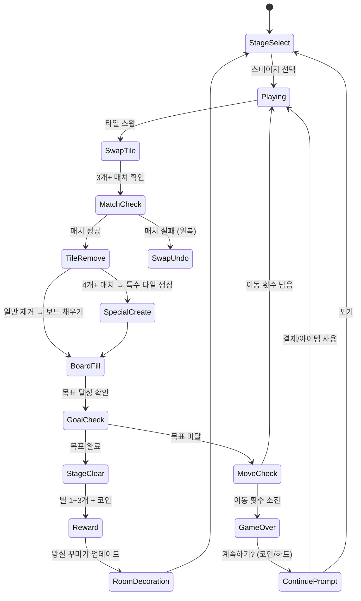
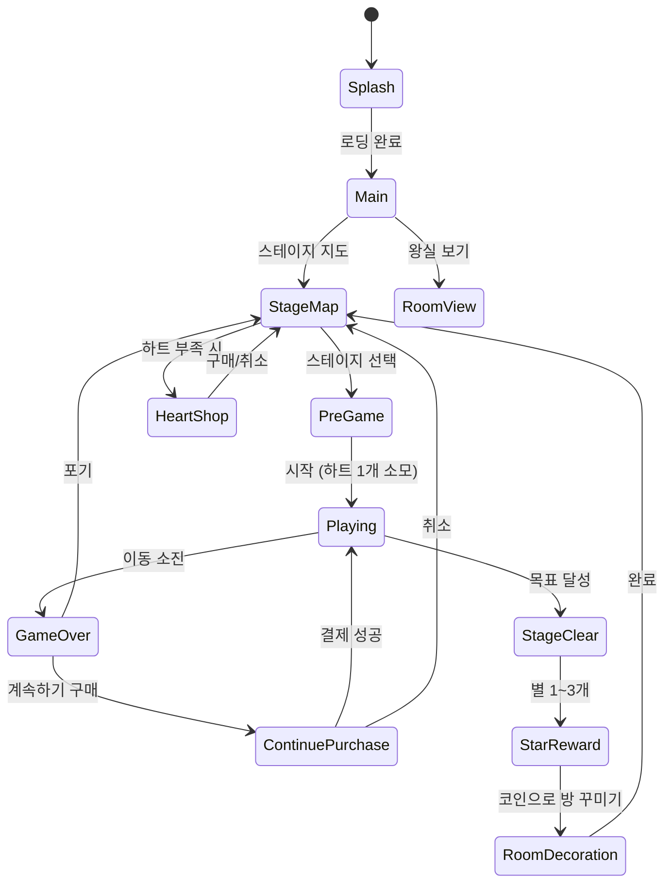

# 로얄 매치 (Royal Match) — 기능 기획서

> **벤치마크 대상**: Dream Games, Ltd. / 전 세계 매출 1위 매치-3 게임
> **개발 목표**: 핵심 재미 루프만 MVP로 구현, 1~2주 출시 목표

---

## 개요

보드 위 타일을 스왑(교환)하여 3개 이상 같은 색/종류를 맞추는 전통적 매치-3 게임.
로얄 매치가 1위인 이유는 **메카닉의 단순함** + **특수 타일의 폭발적 카타르시스** + **메타게임(왕실 꾸미기)의 감성적 훅**.

---

## 1. 핵심 성공 요인 분석

### 왜 로얄 매치가 매치-3 중 1위인가

| 요인 | 내용 |
|------|------|
| **진입 장벽 제거** | 첫 20스테이지는 거의 실패 불가. 성취감 → 습관 형성 |
| **즉각적 시각 피드백** | 매치 시 화려한 파티클 + 사운드. 도파민 루프 최적화 |
| **특수 타일 조합의 폭발감** | 2개 특수 타일 조합 시 화면 전체를 날리는 연출 → "또 하고 싶다" |
| **메타게임 감성 훅** | 왕실 방 꾸미기 → 스토리 완결성 + 소유욕 자극 |
| **에너지 시스템(하트)** | 세션을 짧게 끊어 일상 루틴화. 충전 대기 → 재접속 |
| **보스 스테이지** | 킹스 나이트메어로 긴장감과 서사 부여 |
| **소셜 없음** | PVP/협동 없이 순수 싱글 퍼즐. 경쟁 스트레스 제거 |

---

## 2. 코어 루프



### 루프 핵심 원칙

1. **목표 다양성**: 단순 타일 제거만이 아닌 — 특정 타일 수집, 장애물 제거, 특정 위치 도달 등
2. **이동 제한**: 무한 시간 아닌 "이동 횟수(moves)" 제한 → 긴장감 + 부스터 판매
3. **연쇄 반응(cascade)**: 타일 제거 후 낙하 → 자동 연쇄 매치 → 예상 밖 카타르시스

---

## 3. 특수 타일 시스템

### 3.1 특수 타일 생성 조건

| 특수 타일 | 생성 조건 | 아이콘 |
|-----------|-----------|--------|
| **로켓 (Rocket)** | 4개 일직선 매치 | 🚀 |
| **TNT** | L자/T자 5개 매치 | 💣 |
| **라이트볼 (Light Ball)** | 6개+ 매치 또는 특정 형태 | 🌟 |
| **프로펠러** | 별도 조건 (후속 업데이트) | 🔧 |

### 3.2 단독 발동 효과

| 특수 타일 | 효과 범위 |
|-----------|-----------|
| **로켓 (가로)** | 해당 행(row) 전체 제거 |
| **로켓 (세로)** | 해당 열(column) 전체 제거 |
| **TNT** | 3×3 범위 제거 |
| **라이트볼** | 보드 내 특정 색상 타일 전체 제거 |

### 3.3 조합 매트릭스 (핵심: 폭발 카타르시스)

| 조합 | 효과 |
|------|------|
| **로켓 + 로켓** | 가로 행 + 세로 열 동시 제거 (십자 폭발) |
| **로켓 + TNT** | TNT 3개가 보드 전체로 발사되어 분산 폭발 |
| **로켓 + 라이트볼** | 특정 색 타일을 모두 로켓으로 교체 후 발사 |
| **TNT + TNT** | 5×5 범위 초대형 폭발 |
| **TNT + 라이트볼** | 보드 내 특정 색 타일을 모두 TNT로 교체 후 연쇄 폭발 |
| **라이트볼 + 라이트볼** | **보드 전체 완전 초기화** (최고 카타르시스) |

### 3.4 구현 우선순위 (MVP)

1. 로켓 (가로/세로) — 필수
2. TNT — 필수
3. 라이트볼 — 필수
4. 조합: 로켓+로켓, TNT+TNT — 1차 MVP
5. 나머지 조합 — 2차

---

## 4. 스테이지 디자인 원칙

### 4.1 난이도 곡선

```
난이도
▲
│                              ★보스★
│                        ╭──╮
│                   ╭────╯  │
│              ╭────╯       ╰──── 안정
│         ╭────╯
│    ╭────╯
│────╯  (초반 쉬움)
└─────────────────────────────────── 스테이지
  1  10  20  30  40  50  ...
```

### 4.2 스테이지 구간별 설계

| 구간 | 목적 | 메카닉 도입 |
|------|------|-------------|
| 1~10 | 튜토리얼 | 기본 스왑, 로켓 소개 |
| 11~25 | 습관 형성 | TNT 도입, 첫 장애물 (박스) |
| 26~50 | 참여 고착 | 라이트볼, 복합 목표 |
| 51~100 | 수익화 구간 | 어려운 스테이지, 부스터 유도 |
| 매 50스테이지 | **보스 스테이지** | 킹스 나이트메어 |

### 4.3 장애물 종류 (순차 도입)

| 장애물 | 설명 | 도입 스테이지 |
|--------|------|---------------|
| **박스 (Box)** | 매치 인접 1회 제거 | 15스테이지 |
| **체인 (Chain)** | 해당 타일 직접 매치해야 제거 | 25스테이지 |
| **버블 (Bubble)** | 타일을 감싸 선택 불가, 인접 매치로 제거 | 35스테이지 |
| **달걀 (Egg)** | N회 매치로 부화, 부화 후 보너스 | 45스테이지 |

### 4.4 스테이지 목표 유형

- **타일 수집**: 특정 색/종류 N개 제거
- **장애물 제거**: 모든 박스/체인 파괴
- **낙하 목표**: 특정 타일을 보드 하단으로 이동
- **복합 목표**: 위 조건 2가지 동시 (고난이도)

---

## 5. 킹스 나이트메어 (King's Nightmare)

### 5.1 개요

매 50스테이지마다 등장하는 **보스 전투 형식의 미니게임**.
왕이 위험에 처한 서사적 상황을 매치-3로 해결하는 구조.
로얄 매치의 핵심 차별화 요소 중 하나.

### 5.2 메카닉

```
[서사 연출] → [매치-3 퍼즐] → [결과 연출] → [다음 서사]
```

- 각 나이트메어는 **스토리 에피소드** 형태 (3~5단계)
- 각 단계는 제한된 이동 횟수 내 특수 목표 달성
- 실패 시 하트 소모 없이 재도전 가능 (진입 장벽 낮춤)
- 클리어 시 왕실 꾸미기 특별 아이템 지급

### 5.3 보스 스테이지 특수 규칙

| 규칙 | 내용 |
|------|------|
| **제한 시간** | 이동 횟수 대신 시간 제한 옵션 |
| **특수 타일 강제** | 시작 시 보드에 특수 타일 배치 |
| **연속 목표** | 한 번에 여러 웨이브 클리어 |

### 5.4 MVP 범위

- 킹스 나이트메어는 **2차 개발** (MVP 제외)
- 대신 25/50스테이지에 일반 도전 스테이지로 대체 가능

---

## 6. 메타게임: 왕실 꾸미기 (Room Decoration)

### 6.1 보상 심리학

```
스테이지 클리어 → 별 + 코인 획득 → 왕실 방 아이템 선택 → 비포/애프터 연출
```

**핵심 심리 훅**:
- **완결 욕구**: 방이 "미완성" 상태로 보임 → 완성하고 싶은 충동
- **선택의 착각**: A/B 중 선택 → 자기 취향 반영 → 소유감 강화
- **스토리 연결**: 각 방 완성 시 짧은 스토리 컷신 → 감정 이입

### 6.2 방 구성

| 방 번호 | 테마 | 아이템 수 | 해금 스테이지 |
|---------|------|-----------|---------------|
| 1 | 왕의 침실 | 8 | 1~10 |
| 2 | 왕실 홀 | 10 | 11~25 |
| 3 | 정원 | 12 | 26~45 |
| 4 | 주방 | 10 | 46~65 |
| 5 | 탑 | 14 | 66~90 |

### 6.3 아이템 선택 UX

```
[방 입장]
    │
    ▼
[미완성 아이템 하이라이트]
    │
    ▼
[A vs B 선택지 제시]  ← 핵심! 선택지를 줌으로써 참여감 극대화
    │
    ▼
[설치 애니메이션 + 효과음]
    │
    ▼
[비포/애프터 비교 연출]
    │
    ▼
[다음 아이템 미리보기] ← "다음이 궁금하다" 훅
```

### 6.4 MVP 범위

- 방 1개, 아이템 5~8개로 시작
- A/B 선택 없이 단순 "설치" 버튼으로 단순화 가능
- 비포/애프터 연출은 필수 (심리적 보상의 핵심)

---

## 7. 수익화 전략

### 7.1 에너지 시스템 (하트)

| 항목 | 내용 |
|------|------|
| **최대 하트** | 5개 |
| **회복 시간** | 30분/개 |
| **스테이지 실패 시** | 하트 1개 소모 |
| **스테이지 클리어 시** | 하트 소모 없음 |

**결제 전환 포인트**: 하트 소진 → "계속하려면 하트 구매" 또는 "30분 기다려" → 참을 수 없을 때 결제

### 7.2 코인 시스템

**코인 획득**:
- 스테이지 클리어: 별 수에 따라 10~30코인
- 일일 보너스: 50코인
- 광고 시청: 20코인
- 인앱 결제: 패키지별 차등

**코인 사용**:
| 용도 | 비용 |
|------|------|
| 이동 횟수 +5 | 900코인 |
| 부스터 1개 | 100~300코인 |
| 하트 1개 | 200코인 |
| 하트 5개 | 900코인 |

### 7.3 부스터 시스템

| 부스터 | 효과 | 코인 비용 |
|--------|------|-----------|
| **로켓** | 보드에 즉시 로켓 1개 배치 | 100코인 |
| **TNT** | 보드에 즉시 TNT 1개 배치 | 150코인 |
| **라이트볼** | 보드에 즉시 라이트볼 배치 | 300코인 |
| **셔플** | 보드 전체 타일 재배치 | 100코인 |
| **이동 +5** | 게임 중 이동 횟수 추가 | 900코인 |

### 7.4 결제 전환 포인트 (Conversion Funnel)

```
1단계: 스테이지 실패 직후
   → "이동 5번 추가? 900코인" (긴박감 최고조)

2단계: 하트 소진
   → "하트 패키지: ₩1,200" (30분 기다리기 싫을 때)

3단계: 어려운 스테이지 진입 전
   → "부스터 팩으로 확실히 클리어!" (사전 구매 유도)

4단계: 왕실 꾸미기 막힘
   → "코인이 부족해요" → 코인 패키지 구매
```

### 7.5 광고 수익화

| 광고 유형 | 트리거 | 보상 |
|-----------|--------|------|
| **보상형 광고** | 게임 오버 후 선택 | 이동 +3 또는 하트 +1 |
| **인터스티셜** | 스테이지 완료 후 (매 3회) | 없음 (강제) |
| **배너** | 메인 메뉴 | 없음 |

### 7.6 인앱 결제 패키지 설계

| 패키지 | 가격 | 내용 | 전환 포인트 |
|--------|------|------|-------------|
| **스타터** | ₩1,200 | 하트 5 + 코인 500 | 첫 실패 직후 |
| **인기** | ₩5,900 | 하트 무제한 3일 + 코인 2000 | 3번 이상 실패 |
| **프리미엄** | ₩11,000 | 하트 무제한 1주 + 코인 5000 + 부스터 팩 | VIP 전환 |

---

## 8. MVP 벤치마킹: 우리가 가져갈 것

### 8.1 반드시 구현 (MVP 필수)

| 항목 | 이유 |
|------|------|
| **스왑 매칭 기본 메카닉** | 게임의 본체 |
| **로켓 + TNT + 라이트볼** | 카타르시스의 핵심 |
| **로켓+로켓, TNT+TNT 조합** | 가장 자주 발생하는 조합 |
| **이동 횟수 제한** | 긴장감 + 부스터 판매 |
| **게임 오버 → 이동 추가 결제 유도** | 핵심 수익화 |
| **하트 시스템 (5개, 30분 충전)** | 세션 관리 + 수익화 |
| **왕실 방 1개 (5~8 아이템)** | 메타게임 훅 |

### 8.2 2차 개발 (MVP 이후)

| 항목 | 이유 |
|------|------|
| 킹스 나이트메어 | 복잡한 서사 연출 필요 |
| 모든 특수 타일 조합 | 우선 기본 4개 조합만 |
| 소셜 기능 | MVP에 불필요 |
| 다양한 장애물 | 박스/체인 2개만으로 시작 |
| 방 2개 이상 | 방 1개로 검증 후 확장 |

### 8.3 로얄 매치에서 뺄 것 (단순화)

| 뺄 요소 | 대안 |
|---------|------|
| 복잡한 연출 (3D 애니메이션) | 2D 파티클 이펙트로 대체 |
| 다국어 스토리 텍스트 | 최소한의 아이콘/이모지로 대체 |
| 복잡한 레벨 에디터 | 하드코딩 50스테이지로 시작 |
| 클랜/소셜 | 완전 제거 |
| 시즌 이벤트 | 완전 제거 |

---

## 게임 플로우 (전체 상태 머신)



---

## UI 레이아웃

### 메인 게임 화면

```
┌─────────────────────────────┐
│  👑 레벨 42    ❤️❤️❤️❤️❤️  │  ← 상단: 레벨 + 하트
│  목표: 🍎×30  이동: 24      │  ← 목표 + 이동 횟수
├─────────────────────────────┤
│                             │
│  🟡 🔵 🔴 🟢 🟡 🔵 🔴    │
│  🔵 🟡 🟢 🔴 🔵 🟡 🟢    │
│  🔴 🟢 🟡 🔵 🔴 🟢 🟡    │
│  🟢 🔴 🔵 🟡 🟢 🔴 🔵    │
│  🟡 🔵 🔴 🟢 🟡 🔵 🔴    │
│  🔵 🟡 🟢 🔴 🔵 🟡 🟢    │
│  🔴 🟢 🟡 🔵 🔴 🟢 🟡    │
│                             │  ← 7×7 or 8×8 보드
├─────────────────────────────┤
│  [🚀] [💣] [🌟] [🔀] [+5] │  ← 하단: 부스터 버튼
└─────────────────────────────┘
```

### 게임 오버 팝업

```
┌─────────────────────────────┐
│         게임 오버 😢        │
│                             │
│    이동 +5로 계속하기?      │
│         900 🪙              │
│                             │
│  [계속하기]  [포기하기]     │
└─────────────────────────────┘
```

---

## 스코어링 시스템

| 항목 | 점수/코인 |
|------|-----------|
| 3매치 | 기본 점수 10 |
| 4매치 | 점수 20 + 로켓 생성 |
| 5매치 (L/T) | 점수 30 + TNT 생성 |
| 6매치+ | 점수 50 + 라이트볼 생성 |
| 연쇄(cascade) 1단계 | 추가 10% |
| 연쇄 2단계+ | 추가 25% |
| 스테이지 클리어 별 1개 | 10코인 |
| 스테이지 클리어 별 2개 | 20코인 |
| 스테이지 클리어 별 3개 | 30코인 |
| 남은 이동 횟수 보너스 | 이동당 추가 5코인 |

---

## 사운드/이펙트

| 이벤트 | 사운드 | 이펙트 |
|--------|--------|--------|
| 타일 선택 | 경쾌한 클릭 | 살짝 확대 |
| 3매치 | 팝 사운드 | 파티클 폭발 |
| 특수 타일 발동 | 웅장한 폭발음 | 화면 흔들림 |
| 연쇄 매치 | 상승 피치 사운드 | 콤보 텍스트 |
| 스테이지 클리어 | 팡파레 | 별 날아오는 애니 |
| 게임 오버 | 슬픈 효과음 | 화면 페이드 |
| 왕실 꾸미기 | 만족스러운 효과음 | 반짝임 + 비포/애프터 |

---

## MVP 범위 요약

### 포함 (1~2주 구현)

- [x] 7×7 보드, 5가지 색상 타일
- [x] 스왑 매칭 (3개+)
- [x] 특수 타일: 로켓(가로/세로), TNT, 라이트볼
- [x] 특수 타일 조합: 로켓+로켓, TNT+TNT
- [x] 장애물: 박스
- [x] 이동 횟수 제한
- [x] 게임 오버 → 이동 추가 (코인/결제)
- [x] 하트 시스템 (5개, 30분 충전)
- [x] 스테이지 25개 (하드코딩)
- [x] 왕실 방 1개 (8 아이템)
- [x] 광고 보상형 (게임 오버 후)
- [x] 코인 기반 인앱 결제

### 제외 (2차 개발)

- [ ] 킹스 나이트메어
- [ ] 방 2개 이상
- [ ] 모든 특수 타일 조합
- [ ] 소셜/클랜
- [ ] 시즌 이벤트
- [ ] 클라우드 저장
