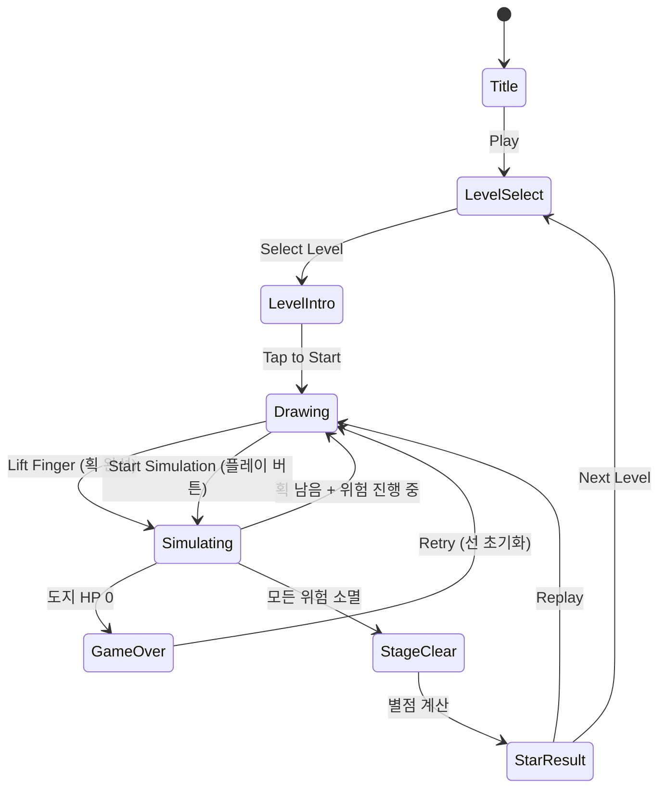

# Save the Doge

> 손가락으로 선을 그어 도지(강아지)를 위험에서 구하는 드로잉 물리 퍼즐

## 개요

화면 안에 도지(Shiba Inu 강아지 캐릭터)가 있고, 불/벌/비/폭탄 등 다양한 위험이 도지를 향해 다가온다.
플레이어는 화면에 선을 자유롭게 그어 물리 오브젝트(벽, 다리, 방패)를 만들어 도지를 보호한다.
정해진 정답이 없다. 창의적이고 웃긴 방식으로 도지를 구하면 클리어.

**핵심 재미 루프**: 위험 인식 → 선 그리기 → 물리 시뮬레이션 확인 → 성공/실패 → 재도전

## 게임 규칙

### 기본 규칙

- 도지는 화면 내 특정 위치에 서 있거나 앉아 있음 (이동 불가)
- 위험 요소들이 중력/방향을 따라 도지를 향해 이동
- 플레이어는 제한된 **잉크(획 수 또는 길이)**로 선을 그어 위험을 막음
- 도지가 위험에 닿으면 **게임 오버**
- 모든 위험 요소가 제거되거나 도지에게 닿지 않고 소멸되면 **클리어**

### 드로잉 규칙

- 손가락으로 자유롭게 선을 그음 (시작점 ~ 끝점)
- 그려진 선은 즉시 **Matter.js 물리 오브젝트(Static Body)**로 변환
- 선의 두께: 고정값 (기본 펜 10px, 스킨별 변동 없음)
- 제한: 레벨별 **최대 획 수** 제한 (3~7획)
- 이미 그린 선은 삭제 불가 (단, 힌트 아이템으로 되돌리기 가능)

### 물리 시뮬레이션

- Phaser.io + Matter.js 기반
- 그려진 선: Static Rigid Body (질량 무한대, 이동 없음)
- 위험 요소: Dynamic Body (중력, 탄성, 마찰 적용)
- 도지: Sensor Body (물리 충돌 감지만, 직접 이동 없음)
- 충돌 감지: 도지 + 위험 요소 접촉 시 HP 감소 또는 즉사

### 클리어 조건

| 조건 | 설명 |
|------|------|
| 완전 보호 | 모든 위험이 소멸되거나 화면 밖으로 나갈 때까지 도지 생존 |
| 시간 제한 | 레벨별 제한 시간 내 클리어 |
| 획 제한 | 지정된 획 수 이하로 클리어 (별점 시스템) |

### 별점 시스템 (3성 평가)

| 별점 | 조건 |
|------|------|
| ⭐⭐⭐ | 최소 획 수 이하로 클리어 |
| ⭐⭐ | 제한 획 수 내 클리어 |
| ⭐ | 힌트 사용하여 클리어 |

## 위험 요소 카탈로그

| 위험 요소 | 이동 방식 | 처리 방법 | 등장 레벨 |
|-----------|----------|----------|----------|
| 불꽃 (Fire) | 바닥을 따라 이동 | 선으로 막기, 고립 | 1~ |
| 비 (Rain) | 위에서 낙하 | 지붕/우산 그리기 | 3~ |
| 벌 (Bee) | 도지를 향해 직선 비행 | 벽으로 막기 | 5~ |
| 바위 (Boulder) | 비탈면 굴러 낙하 | 선으로 방향 전환 | 7~ |
| 폭탄 (Bomb) | 포물선 낙하 | 방패로 튕기기 | 10~ |
| 번개 (Lightning) | 수직 낙하, 랜덤 위치 | 피뢰침 그리기 | 13~ |
| 상어 (Shark) | 물속 → 점프 | 다리 그려 도지 올리기 | 16~ |

## 게임 플로우



### 드로잉 모드 vs 시뮬레이션 모드

- **드로잉 모드**: 물리 정지, 위험 요소 투명 표시. 선 미리보기 가능
- **시뮬레이션 모드**: 물리 시작, 실시간 확인. 추가 획 불가 (레벨 설정에 따라 다름)
- 일부 레벨: 실시간 드로잉 (시뮬레이션 중에도 선 그리기 가능, 난이도 높음)

## UI 레이아웃

```
┌─────────────────────────────┐
│  ✏️ x3    ❤️❤️❤️    ⏱ 30s  │  ← HUD (남은 획 수, HP, 타이머)
├─────────────────────────────┤
│                             │
│   🔥→         🐝→           │  ← 위험 요소 (애니메이션)
│                             │
│         🐕                  │  ← 도지 (중앙~하단 배치)
│   ████████████████          │  ← 지형 (바닥, 발판 등)
│                             │
│  [플레이어 드로잉 영역]       │
│                             │
├─────────────────────────────┤
│  [▶ 실행]  [↩ 되돌리기]  [💡힌트] │  ← 액션 버튼
└─────────────────────────────┘
```

### 화면별 UI

| 화면 | 주요 요소 |
|------|----------|
| 타이틀 | 도지 애니메이션, Play 버튼, 설정 |
| 레벨 셀렉트 | 그리드 (5×4), 별점 표시, 잠금 |
| 인게임 | 드로잉 캔버스, HUD, 위험요소, 도지 |
| 클리어 | 별점 연출, 다음 레벨 버튼, 공유 버튼 |
| 게임오버 | 도지 반응 이모지, 재시도, 힌트 광고 |

## 레벨 디자인 (MVP 20레벨)

| 레벨 | 위험 요소 | 획 제한 | 도입 개념 |
|------|----------|---------|----------|
| 1 | 불꽃 ×1 (좌→우) | 3 | 튜토리얼: 선 그리기 |
| 2 | 불꽃 ×2 | 3 | 여러 선 활용 |
| 3 | 비 (전면) | 3 | 지붕 개념 |
| 4 | 불꽃 + 비 | 4 | 복합 위협 |
| 5 | 벌 ×1 | 2 | 벽 개념 |
| 6 | 벌 ×2 (양방향) | 3 | 방향 전환 |
| 7 | 바위 (경사면) | 2 | 방향 전환 선 |
| 8 | 불꽃 + 벌 | 4 | 복합 해결 |
| 9 | 비 + 바위 | 4 | 지형 활용 |
| 10 | 폭탄 ×1 | 3 | 튕기기 개념 |
| 11 | 폭탄 ×2 + 비 | 4 | 복합 응용 |
| 12 | 벌 떼 (×5) | 5 | 면적 방어 |
| 13 | 번개 (랜덤 3회) | 4 | 피뢰침 전략 |
| 14 | 불꽃 + 번개 + 비 | 5 | 전방위 방어 |
| 15 | 바위 + 폭탄 | 4 | 동선 계획 |
| 16 | 상어 (수면 도지) | 3 | 다리 개념 |
| 17 | 폭탄 + 벌 + 번개 | 6 | 고난이도 복합 |
| 18 | 전 요소 ×2 | 7 | 창의적 해결 |
| 19 | 실시간 드로잉 필요 | 5 | 타이밍 요소 |
| 20 | 보스 레벨 (전 요소) | 7 | 최종 종합 |

## 스코어링 시스템

| 항목 | 점수 |
|------|------|
| 레벨 클리어 | +1000 |
| 남은 획 수 × 200 | 최대 +1400 |
| 남은 시간 × 10 | 최대 +300 |
| 힌트 미사용 보너스 | +500 |
| 도지 HP 만점 | +200 |

## 도지 캐릭터 반응 시스템

도지의 표정/이모지가 상황에 따라 변화 → 감정 이입 + 바이럴 포인트

| 상황 | 도지 반응 |
|------|----------|
| 대기 중 | 😊 앉아서 꼬리 흔들기 |
| 위험 접근 | 😨 떨기 |
| 선 완성 시 | 😮 놀람 표정 |
| 위험 막힘 | 😄 점프 + "WOW" |
| 게임오버 | 😵 쓰러지기 + "such fail" |
| 클리어 | 🎉 달리기 + "much safe, very wow" |

## 수익화 설계

### 힌트 시스템

- 레벨당 1회 힌트 (추천 선 위치 반투명 표시)
- 무료 힌트: 광고 시청 후 획득
- 유료 힌트: 힌트 팩 구매 (IAP)

### 펜 스킨 (코스메틱)

| 스킨 | 효과 | 획득 |
|------|------|------|
| 기본 펜 | 검정 실선 | 기본 제공 |
| 무지개 펜 | 무지개 색상 | 광고 보상 |
| 도지 발자국 | 발바닥 패턴 | IAP |
| 레이저 | 빛나는 선 | IAP |
| 크레용 | 텍스처 있는 선 | IAP |

### 광고

| 유형 | 트리거 |
|------|--------|
| 인터스티셜 | 5레벨마다 클리어 후 |
| 리워드 광고 | 힌트 요청, 재시도 +1획 |
| 배너 | 레벨 셀렉트 화면 하단 |

## 바이럴 전략

- **공유 기능**: 클리어 후 "내 드로잉 보기" → GIF 생성 → SNS 공유
- **웃긴 풀이 유도**: 최소한의 선으로 기발하게 해결 시 "GENIUS!" 연출
- **도지 밈 활용**: "such protect", "very safe", "much wow" 텍스트 팝업
- **챌린지**: "이 레벨 1획으로 풀기" 도전 과제

## 사운드/이펙트

| 상황 | 사운드 |
|------|--------|
| 선 그리기 | 마커 긋는 소리 |
| 물리 충돌 | 통통 튕기는 소리 |
| 위험 소멸 | 팡 + 파티클 |
| 도지 피격 | 낑낑 소리 |
| 클리어 | 밝은 팡파레 + 도지 바크 |
| 게임오버 | 슬픈 효과음 |

## 기술 구현 가이드 (개발팀 참고)

### Phaser + Matter.js 드로잉 → 물리 변환

```
1. pointerdown 이벤트로 드로잉 시작점 기록
2. pointermove로 선 경로 배열 수집 (샘플링: 5px 간격)
3. pointerup으로 드로잉 종료
4. 경로 배열 → Matter.Bodies.fromVertices() 또는
   MatterJS Composite로 다각형 생성
5. 생성된 Body를 world에 추가 (isStatic: true)
6. Phaser Graphics로 선 렌더링 동기화
```

### 핵심 기술 챌린지

- **선 → 폴리곤 변환**: 포인트 배열을 두께 있는 폴리곤으로 변환 (offset polygon)
- **충돌 정확도**: Matter.js의 복잡한 폴리곤 충돌 최적화
- **GIF 생성**: html2canvas + gif.js로 클라이언트 사이드 GIF 녹화

### 권장 라이브러리

| 라이브러리 | 용도 |
|-----------|------|
| Phaser 3.x | 게임 엔진 + 렌더링 |
| Matter.js | 물리 엔진 (Phaser 내장) |
| simplify-js | 드로잉 경로 단순화 |
| gif.js | 클리어 GIF 생성 |

## MVP 범위

### Phase 1 — MVP (1주차 목표)

- [ ] 기획서 작성
- [ ] 드로잉 → Matter.js Static Body 변환
- [ ] 위험 요소: 불꽃, 비, 벌 (3종)
- [ ] 도지 캐릭터 + 충돌 감지
- [ ] 레벨 1~10 구현
- [ ] 클리어 / 게임오버 판정
- [ ] 별점 시스템 (3성)

### Phase 2 — 완성 (2주차 목표)

- [ ] 위험 요소: 바위, 폭탄, 번개, 상어 추가
- [ ] 레벨 11~20 구현
- [ ] 도지 감정 반응 애니메이션
- [ ] 펜 스킨 시스템
- [ ] 힌트 시스템 + 리워드 광고
- [ ] 클리어 GIF 생성 + SNS 공유
- [ ] BGM + 효과음

### 출시 기준 (Go-Live Checklist)

- [ ] 레벨 10개 이상 플레이 가능
- [ ] 크래시 없이 레벨 진행
- [ ] 힌트 광고 수익화 동작
- [ ] iOS / Android APK 빌드 성공
