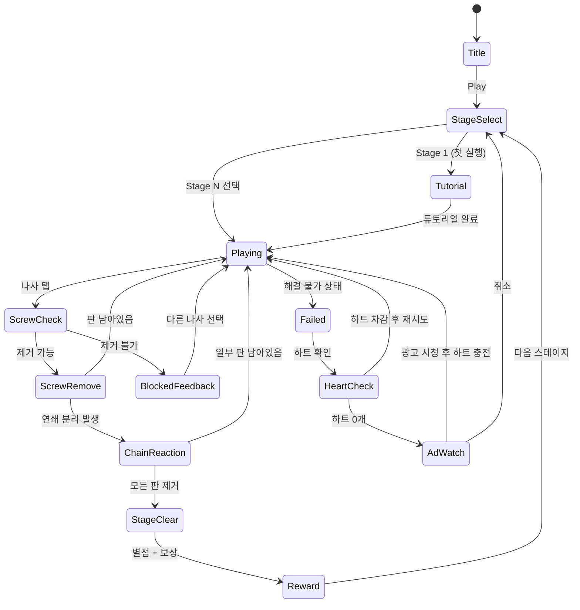

# Screw Puzzle (나사 퍼즐)

> **레퍼런스**: #31 + #51 + #68 (우들 스크류 온) — 3개 나사 퍼즐 종합 최적 설계
> **장르**: Screw / Wood Puzzle
> **목표 평점**: 4.8+ | **MVP 기간**: 1~2주

---

## 장르 분석 — #31 / #51 / #68 비교

| 항목 | #31 (기본형) | #51 (중급형) | #68 우들 스크류 온 (통합 최적) |
|------|-------------|-------------|-------------------------------|
| 핵심 메카닉 | 나사 제거로 판 분리 | 색상 매칭 + 제거 | 레이어 스택 + 순서 퍼즐 |
| 난이도 곡선 | 빠른 상승, 이탈율 높음 | 완만하지만 단조로움 | 튜토리얼→단계적 상승 |
| 시각 표현 | 평면 2D | 단순 3D UI | Pseudo-3D (깊이감 있는 2D) |
| 수익화 | 광고 위주 | IAP 위주 | 광고 + IAP 혼합 |
| 차별점 | - | 색상 퍼즐 추가 | **하트/목숨 시스템 + 스토리텔링** |

### #68의 핵심 차별점
1. **하트(목숨) 시스템** — 제목의 "1 하트"가 핵심. 하트 1개로 시작, 클리어 시 보충
2. **스토리/캐릭터** — 나무 캐릭터 "우들(Woodle)"이 퍼즐을 탈출하는 서사
3. **레이어 순서 퍼즐** — 단순 제거가 아닌 올바른 순서 존재
4. **힌트 경제** — 힌트를 하트로 구매, 광고 시청으로 충전

---

## 개요

여러 층으로 쌓인 나무 판들이 나사(스크류)로 고정되어 있다.
플레이어는 **올바른 순서로 나사를 제거**하여 모든 판을 분리하면 스테이지 클리어.
잘못된 순서로 제거하면 판이 걸려 더 이상 진행 불가 → 실패.

**핵심 재미**: "어떤 나사를 먼저 빼야 하지?" 하는 **순서 추론의 쾌감** + 올바른 순서 발견 시 연쇄 반응으로 판들이 분리되는 **시각적 만족감**

---

## 게임 규칙

### 기본 규칙
- 화면에 **나무 판(Board)** 여러 장이 나사로 연결되어 배치
- 나사는 **2개 이상의 판을 관통**하여 고정
- 나사를 탭하면 **제거 가능 여부 체크**:
  - 해당 나사를 빼면 판이 자유롭게 이동 가능 → **제거 가능 (초록 하이라이트)**
  - 빼면 다른 판이 막혀 고착 → **제거 불가 (빨간 표시)**
- 모든 판이 분리/제거되면 **스테이지 클리어**
- 해결 불가능한 상태가 되면 **실패 (하트 1 감소)**

### 나사 타입
| 타입 | 설명 | 해제 조건 |
|------|------|-----------|
| 일반 나사 | 단순 제거 가능 | 탭 1회 |
| 잠금 나사 | 특정 나사 제거 후 해제 | 선행 나사 제거 |
| 색상 나사 | 같은 색 나사 모두 제거 필요 | 동색 세트 완성 |
| 회전 나사 | 회전 방향 탭 (좌/우) | 방향 맞추기 |

### 하트(목숨) 시스템
- 시작 시 하트 **5개** 보유
- 스테이지 실패 또는 "실행 취소 초과" 시 하트 **1 감소**
- 하트 0 = **광고 시청 후 충전** 또는 **IAP 구매**
- 스테이지 클리어 시 하트 **+1 회복** (최대 5)

---

## 게임 플로우



---

## UI 레이아웃

```
┌─────────────────────────────┐
│  ❤️❤️❤️❤️❤️   Stage 12  ⚙️  │  ← 상단 HUD (하트 + 스테이지 + 설정)
├─────────────────────────────┤
│                             │
│      ╔══════╗               │
│   ╔══╬══╗   ║  ← 나무 판    │
│   ║  ║  ║   ║    (겹침/적층) │
│   ║  🔩 ║   🔩               │  ← 나사 (탭 가능)
│   ║  ║  ╚═══╝               │
│   ╚══╝  🔩                  │
│         ║                   │
│      ╔══╩══╗                │
│      ║ 우들 ║                │  ← 캐릭터 판
│      ╚═════╝                │
│                             │
├─────────────────────────────┤
│  💡 힌트(3)  ↩️ 되돌리기(3)  │  ← 도구 바
└─────────────────────────────┘
```

### Pseudo-3D 깊이 표현 (Phaser.io 2D)
- 판은 **isometric 각도 (30°)** 로 기울여 렌더링
- 나사는 **원통형 그라데이션** (상단 밝음 → 하단 어두움)
- 레이어 순서: z-index로 앞/뒤 판 구분
- 나사 제거 애니메이션: 위로 튀어나오는 tweeen + 회전 효과
- 판 분리 애니메이션: 슬라이드 아웃 + 중력 낙하 시뮬레이션 (tween)

---

## 스코어링 시스템

| Action | 점수 | 설명 |
|--------|------|------|
| 나사 제거 | +50 | 기본 |
| 연쇄 분리 | +50 × 연쇄 수 | 1번에 N판 분리 |
| 스테이지 클리어 | +500 | 기본 |
| 하트 풀(5개) 클리어 | +200 | 보너스 |
| 힌트 미사용 클리어 | +300 | 퍼펙트 보너스 |

### 별점 시스템
| 조건 | 별점 |
|------|------|
| 클리어 | ⭐ |
| 힌트 0~1회 사용 | ⭐⭐ |
| 힌트 미사용 + 되돌리기 0회 | ⭐⭐⭐ |

---

## 난이도 설계

| Level | 판 수 | 나사 수 | 나사 타입 | 예상 해결 시간 |
|-------|-------|---------|-----------|---------------|
| 1~5 | 2~3 | 2~4 | 일반 | 10~20초 |
| 6~15 | 3~5 | 4~7 | 일반 + 잠금 | 20~40초 |
| 16~30 | 5~7 | 6~10 | + 색상 나사 | 40~90초 |
| 31~50 | 7~10 | 10~15 | + 회전 나사 | 1~3분 |
| 51+ | 10~15 | 15~25 | 전체 혼합 | 2~5분 |

### 난이도 곡선 원칙
- **레벨 1~3**: 나사 1~2개, 즉각 성공 경험 제공 (온보딩)
- **레벨 4~10**: 잠금 나사 도입, 순서 추론 유도
- **레벨 11~**: 복잡성 점진 증가, 매 5레벨마다 "쉬어가는" 레벨 삽입

---

## 사운드 / 이펙트

| 이벤트 | 사운드 | 이펙트 |
|--------|--------|--------|
| 나사 탭 (가능) | 금속 딸깍 | 초록 링 펄스 |
| 나사 탭 (불가) | 묵직한 둔탁음 | 빨간 흔들림 (shake) |
| 나사 제거 | 나사 풀리는 소리 | 회전 + 위로 이동 tween |
| 연쇄 분리 | 연속 슬라이딩 소리 | 판 날아가는 파티클 |
| 스테이지 클리어 | 경쾌한 팡파레 | 별 3개 애니메이션 |
| 실패 | 묵직한 쿵 소리 | 화면 흔들림 + 하트 감소 |
| 힌트 사용 | 반짝이는 효과음 | 정답 나사 황금 하이라이트 |

---

## 수익화 전략

### 광고 (주 수익원 — MVP 우선)
| 광고 유형 | 트리거 | 보상 |
|-----------|--------|------|
| 보상형 광고 | 하트 0 → 충전 버튼 | 하트 +2 |
| 보상형 광고 | 힌트 0 → 광고 보기 | 힌트 +1 |
| 보상형 광고 | 실패 후 "계속하기" | 하트 미차감 + 재시도 |
| 인터스티셜 | 매 5 스테이지 클리어 후 | 없음 (자연스럽게 삽입) |
| 배너 광고 | 스테이지 선택 화면 하단 | 없음 |

### IAP (2차 수익원)
| 상품 | 가격 | 내용 |
|------|------|------|
| 하트 팩 x10 | ₩1,100 | 하트 10개 충전 |
| 힌트 팩 x20 | ₩1,100 | 힌트 20개 |
| 광고 제거 | ₩3,300 | 배너 + 인터스티셜 제거 |
| 프리미엄 팩 | ₩5,500 | 광고제거 + 하트 무제한 7일 |

### 수익화 균형 원칙
- 강제 광고 없음 — **항상 선택형**
- 하트 시스템: 하루 자연 회복 2개 (시간제 회복은 MVP 이후)
- 첫 10레벨은 힌트 3개 무료 제공 (온보딩)

---

## Phaser.io 2D 구현 가이드

### 핵심 기술 포인트

#### 1. Pseudo-3D 판 렌더링
```
- 판 기본형: Graphics.fillRect + skewX 변환 (또는 사전 제작 스프라이트)
- 상단면: 밝은 색상 (#8B6914)
- 측면: 어두운 색상 (#5C4A0A)
- Phaser.GameObjects.Container로 상단+측면 그룹화
```

#### 2. 나사 렌더링
```
- 원형 헤드: Graphics.fillCircle + 방사형 그라데이션 텍스처
- 나사 몸통: 얇은 cylinder 느낌 (직사각형 + 상하 그라데이션)
- 색상 구분: tint 적용으로 타입별 색상 처리
```

#### 3. 제거 가능 여부 판별 알고리즘
```
판을 노드, 나사를 엣지로 하는 그래프 구성
→ 나사 제거 시뮬레이션: 해당 나사 제거 후 각 판의 이동 가능 방향 계산
→ 이동 경로에 다른 판이 없으면 제거 가능
```

#### 4. 연쇄 분리 로직
```
나사 제거 → 자유로워진 판 탐지
→ 자유 판 이동 tween (슬라이드 아웃)
→ 이동으로 인해 새로 자유로워진 판 탐지 (BFS)
→ 연쇄 처리
```

#### 5. 힌트 시스템
```
BFS/DFS로 현재 상태에서 클리어 가능한 나사 순서 탐색
→ 첫 번째 제거 가능 나사 하이라이트
→ 전체 풀이 순서는 "전체 힌트" IAP로 제공
```

---

## 레벨 데이터 구조 (JSON)

```json
{
  "stage": 1,
  "boards": [
    { "id": "A", "x": 100, "y": 200, "w": 120, "h": 60, "color": "#8B6914" },
    { "id": "B", "x": 180, "y": 280, "w": 100, "h": 60, "color": "#6B8E23" }
  ],
  "screws": [
    { "id": "s1", "x": 160, "y": 240, "boards": ["A", "B"], "type": "normal" }
  ],
  "solution": ["s1"]
}
```

---

## MVP 범위

### Phase 1 (MVP — 1주)
- [ ] 나무 판 + 나사 렌더링 (Pseudo-3D 스프라이트)
- [ ] 나사 탭 → 제거 가능 여부 판별
- [ ] 나사 제거 + 판 분리 애니메이션
- [ ] 실패 판정 (막힌 상태 감지)
- [ ] 스테이지 클리어 판정
- [ ] 하트 시스템 기본 (5하트, 차감/클리어 시 회복)
- [ ] 레벨 데이터 JSON 20개 스테이지
- [ ] 보상형 광고 (하트 충전)

### Phase 2 (1주 추가)
- [ ] 힌트 시스템 (BFS 정답 탐색)
- [ ] 되돌리기 (Undo) 3회
- [ ] 색상 나사 + 회전 나사 타입 추가
- [ ] 스테이지 셀렉트 화면 (별점 표시)
- [ ] 인터스티셜 광고 삽입
- [ ] 튜토리얼 (레벨 1~3 가이드)
- [ ] IAP 연동 기본

### Phase 3 (데이터 후)
- [ ] 레벨 50개 추가
- [ ] 일일 챌린지 모드
- [ ] 캐릭터 "우들" 스토리 모드

---

## 결론 — 나사 퍼즐 단일 앱 최종 기획

### 왜 #68이 최종 통합안인가

1. **#31의 교훈**: 순수 나사 제거만으로는 단조롭다 → #68은 하트/스토리로 감성 추가
2. **#51의 교훈**: 색상 매칭 복잡도가 캐주얼 유저 이탈 유발 → #68은 색상 나사를 중급 이후 도입
3. **#68의 강점**: 하트 1개에서 시작하는 긴장감 + "우들" 캐릭터 서사 → **감성적 몰입**

### 구현 우선순위

```
1순위: 코어 메카닉 (판+나사 렌더링, 제거 로직, 클리어 판정)
2순위: 하트 시스템 + 보상형 광고 → 수익화 파이프라인 확보
3순위: 힌트 + 되돌리기 → 이탈 방지
4순위: 레벨 콘텐츠 20개 → 출시 최소 분량
5순위: 튜토리얼 + UX 폴리싱
```

### CPI 최적화 예측
- 나사 퍼즐 장르 평균 CPI: $0.8~1.5 (캐주얼 상위권)
- "1 하트" 긴장감 크리에이티브 → CTR 높을 것으로 예상
- **출시 목표: 2주 내 스토어 등록 → 1주 광고 테스트 → 데이터 기반 피벗**
