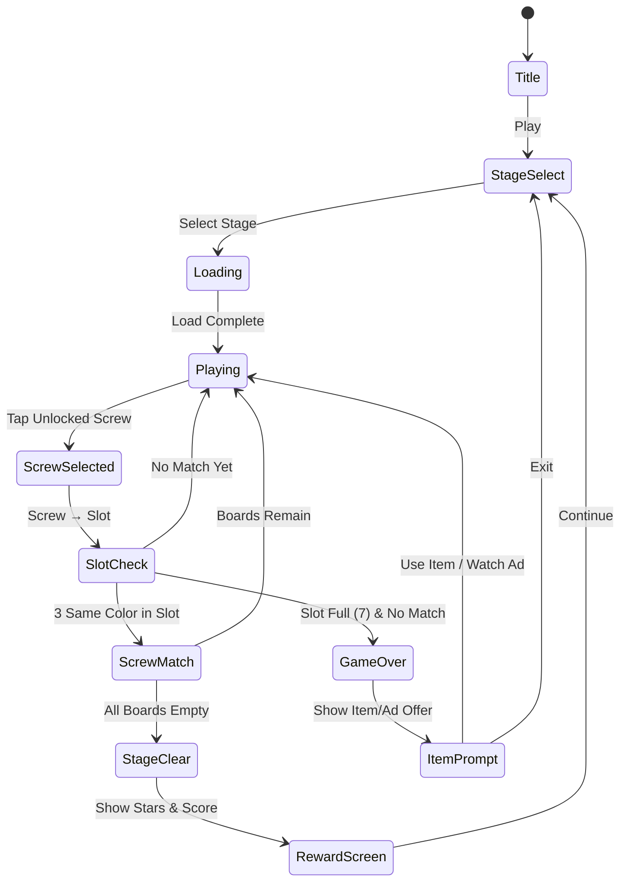

# 나사 매치 - 나사풀기 핀 퍼즐

> 나사 풀기가 핵심인 3D 로직 퍼즐. 같은 색 나사끼리 매칭해 판을 비워라.

## 개요

여러 겹으로 쌓인 나무판에 색깔별 나사가 박혀 있다. 플레이어는 나사를 탭해 같은 색 슬롯으로 이동시키고, 슬롯이 가득 차면 나사가 자동 제거된다. 위 판의 나사를 먼저 풀어야 아래 판에 접근할 수 있는 레이어 퍼즐. 모든 나사를 제거하면 스테이지 클리어.

### 레퍼런스

- **장르**: Screw Puzzle / Pin Pull
- **유사 게임**: Screw Jam, Screw Away, Pin Rescue
- **핵심 재미**: 막힌 나사를 풀어나가는 해소감 + 레이어 전략

## 게임 규칙

### 기본 규칙

- 나무판(Board)에 여러 색깔의 나사(Screw)가 박혀 있음
- 나사를 탭하면 하단 **대기 슬롯(최대 7칸)**에 임시 보관
- 슬롯 내 **같은 색 나사 3개**가 모이면 자동으로 제거됨
- 슬롯이 가득 차서 3매치 불가 상태가 되면 **게임 오버**
- 판(Board)의 모든 나사가 제거되면 해당 판 클리어
- 모든 판을 클리어하면 **스테이지 클리어**

### 레이어(판 겹침) 규칙

- 여러 판이 Z축으로 겹쳐져 배치됨 (최대 4단)
- **위 판의 나사가 아래 판의 구멍을 막고 있으면** 아래 나사는 잠금 상태
- 위 판의 나사를 모두 제거해야 아래 판 나사에 접근 가능
- 잠금 상태 나사는 시각적으로 어둡게 표시 (비활성)
- 판이 비워지면 판 자체가 사라지며 아래 판이 올라옴 (상승 애니메이션)

### 나사 선택 규칙

- **잠금 해제된** 나사만 탭 가능
- 탭 → 나사가 돌아가는 애니메이션 → 슬롯으로 이동
- 슬롯에서 같은 색 3개 완성 시 → 제거 이펙트 → 슬롯 자리 비워짐
- 같은 색끼리 슬롯 내에서 자동 인접 정렬

### 색상 매칭

- 나사 색상: 빨강, 파랑, 노랑, 초록, 보라, 주황, 분홍, 하늘 (최대 8색)
- 각 색상은 **3의 배수**로 존재 (3개, 6개, 9개...)
- 모든 나사를 3매치로 제거 가능하도록 보장된 레벨 설계

## 게임 플로우



## UI 레이아웃

```
┌─────────────────────────────┐
│  ❤️❤️❤️   Lv.12   ⭐ 3400  │  ← 상단 HUD (목숨/레벨/스코어)
├─────────────────────────────┤
│                             │
│   ┌──────────────────────┐  │
│   │  [판3] 그림자 효과    │  │  ← 뒤에 쌓인 판 (어둡게)
│   │  [판2] 중간           │  │
│   │  [판1] 활성 판        │  │  ← 현재 접근 가능한 판
│   │   🔴  🔵  🟡  🔴    │  │    (나사 색상 표시)
│   │   🟢  🔴  🟡  🔵    │  │    잠긴 나사: 반투명
│   │   🟡  🟢  🔵  🟢    │  │
│   └──────────────────────┘  │
│                             │
│  진행도: ████░░░ 8/15 나사  │  ← 진행 표시
├─────────────────────────────┤
│  [🔴][🔴][🔵][  ][  ][  ][  ] │  ← 슬롯 (7칸)
├─────────────────────────────┤
│  💣 폭탄(2)  ↩️ 되돌리기(3) │  ← 아이템
└─────────────────────────────┘
```

### 판 겹침 표현 (유사 3D)

```
        [판3] ──────────────
       /판2/ ──────────────
      [판1] ── 활성 ── ────
```

- 판마다 오프셋(x+8, y-8)으로 비스듬하게 배치
- 그림자 레이어로 깊이감 표현
- 활성 판: 밝음 / 비활성 판: 어둡고 채도 낮음
- 판 제거 시: 위로 날아가는 애니메이션

## 스코어링 시스템

| Action | Score |
|--------|-------|
| 나사 1개 슬롯 이동 | +10 |
| 3매치 제거 | +150 |
| 연속 3매치 콤보 | +150 × 콤보 수 |
| 판 클리어 | +300 |
| 스테이지 클리어 | +1000 |
| 남은 이동수 보너스 | 남은슬롯칸 × 50 |
| 아이템 미사용 클리어 | +500 |

### 별 평가 시스템

| 조건 | 별 |
|------|----|
| 스테이지 클리어 | ⭐ |
| 아이템 1개 이하 사용 | ⭐⭐ |
| 아이템 0개 사용 | ⭐⭐⭐ |

## 난이도 설계

### 레벨 설계 테이블 (30레벨 MVP)

| Level | 판 수 | 색상 수 | 나사 수 | 슬롯 | 특이사항 |
|-------|-------|---------|---------|------|----------|
| 1~3   | 1     | 3       | 9       | 7    | 튜토리얼, 잠금 없음 |
| 4~6   | 1     | 4       | 12      | 7    | 기본 매칭 |
| 7~10  | 2     | 4       | 18      | 7    | 레이어 도입 |
| 11~14 | 2     | 5       | 24      | 7    | 잠금 나사 등장 |
| 15~18 | 3     | 5       | 30      | 7    | 3단 레이어 |
| 19~22 | 3     | 6       | 36      | 7    | 복잡한 잠금 패턴 |
| 23~26 | 4     | 7       | 42      | 7    | 4단 레이어 |
| 27~30 | 4     | 8       | 48      | 7    | 최고 난이도 |

### 잠금 패턴 유형

| 패턴 | 설명 |
|------|------|
| 단순 잠금 | 위 판 나사 → 아래 판 1개 잠금 |
| 다중 잠금 | 위 판 나사 하나가 아래 판 2~3개 잠금 |
| 교차 잠금 | 서로 다른 판의 나사가 서로를 잠금 (데드락 없도록 설계) |
| 색상 트랩 | 같은 색 나사가 각각 다른 판에 잠겨 있어 순서 중요 |

## 아이템 시스템

### 기본 아이템

| Item | 아이콘 | 효과 | 획득 방법 |
|------|--------|------|-----------|
| 💣 나사 폭탄 | 폭탄 | 슬롯의 나사 1개 제거 (매칭 없이) | 구매 / 광고 |
| ↩️ 되돌리기 | 화살표 | 슬롯 마지막 나사 보드로 복귀 | 구매 / 광고 |
| 🔓 잠금 해제 | 자물쇠 | 잠긴 나사 1개 강제 해제 | 구매 |
| ✨ 색상 변환 | 별 | 나사 1개의 색상을 원하는 색으로 변경 | 프리미엄 |

### 게임 오버 시 구제 시스템

1. **광고 시청** → 슬롯 초기화 (슬롯의 나사를 모두 보드로 되돌림)
2. **💎 코인 사용** → 나사 폭탄 3개 즉시 지급
3. **포기** → 스테이지 재시작

## 수익화 설계

### 광고 노출 지점

| 지점 | 유형 | 빈도 |
|------|------|------|
| 게임 오버 후 부활 | 리워드 광고 | 스테이지당 1회 |
| 스테이지 클리어 후 | 인터스티셜 | 3레벨마다 1회 |
| 아이템 무료 획득 | 리워드 광고 | 수시 |
| 메인 화면 | 배너 | 상시 |

### 인앱 결제

| 상품 | 가격 | 내용 |
|------|------|------|
| 코인 소팩 | $0.99 | 코인 100개 |
| 코인 중팩 | $2.99 | 코인 350개 |
| 코인 대팩 | $7.99 | 코인 1000개 |
| 광고 제거 | $2.99 | 영구 광고 제거 |
| 스타터팩 | $1.99 | 코인 200개 + 아이템 5종 세트 |

### 아이템 가격 (코인)

| 아이템 | 가격 |
|--------|------|
| 나사 폭탄 1개 | 30코인 |
| 되돌리기 1개 | 20코인 |
| 잠금 해제 1개 | 40코인 |
| 색상 변환 1개 | 50코인 |

## 비주얼 & 사운드

### 유사 3D 표현 (Phaser.io 2D)

- 판마다 오프셋 배치: `x += 10 * layer`, `y -= 8 * layer`
- 각 판에 드롭 쉐도우 필터 적용
- 나사 스프라이트: 머리(원형) + 몸통(짧은 직사각형) 분리
- 나사 회전 애니메이션: 탭 시 90도 × 3회 회전 후 이동
- 판 제거: `tween(y -= 300, alpha 0)` 애니메이션

### 색상 팔레트 (나사 색)

```
빨강: #E53935   파랑: #1E88E5   노랑: #FDD835
초록: #43A047   보라: #8E24AA   주황: #FB8C00
분홍: #E91E8C   하늘: #00BCD4
```

### 사운드 이펙트

| 이벤트 | 효과음 |
|--------|--------|
| 나사 탭 | 드릴 소리 짧게 (삐이이익) |
| 슬롯 이동 | 또각 |
| 3매치 제거 | 팡! + 반짝 이펙트 |
| 연속 콤보 | 상승 톤 (도레미파솔) |
| 판 클리어 | 목재 부서지는 소리 |
| 스테이지 클리어 | 팡파레 |
| 게임 오버 | 실패 사운드 + 슬로우 모션 |

## 튜토리얼 설계

### 레벨 1~3: 인터랙티브 튜토리얼

- **Lv.1**: 나사 탭 → 슬롯 이동 안내 (3색, 9나사)
  - 화살표로 탭할 나사 안내
  - "같은 색 3개를 모으세요!" 텍스트
- **Lv.2**: 슬롯 매칭 자동 제거 체험
  - "3개가 모이면 자동으로 제거돼요!"
- **Lv.3**: 레이어(판 겹침) 첫 등장
  - 잠금 나사 하이라이트 + "위 판 나사를 먼저 풀어요!"

## 레벨 데이터 구조 (개발팀 참고)

```typescript
interface ScrewLevel {
  id: number;
  boards: Board[];        // 판 배열 (인덱스 0이 맨 아래)
  timeLimit?: number;     // 선택적 타이머 (초)
  starConditions: {
    oneStar: boolean;     // 클리어
    twoStar: number;      // 아이템 최대 사용 횟수
    threeStar: number;    // 0 = 아이템 미사용
  };
}

interface Board {
  id: number;
  screws: Screw[];
  position: { x: number; y: number };  // 판 위치
}

interface Screw {
  id: number;
  color: ScrewColor;
  boardId: number;
  holePosition: { row: number; col: number };
  lockedBy?: number[];  // 위 판의 나사 id 배열 (잠금 조건)
}

type ScrewColor = 'red' | 'blue' | 'yellow' | 'green' | 'purple' | 'orange' | 'pink' | 'cyan';
```

## MVP 범위

### Phase 1 (Week 1) — 코어 루프

- [x] 기획서 작성
- [ ] 나사 탭 → 슬롯 이동 로직
- [ ] 3매치 자동 제거 로직
- [ ] 슬롯 가득참 → 게임 오버
- [ ] 단일 판 레벨 (레이어 없음)
- [ ] 레벨 1~10 데이터

### Phase 2 (Week 2) — 레이어 + 폴리시

- [ ] 판 겹침 (레이어) 로직
- [ ] 잠금/해제 시스템
- [ ] 유사 3D 비주얼 (오프셋 + 쉐도우)
- [ ] 나사 회전 애니메이션
- [ ] 판 제거 애니메이션
- [ ] 레벨 11~30 데이터
- [ ] 아이템 2종 (폭탄, 되돌리기)
- [ ] 스코어링 + 별 평가

### Phase 3 (출시 후)

- [ ] 광고 통합 (AdMob)
- [ ] 인앱 결제
- [ ] 코인 시스템
- [ ] 추가 아이템 2종
- [ ] 레벨 31~50
- [ ] 리더보드
