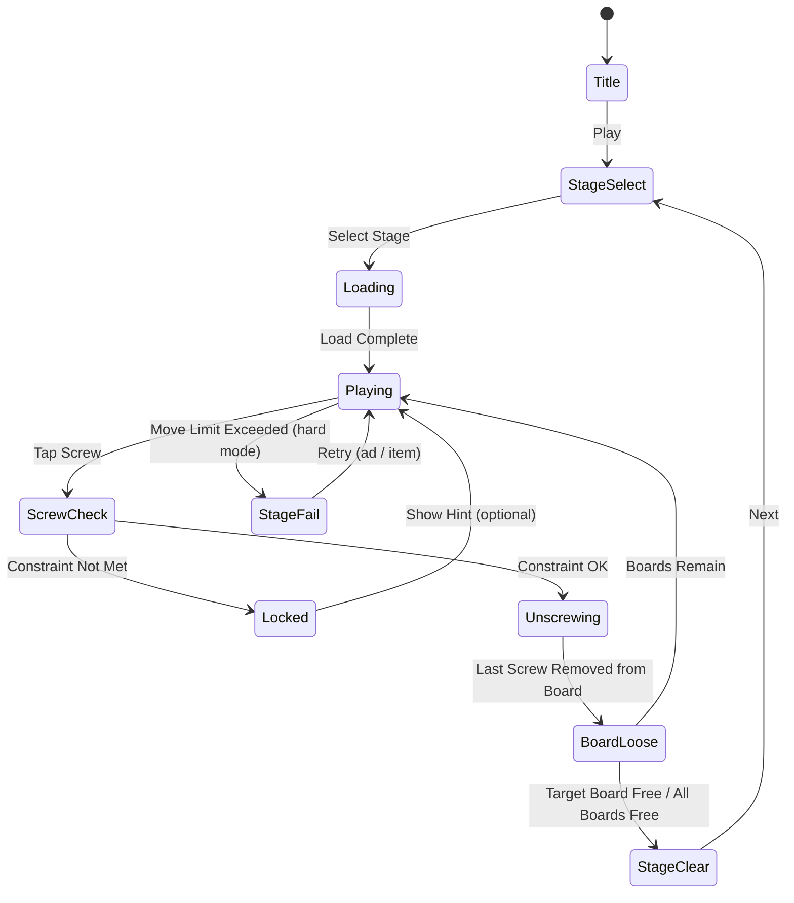

# Screwdom 3D

> 나무판에 박힌 나사를 올바른 순서로 풀고 빼서, 판을 완전히 분리하는 3D 로직 퍼즐 게임.

## 개요

여러 나무판이 나사로 고정되어 있다. 플레이어는 올바른 순서로 나사를 풀어 판을 해체해야 한다.
겉보기엔 단순하지만, 어떤 나사를 먼저 풀어야 하는지 **공간적 순서 추론**이 핵심 재미다.
Phaser.io에서 **아이소메트릭(2.5D) 원근 표현**으로 3D 느낌을 구현한다.

### #31 나사 매치와의 차이

| 항목 | #31 나사 매치 (Screw Match) | #51 Screwdom 3D |
|------|----------------------------|-----------------|
| 코어 장르 | 색상 정렬 (Sort Puzzle) | 순서 해체 (Disassembly Puzzle) |
| 메카닉 | 같은 색 나사를 같은 볼트에 모아 빼내기 | 나사 풀기 순서를 추론해 나무판 분리 |
| 공간 표현 | 2D 탑-다운 | 2.5D 아이소메트릭 |
| 핵심 재미 | 이동 경로 전략 | 순서 추론 + 만족스런 해체 피드백 |
| 플레이 타임 | 퍼즐당 2~4분 | 퍼즐당 1~3분 |
| 난이도 점진 | 나사 색·수 증가 | 판 레이어·잠금 나사 증가 |
| 타겟 유저 | 색 분류 선호 | 물리적 해체 ASMR 선호 |

> **결론**: 완전히 다른 메카닉. 같은 나사 테마지만 교차 유저층을 공략할 수 있다.

---

## 게임 규칙

### 기본 규칙
- 화면에 **나무판(Board) 2~6개**가 나사로 고정되어 있다.
- 각 나사에는 **방향(Direction)** 이 있다: 위에서 아래 또는 특정 판에서 다른 판으로 관통.
- 플레이어는 탭(혹은 드래그)으로 나사를 **풀어서(unscrew)** 제거한다.
- **잠금 나사(Locked Screw)**: 위의 판이 올려져 있거나 다른 나사가 눌러주고 있으면 풀 수 없음.
- 모든 나사를 제거하거나 목표 판이 분리되면 **스테이지 클리어**.
- 잘못된 순서로 구조가 붕괴되거나 이동 횟수를 초과하면 **스테이지 실패**.

### 나사 타입

| 타입 | 설명 | 등장 레벨 |
|------|------|-----------|
| 일반 나사 | 즉시 탭으로 제거 | 1부터 |
| 긴 나사 (Long) | 드래그 방향으로 뽑아야 함 | 5부터 |
| 잠금 나사 (Locked) | 특정 조건 해제 후 제거 가능 | 3부터 |
| 색상 나사 (Colored) | 같은 색 홀에만 삽입 가능 | 8부터 |
| 회전 나사 (Rotating) | 2회 탭으로 풀림 | 10부터 |

### 판(Board) 상태

| 상태 | 조건 |
|------|------|
| Fixed | 1개 이상 나사로 고정됨 |
| Loose | 나사가 모두 제거됨 → 자동 이탈 애니메이션 |
| Target | 이 판을 분리하면 클리어 (일부 스테이지) |

### 순서 제약 (핵심 퍼즐 로직)
- 판 A가 판 B 위에 올려져 있을 때, B를 고정한 나사는 A가 분리되기 전까지 **잠금** 상태.
- 나사 N1이 나사 N2의 헤드를 누르고 있으면 N2는 N1 제거 전까지 잠금.
- 이 제약 체인이 퍼즐의 난이도를 결정한다.

---

## 게임 플로우



---

## 3D → 2D 변환 전략 (Phaser.io)

Phaser.io는 네이티브 3D를 지원하지 않으므로 **아이소메트릭(Isometric) 투영**을 사용한다.

### 아이소메트릭 좌표계

```
월드 좌표 (x, y, z)  →  화면 좌표 (sx, sy)

sx = (x - y) * TILE_W / 2
sy = (x + y) * TILE_H / 2 - z * Z_SCALE
```

- `TILE_W`: 타일 폭(px), 권장 128px
- `TILE_H`: 타일 높이(px), 권장 64px (= TILE_W / 2)
- `Z_SCALE`: 높이 스케일, 권장 32px per unit

### 렌더링 레이어 순서 (Painter's Algorithm)

1. 가장 뒤쪽(y+x 값이 큰) 판부터 먼저 그림
2. 나사는 해당 판 스프라이트 위에 합성
3. 높이(z)가 높은 판은 낮은 판보다 나중에 그림

### 나사 풀기 애니메이션

- 탭 시 나사 스프라이트 위로 이동 (tween: y -= Z_SCALE * 3, duration 300ms)
- 완전히 뽑히면 페이드아웃 + 파티클 효과
- 판이 분리될 때 판 스프라이트 위/옆으로 슬라이드 (tween, duration 400ms)

### 가상 3D 깊이감 강화 기법

- **그림자(Shadow)**: 각 판 아래에 흐린 타원형 그림자 레이어 추가
- **엣지 라이팅**: 판의 좌측면/하단면에 어두운 색 사이드 스프라이트 추가 (2.5D 효과)
- **나사 헤드 하이라이트**: 탭 가능한 나사에 shimmer 애니메이션
- **원근 스케일**: z가 높을수록 스프라이트 스케일 1.0, 낮을수록 0.85~0.95

---

## UI 레이아웃

```
┌─────────────────────────────┐
│  ← Back   [Stage 3]   💡×3  │  ← 상단 HUD (뒤로/스테이지명/힌트 카운트)
├─────────────────────────────┤
│                             │
│        ┌──────┐             │
│        │ 판 A │   ← z=2     │
│    ┌───┼──────┼───┐         │
│    │   │  🔩  │   │ ← 나사  │  ← 아이소메트릭 퍼즐 영역
│    │  판 B (z=1)  │         │
│    └──────────────┘         │
│          🔩  🔩              │
│    ┌──────────────────┐     │
│    │    판 C (z=0)    │     │  ← 바닥판
│    └──────────────────┘     │
│                             │
├─────────────────────────────┤
│  Moves: 4/6   ↩️ Undo  💡  │  ← 하단 HUD (이동횟수/되돌리기/힌트)
└─────────────────────────────┘
```

---

## 스코어링 시스템

| 액션 | 점수 |
|------|------|
| 나사 제거 성공 | +50 |
| 판 분리 성공 | +200 |
| 스테이지 클리어 | +500 |
| 잔여 이동 보너스 | 잔여수 × 100 |
| 힌트 미사용 클리어 | +300 (Perfect) |
| Undo 미사용 클리어 | +200 |

### 성적 등급

| 등급 | 조건 |
|------|------|
| ⭐⭐⭐ | 잔여이동 ≥ 2 & 힌트 미사용 |
| ⭐⭐ | 클리어 (힌트/Undo 사용) |
| ⭐ | 광고 시청 후 재시도 성공 |

---

## 난이도 설계

| Level | 판 수 | 나사 수 | 레이어 깊이 | 이동 제한 | 특수 나사 |
|-------|-------|---------|-------------|-----------|-----------|
| 1~5   | 2     | 3~4     | 2           | 없음      | 없음 |
| 6~15  | 3     | 5~7     | 2~3         | 없음      | 긴 나사 |
| 16~30 | 4     | 7~10    | 3           | 있음      | 잠금 나사 |
| 31~50 | 5     | 10~14   | 3~4         | 있음      | 색상 나사 |
| 51~   | 6     | 14+     | 4+          | 있음      | 회전 나사 |

### 튜토리얼 (Level 1~3)
- Level 1: 나사 2개, 판 2개, 순서 제약 없음 → 자유롭게 탭
- Level 2: 나사 3개, 판 2개, 1개 잠금 → 순서 개념 도입
- Level 3: 나사 4개, 판 3개, 2개 잠금 → 레이어 개념 도입

---

## 아이템/도구

| 아이템 | 효과 | 획득 방법 |
|--------|------|-----------|
| 💡 힌트 | 다음에 풀 수 있는 나사 강조 표시 (3초) | 레벨업 보상, 광고 리워드, 인앱구매 |
| ↩️ Undo | 마지막 나사 제거 취소 (나사+판 원위치) | 레벨업 보상, 광고 리워드, 인앱구매 |
| 🔓 전체 힌트 | 전체 정답 순서 표시 (한 번) | 인앱구매 전용 |

---

## 수익화 전략

### 광고 리워드 (핵심 수익원)
- 실패 시 "광고 보고 계속하기" → 이동 제한 +3 추가
- 힌트 소진 시 "광고 보고 힌트 충전" → 힌트 2개 획득
- 스테이지 클리어 후 "광고 보고 다음 스테이지 잠금 해제"

### 인앱구매
- 힌트 팩 (10개) : $0.99
- Undo 팩 (10개) : $0.99
- 광고 제거 (영구) : $2.99
- 전체 스테이지 언락 : $4.99

### 무료 제공
- Level 1~20 완전 무료
- Level 21+ 광고 시청 또는 구매로 언락

---

## 사운드/이펙트

| 이벤트 | 사운드 | 이펙트 |
|--------|--------|--------|
| 나사 탭 (시작) | 삑-긁힘 소리 | 나사 헤드 파란 하이라이트 |
| 나사 제거 | 뽑히는 "슉" 소리 | 나사 위로 tween + 파티클 |
| 잠금 나사 탭 | 둔탁한 "탁" 소리 | 흔들림 애니메이션 (shake) |
| 판 분리 | 나무판 미끄러지는 소리 | 판 슬라이드 애니 + 먼지 파티클 |
| 스테이지 클리어 | 경쾌한 완성음 | 화면 전체 폭발 파티클 + 별 3개 |
| 실패 | 낮은 효과음 | 화면 흔들림 |
| 힌트 사용 | 띵- 소리 | 정답 나사에 황금 테두리 펄스 |

---

## MVP 범위

### Phase 1 (MVP — 1주 목표)
- [ ] 아이소메트릭 좌표계 구현 (Phaser.io)
- [ ] 나무판 + 나사 스프라이트 렌더링
- [ ] 나사 탭 → 제거 로직 (잠금 체크 포함)
- [ ] 판 분리 애니메이션
- [ ] 레벨 1~10 데이터 설계 및 구현
- [ ] 클리어 / 실패 판정

### Phase 2 (2주차)
- [ ] 힌트 / Undo 아이템
- [ ] 이동 제한 시스템
- [ ] 별 3개 평가 시스템
- [ ] 광고 리워드 연동 (AdMob)
- [ ] 레벨 11~30

### Phase 3 (선택)
- [ ] 특수 나사 타입 (색상, 회전)
- [ ] 레벨 에디터 (내부용)
- [ ] 리더보드

---

## #31 / #51 / #68 나사 장르 통합 전략

### 각 게임 포지셔닝

| 게임 | 장르 분류 | 핵심 재미 | 타겟 |
|------|-----------|-----------|------|
| #31 나사 매치 | Sort Puzzle | 전략적 이동 | 퍼즐 마니아 |
| #51 Screwdom 3D | Disassembly Puzzle | 순서 추론 + ASMR 해체감 | 캐주얼~미드코어 |
| #68 (미확인) | TBD | TBD | TBD |

### 통합 앱 vs 개별 앱 결론

**권장: 단일 앱 "나사 퍼즐 컬렉션"으로 출시**

**이유:**
1. **크로스 프로모션**: 한 게임 플레이 완료 후 다른 게임 노출 → CPI 대비 LTV 극대화
2. **ASO 효과**: "screw puzzle", "bolt puzzle" 키워드를 단일 앱으로 독점
3. **공통 인프라 재활용**: 모노레포 lib/web/rn 파이프라인 그대로 활용
4. **개발 속도**: 공통 UI/광고 SDK/결제 로직 1회 구현

**구조:**
```
screw-puzzle-collection/rn
  ├── 홈 화면 (게임 선택)
  ├── WebView → web/screw-match (#31)
  ├── WebView → web/screwdom3d (#51)
  └── WebView → web/screw-xxx (#68)
```

**단, 각 lib/web은 독립 패키지로 유지** — 개별 앱으로도 출시 가능하도록.

### 출시 순서 권장

1. **즉시**: #51 Screwdom 3D (해체 ASMR + 3D 비주얼 → 마케팅 후킹 강함)
2. **+1주**: #31 나사 매치 추가 (통합 앱 업데이트)
3. **+2주**: #68 확인 후 추가 여부 결정

---

## 기술 구현 참고사항 (lib 팀 전달용)

- Phaser 씬: `IsoBoard` (아이소메트릭 렌더러), `ScrewPuzzle` (게임 로직)
- 데이터 포맷: 각 레벨을 JSON으로 정의

```json
{
  "level": 1,
  "boards": [
    { "id": "A", "z": 1, "x": 2, "y": 2 },
    { "id": "B", "z": 0, "x": 2, "y": 2 }
  ],
  "screws": [
    { "id": "s1", "fromBoard": "A", "toBoard": "B", "locked": false },
    { "id": "s2", "fromBoard": "A", "toBoard": "B", "locked": false }
  ],
  "solution": ["s1", "s2"]
}
```

- 잠금 체크: `canUnscrew(screwId)` → 해당 나사 위 판이 모두 Loose인지 확인
- 아이소메트릭 유틸: `worldToScreen(x, y, z)` 함수 분리 (테스트 용이)
