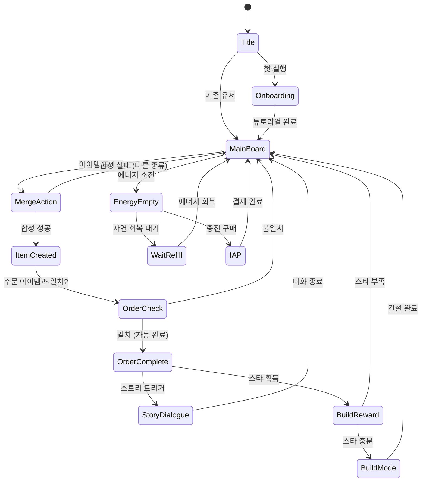

# 씨사이드 익스케이프 (Seaside Escape)

> **장르**: Merge + Story (합성 & 스토리)
> **레퍼런스**: Seaside Escape by Microfun Limited (App Store Rank #34, Rating 4.3)
> **개발 목표**: MVP 1~2주 / 공통 머지 엔진(lib/merge-core) 재사용

---

## 1. 개요

바닷가 폐허 리조트를 물려받은 주인공이 합성(Merge)으로 자원을 만들고, 리조트를 복원하며
바닷가 미스터리를 풀어가는 **머지 + 메타 빌드 + 스토리** 게임.

### 핵심 재미 루프

```
머지(Merge) → 자원 획득 → 주문 완료 → 코인/스타 보상 → 리조트 건설/꾸미기 → 스토리 진행 → 새 머지 아이템 해금
```

### 가십하버(#5)와의 비교 분석

| 항목 | 가십하버 (#5) | 씨사이드 익스케이프 (#34) |
|------|--------------|------------------------|
| 개발사 | Microfun Limited | Microfun Limited |
| 테마 | 항구 마을, 가십/인간 드라마 | 해변 리조트, 미스터리/로맨스 |
| 머지 엔진 | 동일 | 동일 (확인됨) |
| 코어 루프 | 머지 → 주문 → 빌드 → 스토리 | 머지 → 주문 → 빌드 → 스토리 |
| 아이템 테마 | 항구 아이템 (배, 생선, 항구 시설) | 해변 아이템 (모래성, 파라솔, 조개) |
| 수익화 구조 | 에너지 + IAP | 에너지 + IAP (동일) |
| 결론 | **엔진 완전 동일, 테마만 다름** | 리스킨 전략의 교과서 |

**핵심 인사이트**: Microfun은 동일한 머지 엔진으로 테마만 바꿔 여러 앱을 출시하는
"테마 리스킨" 전략을 검증된 방식으로 사용 중. 우리도 동일 전략 적용 가능.

---

## 2. 게임 규칙

### 2.1 머지 보드 (Core Merge Board)

- 격자형 보드 (기본 7×9, 확장 가능)
- 보드 위 아이템을 드래그하여 같은 종류 2개를 합치면 → 상위 단계 아이템 생성
- 아이템은 **티어(Tier) 1~10**까지 존재
- 에너지(⚡)를 소비하여 발생기(Generator)를 탭 → 아이템 생성

### 2.2 발생기 (Generator)

| 발생기 | 생성 아이템 | 에너지 비용 |
|--------|-------------|------------|
| 파도 발생기 | 조개 껍질 Tier 1 | 1⚡ |
| 모래 발생기 | 모래 두더지 Tier 1 | 1⚡ |
| 야자수 발생기 | 야자수 씨앗 Tier 1 | 1⚡ |

### 2.3 아이템 합성 체인 (해변 테마)

#### 조개 계열 (Shell Chain)
```
조개 껍질 → 작은 조개 → 소라 → 큰 소라 → 반짝이는 소라
→ 진주 → 빛나는 진주 → 진주 목걸이 → 황금 진주 → 전설의 보물
(Tier 1)                                                  (Tier 10)
```

#### 모래 계열 (Sand Chain)
```
모래 한 줌 → 모래 뭉치 → 모래성 기초 → 작은 모래성 → 모래성
→ 탑이 있는 모래성 → 궁전 모래성 → 황금 모래성 → 크리스탈 성 → 전설의 궁전
(Tier 1)                                                           (Tier 10)
```

#### 야자수 계열 (Palm Chain)
```
씨앗 → 새싹 → 어린 야자수 → 야자수 → 열매 달린 야자수
→ 코코넛 야자수 → 황금 야자수 → 빛나는 야자수 → 고대 야자수 → 전설의 낙원 나무
(Tier 1)                                                          (Tier 10)
```

### 2.4 주문 시스템 (Orders)

NPC가 아이템을 요청 → 플레이어가 완성된 아이템 제출 → 코인/스타/경험치 보상

```
[NPC 주문 카드]
━━━━━━━━━━━━━━━
👩 Maria: "리조트 수영장에 파라솔이 필요해요!"
  [ 파라솔 Tier 3 × 2 ] → 보상: ⭐ 3 + 💰 120
━━━━━━━━━━━━━━━
```

- 동시 활성 주문: 최대 3개
- 주문 완료 시 스토리 대화 트리거

### 2.5 빌드 & 데코 시스템 (Meta Layer)

스타(⭐)를 소비하여 리조트 시설 건설/업그레이드:

| 시설 | 필요 스타 | 효과 |
|------|-----------|------|
| 수영장 Lv.1 | ⭐ 5 | 보드 칸 +2 해금 |
| 비치 바 Lv.1 | ⭐ 8 | 새 발생기 해금 |
| 리조트 본관 Lv.1 | ⭐ 12 | 에너지 최대치 +10 |
| 선베드 구역 | ⭐ 6 | 새 NPC 등장 → 스토리 진행 |
| 수상 스포츠 센터 | ⭐ 15 | 특수 아이템 해금 |

---

## 3. 스토리 라인

### 세계관

주인공(플레이어)은 오래 전 사라진 할머니로부터 낡은 해변 리조트 "씨사이드 파라다이스"를 유산으로 물려받는다.
리조트를 복원하는 과정에서 과거 할머니와 얽힌 바닷가 미스터리와 로맨스를 발견하게 된다.

### 주요 등장인물

| 캐릭터 | 역할 | 소개 |
|--------|------|------|
| 주인공 (플레이어) | 리조트 오너 | 리조트를 물려받은 평범한 30대 |
| 루카 | 로맨틱 인터레스트 | 인근 다이빙숍 운영, 비밀이 있음 |
| 마리아 | 친구/조력자 | 리조트 이전 직원, 할머니를 잘 알고 있음 |
| 빅터 | 조연/라이벌 | 리조트 땅을 노리는 부동산 개발업자 |
| 할머니 (플래시백) | 핵심 미스터리 | 사라진 이유, 숨겨둔 보물의 단서 |

### 챕터 구조 (MVP: 챕터 1~3)

```
챕터 1: 도착 (스테이지 1~10)
  → 리조트 첫 인상, 마리아 만남, 기본 머지 학습
  → 수영장 복원 완료 (챕터 클리어 보상)

챕터 2: 비밀 (스테이지 11~25)
  → 루카 등장, 할머니 일기 발견
  → 비치 바 복원 완료

챕터 3: 폭풍 (스테이지 26~40)
  → 빅터의 위협, 해저 유물 발견
  → 리조트 본관 1차 복원 완료
  → 미스터리 첫 단서 공개 (다음 챕터 떡밥)
```

---

## 4. 게임 플로우 (상태 머신)



---

## 5. UI 레이아웃

### 메인 보드 화면

```
┌─────────────────────────────┐
│  [⬅] 씨사이드 파라다이스  [⚙] │  ← 상단 내비
│  💰 1,240   ⭐ 8   ⚡ 35/50 │  ← 자원 HUD
├─────────────────────────────┤
│  ┌──────────────────────┐   │
│  │  [주문 카드 1] [주문 2] │  ← 주문 패널 (상단)
│  └──────────────────────┘   │
├─────────────────────────────┤
│                              │
│  [🐚][🐚][  ][🌴][🌴][  ]   │
│  [  ][🏖][🏖][  ][🐚][  ]   │  ← 머지 보드
│  [🌴][  ][🏖][  ][  ][🏖]   │    (7×9 격자)
│  [  ][🐚][  ][🌴][🏖][  ]   │
│  [🔮][  ][  ][  ][🌴][  ]   │
│                              │
├─────────────────────────────┤
│  [발생기1⚡] [발생기2⚡] [🎁]  │  ← 하단 액션바
└─────────────────────────────┘
```

### 빌드 모드 화면

```
┌─────────────────────────────┐
│  [⬅] 리조트 건설    ⭐ 8   │
├─────────────────────────────┤
│                              │
│    🏖 씨사이드 파라다이스 🏖  │
│                              │
│  [수영장 Lv.1]  ⭐5  [건설]  │
│  [비치 바]      ⭐8  [잠금]  │  ← 건설 목록
│  [선베드 구역]  ⭐6  [잠금]  │
│                              │
└─────────────────────────────┘
```

---

## 6. 수익화 구조

> 가십하버(#5) 동일 구조 적용

### 에너지 시스템

| 항목 | 값 |
|------|-----|
| 에너지 최대치 | 50 |
| 자연 회복 | 1개/5분 |
| 전체 회복 시간 | ~4시간 |
| 광고 시청 보상 | +10 에너지 |

### IAP 구성

| 상품 | 가격 | 내용 |
|------|------|------|
| 에너지 팩 Small | $0.99 | 에너지 +25 |
| 에너지 팩 Large | $2.99 | 에너지 +80 |
| 스타터 번들 | $4.99 | 에너지 +100 + 코인 5,000 |
| 월정액 패스 | $9.99/월 | 매일 에너지 +20, 광고 제거 |
| 보석 팩 | $1.99~$19.99 | 보드 확장, 보관함 슬롯 |

### 광고 수익

- 에너지 부족 시: 광고 보기 → 에너지 +10
- 주문 스킵: 광고 보기 → 즉시 완료
- 데일리 보너스 배증: 광고 보기 → 보상 ×2

---

## 7. 난이도 설계

### 스테이지 유형

| 유형 | 설명 | 첫 등장 |
|------|------|---------|
| 기본 머지 | 목표 아이템 합성 | 스테이지 1 |
| 주문 완료 | N개 주문 처리 | 스테이지 3 |
| 시간 제한 | X분 내 Y개 합성 | 스테이지 8 |
| 보드 정리 | 장애물 제거 후 합성 | 스테이지 12 |
| 보스 주문 | 대량 고티어 아이템 | 챕터 엔딩마다 |

### 에너지 소비 곡선 (챕터별)

| 챕터 | 평균 에너지/스테이지 | 설계 의도 |
|------|-------------------|----------|
| 1 | 15~20 | 진입 장벽 낮음, 첫 IAP 유도 전 |
| 2 | 25~35 | 첫 페이월 등장 구간 |
| 3 | 35~50 | 에너지 번들 구매 유도 피크 |

---

## 8. 사운드 & 이펙트

| 이벤트 | 사운드 | 이펙트 |
|--------|--------|--------|
| 아이템 머지 | 촤르르 (파도음 변형) | 반짝임 + 아이템 등장 |
| 주문 완료 | 청량한 벨 | 별 3개 팡파르 |
| 스토리 대화 | 배경 파도 앰비언트 | 대화창 슬라이드 인 |
| 건설 완료 | 건설 효과음 | 먼지 팡 + 건물 등장 |
| 에너지 소진 | 소프트 알림음 | 에너지 바 빨간색 |
| 레벨업 아이템 | 반짝임 + 업 효과음 | 파티클 폭발 |

---

## 9. MVP 범위

### Phase 1 — MVP (1주차)

- [ ] 기획서 작성 ← **현재**
- [ ] lib/merge-core: 기본 머지 보드 (격자, 드래그&드롭, 합성 로직)
- [ ] lib/merge-core: 발생기 시스템 (탭 → 아이템 생성)
- [ ] lib/merge-core: 에너지 시스템
- [ ] lib/seaside-escape: 해변 테마 아이템 3체인 (조개/모래/야자수 Tier 1~5)
- [ ] lib/seaside-escape: 주문 시스템 (3개 슬롯)
- [ ] web/seaside-escape: 기본 UI (보드 + HUD + 주문 패널)
- [ ] 챕터 1 스테이지 10개

### Phase 2 — 스토리 & 메타 (2주차)

- [ ] lib/seaside-escape: 빌드 시스템 (스타 소비 → 시설 건설)
- [ ] 스토리 대화 시스템 (챕터 1~2)
- [ ] 챕터 2 스테이지 15개
- [ ] 기본 IAP 연동 (에너지 팩)
- [ ] 광고 시청 보상

### Phase 3 — 확장

- [ ] 챕터 3 + 이후 콘텐츠
- [ ] 월정액 패스
- [ ] 소셜 기능 (친구 방문)
- [ ] 이벤트 시스템

---

## 10. 머지 엔진 공통화 전략 분석

### 현황 파악

가십하버(#5)와 씨사이드 익스케이프(#34)는 **동일한 Microfun 머지 엔진** 위에서 동작.
두 게임의 코어 로직 차이는 사실상 **아이템 데이터와 테마 에셋**뿐이다.

### lib/merge-core 공통 모듈 설계안

```
lib/merge-core/
├── src/
│   ├── board/
│   │   ├── MergeBoard.ts        # 격자 상태 관리
│   │   ├── DragDropSystem.ts    # 드래그&드롭 + 합성 판정
│   │   └── BoardConfig.ts       # 보드 크기/레이아웃 설정
│   ├── items/
│   │   ├── ItemRegistry.ts      # 아이템 체인 등록 (데이터 주입)
│   │   ├── ItemTier.ts          # 티어 시스템
│   │   └── Generator.ts         # 발생기 로직
│   ├── orders/
│   │   ├── OrderSystem.ts       # 주문 생성/완료 로직
│   │   └── OrderSlot.ts         # 주문 슬롯 관리
│   ├── energy/
│   │   └── EnergySystem.ts      # 에너지 소비/회복/시간 관리
│   └── index.ts
```

### 테마별 게임은 데이터만 주입

```typescript
// lib/seaside-escape/items.ts
import { ItemRegistry } from 'lib/merge-core';

ItemRegistry.register([
  { id: 'shell_1', tier: 1, chain: 'shell', name: '조개 껍질', sprite: 'shell_01' },
  { id: 'shell_2', tier: 2, chain: 'shell', name: '작은 조개', sprite: 'shell_02' },
  // ...
]);

// lib/gossip-harbor/items.ts  ← 가십하버도 동일 엔진
ItemRegistry.register([
  { id: 'boat_1', tier: 1, chain: 'boat', name: '작은 보트', sprite: 'boat_01' },
  // ...
]);
```

### ROI 분석: 공통 엔진 투자 가치

| 항목 | 엔진 없이 (게임별 개발) | lib/merge-core 활용 |
|------|----------------------|-------------------|
| 첫 번째 게임 개발 기간 | 2주 | **3주** (엔진 구축 포함) |
| 두 번째 게임 개발 기간 | 2주 | **3~5일** (데이터+에셋만) |
| 세 번째 게임 개발 기간 | 2주 | **3~5일** |
| 버그 수정 적용 범위 | 게임별 개별 수정 | **전체 게임 일괄 수정** |
| 결론 | 게임 2개부터 손익분기 | **빠른 포트폴리오 확장** |

### 결론: 머지 엔진 공통화 **투자 권고**

우리에게 3개월이 남았고, 머지 장르는 App Store 상위권에서 검증된 장르다.
`lib/merge-core`에 **1주 투자**하면 씨사이드 익스케이프 이후 3번째, 4번째 머지 게임을
**3~5일 만에 출시**할 수 있다. Microfun처럼 테마 리스킨 전략으로 포트폴리오를 빠르게 확장하는 것이
우리 상황에서 가장 합리적인 선택이다.

**실행 순서 제안**:
1. `lib/merge-core` 구현 (1주)
2. 씨사이드 익스케이프 출시 (1주) — 시장 반응 확인
3. CPI/ROAS 데이터 기반으로 3번째 머지 테마 선정 (3~5일 출시)
4. 성과 좋은 테마에 콘텐츠 집중 투자

---

## 참고

- 레퍼런스 랭킹: App Store #34 (Merge 장르)
- 비교 게임: 가십하버 #5 (동일 개발사, 선행 검증)
- 관련 이슈: [#5 가십하버](https://github.com/hisgtory/mobile-arcade/issues/5)
