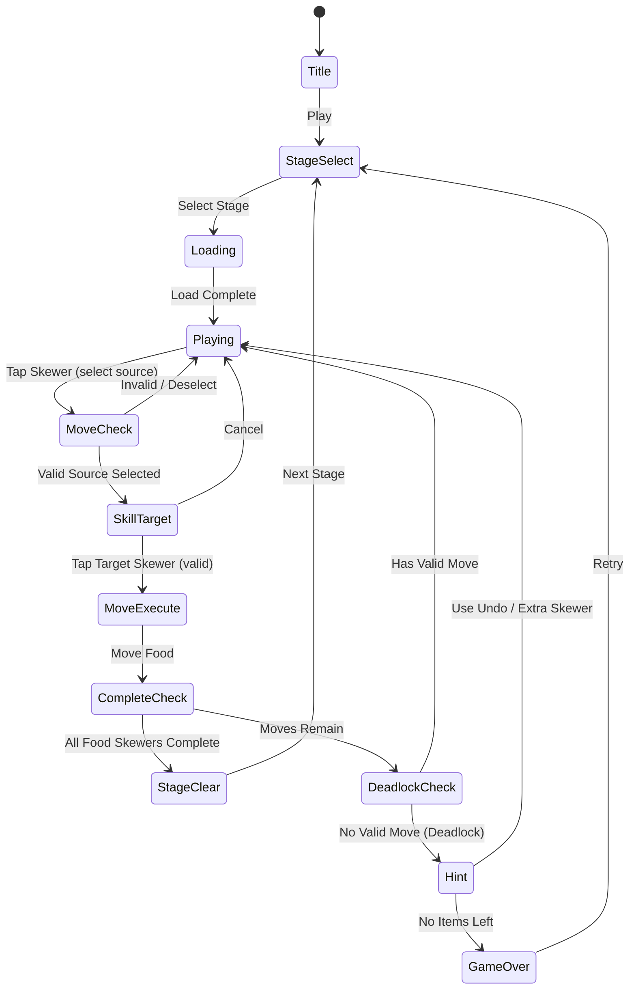

# Skewer Jam: Food Sort

> **레퍼런스**: iKame Games - Zego Studio | 평점 4.5 | 장르: sort-puzzle | 랭크: #83

## 개요

꼬치(스큐어)에 꽂힌 음식을 같은 종류끼리 정렬하는 스택 기반 퍼즐 게임.
음식을 꼬치 위에서부터 꺼내(LIFO) 다른 꼬치로 옮기며 각 꼬치를 단일 음식 종류로 채우면 클리어.
꼬치 정렬 완성 시 요리 완성 애니메이션으로 시각적 만족감을 제공한다.

### #7 Grill Sort와의 차이점

| 항목 | Grill Sort (#7) | Skewer Jam (#83) |
|------|----------------|-----------------|
| 컨테이너 | 그릴 트레이 (수평 슬롯) | 꼬치 (수직 스택) |
| 이동 단위 | 1개씩 또는 묶음 | **LIFO 스택 top만** 이동 가능 |
| 용량 | 가변 (트레이 길이) | **고정 (꼬치 당 N칸)** |
| 완성 조건 | 트레이 내 동일 음식 채우기 | 꼬치 전체를 단일 종류로 채우기 |
| 시각 테마 | 바베큐 그릴 | **꼬치 요리 (쿠킹 완성 연출)** |
| 전략성 | 중 | **높음 (스택 순서 예측 필수)** |

> **결론**: 동일 음식 정렬 테마이지만 LIFO 스택 구조로 인해 전략 깊이가 다름.
> Grill Sort보다 퍼즐 난이도가 높아 코어 유저 타깃.

---

## 게임 규칙

### 기본 구조

- **꼬치(Skewer)**: 음식을 N개 꽂을 수 있는 수직 스택 컨테이너
- **음식(Food)**: 여러 종류 (예: 🍖 고기, 🧅 양파, 🫑 피망, 🍅 토마토, 🍄 버섯 등)
- **이동 규칙**: 꼬치 **최상단(top)** 음식만 꺼낼 수 있음 (LIFO)
- **이동 조건**: 대상 꼬치가 비어있거나, 대상 꼬치 최상단 음식과 **같은 종류**일 때만 이동 가능
- **클리어 조건**: 모든 꼬치가 단일 종류 음식으로 꽉 채워지거나, 지정 꼬치 수가 완성되면 클리어

### 이동 규칙 상세

```
꼬치 A: [🍖, 🧅, 🍖]  (bottom → top)
꼬치 B: [🍖, 🍖]
꼬치 C: [] (빈 꼬치)

가능한 이동:
✅ A top(🍖) → B top(🍖): 같은 종류
✅ A top(🍖) → C: 빈 꼬치
❌ A top(🍖) → (다른 음식 top): 다른 종류
```

### 완성 판정

- 꼬치 용량이 N이고, 같은 종류 음식 N개로 꽉 차면 **완성(Complete)** 상태
- 완성된 꼬치: 잠금 처리 (더 이상 이동 불가), 요리 완성 애니메이션 재생
- **모든 음식 꼬치**가 완성되면 스테이지 클리어
  - (빈 꼬치 = 도우미 꼬치, 완성 대상 아님)

### 막힘(Deadlock) 조건

이동 가능한 경우가 하나도 없으면 **막힘** 상태 → 실패 or 힌트 제공

---

## 게임 플로우



---

## UI 레이아웃

```
┌─────────────────────────────┐
│  ❤️ Lives  Lv.12  ⭐ Score  │  ← 상단 HUD
│  [≡ Menu]          [💡 Hint] │
├─────────────────────────────┤
│                             │
│   🔥  🔥  🔥  🔥  🔥        │  ← 꼬치 불꽃 (완성 연출용)
│   │   │   │   │   │         │
│  [🍖][🧅][🍖][   ][🫑]     │  ← 꼬치 스택 (수직)
│  [🧅][🍖][🍖][   ][🫑]     │    (bottom에서 top으로 쌓임)
│  [🍖][🫑][🧅][   ][🫑]     │    [] = 빈 슬롯
│   ↑   ↑   ↑   ↑   ↑        │
│  (1) (2) (3) (4) (5)        │  ← 꼬치 번호 (탭 영역)
│                             │
├─────────────────────────────┤
│  [↩️ Undo]  [➕ Skewer]  [💎]│  ← 아이템 바
└─────────────────────────────┘
```

### 선택 인터랙션

1. 꼬치 탭 → 해당 꼬치 선택 (하이라이트)
2. 이동 가능한 꼬치 표시 (초록 테두리)
3. 이동 불가 꼬치 표시 (회색/흐림)
4. 다시 탭 → 이동 실행 또는 선택 해제

---

## 스코어링 시스템

| Action | Score |
|--------|-------|
| 꼬치 1개 완성 | +200 |
| 연속 완성 (콤보) | +200 × 콤보 수 |
| 스테이지 클리어 | +500 |
| 최소 이동 클리어 보너스 | +300 |
| 힌트 사용 | -50 |

---

## 난이도 설계

| Level | 꼬치 수 | 음식 종류 | 꼬치 용량 | 도우미(빈) 꼬치 | 예상 최소 이동 |
|-------|---------|----------|----------|----------------|--------------|
| 1~5   | 4       | 3        | 4        | 1              | ~15수 |
| 6~15  | 5       | 4        | 4        | 1              | ~20수 |
| 16~30 | 6       | 5        | 4        | 1              | ~25수 |
| 31~50 | 7       | 5        | 5        | 1              | ~30수 |
| 51+   | 8       | 6        | 5        | 1              | ~40수 |

> **밸런싱 원칙**:
> - 도우미 꼬치는 항상 1개 (2개이면 너무 쉬움)
> - 꼬치 용량 = 음식 종류당 개수 (항상 균등 분배)
> - 초기 배치는 최소 1개의 솔루션 경로가 존재하도록 생성

---

## 아이템 / 수익화

### 무료 아이템

| Item | 효과 | 제한 |
|------|------|------|
| Undo (되돌리기) | 마지막 이동 1수 취소 | 스테이지당 3회 |
| Hint (힌트) | 다음 최적 이동 1수 표시 | 스테이지당 2회 |

### 유료/광고 아이템

| Item | 효과 | 수익화 방식 |
|------|------|------------|
| Extra Skewer (꼬치 추가) | 빈 꼬치 1개 추가 (임시) | 광고 시청 or 젬 |
| Undo Pack | Undo 5회 추가 | 젬 구매 |
| Stage Skip | 현재 스테이지 건너뜀 | 광고 시청 |
| No Ads | 광고 제거 | IAP (인앱결제) |

### 광고 배치 전략

- 게임 오버 후 "광고 보고 계속하기" (Extra Skewer 1개 지급)
- 스테이지 클리어 후 인터스티셜 (5스테이지마다)
- 힌트 소진 후 광고 시청으로 힌트 충전
- 메인 화면 배너 (하단)

---

## 테마 & 비주얼

### 꼬치 완성 연출 (핵심 재미 루프)

```
완성 순간:
1. 꼬치 전체 흔들림 애니메이션 (0.3s)
2. 불꽃 이펙트 점화 🔥
3. 음식 황금빛 글로우 효과
4. "완성!" 텍스트 팝업 + 파티클
5. 맛있는 향기 라인(물결) 이펙트 (2D 시각화)
```

### 음식 테마 세트

| 테마 | 음식 구성 | 해금 조건 |
|------|----------|----------|
| 기본 야채구이 | 🍖 🧅 🫑 🍅 🍄 | 기본 |
| 해산물 꼬치 | 🦐 🐙 🐟 🦑 🧀 | Lv.20 해금 |
| 디저트 꼬치 | 🍓 🍇 🍍 🍒 🍑 | Lv.40 해금 |
| 할로윈 | 🎃 👻 🦇 🕷️ 💀 | 시즌 이벤트 |

---

## 사운드 / 이펙트

| 이벤트 | 효과 |
|--------|------|
| 음식 이동 | 꽂히는 소리 (뽁!) |
| 꼬치 완성 | 요리 완성 사운드 + 불꽃 이펙트 |
| 콤보 완성 | 상승 톤 팡파레 |
| 스테이지 클리어 | 축하 효과음 + 별 파티클 |
| 막힘(Deadlock) | 낮은 경고음 |
| 게임 오버 | 실패 사운드 |
| 배경음악 | 가벼운 요리 테마 BGM (루프) |

---

## sort-core 엔진 전략 (공통화)

> **현황**: 정렬 퍼즐 게임이 8개 (#4, #7, #29, #36, #38, #67, #76, #83)
> 게임마다 개별 구현은 비효율적. **공통 엔진(lib/sort-core)** 추출 전략 권장.

### lib/sort-core 설계 방향

```
lib/sort-core/
├── engine/
│   ├── SortContainer.ts    # 컨테이너 추상화 (스택/큐/배열)
│   ├── SortItem.ts         # 아이템 추상화 (타입 ID만)
│   ├── SortEngine.ts       # 이동 규칙, 완성 판정, 데드락 감지
│   ├── SortSolver.ts       # BFS/DFS 솔버 (레벨 검증용)
│   └── SortHistory.ts      # Undo 스택 관리
├── generators/
│   ├── LevelGenerator.ts   # 난이도별 랜덤 레벨 생성
│   └── LevelValidator.ts   # 솔루션 존재 여부 검증
└── types.ts
```

### 게임별 sort-core 활용 방식

| 게임 | 컨테이너 타입 | 이동 규칙 변형 | 테마 스킨 |
|------|-------------|--------------|----------|
| Grill Sort (#7) | 배열(Array) | top N개 이동 | 바베큐 그릴 |
| **Skewer Jam (#83)** | **스택(Stack, LIFO)** | **top 1개만** | **꼬치 요리** |
| #29, #36, #38... | TBD | TBD | TBD |

### 핵심 인터페이스 (의사코드)

```typescript
interface SortContainer {
  id: string;
  capacity: number;
  items: SortItem[];        // index 0 = bottom
  canReceive(item: SortItem): boolean;
  peek(): SortItem | null;  // top 아이템 확인
  push(item: SortItem): void;
  pop(): SortItem | null;
}

interface SortEngine {
  containers: SortContainer[];
  move(fromId: string, toId: string): MoveResult;
  isComplete(): boolean;
  isDeadlock(): boolean;
  getValidMoves(): Move[];
}
```

### 개발 우선순위

1. **Skewer Jam MVP**: sort-core 없이 직접 구현으로 빠른 출시
2. **Grill Sort 개발 시**: sort-core로 리팩토링하여 공통화
3. **3번째 정렬 게임부터**: sort-core 기반으로 빠른 스킨 개발

> ⚠️ **MVP 우선**: sort-core 공통화는 2번째 정렬 게임 개발 시점에 진행.
> 현재는 Skewer Jam 단독 구현으로 속도 우선.

---

## MVP 범위

### Phase 1 (MVP — 1주 목표)

- [x] 기획서 작성
- [ ] sort-core 기본 엔진 (Stack 타입, 이동 규칙, 완성 판정)
- [ ] Phaser 씬: 꼬치 렌더링 (수직 스택 시각화)
- [ ] 드래그 or 탭-탭 이동 인터랙션
- [ ] 데드락 감지 → 게임 오버 처리
- [ ] Undo 기능 (3회)
- [ ] 스테이지 10개 (하드코딩 레벨)
- [ ] 꼬치 완성 이펙트 (기본)
- [ ] 클리어 / 실패 화면

### Phase 2 (출시 후 1주)

- [ ] 랜덤 레벨 생성기 + 솔버 검증
- [ ] 스테이지 50개
- [ ] 음식 테마 2종 (기본 + 해산물)
- [ ] 광고 통합 (Extra Skewer, 인터스티셜)
- [ ] 힌트 시스템
- [ ] 스코어보드

### Phase 3 (데이터 기반 판단 후)

- [ ] sort-core 라이브러리로 공통화
- [ ] 시즌 이벤트 테마
- [ ] IAP (No Ads, Gem Pack)
- [ ] 리더보드 / 소셜 기능
