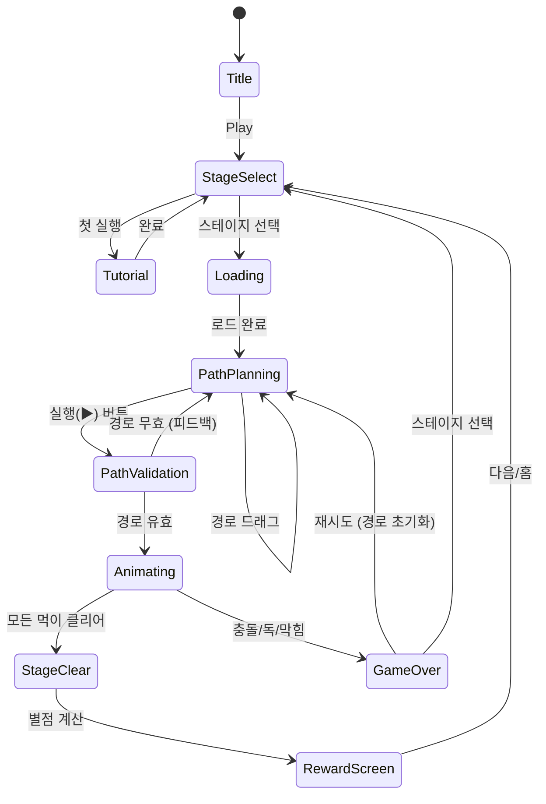
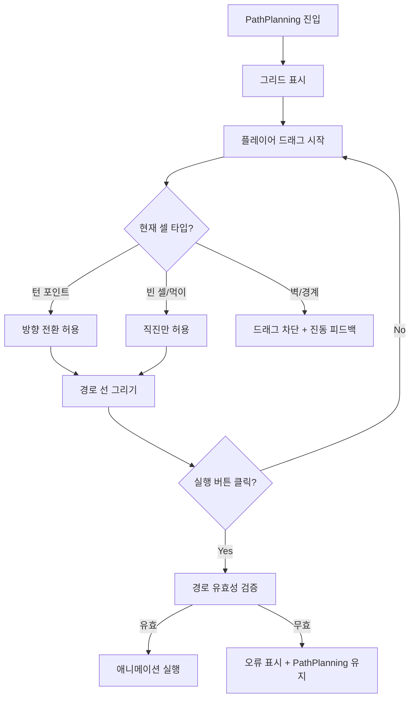

# Snake Puzzle: Slither to Eat

> 뱀이 그리드 위의 모든 먹이를 먹는 경로를 찾는 로직 퍼즐 게임.
> 한붓그리기 방식으로 경로를 미리 설계하고, 뱀이 실행하면서 몸통 충돌 여부를 검증한다.

## 개요

플레이어는 그리드 위에서 뱀의 이동 경로를 **미리 그린다**. 뱀은 먹이를 먹을 때마다 몸통이 길어지기 때문에, 나중에 지나갈 공간까지 미리 계산해야 한다. 모든 먹이를 먹는 올바른 경로를 찾으면 스테이지 클리어. 퍼즐의 핵심은 **뱀의 성장으로 인한 공간 제약**과 **방향 전환 포인트 제한**이다.

## 게임 규칙

### 기본 규칙

- 그리드(N×M) 위에 뱀 머리, 먹이, 장애물이 배치됨
- 플레이어는 뱀의 경로를 **드래그/스와이프**로 미리 설계
- 경로 확정 후 뱀이 자동으로 이동하며 경로를 따라감
- 모든 먹이(★)를 먹으면 **스테이지 클리어**
- 아래 실패 조건 중 하나라도 발생하면 **게임 오버**

### 이동 규칙

- 뱀은 상/하/좌/우 4방향만 이동 가능
- **직진 기본**: 뱀은 현재 방향으로 계속 직진
- **방향 전환**: 플레이어가 지정한 **턴 포인트(Turn Point)** 셀에서만 방향 전환 가능
- 턴 포인트가 아닌 셀에서 방향을 바꾸려 하면 유효하지 않은 경로
- 뱀은 자신의 몸통을 지나갈 수 없음 (단, 꼬리가 이미 지나간 셀은 재진입 가능)

### 뱀 성장 메카닉

- 뱀이 먹이(★)를 먹으면 꼬리가 1칸 길어짐
- 초기 뱀 길이: 1칸 (머리만)
- 먹이를 먹을수록 몸통이 공간을 차지 → 후반 경로가 점점 제한됨
- **경로 설계 시 뱀의 미래 몸통 위치를 미리 계산**해야 함

### 장애물 및 특수 셀

| 셀 타입 | 아이콘 | 효과 |
|--------|--------|------|
| 먹이 | ★ | 먹으면 뱀 +1 성장, 클리어 조건 |
| 독 먹이 | ☠ | 먹으면 즉시 게임 오버 |
| 벽 | ■ | 이동 불가 (경로 막음) |
| 포탈 A/B | ⬡ | A로 진입 시 B로 순간이동 (방향 유지) |
| 턴 포인트 | ↻ | 이 셀에서만 방향 전환 허용 |
| 빈 셀 | □ | 이동 가능, 직진 강제 |

### 실패 조건

1. 뱀이 **자신의 몸통**에 충돌
2. **독 먹이(☠)** 섭취
3. **벽(■) 또는 그리드 경계** 충돌
4. 경로가 막혀 더 이상 진행 불가 (데드엔드)

## 게임 플로우



### 핵심 플로우: 경로 계획 단계



## UI 레이아웃

```
┌─────────────────────────────┐
│  ← Back   Lv.23   ★ 2/3   │  ← 상단 HUD (레벨, 먹이 진행도)
│         ⏱ 00:45            │
├─────────────────────────────┤
│                             │
│  □  □  □  ■  □  □  □      │
│  □  ☠  □  □  □  ★  □      │
│  □  □  ↻  □  ↻  □  □      │  ← 그리드 (7×7 예시)
│  □  □  □  □  □  ☠  □      │    경로 선이 오버레이됨
│  🐍 □  □  ■  □  □  □      │
│  □  □  □  □  □  ★  □      │
│  □  □  □  □  □  □  □      │
│                             │
├─────────────────────────────┤
│  [↺ Reset]  [▶ Run]  [💡 Hint] │  ← 하단 컨트롤
└─────────────────────────────┘
```

### 경로 오버레이 표시

```
경로 드래그 시 셀 위에 방향 화살표 오버레이:

  □ → ↗ → □ → □
  ↑           ↓
  □   [🐍]    □
  ↑           ↓
  □ ← ★ ← □ ← □

(뱀 몸통 예상 위치는 반투명 초록색으로 표시)
```

## 스코어링 시스템

| Action | 조건 | 점수 |
|--------|------|------|
| 먹이 획득 | 먹이 1개 섭취 | +100 |
| 스테이지 클리어 | 모든 먹이 클리어 | +500 |
| 빠른 클리어 보너스 | 제한시간 50% 이상 남음 | +200 |
| 퍼펙트 클리어 | 힌트 없이 1시도 클리어 | +300 |
| 시간 보너스 | 남은 초 × 5 | 가변 |

### 별점 시스템 (3성)

| 별 | 조건 |
|----|------|
| ★ | 스테이지 클리어 |
| ★★ | 힌트 미사용 클리어 |
| ★★★ | 힌트 미사용 + 제한시간 50% 이상 남김 |

## 난이도 설계

### 그리드 크기 및 구성

| 구간 | 레벨 | 그리드 | 먹이 수 | 뱀 초기 길이 | 독 | 포탈 | 턴포인트 제한 | 시간 |
|------|------|--------|---------|------------|-----|------|------------|------|
| Tutorial | 1~5 | 4×4 | 2 | 1 | 없음 | 없음 | 없음 | 무제한 |
| Easy | 6~15 | 5×5 | 3 | 1 | 없음 | 없음 | 없음 | 120s |
| Normal | 16~25 | 6×6 | 4 | 2 | 1개 | 없음 | 있음 | 100s |
| Hard | 26~35 | 7×7 | 5 | 2 | 2개 | 1쌍 | 있음 | 90s |
| Expert | 36~50 | 8×8 | 6 | 3 | 3개 | 2쌍 | 있음 | 80s |

### 난이도 요소 조합

```
Easy:   먹이 위치 단순, 직선 경로 위주, 막힘 없음
Normal: 회전 필요, 독 먹이 1개, 경로 선택지 좁음
Hard:   포탈 활용 필수, 뱀 성장 충돌 고려, 다중 해법 없음
Expert: 최소 경로 존재, 몸통 관리 핵심, 시간 압박
```

### 레벨 설계 원칙

- 각 스테이지는 **유일한 정답 경로** (또는 소수의 동치 경로)만 존재
- 퍼즐 생성: 역방향 설계 (정답 경로 먼저 설계 → 장애물 배치)
- 튜토리얼 레벨은 단계별 안내 팝업 포함

## 사운드/이펙트

| 이벤트 | 사운드 | 이펙트 |
|--------|--------|--------|
| 경로 드래그 | 가벼운 틱틱 효과음 | 경로 선 그리기 애니메이션 |
| 먹이 섭취 | 먹는 소리 (뻑뻑) | 먹이 사라짐 + 뱀 성장 |
| 독 섭취 | 경고음 | 화면 빨간 플래시 + 죽음 애니메이션 |
| 벽 충돌 | 둔탁한 소리 | 진동 햅틱 |
| 포탈 통과 | 워프 효과음 | 반짝임 이펙트 |
| 스테이지 클리어 | 밝은 팡파레 | 별점 획득 애니메이션 |
| 게임 오버 | 실패음 | 뱀 흔들림 후 소멸 |
| 힌트 사용 | 차임벨 | 정답 경로 일부 점멸 표시 |

## 수익화 설계

### 무료 제공

- 레벨 1~20 무료 플레이
- 힌트 3회/일 무료 (자연 회복)

### 수익화 아이템

| 상품 | 설명 | 가격 (예상) |
|------|------|------------|
| 힌트 팩 (5개) | 정답 경로 일부 표시 | $0.99 |
| 힌트 팩 (30개) | 묶음 할인 | $3.99 |
| 스킨 팩: Desert | 모래사막 테마 그리드 + 뱀 | $1.99 |
| 스킨 팩: Ocean | 해양 테마 그리드 + 뱀 | $1.99 |
| 스킨 팩: Neon | 네온 사이버펑크 테마 | $2.99 |
| 레벨 팩 (51~100) | 추가 50 레벨 | $2.99 |
| Ad-Free | 광고 제거 영구권 | $2.99 |
| 올인원 번들 | 스킨3 + Ad-Free + 레벨팩 | $7.99 |

### 광고 리워드

- 스테이지 실패 시: "광고 보고 힌트 받기" 버튼 노출
- 일일 보너스: "광고 보고 힌트 1개 받기" (1일 3회 한도)
- 클리어 후: "광고 보고 다음 레벨 스킵" 옵션 (선택)

### CPI/ROAS 최적화 포인트

- D1 리텐션: 튜토리얼 완주율 → 레벨 1~5 완주 시 "보상 스킨" 증정
- D7 리텐션: 레벨 20 도달 시 첫 구매 50% 할인 팝업
- 주요 이탈 지점: 레벨 15~20 난이도 점프 구간 → 힌트 무료 지급으로 완충

## MVP 범위

### Phase 1 — MVP (1주)

- [x] 기획서 작성
- [ ] 코어 그리드 엔진 (4×4~8×8)
- [ ] 뱀 이동 + 몸통 성장 로직
- [ ] 경로 드래그 입력 시스템
- [ ] 먹이 섭취 + 클리어 판정
- [ ] 게임 오버 판정 (벽, 몸통 충돌)
- [ ] 50 레벨 데이터 (JSON 하드코딩)
- [ ] 기본 UI (그리드, HUD, 클리어/오버 화면)
- [ ] 별점 시스템

### Phase 2 — 완성도

- [ ] 턴 포인트 메카닉
- [ ] 독 먹이 + 포탈 장애물
- [ ] 힌트 시스템 (경로 일부 표시)
- [ ] 스킨 시스템
- [ ] 사운드/햅틱
- [ ] 광고 통합 (AdMob)
- [ ] 인앱 결제

### Phase 3 — 성장

- [ ] 레벨 에디터 (유저 생성 퍼즐)
- [ ] 일일 챌린지 레벨
- [ ] 리더보드 (클리어 타임 기준)
- [ ] 레벨 팩 51~100

## 기술 구현 가이드 (lib 팀 전달 사항)

### 핵심 데이터 구조

```typescript
// 그리드 셀 타입
type CellType = 'empty' | 'wall' | 'food' | 'poison' | 'portal' | 'turnPoint';

// 레벨 데이터
interface LevelData {
  id: number;
  grid: CellType[][];       // N×M 그리드
  snakeStart: Position;     // 뱀 머리 초기 위치
  snakeDirection: Direction; // 초기 방향
  snakeLength: number;       // 초기 뱀 길이
  portals: [Position, Position][]; // 포탈 쌍
  timeLimit: number;         // 초 (0 = 무제한)
  foodCount: number;         // 클리어 조건
}

// 경로 계획
interface PathPlan {
  waypoints: Position[];    // 플레이어가 설정한 경로
  turns: Position[];        // 턴 포인트 위치
}
```

### 경로 유효성 검증 알고리즘

```
1. 경로가 그리드 경계 내에 있는지 확인
2. 경로가 벽을 통과하지 않는지 확인
3. 방향 전환이 턴 포인트에서만 일어나는지 확인
4. 뱀 몸통 위치를 시뮬레이션하며 자기 충돌 확인
5. 경로가 모든 먹이를 지나는지 확인
6. 독 먹이를 경로가 지나지 않는지 확인
```

### 퍼즐 생성 전략 (50레벨)

```
역방향 설계:
1. 빈 그리드에서 시작
2. 정답 경로 S(start) → E(end) 설계
3. 경로 상에 먹이 배치
4. 경로 외 공간에 장애물(벽/독) 배치
5. 오답 경로를 막는 요소 추가
6. 난이도 검증 (다른 해법 없는지 BFS/DFS 검증)
```
